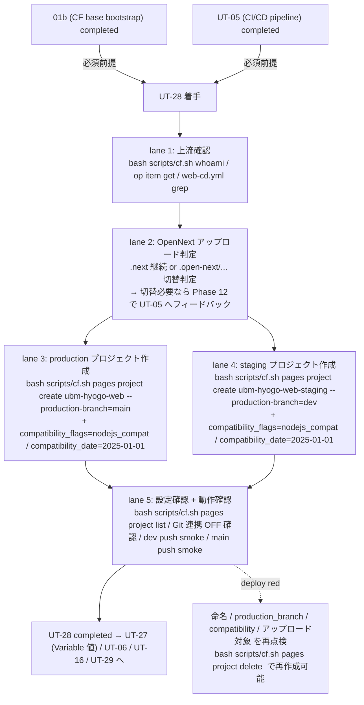

# Phase 2: 設計

## メタ情報

| 項目 | 値 |
| --- | --- |
| タスク名 | Cloudflare Pages プロジェクト（staging / production）作成 (ut-28-cloudflare-pages-projects-creation) |
| Phase 番号 | 2 / 13 |
| Phase 名称 | 設計 |
| 作成日 | 2026-04-29 |
| 前 Phase | 1 (要件定義) |
| 次 Phase | 3 (設計レビュー) |
| 状態 | completed |
| タスク種別 | implementation / NON_VISUAL / cloudflare_pages_projects_creation |

## 目的

Phase 1 で確定した「上流 2 件完了前提・5 リスク同時封じ・Pages プロジェクト 2 件・OpenNext 整合性判定・Pages Git 連携 OFF」要件を、配置トポロジ / SubAgent lane / state ownership / 設定一致表 / コマンド草案 / OpenNext アップロード判定基準 / 動作確認手順に分解し、Phase 3 のレビューが代替案比較で結論を出せる粒度の設計入力を作成する。本 Phase の成果は仕様レベルであり、実 `wrangler pages project create` 実行は Phase 13 ユーザー承認後に委ねる。

## 実行タスク

1. 5 ステップトポロジ（前提確認 → アップロード成果物判定 → プロジェクト作成 → 設定確認 → 動作確認）を Mermaid で固定する。
2. SubAgent lane 5 本（lane 1 上流確認 / lane 2 OpenNext アップロード判定 / lane 3 production プロジェクト作成 / lane 4 staging プロジェクト作成 / lane 5 設定確認 + 動作確認）を表化する。
3. プロジェクト設定一致表（名前 / `production_branch` / `compatibility_date` / `compatibility_flags` / アップロード対象 / Git 連携）を確定する。
4. OpenNext アップロード判定基準（`.next` 継続 vs `.open-next/...` 切替）を定義し、UT-05 へのフィードバック条件を確定する。
5. `bash scripts/cf.sh` 経由の `wrangler pages project create` コマンド草案を bash 系列で固定する。
6. 動作確認手順（dev push → staging deploy success / main push → production deploy success / `pages project list` 確認）を仕様化する。
7. 命名規則 `<base>` / `<base>-staging` を固定し、Variable `CLOUDFLARE_PAGES_PROJECT` の引き渡し値を `ubm-hyogo-web`（suffix なし）で確定する。
8. Pages Git 連携 OFF 既定方針を運用ルールに固定する。
9. リスク R-1〜R-5 を苦戦箇所 1〜5 に対応付けて表化する。

## 依存タスク順序（上流 2 件完了必須）— 重複明記 2/3

> **01b（Cloudflare base bootstrap）/ UT-05（CI/CD パイプライン実装）の 2 件が completed であることが本 Phase の必須前提である。**
> 未完了で本 Phase の設計を実装に移すと、(a) `wrangler pages project create` を呼ぶ API Token が確定しない、(b) `web-cd.yml` の参照キーと作成プロジェクト名が乖離する、いずれの場合もプロジェクト作成直後に CD が 401 / 8000017 (Project not found) / 命名ミスマッチを起こす。Phase 3 の NO-GO 条件で再度 block ゲートを置く。

## 参照資料

| 種別 | パス | 用途 |
| --- | --- | --- |
| 必須 | docs/30-workflows/ut-28-cloudflare-pages-projects-creation/phase-01.md | 真の論点 / 4 条件 / 苦戦箇所割り当て |
| 必須 | docs/30-workflows/unassigned-task/UT-28-cloudflare-pages-projects-creation.md | 親仕様 §苦戦箇所・知見 |
| 必須 | .github/workflows/web-cd.yml | プロジェクト名参照仕様（`${{ vars.CLOUDFLARE_PAGES_PROJECT }}-staging`） |
| 必須 | apps/web/wrangler.toml | `name` / `pages_build_output_dir` / `compatibility_date` / `compatibility_flags` |
| 必須 | apps/web/open-next.config.ts | OpenNext のビルド出力構造 |
| 必須 | apps/api/wrangler.toml | Workers 側 `compatibility_date = "2025-01-01"` / `compatibility_flags = ["nodejs_compat"]` |
| 必須 | scripts/cf.sh | `wrangler` ラッパーの正規経路 |
| 必須 | https://developers.cloudflare.com/pages/platform/branch-build-controls/ | `production_branch` 仕様 |
| 必須 | https://developers.cloudflare.com/workers/configuration/compatibility-dates/ | `compatibility_date` 仕様 |
| 参考 | https://github.com/opennextjs/opennextjs-cloudflare | OpenNext for Cloudflare 出力構造 |

## トポロジ (Mermaid)



## SubAgent lane 設計

| lane | 役割 | 入力 | 出力 / 副作用 | 成果物 |
| --- | --- | --- | --- | --- |
| 1. 上流確認 | 01b / UT-05 の completed 状態を inventory として確認 | repository / 1Password エントリ / `web-cd.yml` | 確認ログ（値はマスク） | outputs/phase-13/verification-log.md §upstream |
| 2. OpenNext アップロード判定 | `.next` 継続 / `.open-next/...` 切替の判定。`apps/web/open-next.config.ts` / `apps/web/wrangler.toml` の `pages_build_output_dir` / `web-cd.yml` の `pages deploy .next` を突き合わせる | `apps/web/*` 静的解析 | 判定結果 + UT-05 フィードバック要否 | outputs/phase-02/main.md §opennext-judgement / Phase 12 unassigned-task-detection |
| 3. production プロジェクト作成 | `bash scripts/cf.sh pages project create ubm-hyogo-web --production-branch=main` | API Token（op 経由） | Pages プロジェクト 1 件作成 | outputs/phase-13/apply-runbook.md §production |
| 4. staging プロジェクト作成 | `bash scripts/cf.sh pages project create ubm-hyogo-web-staging --production-branch=dev` | API Token（op 経由） | Pages プロジェクト 1 件作成 | outputs/phase-13/apply-runbook.md §staging |
| 5. 設定確認 + 動作確認 | `pages project list` でプロジェクト 2 件存在確認 / Dashboard で Git 連携 OFF 確認 / dev push smoke / main push smoke | CD run URL | smoke ログ / project list 出力（値マスク） | outputs/phase-11/manual-smoke-log.md / outputs/phase-13/verification-log.md |

## プロジェクト設定一致表（最終状態）

| 環境 | プロジェクト名 | `production_branch` | `compatibility_date` | `compatibility_flags` | アップロード対象（暫定） | Git 連携 |
| --- | --- | --- | --- | --- | --- | --- |
| production | `ubm-hyogo-web` | `main` | `2025-01-01` | `["nodejs_compat"]` | `.next`（OpenNext 整合は lane 2 で判定。切替必要なら UT-05 へフィードバック） | OFF |
| staging | `ubm-hyogo-web-staging` | `dev` | `2025-01-01` | `["nodejs_compat"]` | 同上 | OFF |

> Workers 側 (`apps/api/wrangler.toml`) と完全一致: `compatibility_date = "2025-01-01"` / `compatibility_flags = ["nodejs_compat"]`。バージョンずれ禁止（苦戦箇所 §3）。

## OpenNext アップロード成果物 判定基準（lane 2）

| 観点 | 確認内容 | 判定 |
| --- | --- | --- |
| 現状 wrangler.toml | `apps/web/wrangler.toml` `pages_build_output_dir = ".next"` | 素の Next.js 出力前提 |
| 現状 web-cd.yml | `pages deploy .next --project-name=...` | 素の Next.js 出力前提 |
| 現状 OpenNext 設定 | `apps/web/open-next.config.ts` で `defineCloudflareConfig()` を export | OpenNext 採用 |
| OpenNext 標準出力 | `.open-next/assets/` + `_worker.js` | `.next` のままでは `_worker.js` Workers エントリが反映されない可能性 |

### 判定ルール

- **(A) `.next` 継続で動作確認 green**: 現状仕様を維持できるのは、UT-05 が Pages 形式を明示採用し、aiworkflow-requirements 正本に `pages_build_output_dir = ".next"` の例外理由を記録済みの場合に限る。正本に例外理由がない場合、`.next` 継続は実 apply 前ブロッカー。
- **(B) `.next` 継続で動作確認 red（`_worker.js` 不在 / runtime error）**: `.open-next/assets` への切替が必要。`apps/web/wrangler.toml` の `pages_build_output_dir` と `web-cd.yml` の `pages deploy .next` を `.open-next/assets` に変更する PR を **UT-05 にフィードバックとして登録**（Phase 12 unassigned-task-detection.md）し、本タスクは `.next` 前提のままプロジェクトを作成する（プロジェクト側設定としてアップロード対象を強制する仕組みは無いため、CD 側の deploy コマンドで吸収）。
- **(C) OpenNext Workers 形式が正本**: `main = ".open-next/worker.js"` + `[assets] directory = ".open-next/assets"` が正本の場合、`pages_build_output_dir = ".next"` のまま実 apply しない。UT-05 完了確認で修正済みか、例外理由が記録済みかを Phase 13 preflight で確認する。
- 判定タイミング: lane 2 で静的解析 → lane 5 dev push smoke で実走確認 → red の場合 Phase 12 で UT-05 へフィードバック登録。

## ファイル変更計画

| パス | 操作 | 編集者 | 注意 |
| --- | --- | --- | --- |
| `outputs/phase-13/apply-runbook.md` | 新規作成（lane 3 / 4） | lane 3-4 | `bash scripts/cf.sh pages project create ...` のコマンド系列。Token 値は op 参照 only |
| `outputs/phase-13/verification-log.md` | 新規作成（lane 5） | lane 5 | `pages project list` 出力 / Git 連携状態 / CD run URL（実 URL は記録、Token 値はマスク） |
| `outputs/phase-11/manual-smoke-log.md` | 新規作成（lane 5） | lane 5 | dev push / main push smoke の log |
| `doc/01-infrastructure-setup/01b-parallel-cloudflare-base-bootstrap/` 配下 | 追記方針のみ（Phase 12） | Phase 12 | Pages プロジェクト命名・`production_branch`・互換性同期の正本ドキュメント追記方針 |
| その他 | 変更しない | - | apps/web の wrangler.toml / open-next.config.ts / `.github/workflows/*.yml` / D1 / `.env` 等は本タスクで触らない（OpenNext 切替が必要な場合は UT-05 側 PR で対応） |

## 環境変数 / Secret

| 種別 | 名前 | 用途 | 管理場所 |
| --- | --- | --- | --- |
| Cloudflare API Token | `CLOUDFLARE_API_TOKEN` | `wrangler pages project create` 実行に必要 | 1Password Environments → `bash scripts/cf.sh` 経由で動的注入（`.env` には op 参照のみ） |
| Cloudflare Account ID | `CLOUDFLARE_ACCOUNT_ID` | `wrangler` のアカウント識別 | 1Password Environments → `scripts/cf.sh` 経由 |
| GitHub Variable | `CLOUDFLARE_PAGES_PROJECT` | UT-27 への引き渡し値（`ubm-hyogo-web` = production 名 suffix なし） | 本タスクで命名確定し、UT-27 が GitHub Actions Variables に配置 |

> token / Account ID 値は payload / runbook / Phase outputs に転記しない。`.env` にも実値を書かない（CLAUDE.md ローカル `.env` 運用ルール準拠 / AC-13）。

## state ownership 表

| state | 物理位置 | owner | writer | reader | TTL / lifecycle |
| --- | --- | --- | --- | --- | --- |
| Cloudflare Pages プロジェクト（production） | Cloudflare アカウント | UT-28 PR | lane 3（`wrangler pages project create` 経由のみ） | CD ワークフロー / カスタムドメイン (UT-16) / スモーク (UT-29) | 永続。命名変更時は delete → create |
| Cloudflare Pages プロジェクト（staging） | Cloudflare アカウント | UT-28 PR | lane 4（`wrangler pages project create` 経由のみ） | CD ワークフロー / スモーク (UT-29) | 永続。同上 |
| `production_branch` 設定（環境別） | Cloudflare Pages プロジェクト設定 | UT-28 PR | lane 3 / 4（create 時に同時設定） | Cloudflare Pages ランタイム | 永続。ブランチ戦略変更時に再設定 |
| `compatibility_date` / `compatibility_flags` | Cloudflare Pages プロジェクト設定 | UT-28 PR | lane 3 / 4 | Cloudflare Pages ランタイム | 永続。Workers 側更新時に同期 |
| Pages Git 連携状態（OFF） | Cloudflare Dashboard | UT-28 PR | lane 5（OFF 確認 / 必要なら OFF 化） | 運用者 | 永続。誤って ON にしないこと |
| `apply-runbook.md` / `verification-log.md` | `outputs/phase-13/` | UT-28 PR | lane 3-5 | 監査 / 将来運用 | 永続（PR にコミット） |
| Variable 値 `CLOUDFLARE_PAGES_PROJECT = ubm-hyogo-web` | UT-27 ワークフローへの引き渡し | UT-28 PR | Phase 13 完了時に UT-27 へ通知 | UT-27 / `web-cd.yml` | 永続。命名変更時に再同期 |

> **重要境界**:
> - **Cloudflare Pages プロジェクトの create / delete は `bash scripts/cf.sh` 経由のみ**（CLAUDE.md「`wrangler` 直接実行禁止」/ AC-14）。
> - `compatibility_date` / `compatibility_flags` は **Workers 側 (`apps/api/wrangler.toml`) を正本** とし、Pages 側を派生コピー（同一値）で揃える。Workers 側更新時は Pages 側も同期する運用を Phase 12 ドキュメントに記載。
> - Pages Git 連携は **OFF 既定**。GitHub Actions 主導 deploy と二重起動しない。

## `bash scripts/cf.sh` 経由のコマンド草案（仕様レベル / 実 PUT は Phase 13）

```bash
# ===== 0. 上流確認（lane 1） =====
bash scripts/cf.sh whoami                                              # API Token 認証
op item get "Cloudflare" --vault UBM-Hyogo > /dev/null                 # 1Password エントリ存在
grep -nE "pages deploy|project-name" .github/workflows/web-cd.yml      # web-cd.yml の参照キー確認

# ===== 1. OpenNext アップロード判定（lane 2） =====
cat apps/web/wrangler.toml | grep -E "pages_build_output_dir|compatibility"
cat apps/web/open-next.config.ts
# 判定: .next 継続（A）か .open-next/... 切替（B）か。
# B の場合は Phase 12 で UT-05 にフィードバック登録（本タスクではプロジェクトのみ作成）

# ===== 2. production プロジェクト作成（lane 3） =====
bash scripts/cf.sh pages project create ubm-hyogo-web \
  --production-branch=main \
  --compatibility-flags=nodejs_compat \
  --compatibility-date=2025-01-01

# ===== 3. staging プロジェクト作成（lane 4） =====
bash scripts/cf.sh pages project create ubm-hyogo-web-staging \
  --production-branch=dev \
  --compatibility-flags=nodejs_compat \
  --compatibility-date=2025-01-01

# ===== 4. 設定確認（lane 5） =====
bash scripts/cf.sh pages project list                                  # 2 件存在確認
# Git 連携: Cloudflare Dashboard で Settings → Builds & deployments → "Disconnect from Git"
#   または Git 連携を一切設定しない（create 直後の既定状態は連携なし）

# ===== 5. 動作確認（lane 5） =====
git commit --allow-empty -m "chore(cd): trigger staging deploy smoke [UT-28]"
git push origin dev
gh run watch                                                            # web-cd.yml deploy-staging が green

git commit --allow-empty -m "chore(cd): trigger production deploy smoke [UT-28]"
git push origin main                                                    # ※ 通常は dev → main の PR 経由
gh run watch                                                            # web-cd.yml deploy-production が green
```

> 値そのものは出力しない。API Token / Account ID は `bash scripts/cf.sh` の op run 経由でのみ環境変数として揮発的に渡る（ファイル / ログには残らない）。

## 動作確認手順

### `pages project list` 確認

1. `bash scripts/cf.sh pages project list` を実行。
2. `ubm-hyogo-web` / `ubm-hyogo-web-staging` の 2 件が表示されることを確認。
3. それぞれの `production_branch` が `main` / `dev` であることを確認。

### dev push smoke

1. ワークツリー上で空コミットを作成: `git commit --allow-empty -m "chore(cd): smoke [UT-28]"`
2. dev に push: `git push origin dev`
3. `gh run watch` で `web-cd.yml` の `deploy-staging` が green になることを確認。
4. Cloudflare Dashboard の Pages → `ubm-hyogo-web-staging` → Deployments で deploy 履歴を確認。
5. 公開 URL `https://ubm-hyogo-web-staging.pages.dev` が 200 を返すことを確認（HTTP のみ。Auth は別タスク）。

### main push smoke

1. dev → main の PR を経由して main に変更を入れる（通常運用）。
2. `gh run watch` で `web-cd.yml` の `deploy-production`（main 条件）が green になることを確認。
3. 公開 URL `https://ubm-hyogo-web.pages.dev` が 200 を返すことを確認。

### Pages Git 連携 OFF 確認（苦戦箇所 §5）

1. Cloudflare Dashboard → Pages → 各プロジェクト → Settings → Builds & deployments を開く。
2. "Connect to Git" が OFF（または未接続）であることを確認。
3. ON になっている場合は OFF に切り替える（既存ブランチへの自動 deploy を即停止）。

### OpenNext アップロード整合性確認（苦戦箇所 §1）

1. dev push smoke 後、deploy された URL のレスポンスで `_worker.js` 経由のサーバーレンダリングが期待通り動くか軽く確認（トップページ / 任意 SSR ルート）。
2. `_worker.js` 不在エラー / runtime error がある場合は判定 (B) に該当 → Phase 12 で UT-05 にフィードバック登録。

## 実行手順

### ステップ 1: 前提確認の固定

- 上流 2 件（01b / UT-05）completed 確認を Phase 5 着手前のゲート条件として `apply-runbook.md` に記述。

### ステップ 2: トポロジと lane の確定

- Mermaid 図と SubAgent lane 5 本を `outputs/phase-02/main.md` に固定。

### ステップ 3: 設定一致表の確定

- Pages プロジェクト 2 件の名前 / `production_branch` / `compatibility_date` / `compatibility_flags` / アップロード対象 / Git 連携 を表化。

### ステップ 4: OpenNext アップロード判定基準の確定

- 判定 (A)（`.next` 継続）/ (B)（`.open-next/...` 切替 + UT-05 フィードバック）の境界を明文化。

### ステップ 5: コマンド草案の確定

- `bash scripts/cf.sh pages project create ...` を 5 段（上流確認 → OpenNext 判定 → production 作成 → staging 作成 → 設定/動作確認）で固定。

### ステップ 6: 動作確認手順の確定

- `pages project list` / dev push smoke / main push smoke / Git 連携 OFF 確認 / OpenNext 整合性 の 5 件を仕様化。

### ステップ 7: リスク R-1〜R-5 の表化

- 苦戦箇所 1〜5 と一対一に対応付け、緩和策と担当 Phase を明記。

### ステップ 8: 値転記禁止の運用境界確定

- API Token / Account ID 値を payload / runbook / Phase outputs / ログ に転記しない。op 参照のみ可（AC-13）。

## リスク表（苦戦箇所 1〜5 → R-1〜R-5）

| # | リスク | 影響 | 緩和策 | 担当 Phase |
| --- | --- | --- | --- | --- |
| R-1 | OpenNext 採用環境のアップロード対象不整合（`.next` vs `.open-next/...`） | deploy が success でも `_worker.js` が反映されず SSR / API ルートが 500 / 404 | lane 2 で静的判定 + lane 5 smoke で実走確認、red なら Phase 12 で UT-05 へフィードバック登録（PR 切替依頼） | Phase 2 / 11 / 12 |
| R-2 | `production_branch` 取り違え（main/dev を逆配線、または未設定） | preview 扱いで環境変数 / カスタムドメイン未反映、URL がプレビューエイリアス化 | プロジェクト作成時に `--production-branch=main` / `--production-branch=dev` を必須引数化、`pages project list` で確認 | Phase 2 / 5 / 11 |
| R-3 | `compatibility_date` / `compatibility_flags` の Workers 同期ずれ | 共有 util の `process` / `node:*` モジュール可用性が片側だけ異なり、Workers と Pages で挙動分岐 | プロジェクト作成時に `--compatibility-date=2025-01-01` / `--compatibility-flags=nodejs_compat` を必須化。Workers 側更新時は Pages 側を同期する運用を Phase 12 ドキュメントに明記 | Phase 2 / 5 / 12 |
| R-4 | プロジェクト命名揺れ（`<base>` vs `<base>-staging` の二重訂正、Variable 値ミスマッチ） | UT-27 で配置した `CLOUDFLARE_PAGES_PROJECT` の値と `web-cd.yml` の suffix 連結結果が一致せず、`pages deploy` が 8000017 (Project not found) | 命名規則「production = `<base>` / staging = `<base>-staging`」/ Variable 値 = production 名（suffix なし）を AC-6 で固定。UT-27 への引き渡し値も同じ | Phase 2 / 5 / 11 |
| R-5 | Pages 自動 Git 連携と GitHub Actions の二重 deploy | 同一ブランチに対して Cloudflare 側 build と GitHub Actions deploy が並走、ログ分散で原因追跡困難 / build が古い commit を採用するレース | Pages Git 連携 OFF 既定方針、create 直後の既定状態（連携なし）を維持、Dashboard で OFF を最終確認 | Phase 2 / 5 / 11 |

## 統合テスト連携

| 連携先 Phase | 連携内容 |
| --- | --- |
| Phase 3 | 設計の代替案比較・PASS/MINOR/MAJOR 判定の入力 |
| Phase 4 | lane 1〜5 ごとのテスト計画ベースライン |
| Phase 5 | 実装ランブック（`bash scripts/cf.sh pages project create ...`）の擬似コード起点 |
| Phase 6 | 異常系（命名衝突 / branch 設定ミス / OpenNext 不整合 / Git 連携二重起動 / Token スコープ不足） |
| Phase 11 | dev push smoke / main push smoke / `pages project list` / Git 連携 OFF / OpenNext 整合性 の実走基準 |
| Phase 12 | OpenNext 切替フィードバックを UT-05 unassigned-task-detection に登録 / `compatibility_date` 同期運用を 01b ドキュメントに追記 |
| Phase 13 | user_approval_required: true で実 `wrangler pages project create` を実行する根拠を提供 |

## 多角的チェック観点

- 上流 2 件完了前提が 3 重に明記されているか（本 Phase が 2 重目）。
- 設定一致表で `production_branch` / `compatibility_date` / `compatibility_flags` / Git 連携 が 2 環境すべてに記述されているか。
- 命名規則「`<base>` / `<base>-staging`」と Variable 値「`<base>`（suffix なし）」が固定されているか（§4）。
- OpenNext アップロード判定 (A)/(B) の境界と UT-05 フィードバック条件が明文化されているか（§1）。
- Pages Git 連携 OFF が運用ルールとして明記されているか（§5）。
- `compatibility_date = 2025-01-01` が Workers 側と完全一致しているか（§3）。
- コマンド系列がすべて `bash scripts/cf.sh ...` 経由になっているか（CLAUDE.md / AC-14）。
- API Token / Account ID 値が Phase 成果物・runbook・bash 例の文字列に転記されていないか（op 参照のみか）。
- 不変条件 #5 を侵害しない範囲か（apps/api / apps/web / D1 を本タスクで編集しない）。
- OpenNext 切替が必要な場合に本タスク内で workflow を直接編集せず UT-05 にフィードバックする責務分離になっているか。

## サブタスク管理

| # | サブタスク | 担当 Phase | 状態 | 備考 |
| --- | --- | --- | --- | --- |
| 1 | Mermaid トポロジ | 2 | completed | 5 lane + rollback ヒント |
| 2 | SubAgent lane 5 本 | 2 | completed | I/O・成果物明示 |
| 3 | プロジェクト設定一致表 | 2 | completed | 2 環境 × 6 列 |
| 4 | OpenNext アップロード判定基準 (A)/(B) | 2 | completed | UT-05 フィードバック条件込み |
| 5 | `bash scripts/cf.sh` コマンド草案 | 2 | completed | 5 段（上流確認 → OpenNext 判定 → production 作成 → staging 作成 → 設定/動作確認） |
| 6 | 動作確認手順 5 件 | 2 | completed | `pages project list` / dev push / main push / Git 連携 OFF / OpenNext 整合性 |
| 7 | 命名規則・Variable 引き渡し値の固定 | 2 | completed | `<base>` = `ubm-hyogo-web`（suffix なし） |
| 8 | Pages Git 連携 OFF 既定方針 | 2 | completed | 運用ルール化 |
| 9 | リスク R-1〜R-5 の表化（苦戦箇所 1〜5 対応） | 2 | completed | 緩和策 + 担当 Phase 込み |
| 10 | state ownership 表 | 2 | completed | Workers 正本 / Pages 派生境界明記 |
| 11 | ファイル変更計画 | 2 | completed | apply-runbook / verification-log / manual-smoke-log |
| 12 | 上流 2 件完了前提の重複明記 | 2 | completed | 3 重明記の 2 箇所目 |
| 13 | 値転記禁止 / `wrangler` 直接実行禁止 の運用境界 | 2 | completed | AC-13 / AC-14 と整合 |

## 成果物

| 種別 | パス | 説明 |
| --- | --- | --- |
| 設計 | outputs/phase-02/main.md | トポロジ / lane / 設定一致表 / OpenNext 判定 / コマンド草案 / 動作確認 / リスク表 / state ownership |
| メタ | artifacts.json | Phase 2 状態の更新（本 workflow で作成済み） |

## 完了条件

- [x] Mermaid トポロジに 5 lane + rollback ヒントが記述されている
- [x] SubAgent lane 5 本に I/O / 成果物が記述されている
- [x] プロジェクト設定一致表に 2 環境 × 6 列（名前 / `production_branch` / `compatibility_date` / `compatibility_flags` / アップロード対象 / Git 連携）すべてが記述されている
- [x] OpenNext アップロード判定 (A)/(B) の境界と UT-05 フィードバック条件が明文化されている
- [x] 命名規則「`<base>` / `<base>-staging`」と Variable 値「`<base>` = `ubm-hyogo-web`（suffix なし）」が固定されている
- [x] Pages Git 連携 OFF 既定方針が運用ルールとして明記されている
- [x] `compatibility_date = 2025-01-01` / `compatibility_flags = ["nodejs_compat"]` が Workers 側と完全一致している
- [x] `bash scripts/cf.sh` 経由のコマンド草案が 5 段で固定されている（`wrangler` 直接実行なし）
- [x] 動作確認手順に 5 件（`pages project list` / dev push / main push / Git 連携 OFF / OpenNext 整合性）が含まれている
- [x] state ownership 表に「Workers 正本 / Pages 派生」境界が記述されている
- [x] リスク R-1〜R-5 が苦戦箇所 1〜5 と一対一に対応している
- [x] 上流 2 件完了前提が本 Phase で重複明記されている（3 重明記の 2 箇所目）
- [x] API Token / Account ID 値が Phase 成果物に転記されていない

## タスク100%実行確認【必須】

- 全実行タスク（9 件）が `completed`
- 全成果物が `outputs/phase-02/` 配下に配置予定（Phase 4 以降で本体生成）
- 異常系（命名衝突 / branch 設定ミス / OpenNext 不整合 / Git 連携二重起動）の対応 lane が設計に含まれる
- artifacts.json の `phases[1].status` が `completed`（Phase 4 以降で同期）

## 次 Phase への引き渡し

- 次 Phase: 3 (設計レビュー)
- 引き継ぎ事項:
  - base case = lane 1〜5 直列 / lane 3-4 部分並列（前提確認 → OpenNext 判定 → (production + staging 並列作成) → 設定/動作確認）
  - Pages プロジェクト 2 件 / `production_branch` 環境別配線 / `compatibility_date = 2025-01-01` / `compatibility_flags = ["nodejs_compat"]` / Git 連携 OFF / アップロード `.next`（OpenNext 切替が必要なら UT-05 フィードバック）
  - 命名規則「`<base>` / `<base>-staging`」と Variable 値「`<base>` = `ubm-hyogo-web`」
  - `bash scripts/cf.sh pages project create ...` のコマンド草案
  - 動作確認手順 5 件
  - リスク R-1〜R-5
  - 上流 2 件完了を NO-GO 条件として Phase 3 へ引き渡す
- ブロック条件:
  - Mermaid に 5 lane のいずれかが欠落
  - state ownership に「Workers = 正本」境界が無い
  - 設定一致表に 2 環境 × 6 列のいずれかが抜けている
  - API Token / Account ID 値が Phase outputs / runbook / bash 例の文字列に直書きされている
  - 上流 2 件完了前提が記述されていない
  - コマンド系列に `wrangler` 直接実行が混入している
