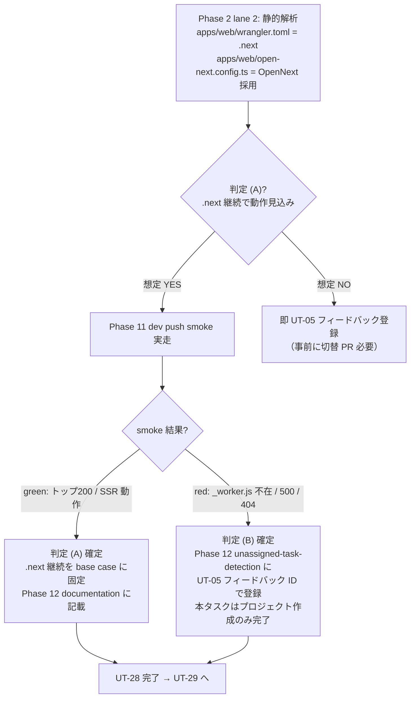

# Phase 9: 統合検証 / E2E

## メタ情報

| 項目 | 値 |
| --- | --- |
| タスク名 | Cloudflare Pages プロジェクト（staging / production）作成 (ut-28-cloudflare-pages-projects-creation) |
| Phase 番号 | 9 / 13 |
| Phase 名称 | 統合検証 / E2E |
| 作成日 | 2026-04-29 |
| 前 Phase | 8 (品質ゲート / NON_VISUAL governance) |
| 次 Phase | 10 (受入確認 / UT-27 への命名引き渡し) |
| 状態 | pending |
| タスク種別 | implementation / NON_VISUAL / cloudflare_pages_projects_creation |

## 目的

Phase 8 で確定した品質ゲート（drift 検知 / 重複起動防止 / NON_VISUAL evidence 規律）を踏まえ、本 Phase では **dev / main 両ブランチからの deploy 連携 E2E テスト** を仕様レベルで確定する。具体的には (1) `dev` push → `web-cd.yml` → Cloudflare Pages staging（`ubm-hyogo-web-staging`）への deploy 成功 / 公開 URL 200 応答、(2) `main` push → `web-cd.yml` → Cloudflare Pages production（`ubm-hyogo-web`）への deploy 成功 / 公開 URL 200 応答、(3) 2 環境間の **役割分離確認**（staging で動いて production で動かない / 逆 のケース検出）、(4) UT-29（CD 後スモーク）との **責務境界整理**（UT-28 = 「プロジェクトが存在し deploy が通る」確認 / UT-29 = 「アプリ機能が公開 URL 上で動く」確認）、(5) OpenNext アップロード判定の最終決着（Phase 2 lane 2 静的判定 → Phase 11 dev push smoke 実走 → ここで red/green を確定し UT-05 フィードバック要否を決め切る）、を確定する。本ワークフローは仕様書整備に閉じ、実 push / 実 deploy は Phase 11 / 13 に委ねるが、本 Phase で **E2E シナリオ SSOT** と **UT-29 境界仕様** を明文化する。

## 実行タスク

1. dev push → staging deploy E2E シナリオを確定する（完了条件: トリガ / 期待 run / 期待 conclusion / 期待公開 URL / 期待 HTTP status code / 失敗時切り戻し手順 が記述）。
2. main push → production deploy E2E シナリオを確定する（完了条件: 同上 main 版、PR ベースの merge → main 経路と直接 push 経路の両方を扱う）。
3. 2 環境間の役割分離確認シナリオを確定する（完了条件: staging のみ / production のみ にデプロイされた場合の独立性 = 互いに干渉しないことを `pages project info` の deployment_id 突合で確認する手順）。
4. UT-29（CD 後スモーク）との責務境界を表化する（完了条件: 「UT-28 が確認するもの / UT-29 が確認するもの / 両者の境界 / 検証担当 Phase」が表化）。
5. OpenNext アップロード判定の最終決着シナリオを確定する（完了条件: Phase 2 (A)/(B) 判定 → dev push smoke 結果 → red の場合 Phase 12 で UT-05 フィードバック登録、green の場合 `.next` 継続を base case として確定する分岐手順が記述）。
6. E2E 失敗時の切り戻し手順を確定する（完了条件: `bash scripts/cf.sh pages project delete <name>` → 再 create / `gh run rerun` / `git revert` の 3 段切り戻しが記述、各段の影響範囲明記）。
7. 公開 URL 疎通確認手順を確定する（完了条件: `curl -sSf -o /dev/null -w "%{http_code}\n" https://ubm-hyogo-web.pages.dev` / staging URL の 2 件、Auth gate 越えは UT-29 のため不要、トップページ HTTP 200 のみで十分）。
8. outputs/phase-09/main.md に E2E シナリオと UT-29 境界仕様を集約する（完了条件: 1 ファイルにすべて記述、pending プレースホルダ可）。

## 参照資料

| 種別 | パス | 用途 |
| --- | --- | --- |
| 必須 | docs/30-workflows/ut-28-cloudflare-pages-projects-creation/phase-02.md | base case（lane 1〜5 / Mermaid トポロジ） |
| 必須 | docs/30-workflows/ut-28-cloudflare-pages-projects-creation/phase-08.md | 品質ゲート / drift 検知 / evidence 規律 |
| 必須 | docs/30-workflows/unassigned-task/UT-28-cloudflare-pages-projects-creation.md §苦戦箇所・知見 | リスク源 |
| 必須 | docs/30-workflows/unassigned-task/UT-29-post-cd-smoke.md | 後続スモークタスク（責務境界整理対象） |
| 必須 | .github/workflows/web-cd.yml | deploy job 名 / トリガ条件 / アップロード対象 |
| 必須 | apps/web/wrangler.toml | `pages_build_output_dir = ".next"` の現状確認 |
| 必須 | apps/web/open-next.config.ts | OpenNext build 出力構造の確認 |
| 必須 | scripts/cf.sh | drift 検知 / project info 取得の正規経路 |
| 参考 | docs/30-workflows/completed-tasks/ut-27-github-secrets-variables-deployment/phase-09.md | 同型 NON_VISUAL E2E 系の構造参照 |

## 上流前提再掲

> Phase 1 / 2 / 3 で 3 重明記済み。本 Phase は E2E 仕様確定段階のため新規重複明記は不要。ただし Phase 11 dev push smoke 実走前には `bash scripts/cf.sh whoami` 成功 / `gh pr list --search "UT-05" --state merged` 確認 / `bash scripts/cf.sh pages project list` で 2 件存在 を直前確認することを runbook で求める。

## E2E シナリオ 1: dev push → staging deploy

### 1.1 シナリオ定義

| 項目 | 値 |
| --- | --- |
| トリガ | `git push origin dev`（空コミット可: `git commit --allow-empty -m "chore(cd): smoke [UT-28]"`） |
| 起動する workflow | `.github/workflows/web-cd.yml` |
| 起動する job | `deploy-staging`（`web-cd.yml` 内、`branch == 'dev'` 条件） |
| アップロード対象 | `.next` ディレクトリ（OpenNext 判定で red なら `.open-next/assets` への切替を UT-05 にフィードバック） |
| デプロイ先 | Cloudflare Pages プロジェクト `ubm-hyogo-web-staging` |
| 期待 conclusion | `success`（`deploy-staging` job が green） |
| 期待公開 URL | `https://ubm-hyogo-web-staging.pages.dev` |
| 期待 HTTP status | `200`（トップページ。Auth gate 越えは UT-29） |
| 期待所要時間 | 5〜10 分（Next.js build + Pages upload） |
| 確認 evidence | `outputs/phase-09/dev-push-run.json` / `outputs/phase-09/staging-curl.txt` |

### 1.2 実走スクリプト（pending の擬似）

```bash
# 1. 空コミットを作って dev に push
git commit --allow-empty -m "chore(cd): smoke [UT-28]"
git push origin dev

# 2. 起動した web-cd.yml run を待機
gh run watch --exit-status --workflow=web-cd.yml \
  | tee outputs/phase-09/dev-push-run-watch.log

# 3. run 結果を JSON で保存
gh run list --workflow=web-cd.yml --branch=dev --limit=1 \
  --json databaseId,headSha,conclusion,status,jobs \
  > outputs/phase-09/dev-push-run.json

# 4. deploy-staging job の conclusion を確認
jq -r '.[0].jobs[] | select(.name == "deploy-staging") | .conclusion' \
  outputs/phase-09/dev-push-run.json

# 5. 公開 URL 疎通確認
curl -sSf -o /dev/null -w "%{http_code}\n" \
  https://ubm-hyogo-web-staging.pages.dev \
  | tee outputs/phase-09/staging-curl.txt
```

### 1.3 期待結果

- `deploy-staging` job conclusion = `success`。
- `https://ubm-hyogo-web-staging.pages.dev` が HTTP 200 を返す。
- Cloudflare Pages Dashboard の Deployments で deploy 1 件追加（`bash scripts/cf.sh pages project info ubm-hyogo-web-staging` の `latest_deployment.id` が更新）。
- `web-cd.yml` の他 job（lint / typecheck / build）が pre-step として success（UT-05 側の責務だが連鎖確認）。

## E2E シナリオ 2: main push → production deploy

### 2.1 シナリオ定義

| 項目 | 値 |
| --- | --- |
| トリガ | `dev` → `main` の PR を merge（推奨）。直接 `git push origin main` は branch protection で禁止される想定 |
| 起動する workflow | `.github/workflows/web-cd.yml` |
| 起動する job | `deploy-production`（`web-cd.yml` 内、`branch == 'main'` 条件） |
| アップロード対象 | `.next`（同上、OpenNext 判定済み） |
| デプロイ先 | Cloudflare Pages プロジェクト `ubm-hyogo-web` |
| 期待 conclusion | `success` |
| 期待公開 URL | `https://ubm-hyogo-web.pages.dev` |
| 期待 HTTP status | `200`（トップページ） |
| 期待所要時間 | 5〜10 分 |
| 確認 evidence | `outputs/phase-09/main-push-run.json` / `outputs/phase-09/production-curl.txt` |

### 2.2 実走スクリプト（pending の擬似）

```bash
# 1. dev → main の PR を merge（gh pr merge）
gh pr merge --squash --delete-branch <PR_NUMBER>

# 2. 起動した web-cd.yml run を待機
gh run watch --exit-status --workflow=web-cd.yml \
  | tee outputs/phase-09/main-push-run-watch.log

# 3. run 結果を JSON で保存
gh run list --workflow=web-cd.yml --branch=main --limit=1 \
  --json databaseId,headSha,conclusion,status,jobs \
  > outputs/phase-09/main-push-run.json

# 4. deploy-production job の conclusion を確認
jq -r '.[0].jobs[] | select(.name == "deploy-production") | .conclusion' \
  outputs/phase-09/main-push-run.json

# 5. 公開 URL 疎通確認
curl -sSf -o /dev/null -w "%{http_code}\n" \
  https://ubm-hyogo-web.pages.dev \
  | tee outputs/phase-09/production-curl.txt
```

### 2.3 期待結果

- `deploy-production` job conclusion = `success`。
- `https://ubm-hyogo-web.pages.dev` が HTTP 200 を返す。
- production プロジェクトの `latest_deployment.id` が更新。
- staging プロジェクトの `latest_deployment.id` は **更新されない**（main push が staging に巻き込まれていないこと = 役割分離 E2E 観点 3 の前提）。

## E2E シナリオ 3: 2 環境間の役割分離確認

### 3.1 シナリオ定義

苦戦箇所 §2（`production_branch` 取り違え）/ §4（命名揺れ）由来の事故として、main push が staging プロジェクトにも巻き込まれてデプロイされる / dev push が production プロジェクトにも飛ぶ といった経路が万が一発生していないことを E2E で確認する。

### 3.2 確認軸

| 観点 | 期待 | 確認方法 |
| --- | --- | --- |
| dev push 直後 | staging プロジェクトのみ `latest_deployment` が更新 / production は不変 | `bash scripts/cf.sh pages project info` の deployment_id を push 前後で diff |
| main push 直後 | production プロジェクトのみ `latest_deployment` が更新 / staging は不変 | 同上 |
| `production_branch` 一致 | production プロジェクトが認識する `production_branch` が `main`、staging プロジェクトが `dev` | `bash scripts/cf.sh pages project info <name>` の `production_branch` field |
| 命名分離 | Variable `CLOUDFLARE_PAGES_PROJECT` = `ubm-hyogo-web` (suffix なし) と `web-cd.yml` の `${{ vars.X }}-staging` 連結が一致 | `web-cd.yml` の `--project-name` 引数を grep + Variable 値突合 |

### 3.3 検証スクリプト

```bash
# push 前 deployment_id 取得
PROD_DEPLOY_BEFORE=$(jq -r '.latest_deployment.id // empty' \
  outputs/phase-08/project-info-prod.json)
STG_DEPLOY_BEFORE=$(jq -r '.latest_deployment.id // empty' \
  outputs/phase-08/project-info-staging.json)

# シナリオ 1（dev push）実走後に再取得
bash scripts/cf.sh pages project info ubm-hyogo-web-staging \
  > outputs/phase-09/project-info-staging-after-dev.json
bash scripts/cf.sh pages project info ubm-hyogo-web \
  > outputs/phase-09/project-info-prod-after-dev.json

STG_DEPLOY_AFTER_DEV=$(jq -r '.latest_deployment.id' \
  outputs/phase-09/project-info-staging-after-dev.json)
PROD_DEPLOY_AFTER_DEV=$(jq -r '.latest_deployment.id' \
  outputs/phase-09/project-info-prod-after-dev.json)

# 期待: STG が更新 / PROD は不変
[ "$STG_DEPLOY_AFTER_DEV" != "$STG_DEPLOY_BEFORE" ] \
  && echo "OK: staging deployment updated by dev push" \
  || echo "NG: staging deployment NOT updated"
[ "$PROD_DEPLOY_AFTER_DEV" = "$PROD_DEPLOY_BEFORE" ] \
  && echo "OK: production deployment unchanged by dev push (役割分離 OK)" \
  || echo "NG: production deployment was triggered by dev push (役割分離 NG)"
```

### 3.4 期待結果

- dev push 後: staging deployment_id 更新 / production deployment_id 不変。
- main push 後: production deployment_id 更新 / staging deployment_id 不変。
- 違反検出時: Phase 11 で blocker 化、`production_branch` 設定を即時修正（`bash scripts/cf.sh pages project delete` → 再 create）。

## E2E シナリオ 4: UT-29（CD 後スモーク）との責務境界

### 4.1 境界定義

| 確認内容 | UT-28（本タスク） | UT-29（CD 後スモーク） |
| --- | --- | --- |
| Pages プロジェクト存在確認 | ◯（`pages project list` で 2 件） | × |
| `production_branch` / 互換性設定の整合 | ◯（drift 検知） | × |
| `web-cd.yml` deploy job conclusion = success | ◯（dev/main 両方） | × |
| 公開 URL HTTP 200（トップページ） | ◯（最低限の到達確認） | ◯（再確認） |
| アプリトップページ DOM 内容（タイトル / hydration） | × | ◯ |
| Auth gate（Magic Link）動作確認 | × | ◯ |
| API ルート（`apps/api`）/health 疎通 | × | ◯ |
| OpenNext SSR 経路（`_worker.js`）動作確認 | △（red 検出のみ。修正は UT-05 / フィードバックは UT-29 にも） | ◯（実機能確認） |
| Lighthouse / a11y / 視覚回帰 | × | ◯（必要に応じて） |
| 公開 URL からの D1 経由データ取得 | × | × |

### 4.2 責務分離の根拠

- **UT-28 = インフラ作成タスク**: 「Cloudflare Pages プロジェクトが正しい設定で 2 件存在し、CD が deploy 完走する」までを保証する。アプリの中身が動くかは別関心事。
- **UT-29 = アプリ機能スモークタスク**: 「公開 URL でアプリの主要画面が動き、Auth / API / OpenNext SSR 等の経路が green」まで確認する。
- **両者の境界**: 「`web-cd.yml` deploy job が success / 公開 URL HTTP 200」までが UT-28、「DOM 検査 / 機能確認」が UT-29。HTTP 200 は両タスクで重複確認するが、UT-28 では到達確認のみ・UT-29 ではコンテンツ検査も含む。

### 4.3 ハンドオフ設計

- 本タスク Phase 13 完了時に `outputs/phase-09/integration-handoff.md` を生成し、UT-29 着手者へ「公開 URL 2 件 / プロジェクト名 2 件 / 直近 deploy run URL」を引き渡す。
- API Token / Account ID 値は引き渡さない（UT-29 が独自に 1Password から動的取得）。
- 引き渡し情報: 公開 URL（公開可）/ プロジェクト名（公開可）/ run URL（公開可）/ Phase 11 smoke の最新 conclusion。

## E2E シナリオ 5: OpenNext アップロード判定の最終決着

### 5.1 判定フロー



### 5.2 判定基準

| 観点 | (A) `.next` 継続 | (B) `.open-next/...` 切替 |
| --- | --- | --- |
| トップページ | 200 | 200（`.next` のままでも到達できる場合あり） |
| SSR ルート（任意のサーバーレンダリングページ） | 200 + 期待 HTML | 500 / 404 / `_worker.js not found` 系 |
| Cloudflare Logs（`wrangler pages deployment tail`） | error なし | `_worker.js` 関連 error |
| 判定先 | base case 固定 | UT-05 フィードバック登録（Phase 12） |

### 5.3 確認スクリプト

```bash
# トップ確認（A/B 共通）
curl -sSf -o /dev/null -w "%{http_code}\n" \
  https://ubm-hyogo-web-staging.pages.dev

# SSR 任意ルート確認（例: /healthz が apps/web 側にある場合 / なければ別ルート）
curl -sSf -o /tmp/ssr.html -w "%{http_code}\n" \
  https://ubm-hyogo-web-staging.pages.dev/

# deployment tail で error 検出
bash scripts/cf.sh pages deployment tail --project-name=ubm-hyogo-web-staging \
  --format=pretty 2>&1 | tee outputs/phase-09/staging-deployment-tail.log
```

## E2E シナリオ 6: 切り戻し手順

### 6.1 切り戻し 3 段

| 段階 | 操作 | 影響範囲 | 復旧時間 |
| --- | --- | --- | --- |
| 1. deploy 単体切り戻し | `gh run rerun <run-id>` または Cloudflare Dashboard で前 deployment を rollback | 公開 URL の中身が前バージョンに戻る | 即時〜数分 |
| 2. プロジェクト再作成 | `bash scripts/cf.sh pages project delete <name>` → `bash scripts/cf.sh pages project create ...` で再作成 | 公開 URL が一時的に 404、UT-27 Variable 値再確認も必要 | 5〜10 分 |
| 3. PR 切り戻し | `git revert` で commit を戻す → 通常の dev/main フローで再 deploy | コードレベルの切り戻し | 通常リリースサイクル |

### 6.2 段階選択基準

- 単発の deploy ミス（環境変数誤り等）: **1 段**で対応。
- `production_branch` / 互換性設定 drift（Dashboard 手動編集事故）: **2 段**で再 create 後 1 段。
- アプリコードのバグ: **3 段**（UT-28 のスコープ外、参考記載のみ）。

## 統合テスト連携先表

| 連携先 Phase | 連携内容 |
| --- | --- |
| Phase 10 | E2E 6 シナリオの判定結果を最終 GO/NO-GO 根拠に渡す |
| Phase 11 | E2E 6 シナリオを smoke リハーサルで実走、特に dev push smoke でシナリオ 1 / 3 / 5 を確定 |
| Phase 12 | OpenNext 判定 (B) になった場合の UT-05 フィードバックを unassigned-task-detection.md に登録、UT-29 ハンドオフドキュメントに公開 URL / プロジェクト名 / run URL を記載 |
| Phase 13 | PR description に E2E シナリオ実走結果サマリーを転記、本適用直後に main push smoke を実走 |
| UT-29 | `outputs/phase-09/integration-handoff.md` を起点にスモーク実装着手 |

## 多角的チェック観点

- 価値性: dev/main 両経路の deploy success と公開 URL 200 を E2E で確定し、UT-29 への引き渡し可能状態を保証。
- 実現性: `git push` / `gh run watch` / `curl` / `bash scripts/cf.sh pages project info` の組み合わせで完結、新規依存なし。
- 整合性: 不変条件 #5 を侵害しない（D1 不関与）/ Phase 8 evidence 規律と整合 / UT-29 と責務境界が表化されている。
- 運用性: 切り戻し 3 段が明示、判定 (A)/(B) の境界が Phase 12 ハンドオフ条件として明確。
- 認可境界: API Token / Account ID 値を E2E スクリプトに直書きしない（`bash scripts/cf.sh` 経由のみ）。
- 役割分離: `production_branch` 配線が dev/main 両方向で機能していることを deployment_id 不変性で機械検証。

## 多角的チェック観点（NON_VISUAL E2E 特有）

- E2E 実行は **本物の Cloudflare アカウント** を消費する。pending 段階では SKIP 可、Phase 11 / 13 で必ず実走。
- HTTP 200 確認は **トップページのみ**。アプリ機能検証は UT-29。境界を明確に保つ。
- run URL / 公開 URL は公開可だが、Cloudflare 側 deployment ID は内部識別子のため evidence にマスクなしで保存可。Phase 12 ドキュメント転記時に判断（Phase 8 §evidence マスク方針と整合）。

## 検証コマンド（E2E SSOT）

```bash
# 0. 前提確認
bash scripts/cf.sh whoami
bash scripts/cf.sh pages project list \
  | tee outputs/phase-09/project-list-before.txt

# 1. dev push smoke（シナリオ 1）
git commit --allow-empty -m "chore(cd): smoke [UT-28]"
git push origin dev
gh run watch --exit-status --workflow=web-cd.yml
gh run list --workflow=web-cd.yml --branch=dev --limit=1 --json databaseId,headSha,conclusion,jobs \
  > outputs/phase-09/dev-push-run.json
curl -sSf -o /dev/null -w "%{http_code}\n" https://ubm-hyogo-web-staging.pages.dev \
  | tee outputs/phase-09/staging-curl.txt

# 2. 役割分離（シナリオ 3）
bash scripts/cf.sh pages project info ubm-hyogo-web-staging \
  > outputs/phase-09/project-info-staging-after-dev.json
bash scripts/cf.sh pages project info ubm-hyogo-web \
  > outputs/phase-09/project-info-prod-after-dev.json

# 3. main push smoke（シナリオ 2、PR merge 後）
gh run watch --exit-status --workflow=web-cd.yml
gh run list --workflow=web-cd.yml --branch=main --limit=1 --json databaseId,headSha,conclusion,jobs \
  > outputs/phase-09/main-push-run.json
curl -sSf -o /dev/null -w "%{http_code}\n" https://ubm-hyogo-web.pages.dev \
  | tee outputs/phase-09/production-curl.txt

# 4. OpenNext 判定（シナリオ 5）
bash scripts/cf.sh pages deployment tail --project-name=ubm-hyogo-web-staging \
  --format=pretty 2>&1 | tee outputs/phase-09/staging-deployment-tail.log

# 5. UT-29 ハンドオフドキュメント生成
cat <<'EOF' > outputs/phase-09/integration-handoff.md
# UT-28 → UT-29 ハンドオフ

## 公開 URL
- production: https://ubm-hyogo-web.pages.dev
- staging:    https://ubm-hyogo-web-staging.pages.dev

## プロジェクト名
- production: ubm-hyogo-web
- staging:    ubm-hyogo-web-staging

## 直近 deploy run URL
- dev push:  <gh run url>
- main push: <gh run url>

## 確認済み
- web-cd.yml deploy-staging / deploy-production conclusion = success
- 公開 URL トップページ HTTP 200

## UT-29 で確認すべき
- アプリトップページ DOM 内容
- Auth gate（Magic Link）動作
- API /health 疎通
- OpenNext SSR 経路の機能性（必要なら）
EOF
```

## 対象内 / 対象外

| 項目 | 判定 | 理由 |
| --- | --- | --- |
| dev push → staging deploy success | 対象内 | 本タスクの主目的 |
| main push → production deploy success | 対象内 | 同上 |
| 公開 URL HTTP 200（トップ） | 対象内 | deploy 完走の最低限到達確認 |
| 役割分離（deployment_id 不変性） | 対象内 | 苦戦箇所 §2 / §4 直接検証 |
| OpenNext 判定 (A)/(B) 決着 | 対象内 | Phase 2 lane 2 → ここで実走決着 |
| 切り戻し 3 段の手順記述 | 対象内 | 失敗時運用継続性 |
| UT-29 ハンドオフ | 対象内（生成のみ） | 後続タスクへの引き渡し |
| アプリ DOM 検査 / Auth / API 機能 | 対象外 | UT-29 のスコープ |
| Lighthouse / a11y / 視覚回帰 | 対象外 | NON_VISUAL のため |
| カスタムドメイン経路の E2E | 対象外 | UT-16 のスコープ |
| D1 経路の E2E | 対象外 | UT-06 / 別タスクのスコープ、不変条件 #5 |

## 実行手順

### ステップ 1: dev push → staging deploy E2E シナリオ確定
- トリガ / job / 期待 conclusion / 期待 HTTP / evidence 保存先を表化。

### ステップ 2: main push → production deploy E2E シナリオ確定
- PR merge 経路を base、直接 push は branch protection で禁止される想定を併記。

### ステップ 3: 役割分離 E2E シナリオ確定
- `pages project info` の `latest_deployment.id` 不変性で機械検証。

### ステップ 4: UT-29 責務境界の表化
- 確認内容 × UT-28 / UT-29 マトリクスでハンドオフ点を確定。

### ステップ 5: OpenNext 判定最終決着フローの確定
- 静的判定 → smoke 実走 → red の場合 UT-05 フィードバック登録、green の場合 base case 固定。

### ステップ 6: 切り戻し 3 段手順の確定
- deploy rerun / プロジェクト再作成 / git revert の 3 段。

### ステップ 7: 公開 URL 疎通確認手順の確定
- `curl -sSf -o /dev/null -w "%{http_code}\n"` ベース、トップページのみ。

### ステップ 8: outputs/phase-09/main.md / integration-handoff.md 集約
- E2E 6 シナリオ + UT-29 境界 + ハンドオフドキュメントを 1 セットで配置（pending プレースホルダ可）。

## サブタスク管理

| # | サブタスク | 担当 Phase | 状態 | 備考 |
| --- | --- | --- | --- | --- |
| 1 | dev push → staging deploy E2E シナリオ | 9 | pending | 1 シナリオ × 5 期待値 |
| 2 | main push → production deploy E2E シナリオ | 9 | pending | 同上 |
| 3 | 役割分離 E2E シナリオ | 9 | pending | deployment_id 不変性 |
| 4 | UT-29 責務境界の表化 | 9 | pending | 10 観点 × 2 タスク |
| 5 | OpenNext 判定 (A)/(B) 最終決着フロー | 9 | pending | Mermaid 含む |
| 6 | 切り戻し 3 段手順 | 9 | pending | rerun / 再作成 / revert |
| 7 | 公開 URL 疎通確認手順 | 9 | pending | curl ベース |
| 8 | outputs/phase-09/main.md + handoff.md | 9 | pending | プレースホルダ可 |

## 成果物

| 種別 | パス | 説明 |
| --- | --- | --- |
| ドキュメント | outputs/phase-09/main.md | E2E 6 シナリオの仕様レベル統合と UT-29 境界仕様 |
| ドキュメント | outputs/phase-09/integration-handoff.md | UT-29 へのハンドオフ情報（公開 URL / プロジェクト名 / run URL） |
| evidence | outputs/phase-09/dev-push-run.json | dev push 後の web-cd.yml run 結果 |
| evidence | outputs/phase-09/main-push-run.json | main push 後の web-cd.yml run 結果 |
| evidence | outputs/phase-09/staging-curl.txt | staging URL HTTP status |
| evidence | outputs/phase-09/production-curl.txt | production URL HTTP status |
| evidence | outputs/phase-09/project-info-staging-after-dev.json | dev push 後の staging プロジェクト情報 |
| evidence | outputs/phase-09/project-info-prod-after-dev.json | dev push 後の production プロジェクト情報（不変性確認） |
| evidence | outputs/phase-09/staging-deployment-tail.log | OpenNext error 検出ログ |
| メタ | artifacts.json | Phase 9 状態の更新 |

## 完了条件

- [ ] dev push → staging deploy E2E シナリオが 5 期待値（conclusion / URL / HTTP / 所要時間 / evidence 保存先）で記述
- [ ] main push → production deploy E2E シナリオが同上で記述
- [ ] 役割分離 E2E シナリオが deployment_id 不変性ベースで記述
- [ ] UT-29 責務境界が 10 観点 × 2 タスクのマトリクスで記述
- [ ] OpenNext 判定 (A)/(B) 最終決着フローが Mermaid + 判定基準で記述
- [ ] 切り戻し 3 段手順（rerun / 再作成 / revert）が影響範囲付きで記述
- [ ] 公開 URL 疎通確認手順が `curl -sSf -o /dev/null -w "%{http_code}\n"` ベースで記述
- [ ] UT-29 ハンドオフドキュメント生成手順が記述（公開 URL / プロジェクト名 / run URL の引き渡し、API Token は含まない）
- [ ] outputs/phase-09/main.md と integration-handoff.md がプレースホルダ含めて作成済み

## タスク100%実行確認【必須】

- 全実行タスク（8 件）が `pending`
- 成果物 `outputs/phase-09/main.md` および `integration-handoff.md` 配置予定
- E2E 6 シナリオすべてに期待値が定義されている
- artifacts.json の `phases[8].status` が `pending`

## 苦戦防止メモ

- E2E 実走は本物の Cloudflare アカウント / 本物の dev / main ブランチ / 本物の Discord 通知（UT-27 配置済の場合）を消費する。pending 段階では絶対に実走しない。Phase 11 リハーサル / Phase 13 本適用 で実走。
- 役割分離 E2E は **`latest_deployment.id` のスナップショット** を取って push 前後で diff する設計。push 直後すぐ取得すると Cloudflare 側 propagation 遅延で古い ID が返る場合があるため、push 後 30 秒〜1 分待ってから取得する。
- OpenNext 判定 (A) で smoke green の場合でも、SSR 経路を踏むまでは判定を確定しない。`/` ルート単体だと素の `.next` でも 200 を返す（静的に近い場合）。**SSR 経路を必ず確認する**（Phase 11 で具体的なルートを確定）。
- 切り戻し 2 段（プロジェクト再作成）の際は、**Variable `CLOUDFLARE_PAGES_PROJECT` も再確認**する（命名揺れがあると `web-cd.yml` 再 deploy が `8000017 Project not found` で失敗）。
- UT-29 ハンドオフドキュメントには **公開 URL とプロジェクト名と run URL のみ**含める。API Token / Account ID / 内部 deployment ID は含めない。

## 次 Phase への引き渡し

- 次 Phase: 10 (受入確認 / UT-27 への命名引き渡し)
- 引き継ぎ事項:
  - E2E 6 シナリオの仕様（pending プレースホルダ）
  - UT-29 責務境界マトリクス（10 観点 × 2 タスク）
  - OpenNext 判定 (A)/(B) 最終決着フロー
  - 切り戻し 3 段手順
  - UT-29 ハンドオフドキュメント生成手順
- ブロック条件:
  - E2E シナリオに期待値が欠落
  - UT-29 責務境界マトリクスに空セル
  - OpenNext 判定フローが Phase 2 静的判定と乖離
  - 切り戻し手順が 3 段未満
  - ハンドオフドキュメントに API Token / Account ID 転記
