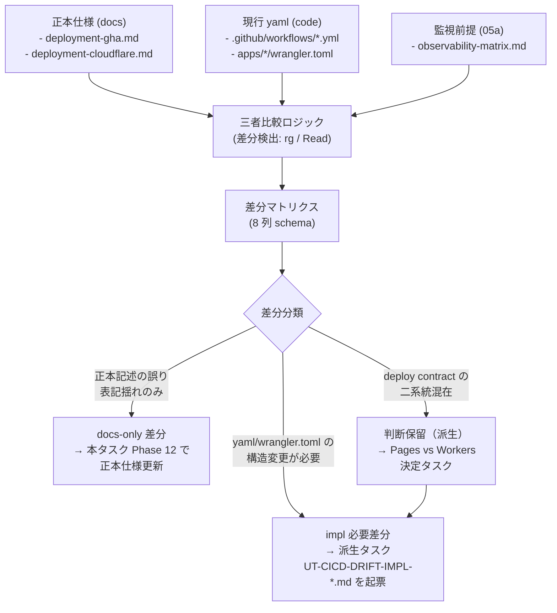

# Phase 2 成果物: 差分マトリクス設計 (UT-CICD-DRIFT)

## メタ情報

| 項目 | 値 |
| --- | --- |
| タスクID | UT-CICD-DRIFT |
| Phase | 2 / 13（設計：差分マトリクス設計） |
| 作成日 | 2026-04-29 |
| 状態 | spec_created |
| タスク分類 | docs-only / specification-cleanup |

> 本タスクは docs-only / specification-cleanup である。yaml 自身の構造変更や `apps/web/wrangler.toml` の deploy target 変更を伴う差分は、本フェーズで「impl 必要」として識別したうえで `unassigned-task/UT-CICD-DRIFT-IMPL-*.md` への派生タスク起票方針として記述するに留め、本タスク内では実装しない。

---

## 1. drift 検出フロー（Mermaid）

---

## 2. 差分マトリクス schema（8 列定義）

| # | 列 | 説明 | 必須 | 例 |
| --- | --- | --- | --- | --- |
| 1 | 差分 ID | `DRIFT-NN` 連番 | yes | `DRIFT-01` |
| 2 | 検出元 | docs / code / obs のどこを起点に検出したか（`docs vs code` / `obs vs code` / `docs vs docs`） | yes | `docs vs code` |
| 3 | 期待値（docs） | 正本仕様での記述 | yes | `Node 22.x LTS` |
| 4 | 実体値（code） | yaml / wrangler.toml の現状 | yes | `node-version: '24'` |
| 5 | 監視前提（05a） | observability-matrix.md での記述（該当時のみ） | optional | `Pages builds を初回監視対象` |
| 6 | 分類 | `docs-only` / `impl 必要` / `判断保留（派生）` | yes | `docs-only` |
| 7 | 解消方針 | 何をどう更新/起票するか | yes | `deployment-gha.md の CI 実行ステップを Node 24 / pnpm 10.33.2 に同期` |
| 8 | 派生タスク候補名 | impl 必要時のみ | conditional | `UT-CICD-DRIFT-IMPL-001-pages-to-workers-cutover` |

---

## 3. docs-only / impl 必要 判別ルール（5 ルール、排他的）

- **ルール 1**: 正本仕様の文言・workflow 名・Node バージョン・pnpm バージョンが現行 yaml と異なる場合 → **docs-only**（仕様書側を実体に合わせる）。
- **ルール 2**: 正本仕様が強く要求する topology（例: deploy target が Workers であるべき）と現行 yaml / wrangler.toml が乖離している場合 → **impl 必要**（実体を仕様に合わせる派生タスクを起票）。
- **ルール 3**: 05a が監視対象として記載した workflow が存在しない場合 → 監視前提を実体に合わせるなら **docs-only**、存在すべき workflow を新設するなら **impl 必要**。
- **ルール 4**: Pages build budget 監視前提と OpenNext Workers 方針が混在する場合 → 本タスクでは判断せず、**判断保留（派生）** として起票。
- **ルール 5**: 不変条件 #5 / #6 に抵触する差分は分類問わず最優先 **impl 必要**（blocker フラグ）。

排他性の確認: ルール 1 と 2 は「仕様書を実体に合わせるか / 実体を仕様に合わせるか」で排他。ルール 4 はルール 2 の特殊ケース（重い判断 → 派生）。ルール 5 は他ルールに優先する blocker。

---

## 4. drift マトリクス本体（Phase 1 §13 の暫定候補を 8 列 schema に展開）

| 差分 ID | 検出元 | 期待値（docs） | 実体値（code/obs） | 監視前提（05a） | 分類 | 解消方針 | 派生タスク候補名 |
| --- | --- | --- | --- | --- | --- | --- | --- |
| DRIFT-01 | docs vs code | `deployment-gha.md`: pnpm 9.x / Node 22.x LTS | 全 5 yaml: pnpm 10.33.2 / Node 24 | — | docs-only | `deployment-gha.md` の CI 実行ステップ §の pnpm/Node バージョン記述を Node 24 / pnpm 10.33.2 に書き換え | — |
| DRIFT-02 | docs vs code | `deployment-gha.md` の workflow 一覧表は 3 件（ci / web-cd / backend-ci） | 実体は 5 件（+ validate-build / verify-indexes） | observability-matrix では validate-build を main 環境観測対象に登録済み | docs-only | `deployment-gha.md` の workflow 構成表に `validate-build.yml` と `verify-indexes.yml` を行追加。各々の用途を 1 行記述 | — |
| DRIFT-03 | docs vs code | `deployment-cloudflare.md`: OpenNext Workers 形式（`main = ".open-next/worker.js"` + `[assets]`）期待 | `apps/web/wrangler.toml`: Pages 形式（`pages_build_output_dir = ".next"`） | 「Pages builds を初回監視対象に含める」と 05a に明記。OpenNext Workers 方針との差分は本タスクで扱う旨も明記 | 判断保留（派生） | 本タスクは判断材料のみ整理（§7 参照）。実 cutover は派生 | `UT-CICD-DRIFT-IMPL-001-pages-vs-workers-decision` |
| DRIFT-04 | docs vs code | `deployment-gha.md`: web-cd.yml は Cloudflare Pages デプロイ + Discord 通知 | web-cd.yml は Pages deploy のみ。Discord 通知ステップなし | — | docs-only | gha.md の通知記述を「未実装、UT-08-IMPL で導入予定」と明記。UT-CICD-DRIFT では通知実装派生を起票しない | UT-08-IMPL |
| DRIFT-05 | docs vs code | `deployment-gha.md`: backend-ci.yml は D1 migrations + Workers deploy + Discord 通知 | backend-ci.yml は D1 + Workers deploy あり、Discord 通知なし | — | docs-only | DRIFT-04 と同方針 | UT-08-IMPL |
| DRIFT-06 | obs vs code | observability-matrix.md は `ci.yml` / `validate-build.yml` のみ環境別観測対象に列挙 | 実在は 5 workflow。web-cd / backend-ci / verify-indexes が観測対象に未登録 | — | 別タスク（本タスク対象外） | 05a observability-matrix.md の更新は本タスクで実施しない（Phase 2 sub §「Ownership 宣言」）。必要時のみ別タスク `UT-CICD-DRIFT-IMPL-004-observability-matrix-extend` を起票 | `UT-CICD-DRIFT-IMPL-004-observability-matrix-extend`（必要時） |
| DRIFT-07 | docs vs docs | `deployment-cloudflare.md` 内で OpenNext Workers 形式と Pages デプロイフローが同居 | （docs 内部の自己矛盾） | — | docs-only | `deployment-cloudflare.md` 内の「Pages 形式 / OpenNext 形式 判定」セクションが正、その他の Pages フロー記述は「現状 Pages 形式で運用中、OpenNext Workers への移行は派生タスクで判断」と注記 | — |
| DRIFT-08 | docs vs code | `deployment-gha.md`: CI に Vitest 並列テスト + Codecov 80% 閾値（hard gate）記述 | ci.yml の `coverage-gate` は `continue-on-error: true`（PR1/3 soft gate）。Vitest テスト job は ci ジョブ内になし | — | docs-only（段階記述）+ 既存 impl タスク（`coverage-80-enforcement` PR3/3）でカバー済み | `deployment-gha.md` に「PR1/3 soft gate 段階」と注記、PR3/3 で hard gate 化する旨を追記。新規 impl タスクは起票せず既存 `coverage-80-enforcement` task に委ねる | — |
| DRIFT-09 | docs vs code | `deployment-cloudflare.md`: API wrangler.toml 例に `[[kv_namespaces]] binding = "SESSION_KV"` 期待 | `apps/api/wrangler.toml` に KV binding 未定義（D1 binding のみ） | — | impl 必要（KV 利用開始時） | UT-13 KV bootstrap が下流で扱う前提のため、本タスクでは drift として記録のみ。新規派生は不要 | （UT-13 既存タスクへ委譲） |
| DRIFT-10 | docs vs code | `deployment-cloudflare.md`: production cron `0 */6 * * *` のみ記述 | `apps/api/wrangler.toml` の `[triggers] crons = ["0 */6 * * *", "0 18 * * *", "*/15 * * * *"]`（3 件） | — | docs-only | `deployment-cloudflare.md` の「API Worker cron / Forms response sync (03b)」セクションは 2 件記述のため、03a schema sync (`0 18 * * *`) を追記して 3 件に同期 | — |

合計 drift 件数: **10 件**（docs-only: 6 件、impl 必要 / 候補: 3 件 [DRIFT-04/05/06 は条件付き] + 判断保留 1 件 [DRIFT-03] + 既存タスク委譲 2 件 [DRIFT-08/09]）。

最終内訳（本タスク完了基準）:
- **docs-only（本タスク Phase 12 で正本仕様更新）**: DRIFT-01, DRIFT-02, DRIFT-04(a 案), DRIFT-05(a 案), DRIFT-07, DRIFT-08, DRIFT-10 → **7 件**
- **impl 必要（派生タスク起票）**: DRIFT-03（判断保留含む）, DRIFT-04(b 案), DRIFT-05(b 案), DRIFT-06 → **最大 4 件**（条件付き）
- **既存タスクへ委譲**: DRIFT-08（coverage-80-enforcement）, DRIFT-09（UT-13） → **2 件**

base case（推奨）: docs-only 7 件 + 派生 1 件（DRIFT-03 = `UT-CICD-DRIFT-IMPL-001-pages-vs-workers-decision`）+ DRIFT-04/05 の通知系は docs-only 案（a）を選択 + DRIFT-06 は当面起票せず Phase 12 で要否再評価。

---

## 5. 不変条件抵触の最終確認

| # | 不変条件 | drift 内検出 | 判定 |
| --- | --- | --- | --- |
| #5 | D1 への直接アクセスは `apps/api` に閉じる | 全 drift で web-cd.yml に D1 操作なし、apps/web/wrangler.toml に D1 binding なし | **抵触なし** |
| #6 | GAS prototype は本番バックエンド仕様に昇格させない | 全 workflow に GAS prototype を deploy 対象とするステップなし | **抵触なし** |

ルール 5（不変条件抵触は最優先 impl）は今回適用対象なし。

---

## 6. 派生タスク起票テンプレ（最小フィールド定義）

派生タスクは `docs/30-workflows/unassigned-task/UT-CICD-DRIFT-IMPL-NNN-<slug>.md` に以下を含める。

| # | フィールド | 必須 | 例 |
| --- | --- | --- | --- |
| 1 | メタ情報（ID / 起票元 = 本タスクの差分 ID / 優先度 HIGH/MEDIUM/LOW / 起票日） | yes | `ID: UT-CICD-DRIFT-IMPL-001`、`起票元: UT-CICD-DRIFT / DRIFT-03`、`priority: HIGH` |
| 2 | なぜこのタスクが必要か（drift マトリクスからの引用） | yes | DRIFT-03 行をそのまま引用 |
| 3 | 何を達成するか（impl 内容） | yes | Pages 形式から OpenNext Workers 形式への cutover 判断と実施 |
| 4 | 具体的な変更対象ファイル（yaml / wrangler.toml 等） | yes | `apps/web/wrangler.toml`, `.github/workflows/web-cd.yml`, `apps/web/next.config.ts` |
| 5 | 受入条件（drift マトリクスの解消方針が完了する状態） | yes | `apps/web/wrangler.toml` が `main = ".open-next/worker.js"` + `[assets] directory = ".open-next/assets"` を持ち、web-cd.yml が `wrangler deploy --env <env>` で Workers デプロイする |
| 6 | 不変条件への影響（#5 / #6 への抵触有無） | yes | #5 抵触なし（D1 binding は apps/api 限定維持）/ #6 抵触なし |
| 7 | 並列タスクへの影響（UT-GOV-001 required_status_checks 名 / UT-GOV-003 CODEOWNERS） | optional | UT-GOV-001 と workflow 名整合確認、CODEOWNERS は影響なし |
| 8 | 命名規則 | yes | `UT-CICD-DRIFT-IMPL-NNN-<slug>` で一意（NNN は 001 から連番、slug は kebab-case） |

派生タスク命名一覧:

- `UT-CICD-DRIFT-IMPL-001-pages-vs-workers-decision`（DRIFT-03 起票元）
- Discord 通知実装は UT-08-IMPL に吸収し、本タスクでは派生IDを作らない
- `UT-CICD-DRIFT-IMPL-004-observability-matrix-extend`（DRIFT-06 必要時）

---

## 7. Pages vs OpenNext Workers の判断材料整理（Phase 2 で収集、判断は派生）

| 観点 | Pages 形式（現状） | OpenNext Workers 形式（正本仕様期待） | 備考 |
| --- | --- | --- | --- |
| `apps/web/wrangler.toml` 設定 | `pages_build_output_dir = ".next"` | `main = ".open-next/worker.js"` + `[assets] directory = ".open-next/assets"` + `[assets] binding = "ASSETS"` | 二者択一（同居不可） |
| ビルドコマンド | `pnpm --filter @ubm-hyogo/web build` | `pnpm --filter @ubm-hyogo/web build:cloudflare`（OpenNext build を含む） | OpenNext は別 build target |
| デプロイコマンド | `wrangler pages deploy .next --project-name=...` | `wrangler deploy --env <env>` | 異なる CLI サブコマンド |
| 無料枠監視 | Pages builds 500ビルド/月（05a 監視対象） | Workers requests 100,000 req/日（05a 監視対象） | Workers 移行で Pages builds 監視は撤去対象 |
| `@opennextjs/cloudflare` 採用前提 | 採用必須でない | 採用必須（`apps/web/package.json` に依存追加） | CLAUDE.md の「Web UI: Cloudflare Workers + Next.js App Router via `@opennextjs/cloudflare`」記述は OpenNext Workers 方針を支持 |
| プレビューデプロイ | Cloudflare Pages の Git integration で自動 | Workers preview は別経路（PR ごとの preview 環境設定要） | DX 影響あり |
| 移行コスト | — | Medium-High（next.config.ts 調整、build target 変更、PR preview 設計、wrangler.toml 書き換え、web-cd.yml 書き換え） | 派生タスクで詳細見積 |
| 整合性 | CLAUDE.md / deployment-cloudflare.md OpenNext 期待値と非整合 | CLAUDE.md と整合、deployment-cloudflare.md 内の Pages フロー記述とは矛盾 | OpenNext 採用が CLAUDE.md と整合 |
| 推奨方向 | — | OpenNext Workers 形式（CLAUDE.md と整合） | ただし最終判断は派生タスクで実施 |

判断は本タスクで行わず、派生 `UT-CICD-DRIFT-IMPL-001-pages-vs-workers-decision` に委譲。

---

## 8. Ownership 宣言（再確認）

| 観点 | 宣言 |
| --- | --- |
| 本タスクが docs-only であること | 正本仕様の更新（Phase 12 で実施）と派生タスク起票方針のみが本タスクの作業範囲 |
| code 変更の禁則 | `.github/workflows/*.yml` / `apps/*/wrangler.toml` の編集は本タスクで一切実施しない |
| 派生タスクの owner | 起票時点では unassigned とし、UT-GOV-003 の `.github/workflows/**` owner ルールに従う |
| 05a への波及 | 05a observability-matrix.md の更新は派生タスク（`UT-CICD-DRIFT-IMPL-004-observability-matrix-extend`）が必要な場合のみ別途起票し、本タスクでは編集しない |

---

## 9. 完了条件チェック

- [x] drift 検出フローが Mermaid 図で記述されている（§1）
- [x] 差分マトリクス schema が 8 列で定義されている（§2）
- [x] docs-only / impl 必要 判別ルールが排他的に 5 ルールで記述されている（§3）
- [x] `deployment-gha.md` / `deployment-cloudflare.md` の更新方針が表化されている（→ canonical-spec-update-plan.md）
- [x] Pages vs Workers の判断は派生タスクへ委譲する方針が明記されている（§7）
- [x] 派生タスク起票テンプレ（最小フィールド）が定義されている（§6）
- [x] 本タスクが docs-only / specification-cleanup である宣言が記載されている（§冒頭、§8）

---

## 10. 次 Phase への引き渡し

- 次 Phase: 3 (設計レビュー)
- 引き継ぎインプット:
  - 差分マトリクス schema（8 列）と drift 本体 10 件
  - 判別ルール 5 件
  - 派生タスク命名規則と最小テンプレ
  - Pages vs Workers 判断保留方針（派生 `UT-CICD-DRIFT-IMPL-001-pages-vs-workers-decision`）
  - 不変条件 #5 / #6 抵触なしの最終確認
- ブロック条件: なし（base case の判別ルールが排他的、派生タスク起票方針あり、docs-only 宣言済み）
