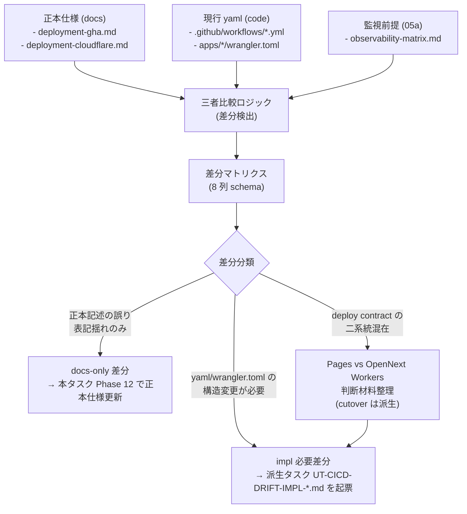

# Phase 2: 設計（差分マトリクス設計）

## メタ情報

| 項目 | 値 |
| --- | --- |
| タスク名 | CI/CD workflow topology and deployment spec drift cleanup (UT-CICD-DRIFT) |
| Phase 番号 | 2 / 13 |
| Phase 名称 | 設計（差分マトリクス設計） |
| 作成日 | 2026-04-29 |
| 前 Phase | 1 (要件定義) |
| 次 Phase | 3 (設計レビュー) |
| 状態 | spec_created |
| タスク分類 | docs-only / specification-cleanup |

## 目的

Phase 1 で確定した「三者（正本仕様 docs / 現行 yaml code / 05a 監視前提）の drift を分類するタスク」を、(a) drift 検出フロー、(b) 差分マトリクスの schema、(c) docs-only / impl 必要の判別ルール、(d) 正本仕様の更新方針、(e) 派生タスク起票方針 の 5 軸で設計する。Phase 3 のレビューが代替案比較で結論を出せる粒度の入力を作成する。

なお本タスクは docs-only / specification-cleanup である。yaml 自身の構造変更や `apps/web/wrangler.toml` の deploy target 変更を伴う差分は、本フェーズで「impl 必要」として識別したうえで `unassigned-task/UT-CICD-DRIFT-IMPL-*.md` への派生タスク起票方針として記述するに留め、本タスク内では実装しない。

## 実行タスク

1. drift 検出フローを Mermaid 図で固定する（完了条件: docs / code / 監視前提の三者を比較し差分を 1 行 1 件として行に落とす flow が図示されている）。
2. 差分マトリクスの schema（列定義）を確定する（完了条件: 「差分 ID / 検出元 / 期待値（docs） / 実体値（code） / 監視前提（05a） / 分類（docs-only / impl 必要） / 解消方針 / 派生タスク候補名」の 8 列が定義されている）。
3. docs-only / impl 必要の判別ルールを文書化する（完了条件: 判別フローが if/then のルールセットとして記述されている）。
4. 正本仕様（`deployment-gha.md` / `deployment-cloudflare.md`）の更新方針を決める（完了条件: 各仕様書ファイルごとに、想定される更新セクション・更新粒度が表化されている）。
5. Pages build budget 監視前提と OpenNext Workers 方針の差分整理方針を決める（完了条件: どちらを current contract とするかの判断材料の収集計画が記述されている。判断そのものは派生タスクで実施）。
6. 派生タスク起票方針（`unassigned-task/UT-CICD-DRIFT-IMPL-*.md`）の命名規則・テンプレ・最小フィールドを定義する（完了条件: 派生タスク 1 件あたりに含めるべき項目が列挙されている）。
7. 成果物 `outputs/phase-02/drift-matrix-design.md` と `outputs/phase-02/canonical-spec-update-plan.md` を分離して作成する（完了条件: 2 ファイル分離が artifacts.json と一致）。

## 参照資料

| 種別 | パス | 用途 |
| --- | --- | --- |
| 必須 | docs/30-workflows/completed-tasks/ut-cicd-workflow-topology-drift-cleanup/phase-01.md | 真の論点・4条件・棚卸し結果 |
| 必須 | .claude/skills/aiworkflow-requirements/references/deployment-gha.md | GHA 正本仕様（更新対象） |
| 必須 | .claude/skills/aiworkflow-requirements/references/deployment-cloudflare.md | Cloudflare deploy 正本仕様（更新対象） |
| 必須 | docs/05a-parallel-observability-and-cost-guardrails/outputs/phase-02/observability-matrix.md | 監視前提（drift 比較の第三軸） |
| 必須 | apps/web/wrangler.toml | Pages vs Workers 判定の実体 |
| 必須 | apps/api/wrangler.toml | apps/api deploy 実体 |

## 構造図 (Mermaid)

## 差分マトリクス schema

| 列 | 説明 | 必須 | 例 |
| --- | --- | --- | --- |
| 差分 ID | `DRIFT-NN` 連番 | yes | `DRIFT-01` |
| 検出元 | docs / code / obs のどこを起点に検出したか | yes | `docs vs code` |
| 期待値（docs） | 正本仕様での記述 | yes | `web-cd.yml が deploy を担当` |
| 実体値（code） | yaml / wrangler.toml の現状 | yes | `web-cd.yml は存在するが job 構成が異なる` |
| 監視前提（05a） | observability-matrix.md での記述 | optional | `web-cd.yml を Pages build budget 監視対象に登録` |
| 分類 | `docs-only` / `impl 必要` / `判断保留（派生）` | yes | `docs-only` |
| 解消方針 | 何をどう更新/起票するか | yes | `deployment-gha.md の web-cd.yml セクションを current job 構成に同期` |
| 派生タスク候補名 | impl 必要時のみ | conditional | `UT-CICD-DRIFT-IMPL-001-pages-to-workers-cutover` |

## docs-only / impl 必要 判別ルール

- ルール 1: 正本仕様の文言・workflow 名・Node バージョン・pnpm バージョンが現行 yaml と異なる場合 → 多くは **docs-only**（仕様書側を実体に合わせる）
- ルール 2: ただし正本仕様が強く要求する topology（例: deploy target が Workers であるべき）と現行 yaml / wrangler.toml が乖離している場合 → **impl 必要**（実体を仕様に合わせる派生タスクを起票）
- ルール 3: 05a が監視対象として記載した workflow が存在しない場合 → 監視前提を実体に合わせるなら **docs-only**、存在すべき workflow を新設するなら **impl 必要**
- ルール 4: Pages build budget 監視前提と OpenNext Workers 方針が混在する場合 → どちらを current contract とするかの判断は本タスクではせず、**判断保留（派生）** として起票
- ルール 5: 不変条件 #5 / #6 に抵触する差分は分類問わず最優先 **impl 必要** とし、blocker フラグを立てる

## 正本仕様の更新方針

| 仕様書 | 想定更新セクション | 更新粒度 | 備考 |
| --- | --- | --- | --- |
| `deployment-gha.md` | workflow 一覧 / Node・pnpm バージョン記述 / job 構成 | section 単位の rewrite | docs-only 差分の主受け皿 |
| `deployment-cloudflare.md` | deploy target（Pages / Workers / OpenNext） / wrangler.toml 抜粋 | section 単位の rewrite | Pages vs Workers 判断は別タスクのため、本タスクでは「現状 X / Y が混在」という事実記載のみ |

## Pages vs OpenNext Workers の差分整理方針

- 本タスクでは判断材料（メリット・デメリット・整合性 / 移行コスト / 無料枠影響）を Phase 2 / 3 / 11 で収集し、判断は派生タスク `UT-CICD-DRIFT-IMPL-PAGES-VS-WORKERS-DECISION` に委譲する。
- 収集項目: `apps/web/wrangler.toml` の `pages_build_output_dir` 有無 / `main` entry 有無 / `@opennextjs/cloudflare` 採用前提との整合 / 05a の build budget 監視前提が前提する deploy target。

## 派生タスク起票テンプレ

`unassigned-task/UT-CICD-DRIFT-IMPL-NNN-<slug>.md` に以下を含めること。

- メタ情報（ID / 起票元 = 本タスクの差分 ID / 優先度）
- なぜこのタスクが必要か（drift マトリクスからの引用）
- 何を達成するか（impl 内容）
- 具体的な変更対象ファイル（yaml / wrangler.toml 等）
- 受入条件（drift マトリクスの解消方針が完了する状態）
- 不変条件への影響（#5 / #6 への抵触有無）

## 既存 schema / Ownership 宣言

| 観点 | 宣言 |
| --- | --- |
| 本タスクが docs-only であること | 正本仕様の更新と派生タスク起票方針のみが本タスクの作業範囲 |
| code 変更の禁則 | `.github/workflows/*.yml` / `apps/*/wrangler.toml` の編集は本タスクで一切実施しない |
| 派生タスクの owner | 起票時点では unassigned とし、UT-GOV-003 の `.github/workflows/**` owner ルールに従う |
| 05a への波及 | 05a observability-matrix.md の更新は派生タスクが必要な場合のみ別途起票し、本タスクでは編集しない |

## 統合テスト連携

| 連携先 Phase | 連携内容 |
| --- | --- |
| Phase 3 | 差分マトリクス schema・判別ルール・更新方針を代替案比較対象として渡す |
| Phase 4 | drift 検出の検証戦略（rg / yamllint / link check）の入力として schema を渡す |
| Phase 5 | 仕様書更新手順（docs-only 差分の適用順）の入力として更新方針を渡す |
| Phase 12 | 派生タスク起票方針を `unassigned-task-detection.md` に転記 |

## 多角的チェック観点（AIが判断）

- 判別ルールが排他的か（同一差分が docs-only と impl 必要の両方に分類されないか）
- Pages vs Workers の判断保留が独立した派生タスクとして起票されるか
- 05a 監視前提の更新を本タスクで行わないことが明示されているか
- 不変条件 #5 / #6 抵触の差分が blocker として最優先扱いされているか
- 派生タスク命名が `UT-CICD-DRIFT-IMPL-NNN-<slug>` で一意か

## サブタスク管理

| # | サブタスク | 担当 Phase | 状態 | 備考 |
| --- | --- | --- | --- | --- |
| 1 | drift 検出フロー Mermaid | 2 | spec_created | 三者比較を図示 |
| 2 | 差分マトリクス schema 確定（8 列） | 2 | spec_created | drift-matrix-design.md |
| 3 | docs-only / impl 必要 判別ルール | 2 | spec_created | ルール 5 件 |
| 4 | 正本仕様 更新方針 | 2 | spec_created | canonical-spec-update-plan.md |
| 5 | Pages vs Workers 判断保留方針 | 2 | spec_created | 派生タスク委譲 |
| 6 | 派生タスク起票テンプレ | 2 | spec_created | `UT-CICD-DRIFT-IMPL-*` |

## 成果物

| 種別 | パス | 説明 |
| --- | --- | --- |
| ドキュメント | outputs/phase-02/drift-matrix-design.md | 差分マトリクス schema・判別ルール・Mermaid 図 |
| ドキュメント | outputs/phase-02/canonical-spec-update-plan.md | 正本仕様の更新方針・更新粒度 |
| メタ | artifacts.json | Phase 2 状態の更新 |

## 完了条件 (Acceptance Criteria for this Phase)

- [ ] drift 検出フローが Mermaid 図で記述されている
- [ ] 差分マトリクス schema が 8 列で定義されている
- [ ] docs-only / impl 必要 判別ルールが排他的に 5 ルールで記述されている
- [ ] `deployment-gha.md` / `deployment-cloudflare.md` の更新方針が表化されている
- [ ] Pages vs Workers の判断は派生タスクへ委譲する方針が明記されている
- [ ] 派生タスク起票テンプレ（最小フィールド）が定義されている
- [ ] 本タスクが docs-only / specification-cleanup である宣言が改めて記載されている

## タスク100%実行確認【必須】

- 全実行タスク（7 件）が `spec_created`
- 全成果物が `outputs/phase-02/` 配下に配置予定
- 不変条件 #5 / #6 抵触差分は blocker 扱いとなる旨が判別ルールに含まれる
- artifacts.json の `phases[1].status` が `spec_created`

## 次 Phase への引き渡し

- 次 Phase: 3 (設計レビュー)
- 引き継ぎ事項:
  - 差分マトリクス schema（8 列）
  - 判別ルール（5 件）
  - 正本仕様 更新方針
  - 派生タスク起票テンプレ
  - Pages vs Workers 判断保留方針
- ブロック条件:
  - 判別ルールが排他的でない
  - 派生タスク起票方針が欠落
  - 本タスクが docs-only であることの宣言が抜けている
