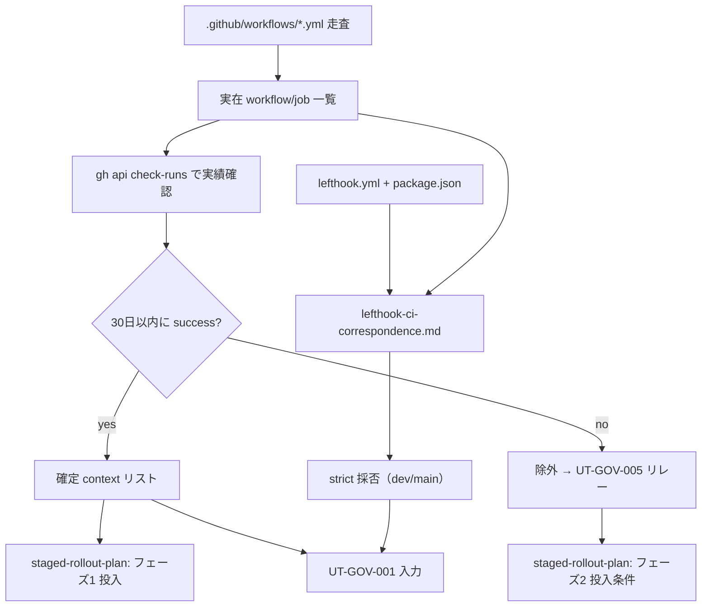

# Phase 2: 設計

## メタ情報

| 項目 | 値 |
| --- | --- |
| タスク名 | branch protection 草案の required_status_checks contexts 同期 (UT-GOV-004) |
| Phase 番号 | 2 / 3（本セッション分） |
| Phase 名称 | 設計 |
| 作成日 | 2026-04-29 |
| 前 Phase | 1 (要件定義) |
| 次 Phase | 3 (設計レビュー) |
| 状態 | spec_created |
| タスク分類 | governance / docs-only / NON_VISUAL |

## 目的

Phase 1 で確定した「投入文字列の実績担保」要件を、(a) 実在 workflow 抽出方針、(b) 草案 8 ↔ 実在 context マッピング設計、(c) 段階適用案、(d) lefthook ↔ CI 対応表、(e) `strict` 採否判定軸 に分解し、Phase 3 が代替案比較で結論を出せる粒度の設計入力を 3 ファイルに分離して作成する。

## 実行タスク

1. 実在 workflow 抽出方針を確定する（完了条件: `.github/workflows/*.yml` 全件の走査手順が再現可能な形で記述、`gh api` での実績確認コマンドが付随）。
2. 草案 8 contexts ↔ 実在 context のマッピング表を `outputs/phase-02/context-name-mapping.md` に作成する（完了条件: 8 件すべてに `<workflow>/<job>` フルパス or 「除外」が付与、各々に実績確認の証跡欄が用意されている）。
3. 段階適用案を `outputs/phase-02/staged-rollout-plan.md` に作成する（完了条件: フェーズ 1 / フェーズ 2 / 名前変更事故対応の 3 セクション構造、後追い投入条件が明文化）。
4. lefthook ↔ CI 対応表を `outputs/phase-02/lefthook-ci-correspondence.md` に作成する（完了条件: hook → pnpm script → CI job の 3 列が整列、同一 pnpm script 共有規約が明記）。
5. `strict: true` の採否を dev / main 別に決定する判定軸を整理する（完了条件: lefthook-ci-correspondence.md または独立セクションに dev=false / main=true 等の決定が根拠付きで記載）。
6. 成果物 3 ファイルへの分離が artifacts.json と一致することを確認する（完了条件: outputs リストに 3 ファイル列挙）。

## 参照資料

| 種別 | パス | 用途 |
| --- | --- | --- |
| 必須 | docs/30-workflows/ut-gov-004-required-status-checks-context-sync/phase-01.md | 真の論点・4条件・命名規則チェックリスト・暫定分類 |
| 必須 | .github/workflows/ 配下全ファイル | 実在 workflow / job 名抽出元（backend-ci.yml / ci.yml / validate-build.yml / verify-indexes.yml / web-cd.yml 等） |
| 必須 | lefthook.yml | hook 名 → command の正本 |
| 必須 | package.json | pnpm scripts の正本 |
| 必須 | docs/30-workflows/completed-tasks/task-github-governance-branch-protection/outputs/phase-2/design.md | §2.b 草案の上書き対象 |
| 必須 | docs/30-workflows/completed-tasks/task-github-governance-branch-protection/outputs/phase-12/implementation-guide.md | §1 / §5 の参照点 |
| 参考 | https://docs.github.com/en/rest/checks/runs | check-run conclusion 仕様 |
| 参考 | https://docs.github.com/en/repositories/configuring-branches-and-merges-in-your-repository/managing-protected-branches/about-protected-branches#require-status-checks-before-merging | strict mode 公式 |

## 設計概要

### A. 実在 workflow 抽出方針

走査対象: `.github/workflows/*.yml` 全件（現時点で backend-ci.yml / ci.yml / validate-build.yml / verify-indexes.yml / web-cd.yml の 5 件を想定。Phase 2 実行時に再列挙）。

抽出規則:

1. 各 yml の top-level `name:` を `<workflow name>` として記録（未指定時はファイル名から拡張子を除去した値）。
2. 各 `jobs.<key>` について `name:` の有無を確認し、明示があれば `<job name>`、無ければ `<key>` を採用。
3. `strategy.matrix` がある場合、`<workflow> / <job> (<matrix-value-1>, <matrix-value-2>)` の最終形を Actions UI / `gh run view` の実 run 出力で確認する。
4. 結果を「実在 context 名一覧」として `context-name-mapping.md` の冒頭表に記録する。

実績確認コマンド（例）:

```bash
# 直近 main 上の commit から check-runs を抽出
RECENT_SHA=$(gh api repos/daishiman/UBM-Hyogo/commits/main --jq '.sha')
gh api "repos/daishiman/UBM-Hyogo/commits/${RECENT_SHA}/check-runs" --paginate \
  --jq '.check_runs[] | {name: .name, conclusion: .conclusion, completed_at: .completed_at}'
```

各 context について `conclusion=success` が過去 30 日以内に 1 回以上記録されていることを確認し、証跡（取得日時 + sha + conclusion）をマッピング表に転記する。

### B. 草案 8 ↔ 実在 context マッピング設計（成果物: context-name-mapping.md）

ファイル構造:

```
# context-name-mapping.md
## 1. 実在 workflow / job 一覧（走査結果）
## 2. 草案 8 contexts のマッピング
## 3. 確定 context リスト（UT-GOV-001 入力）
## 4. 除外 context と UT-GOV-005 リレー候補
## 5. 実績確認証跡
```

マッピング表テンプレート:

| # | 草案名 | 経路（rename / exclude） | 実在 context（フルパス） | 直近成功実績 (date / sha) | UT-GOV-001 投入 |
| --- | --- | --- | --- | --- | --- |
| 1 | typecheck | rename | `<workflow>/<job>` | YYYY-MM-DD / `<sha>` | YES |
| ... | ... | ... | ... | ... | ... |

最終 §3「確定 context リスト」は YAML 互換の plain list で UT-GOV-001 がコピペ参照できる形に整える。

### C. 段階適用案設計（成果物: staged-rollout-plan.md）

ファイル構造:

```
# staged-rollout-plan.md
## フェーズ 1: 既出 context のみ先行投入
## フェーズ 2: 新規 context の後追い投入条件
## 名前変更事故への対応運用
## ロールバック手順
```

- フェーズ 1: §B §3 の確定リストのみを `required_status_checks.contexts` に投入。
- フェーズ 2: 除外 context が UT-GOV-005 等で新設・1 回 CI 成功確認後に追加投入。投入トリガは「main / dev のいずれかで `conclusion=success` を 1 回以上達成した日」。
- 名前変更時運用: workflow refactor が context 名を変更する場合、(a) branch protection 設定更新と同一 PR で行う、または (b) 新旧両方を一時的に contexts に並べ、新側で 1 回 PASS 確認後に旧を外す、の 2 経路のみ許可。
- ロールバック: 投入後に永続停止が発生した場合の admin override 手順 (`gh api -X PATCH /repos/:owner/:repo/branches/:branch/protection` で contexts を即時削除) を明記。

### D. lefthook ↔ CI 対応表設計（成果物: lefthook-ci-correspondence.md）

ファイル構造:

```
# lefthook-ci-correspondence.md
## 1. hook → pnpm script → CI job 対応表
## 2. 同一 pnpm script 共有規約
## 3. strict mode 採否（dev / main）
## 4. ドリフト検出運用
```

対応表テンプレート:

| lefthook hook | pnpm script | CI workflow / job (context) | 備考 |
| --- | --- | --- | --- |
| pre-commit | `pnpm lint` | `<workflow>/<job>` | 同一 script を双方が呼ぶ |
| pre-commit | `pnpm typecheck` | `<workflow>/<job>` | 同上 |
| pre-push | `pnpm test` | `<workflow>/<job>` | matrix 展開時はフルパス |

同一 pnpm script 共有規約: 「lefthook の `run:` と CI workflow の `run:` は同じ pnpm script を呼ぶこと。直接コマンドをインライン記述しない」を文書化。

### E. `strict: true` 採否判定軸

判定軸:

| 観点 | dev | main | 根拠 |
| --- | --- | --- | --- |
| merge 摩擦 | 低（`false`） | 高（`true`） | dev は実験的 merge を許容、main は up-to-date 必須 |
| 壊れリスク | 中 | 低 | main は壊れた場合の影響が大きい |
| solo 運用 | OK | OK | solo 開発のため rebase コストは許容範囲 |

暫定推奨: dev=`strict: false`、main=`strict: true`。最終確定は Phase 3 代替案比較で再評価。

## 構造図 (Mermaid)



## 実行手順

### ステップ 1: Phase 1 入力の取り込み

- 真の論点・暫定分類・命名規則チェックリスト 6 観点を確認する。
- `.github/workflows/`、`lefthook.yml`、`package.json` の現状を走査する。

### ステップ 2: 実在 workflow / job の確定

- `context-name-mapping.md §1` に走査結果を記録する。
- matrix 展開がある job は `gh run view` で実 context 名を目視確認する。

### ステップ 3: マッピングと実績確認

- 草案 8 件それぞれに rename / exclude を確定する。
- `gh api check-runs` で実績確認し、証跡を §5 に記録する。

### ステップ 4: 段階適用案と名前変更運用の文書化

- `staged-rollout-plan.md` を独立ファイルとして作成する。

### ステップ 5: lefthook 対応表と strict 採否

- `lefthook-ci-correspondence.md` に対応表 / 共有規約 / strict 採否 / ドリフト検出運用を記述する。

## 統合テスト連携

| 連携先 Phase | 連携内容 |
| --- | --- |
| Phase 3 | 設計成果物 3 ファイルを代替案比較の base case として渡す |
| Phase 3 | strict 採否の暫定推奨を代替案比較で再評価 |
| 後続（後セッション） | 確定 context リストを UT-GOV-001 phase-XX に直リンク |

## 多角的チェック観点

- 永続停止リスク: マッピング表のすべての rename 行に「実績確認証跡」が付与されているか。
- 整合性: 設計に `apps/api` / `apps/web` への変更が混入していないか（governance 層に閉じる）。
- 名前変更事故: workflow refactor の運用ルールが staged-rollout-plan.md に含まれているか。
- hook 整合: lefthook と CI が同一 pnpm script を呼ぶ規約が明示されているか。
- 無料枠: `gh api` 実績確認が GitHub API rate limit 内で完結するか（公開 repo は 5000 req/h 余裕あり）。

## サブタスク管理

| # | サブタスク | 担当 Phase | 状態 | 備考 |
| --- | --- | --- | --- | --- |
| 1 | 実在 workflow 抽出方針 | 2 | spec_created | A |
| 2 | 草案 8 マッピング | 2 | spec_created | context-name-mapping.md |
| 3 | 段階適用案 | 2 | spec_created | staged-rollout-plan.md |
| 4 | lefthook ↔ CI 対応表 | 2 | spec_created | lefthook-ci-correspondence.md |
| 5 | strict 採否決定 | 2 | spec_created | dev=false / main=true 暫定 |
| 6 | 成果物 3 ファイル分離 | 2 | spec_created | artifacts.json と一致 |

## 成果物

| 種別 | パス | 説明 |
| --- | --- | --- |
| 設計 | outputs/phase-02/context-name-mapping.md | 実在 workflow 一覧・草案 8 マッピング・確定 context リスト・実績証跡 |
| 設計 | outputs/phase-02/staged-rollout-plan.md | フェーズ 1/2 投入計画・名前変更事故運用・ロールバック手順 |
| 設計 | outputs/phase-02/lefthook-ci-correspondence.md | hook ↔ pnpm script ↔ CI job 対応表・共有規約・strict 採否・ドリフト検出運用 |
| メタ | artifacts.json | Phase 2 状態の更新 |

## 完了条件

- [ ] `.github/workflows/` 全 yml の走査結果が context-name-mapping.md §1 に表化されている
- [ ] 草案 8 件すべてに rename / exclude が確定している
- [ ] rename された context すべてに直近 30 日以内の `conclusion=success` 証跡が付与されている
- [ ] staged-rollout-plan.md にフェーズ 1 / 2 / 名前変更運用 / ロールバックの 4 セクションがある
- [ ] lefthook-ci-correspondence.md に hook → pnpm script → CI job の 3 列対応表がある
- [ ] strict 採否が dev / main 別に判定軸付きで決定されている
- [ ] 成果物が 3 ファイルに分離されている

## タスク100%実行確認【必須】

- 全実行タスク（6 件）が `spec_created`
- 全成果物が `outputs/phase-02/` 配下に配置済み
- 異常系（草案 8 件中に実績ゼロのものがある場合の除外フロー / 同名 job 衝突 / matrix 展開）が設計に反映されている
- artifacts.json の `phases[1].status` が `spec_created`
- artifacts.json の `phases[1].outputs` に 3 ファイルが列挙されている

## 次 Phase への引き渡し

- 次 Phase: 3 (設計レビュー)
- 引き継ぎ事項:
  - 設計成果物 3 ファイルを base case として渡す
  - strict 採否の暫定（dev=false / main=true）を代替案で再評価
  - 段階適用案のフェーズ 2 投入条件を代替案 D（契約テスト先行）と比較
- ブロック条件:
  - マッピング表に未確定セルが残っている
  - rename 行に実績証跡が無い
  - 成果物の 3 ファイル分離が未達
