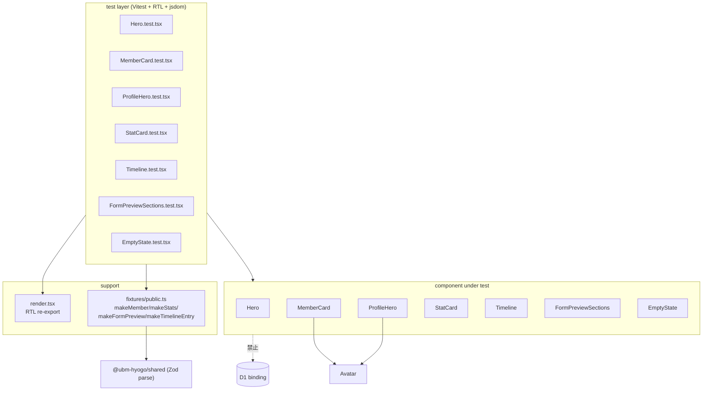

# Phase 2 成果物 — ut-web-cov-02-public-components-coverage

- status: ready (spec)
- purpose: 設計 (テスト構造 / fixture / mock / 想定ケース確定)

## CONST_005 必須項目サマリ

| # | 項目 | 出典 |
| --- | --- | --- |
| 1 | 変更対象ファイル | 本書 §directory layout |
| 2 | 関数シグネチャ | 本書 §コンポーネント API |
| 3 | 入出力 | 本書 §テストケース表 |
| 4 | テスト方針 | 本書 §mock マトリクス |
| 5 | ローカル実行コマンド | 本書 §ローカル実行コマンド |
| 6 | DoD | 本書 §DoD |

## テストアーキテクチャ図



## directory layout

```
apps/web/src/
├── components/
│   ├── feedback/
│   │   ├── EmptyState.tsx
│   │   └── __tests__/
│   │       └── EmptyState.test.tsx          (新規)
│   ├── public/
│   │   ├── Hero.tsx
│   │   ├── MemberCard.tsx
│   │   ├── ProfileHero.tsx
│   │   ├── StatCard.tsx
│   │   ├── Timeline.tsx
│   │   ├── FormPreviewSections.tsx
│   │   └── __tests__/                        (新規)
│   │       ├── Hero.test.tsx
│   │       ├── MemberCard.test.tsx
│   │       ├── ProfileHero.test.tsx
│   │       ├── StatCard.test.tsx
│   │       ├── Timeline.test.tsx
│   │       └── FormPreviewSections.test.tsx
│   └── ui/
│       └── Avatar.tsx                        (実体使用)
└── test/
    ├── render.tsx                             (helper)
    └── fixtures/
        └── public.ts                          (新規)
```

## コンポーネント API (実コード抜粋)

```ts
export interface HeroProps { title: string; subtitle?: string;
  primaryCta?: { label: string; href: string };
  secondaryCta?: { label: string; href: string }; }

export type Density = "comfy" | "dense" | "list";
export interface MemberCardProps { member: PublicMemberListItem; density?: Density; }

export interface ProfileHeroProps { memberId: string; fullName: string; nickname: string;
  occupation: string; location: string;
  ubmZone: string | null; ubmMembershipType: string | null; }

export interface StatCardProps { stats: PublicStatsView; }

export interface TimelineEntry { sessionId: string; title: string; heldOn: string; }
export interface TimelineProps { entries: TimelineEntry[]; }

export interface FormPreviewSectionsProps { preview: FormPreviewView; }

export interface EmptyStateProps { title: string; description?: string;
  resetHref?: string; resetLabel?: string; children?: ReactNode; }
```

## mock マトリクス

| 依存 | 方針 | 理由 |
| --- | --- | --- |
| next/image | mock 不要 (未使用) | 対象 7 component は未使用 |
| next/link | mock 不要 (未使用) | plain `<a>` のみ |
| framer-motion | mock 不要 (未使用) | 対象で未使用 |
| @ubm-hyogo/shared | 実体 import (mock 禁止) | 契約として利用、不変条件 #5 |
| components/ui/Avatar | 実体 import | 純粋関数、`role="img"`/`aria-label` を assert に活用 |
| D1 / fetch / next-auth | 使用禁止 | 不変条件 #6 |

## 各コンポーネントの想定テストケース表

| component | ケース | 種別 | 主な assertion |
| --- | --- | --- | --- |
| Hero | title+subtitle+両 cta | happy | `getByRole('heading', { level: 1 })` / `getByText(subtitle)` / 両 `<a>` href |
| Hero | title のみ | empty | subtitle `<p>` 不在 / `[data-variant]` 0 件 |
| Hero | primaryCta のみ | variant | primary href 検証 / secondary 不在 |
| MemberCard | 全項目埋め density=comfy | happy | name/nickname/occupation/location/zone/status 全表示 |
| MemberCard | nickname/zone/membershipType 省略 | empty | `[data-role="nickname"]` 等 0 件 |
| MemberCard | density=list | variant | `data-density="list"` / occupation 非表示 / `<a href="/members/${id}">` |
| ProfileHero | 全埋め | happy | h1/nickname/occupation/location/badges 全表示 |
| ProfileHero | nickname=""/ubmZone=null/ubmMembershipType=null | empty | nickname/badges element 不在 |
| ProfileHero | size 確認 | variant | Avatar `data-size="lg"` / `aria-label=fullName` |
| StatCard | zoneBreakdown 2 件 | happy | 数値 3 種 + dt/dd ペア |
| StatCard | zoneBreakdown=[] | empty | `<dl>` の子 `<div>` 0 個 |
| StatCard | memberCount=0 | variant | "0" が表示される |
| Timeline | entries 3 件 | happy | `<ol>` 3 `<li>`, `<time dateTime>` |
| Timeline | entries=[] | empty | `container.firstChild === null` |
| Timeline | entries 1 件 | variant | heading "最近の支部会" 表示 |
| FormPreviewSections | 2 section × 2 field | happy | grouping / `data-stable-key` / 日本語 visibility |
| FormPreviewSections | fields=[] | empty | `<p>` のみ / `data-section-key` 不在 |
| FormPreviewSections | required + 未知 visibility | variant | required ラベル / fallback raw 表示 |
| EmptyState | title+description+resetHref | happy | `<a data-role="reset">絞り込みをクリア</a>` |
| EmptyState | title のみ | empty | description / reset link 不在 |
| EmptyState | children + resetLabel カスタム | variant | children 描画 / custom label / `role="status"` |

## ローカル実行コマンド

```bash
mise exec -- pnpm --filter @ubm-hyogo/web test -- Hero.test
mise exec -- pnpm --filter @ubm-hyogo/web test -- MemberCard.test
mise exec -- pnpm --filter @ubm-hyogo/web test -- ProfileHero.test
mise exec -- pnpm --filter @ubm-hyogo/web test -- StatCard.test
mise exec -- pnpm --filter @ubm-hyogo/web test -- Timeline.test
mise exec -- pnpm --filter @ubm-hyogo/web test -- FormPreviewSections.test
mise exec -- pnpm --filter @ubm-hyogo/web test -- EmptyState.test
mise exec -- pnpm --filter @ubm-hyogo/web test:coverage
```

> 実 filter 名は `@ubm-hyogo/web`、test script は `test`。`test` が無い場合は Phase 5 で alias を追加するか `test -- <pattern>` に置換する。

## DoD

- 7 テストファイルが green
- per-file coverage が AC-1 を満たす (Stmts/Lines/Funcs ≥85% / Branches ≥80%)
- 既存 web test suite に regression なし
- snapshot 依存 0 件 (`grep -r toMatchSnapshot apps/web/src/components/{public,feedback}/__tests__` が 0)

## 引き渡し

Phase 3 設計レビューへ、テストアーキテクチャ・ディレクトリレイアウト・想定ケース表・mock マトリクス・CONST_005 一式を渡す。
