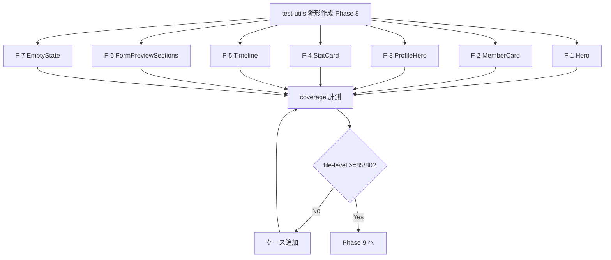

# outputs phase 05: ut-web-cov-02-public-components-coverage

- status: implemented-local
- purpose: 実装ランブック
- evidence: 仕様書 phase-05.md (実測 evidence は Phase 11)

## 新規追加ファイル

| # | パス | ケース数 | mock |
| --- | --- | --- | --- |
| F-1 | apps/web/src/components/public/__tests__/Hero.test.tsx | 3 | なし |
| F-2 | apps/web/src/components/public/__tests__/MemberCard.test.tsx | 3 | なし (Avatar はそのまま) |
| F-3 | apps/web/src/components/public/__tests__/ProfileHero.test.tsx | 3 | なし |
| F-4 | apps/web/src/components/public/__tests__/StatCard.test.tsx | 3 | なし |
| F-5 | apps/web/src/components/public/__tests__/Timeline.test.tsx | 3 | なし (console.error spy のみ) |
| F-6 | apps/web/src/components/public/__tests__/FormPreviewSections.test.tsx | 3 | なし |
| F-7 | apps/web/src/components/feedback/__tests__/EmptyState.test.tsx | 3 | なし |

## 共通 import 規約

```ts
import { describe, it, expect, afterEach, vi } from "vitest";
import { render, screen, cleanup, fireEvent } from "@testing-library/react";
afterEach(() => cleanup());
```

## 実装フロー (mermaid)



## 実行コマンド (per file)

```bash
mise exec -- pnpm --filter @ubm-hyogo/web test -- src/components/public/__tests__/Hero.test.tsx
mise exec -- pnpm --filter @ubm-hyogo/web test -- src/components/public/__tests__/MemberCard.test.tsx
mise exec -- pnpm --filter @ubm-hyogo/web test -- src/components/public/__tests__/ProfileHero.test.tsx
mise exec -- pnpm --filter @ubm-hyogo/web test -- src/components/public/__tests__/StatCard.test.tsx
mise exec -- pnpm --filter @ubm-hyogo/web test -- src/components/public/__tests__/Timeline.test.tsx
mise exec -- pnpm --filter @ubm-hyogo/web test -- src/components/public/__tests__/FormPreviewSections.test.tsx
mise exec -- pnpm --filter @ubm-hyogo/web test -- src/components/feedback/__tests__/EmptyState.test.tsx
mise exec -- pnpm --filter @ubm-hyogo/web test:coverage
```

## DoD

- 21 case 以上 green
- typecheck / lint / test PASS
- file-level coverage 閾値達成
- 既存 test に regression なし
