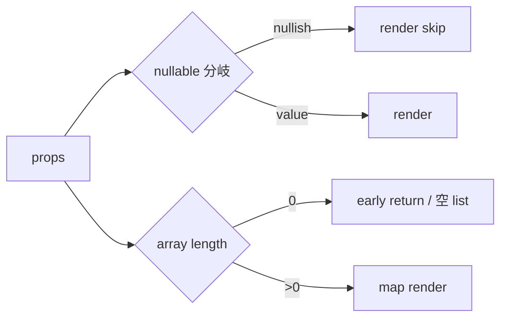

# outputs phase 06: ut-web-cov-02-public-components-coverage

- status: implemented-local
- purpose: 異常系検証
- evidence: 仕様書 phase-06.md (実測 evidence は Phase 11)

## 異常系マトリクス

| Test ID | Component | 異常入力 | 想定挙動 |
| --- | --- | --- | --- |
| T-Hero-EX-1 | Hero | subtitle="" | `<p>` 描画されない (falsy 分岐) |
| T-Hero-EX-2 | Hero | 両 CTA 省略 | `[data-role="cta"]` 内が空 |
| T-Member-EX-1 | MemberCard | nickname/zone/status を全て null | optional 表示 0 件 |
| T-Member-EX-2 | MemberCard | density="list" | occupation 非表示 |
| T-Profile-EX-1 | ProfileHero | zone & status null | `[data-role="badges"]` childCount=0 |
| T-Profile-EX-2 | ProfileHero | nickname="" | nickname `<p>` 非表示 |
| T-Stat-EX-1 | StatCard | zoneBreakdown=[] | `dl` child 0 |
| T-Stat-EX-2 | StatCard | counts=0 | "0" を render |
| T-Timeline-EX-1 | Timeline | entries=[] | null 返却 |
| T-Timeline-EX-2 | Timeline | 100 件 | li 100 + key warning なし |
| T-Form-EX-1 | FormPreviewSections | fields=[] | 概要 `<p>` のみ |
| T-Form-EX-2 | FormPreviewSections | visibility="unknown" | 生文字 fallback |
| T-Empty-EX-1 | EmptyState | 全 optional 省略 | title のみ |
| T-Empty-EX-2 | EmptyState | resetLabel 未指定 | デフォルト "絞り込みをクリア" |

## branch coverage 観点



- 各 component の null 分岐 / early-return / fallback の全分岐をテストでカバー。
- console.error spy で React key warning が 0 件であることを検証 (Timeline / FormPreviewSections)。

## 実行コマンド

```bash
mise exec -- pnpm --filter @ubm-hyogo/web test -- src/components/public
mise exec -- pnpm --filter @ubm-hyogo/web test -- src/components/feedback
mise exec -- pnpm --filter @ubm-hyogo/web test:coverage
```

## DoD

- 14 異常系ケース全 green
- branches ≥80%
- console.error / warn が 0 件
- presentational に閉じる (D1/fetch mock 不要)
