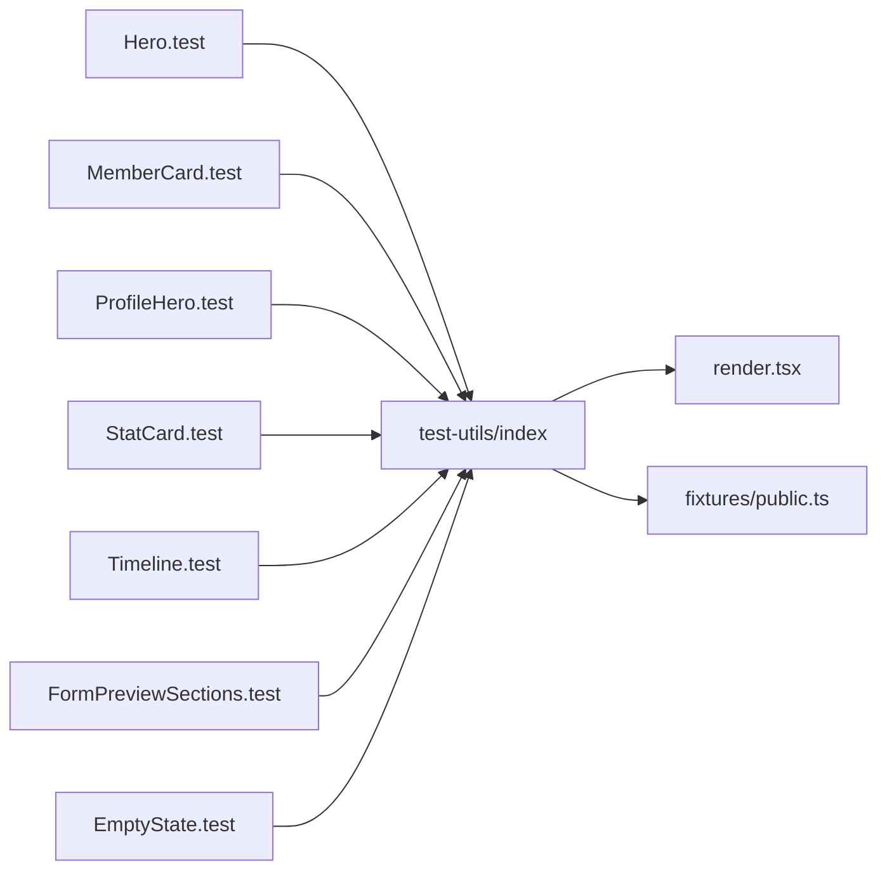

# outputs phase 08: ut-web-cov-02-public-components-coverage

- status: implemented-local
- purpose: DRY 化 (共通 helper / fixture 抽出)
- evidence: 仕様書 phase-08.md

## 新規追加ファイル (test-utils 配下)

| パス | 役割 |
| --- | --- |
| apps/web/src/test-utils/render.tsx | 共通 `renderUI` (将来 Provider 注入の single point) |
| apps/web/src/test-utils/fixtures/public.ts | `buildMember` / `buildStats` / `buildPreview` / `buildTimelineEntry` |
| apps/web/src/test-utils/index.ts | barrel re-export |

## 主要シグネチャ

```ts
export function renderUI(ui: ReactElement, options?: RenderOptions): RenderResult;
export function buildMember(overrides?: Partial<PublicMemberListItem>): PublicMemberListItem;
export function buildStats(overrides?: Partial<PublicStatsView>): PublicStatsView;
export function buildPreview(overrides?: Partial<FormPreviewView>): FormPreviewView;
export function buildTimelineEntry(overrides?: Partial<TimelineEntry>): TimelineEntry;
```

## fixture base 値

| factory | base |
| --- | --- |
| buildMember | memberId="m_1", fullName="山田 太郎", nickname="taro", occupation="ITエンジニア", location="神戸市", ubmZone="A", ubmMembershipType="正会員" |
| buildStats | memberCount=10, publicMemberCount=8, meetingCountThisYear=4, zoneBreakdown=[{zone:"A",count:5},{zone:"B",count:3}] |
| buildPreview | sectionCount=2, fields=[2件 (sectionKey 違い)] |
| buildTimelineEntry | sessionId="s_1", title="第1回", heldOn="2026-04-01" |

## 依存図



## 検証コマンド

```bash
mise exec -- pnpm --filter @ubm-hyogo/web typecheck
mise exec -- pnpm --filter @ubm-hyogo/web test -- src/test-utils
mise exec -- pnpm --filter @ubm-hyogo/web test -- src/components/public
mise exec -- pnpm --filter @ubm-hyogo/web test -- src/components/feedback
```

## DoD

- 7 テストファイルが `test-utils/fixtures/public` を import している
- inline fixture の重複が排除されている
- typecheck / lint / test PASS
- helper 自体は transitive coverage で 80% 以上 (任意で `__tests__/fixtures.test.ts` を追加可)

## 不変条件チェック

- #2 fixture に responseId を含めない
- #5 public/feedback 専用 helper、admin と分離
- #6 helper は fetch / D1 を持たない
