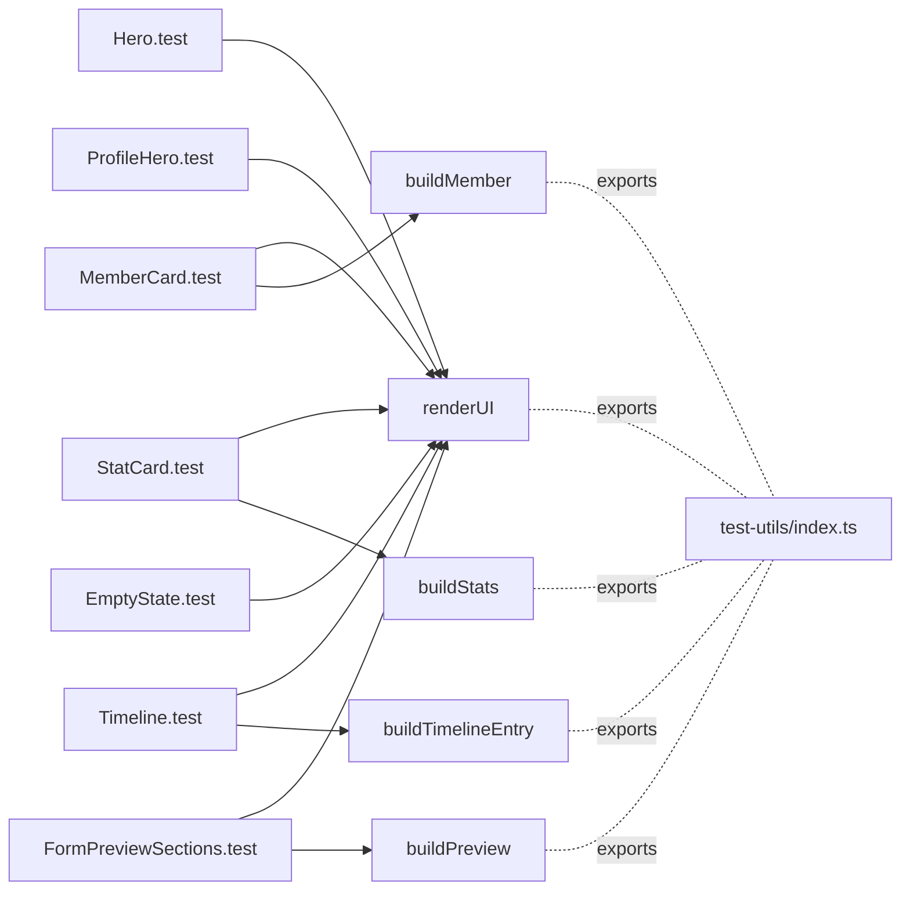

# Phase 8: DRY 化 — ut-web-cov-02-public-components-coverage

## メタ情報

| 項目 | 値 |
| --- | --- |
| task name | ut-web-cov-02-public-components-coverage |
| phase | 8 / 13 |
| wave | ut-coverage |
| mode | parallel |
| 作成日 | 2026-05-01 |
| taskType | implementation |
| visualEvidence | NON_VISUAL |

## 目的

Phase 5/6 で導入する 7 テストファイル間の重複を排除する。共通 render helper / fixture factory / mock setup を `apps/web/src/test-utils/` 配下に抽出する設計を確定する。

## CONST_005 必須項目

### 変更対象ファイル一覧

| パス | 区分 | 概要 |
| --- | --- | --- |
| apps/web/src/test-utils/render.tsx | 新規 | 共通 render helper (`renderUI`) |
| apps/web/src/test-utils/fixtures/public.ts | 新規 | `buildMember` / `buildStats` / `buildPreview` / `buildTimelineEntry` |
| apps/web/src/test-utils/index.ts | 新規 | barrel re-export |
| apps/web/src/components/public/__tests__/*.test.tsx | 編集 | inline fixture を test-utils 経由に置き換え |

### 主要な関数・型のシグネチャ

```ts
// apps/web/src/test-utils/render.tsx
import { render, type RenderOptions, type RenderResult } from "@testing-library/react";
import type { ReactElement } from "react";

export function renderUI(ui: ReactElement, options?: RenderOptions): RenderResult;
```

```ts
// apps/web/src/test-utils/fixtures/public.ts
import type { PublicMemberListItem } from "../../components/public/MemberCard";
import type { PublicStatsView } from "../../components/public/StatCard";
import type { FormPreviewView } from "../../components/public/FormPreviewSections";
import type { TimelineEntry } from "../../components/public/Timeline";

export function buildMember(overrides?: Partial<PublicMemberListItem>): PublicMemberListItem;
export function buildStats(overrides?: Partial<PublicStatsView>): PublicStatsView;
export function buildPreview(overrides?: Partial<FormPreviewView>): FormPreviewView;
export function buildTimelineEntry(overrides?: Partial<TimelineEntry>): TimelineEntry;
```

### 入力・出力・副作用

- `renderUI`: 入力 ReactElement, 出力 RenderResult。副作用なし (RTL の薄い wrapper)。将来 Provider 注入の拡張点。
- `build*`: 入力 partial overrides, 出力 完全な fixture。副作用なし、純関数。

### テスト方針

- helper 自体は対象 test 経由で transitive coverage が取れるため独立 test は不要。
- ただし `apps/web/src/test-utils/__tests__/fixtures.test.ts` で `build*` の override 動作を 1 ケースずつ検証することを推奨 (任意、追加 1 ファイル / 4 ケース)。

### ローカル実行・検証コマンド

```bash
mise exec -- pnpm --filter @ubm-hyogo/web test -- src/test-utils
mise exec -- pnpm --filter @ubm-hyogo/web test -- src/components/public
mise exec -- pnpm --filter @ubm-hyogo/web typecheck
```

### DoD

- 7 テストファイルが `test-utils/fixtures/public` から fixture を import している。
- inline fixture の重複が排除されている (同一構造の object literal が 2 ファイル以上に存在しない)。
- typecheck PASS。

## 抽出設計

### 共通 render helper

- `renderUI(ui, options)` は現状 `render` の薄い wrapper。
- 将来 Provider (例: ThemeProvider, QueryClientProvider) が必要になった場合に wrapper option をここに集約する。
- 当面の効果は import path 統一とリファクタ用 single point。

### fixture factory

| factory | base 値 | override パターン |
| --- | --- | --- |
| buildMember | memberId="m_1", fullName="山田 太郎", nickname="taro", occupation="ITエンジニア", location="神戸市", ubmZone="A", ubmMembershipType="正会員" | nickname/zone/membershipType を null にした variant |
| buildStats | memberCount=10, publicMemberCount=8, meetingCountThisYear=4, zoneBreakdown=[{zone:"A",count:5},{zone:"B",count:3}] | zoneBreakdown=[] / counts=0 |
| buildPreview | sectionCount=2, fields=2 件 (sectionKey 違い) | fields=[] / visibility="unknown" |
| buildTimelineEntry | sessionId="s_1", title="第1回", heldOn="2026-04-01" | overrides で順序検証 |

### mock setup

- 本タスクは presentational のため共通 mock は導入しない。
- `console.error` spy のみ Timeline / FormPreviewSections の test に inline で配置 (key 重複検知用)。

### barrel export

```ts
// apps/web/src/test-utils/index.ts
export { renderUI } from "./render";
export * from "./fixtures/public";
```

## DRY 化 mermaid



## 参照資料

- Phase 4 / 5 / 6
- `@testing-library/react` の RenderOptions API
- 既存 admin test の inline fixture パターン (重複の典型例)

## 統合テスト連携

- 上流: 04a-parallel-public-directory-api-endpoints
- 下流: 09a-A-staging-deploy-smoke-execution

## 多角的チェック観点

- #2 responseId/memberId separation: fixture に responseId を含めない。
- #5 public/member/admin boundary: test-utils は public/feedback 専用 fixture に限定 (admin は別 helper)。
- #6 apps/web D1 direct access forbidden: helper は fetch / D1 を持たない。

## サブタスク管理

- [ ] refs を確認する
- [ ] test-utils の配置と命名規約を確定する
- [ ] outputs/phase-08/main.md を作成する

## 成果物

- outputs/phase-08/main.md

## 完了条件

- 共通 helper / fixture が抽出されている。
- 7 テストファイルから重複が排除されている。
- typecheck / lint / test PASS。

## タスク100%実行確認

- [ ] この Phase の必須セクションがすべて埋まっている
- [ ] 完了済み本体タスクの復活ではなく follow-up gate の仕様になっている
- [ ] 実装、deploy、commit、push、PR を実行していない

## 次 Phase への引き渡し

Phase 9 へ、品質保証フェーズで実行する coverage 計測 / lint / typecheck / regression 確認の入力を引き渡す。
