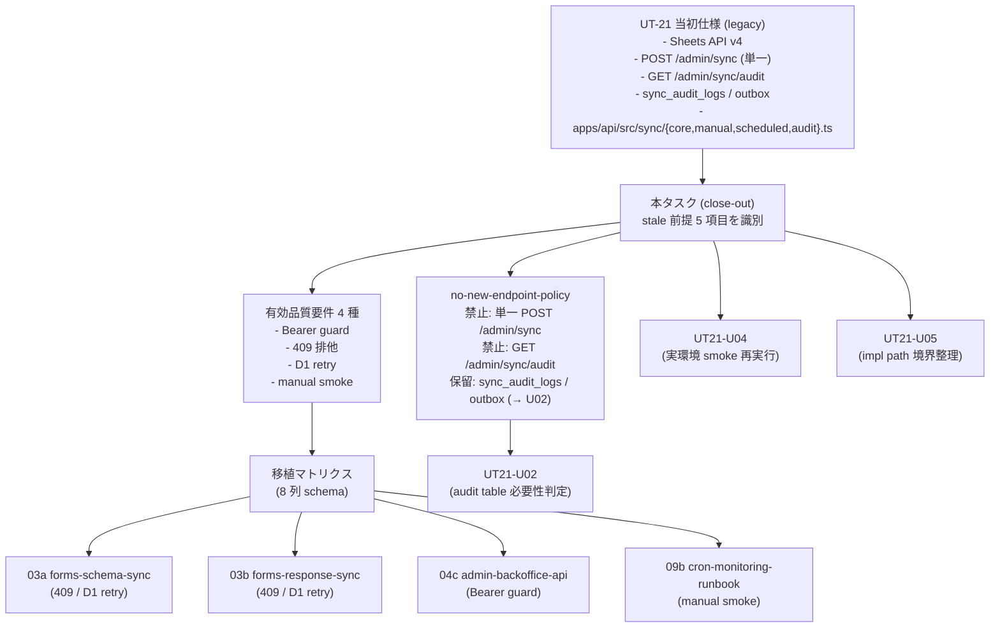

# Phase 2 Output: 移植マトリクス設計（migration-matrix-design）

## メタ情報

| 項目 | 値 |
| --- | --- |
| タスク ID | task-ut21-forms-sync-conflict-closeout-001 |
| Phase | 2 / 13（設計） |
| taskType | docs-only / specification-cleanup（legacy umbrella close-out） |
| 前 Phase | 1（要件定義） |
| 次 Phase | 3（設計レビュー） |

## docs-only / Ownership 宣言

- 本タスクは docs-only / legacy umbrella close-out であり、`apps/api/src/jobs/*` / `apps/api/src/sync/*` / `apps/web/*` の編集、D1 schema (DDL) の追加、Zod schema / `packages/shared` の編集はいずれも本 Phase で **一切行わない**。
- 03a / 03b / 04c / 09b の受入条件への実 patch 適用は、各タスクの Phase 5 / Phase 12 内で行う。本 Phase は「patch 案」を提示するのみ。
- 派生タスク（UT21-U02 / U04 / U05）はすでに `unassigned-task/` 配下に別ファイル化済み。本 Phase は cross-link のみ。

## 構造図 (Mermaid)



## (a) UT-21 stale 前提 5 項目 → 現行正本 差分表（4 列）

| # | UT-21 stale 前提 | 現行正本 | 差分要因 | 取り扱い |
| --- | --- | --- | --- | --- |
| 1 | 同期元 = Google Sheets API v4 (`spreadsheets.values.get`) | Google Forms API (`forms.get` / `forms.responses.list`) | UT-21 起票時は Google Form を Sheets 出力先で受けて読む構成想定。その後 Forms API 直接読みが正本に昇格し、DTO が `SheetRow` から Forms response object へ変更。`SHA-256(response_id)` 冪等キーは Forms `responseId` ベース | Sheets 経路への復帰なし。Phase 5 で 03a / 03b に「Forms API 経路を正本として再確認する」patch 案を提示 |
| 2 | 単一 `POST /admin/sync` endpoint | `POST /admin/sync/schema`（03a） + `POST /admin/sync/responses`（03b） の 2 系統 | `job_kind` 単一責務原則による分離。schema 同期と response 同期は失敗ドメインも retry 戦略も異なる | 単一 `POST /admin/sync` を新設しない（no-new-endpoint-policy で固定） |
| 3 | `GET /admin/sync/audit` 公開 endpoint | `sync_jobs` ledger を admin UI 経由で内部参照（公開 endpoint なし） | 公開 audit endpoint は admin 認可境界を冗長化し、API surface を不必要に拡大する。admin UI 経由なら 04c の Bearer + admin role で完結 | `GET /admin/sync/audit` を新設しない（no-new-endpoint-policy で固定） |
| 4 | `sync_audit_logs` / `sync_audit_outbox` 二段監査テーブル | `sync_jobs` ledger（`status` / `job_kind` / `metrics_json` / `started_at` / `finished_at`） | Sheets sync の best-effort + outbox モデル前提。Forms sync の retry-from-cursor モデルに対しては `sync_jobs` 単独で「実行履歴 / 実行中 job / 失敗詳細」をカバー可能性が高い | 新設保留。UT21-U02（`task-ut21-sync-audit-tables-necessity-judgement-001`）で sync_jobs の不足分析を行ってから判定 |
| 5 | 実装パス `apps/api/src/sync/{core,manual,scheduled,audit}.ts` | `apps/api/src/jobs/sync-forms-responses.ts` + `apps/api/src/sync/schema/*` | Cron handler 配置と import path が現行構成と乖離。仕様だけ追従すると import path / Workers Cron バインディング配置が壊れる | 境界整理は UT21-U05（`task-ut21-impl-path-boundary-realignment-001`）に委譲 |

## (b) 有効品質要件 4 種 → 03a / 03b / 04c / 09b 移植マトリクス（4 行 × 9 列、空セルゼロ）

| 移植 ID | UT-21 由来要件 | 移植先タスク | 反映観点 | 受入条件 patch 案の骨子 | 検証方針 | 派生タスク | 不変条件 touched | 優先度 |
| --- | --- | --- | --- | --- | --- | --- | --- | --- |
| MIG-01 | Bearer guard（401 / 403 / 200 認可境界） | 04c-parallel-admin-backoffice-api-endpoints | `Authorization: Bearer <SYNC_ADMIN_TOKEN>` middleware を `/admin/sync/*` 全ルートへ適用 | 04c に「`/admin/sync/schema` / `/admin/sync/responses` への 401（header 欠落） / 403（token 不一致） / 200（一致）の 3 ケース AC を追加」 | Vitest int test（middleware 単体）+ 04c phase-04 のテスト戦略へ追記 + 09a smoke で 401 ケースを 1 件含める | なし（04c の Phase 内で完結） | #5 | 高 |
| MIG-02 | 409 排他（`sync_jobs.status='running'` 同種 job 衝突） | 03a / 03b | 同種 `job_kind` で `running` レコードが既存の場合 409 Conflict を返却。schema sync と response sync は別 `job_kind` のため相互排他はしない | 03a / 03b 双方の AC に「`job_kind` ごとに同種 running 既存時 409 を返す」を追加 | Vitest int test（sync_jobs repository + handler）+ 03a / 03b phase-04 のテスト戦略へ追記 | なし（03a / 03b の Phase 内で完結） | #4 / #5 | 高 |
| MIG-03 | D1 retry / `SQLITE_BUSY` backoff / 短い transaction / batch-size 制限 | 03a / 03b | 指数バックオフ retry、transaction 短縮（書込まとめずバッチ単位コミット）、batch-size 上限の AC | 03a / 03b の AC に「retry 戦略・batch-size 上限値・transaction 境界」を明記 | Vitest int test（D1 mock retry / batch boundary）+ phase-04 / phase-09 へ追記 | なし（03a / 03b の Phase 内で完結） | #5 | 中 |
| MIG-04 | manual smoke（実 secrets / 実 D1 環境） | 09b runbook + 09a / 09c smoke | NON_VISUAL 証跡として `outputs/phase-11/` 系へログを残す手順を runbook に明記。staging / production の Bearer 401 / 200 / 409 三系統を smoke 化 | 09b runbook に「UT-21 由来 smoke 項目」セクションを追加。09a / 09c phase-11 の証跡形式を統一 | Cloudflare Workers 実環境で `bash scripts/cf.sh` 経由で実行。証跡ログを `outputs/phase-11/main.md` へ記録 | UT21-U04（`task-ut21-phase11-smoke-rerun-real-env-001`） | #5 | 中 |

## (c) `POST /admin/sync` / `GET /admin/sync/audit` 新設禁止方針

詳細は `outputs/phase-02/no-new-endpoint-policy.md` 参照。本ファイルでは結論のみ:

- 単一 `POST /admin/sync` を新設しない（理由: `job_kind` 単一責務原則違反、03a / 03b との二重正本化）
- `GET /admin/sync/audit` を新設しない（理由: admin UI 経由の `sync_jobs` 参照で十分。公開 endpoint は API surface の冗長化）
- 例外条件: 本 close-out 完了後、`task-workflow.md` への正本記述追加 + 03a / 03b / 04c の AC 改訂を伴う独立タスクとして起票する場合に限る

## (d) `sync_audit_logs` / `sync_audit_outbox` 新設保留方針（3 項目）

| 項目 | 内容 |
| --- | --- |
| 保留対象 | `sync_audit_logs`（best-effort 監査ログ） / `sync_audit_outbox`（at-least-once 配送 outbox） |
| 保留条件 | `sync_jobs` ledger（`status` / `job_kind` / `metrics_json` / `started_at` / `finished_at`）の不足分析が未実施。現時点で「不足あり」を裏付けるインシデント / 監査要件のエスカレーションは観測されていない |
| 解除条件 | UT21-U02（`task-ut21-sync-audit-tables-necessity-judgement-001`）にて `sync_jobs` が「実行履歴 / 実行中 job / 失敗詳細 / outbox 配送」をカバーできない領域を 1 件以上特定し、かつ `sync_jobs` の列拡張では吸収困難であることが論証された場合のみ新設 |
| 受け皿タスク | UT21-U02 |
| 本タスク内での扱い | 新設しない。U02 へ委譲する旨を本仕様書 / `outputs/phase-02/no-new-endpoint-policy.md` / UT-21 仕様書状態欄（Phase 12 で legacy ラベル付与時）に記録 |

## (e) UT-21 想定実装パス境界整理の UT21-U05 委譲

| 項目 | 内容 |
| --- | --- |
| UT-21 想定 | `apps/api/src/sync/{core,manual,scheduled,audit}.ts` |
| 現行構成 | `apps/api/src/jobs/sync-forms-responses.ts` + `apps/api/src/sync/schema/*` |
| 委譲先タスク | UT21-U05（`task-ut21-impl-path-boundary-realignment-001`） |
| 委譲スコープ | (1) UT-21 想定パスを現行構成へ正規化する境界整理ルールの確定、(2) Cron handler バインディング配置の現行確認、(3) `apps/api/src/sync/*` 配下が schema 同期専用に閉じる境界の明文化 |
| 本タスクでの扱い | スコープ外。差分認識（§(a) 行 #5）と委譲先 cross-link のみ |

## (f) 受入条件 patch 案 最小フィールド定義（6 件）

03a / 03b / 04c / 09b の各 Phase 5 で「実 patch 適用」を行う際、各 patch には以下 6 フィールドを必ず含める。

| # | フィールド | 説明 |
| --- | --- | --- |
| 1 | 移植 ID（MIG-XX） | 本 Phase の §(b) 移植マトリクス行番号 |
| 2 | 対象タスク ID | 03a-parallel-... / 03b-parallel-... / 04c-parallel-... / 09b-parallel-... のいずれか |
| 3 | 追加対象 AC 番号 | 既存 AC 番号の末尾追加（例: 03a AC-12）。コリジョン時は Phase 5 で再採番 |
| 4 | AC 文言（追加分） | UT-21 由来要件の具体的記述（401/403/200 / 409 / retry / smoke 手順） |
| 5 | 検証方針 | Vitest int test / smoke / lint いずれか（複数可） |
| 6 | 不変条件 touched | #1 / #4 / #5 / #7 のいずれか（複数可） |

## (g) AC-10 検証コマンド再実行ログ（Phase 1 §10 の継承確認）

実行コマンド:

```bash
rg -n "POST /admin/sync\b|GET /admin/sync/audit|sync_audit_logs|sync_audit_outbox" \
  docs/30-workflows/02-application-implementation \
  .claude/skills/aiworkflow-requirements/references
```

結果サマリー（Phase 1 §10 と一致）:

- `POST /admin/sync\b` のヒットはすべて `POST /admin/sync/schema` / `POST /admin/sync/responses` の分割 endpoint への参照。単一 `POST /admin/sync` を「新設すべき」とする記述は **0 件**
- `GET /admin/sync/audit` のヒットは `task-workflow.md` の close-out 注記内（「新設しない」文脈）のみ
- `sync_audit_logs` / `sync_audit_outbox` のヒットは `task-workflow.md` の close-out 注記内のみ。テーブル新設を要求する記述は **0 件**
- 結論: 03a / 03b / 04c / 09a / 09b / 09c / 07c / 08a の正本仕様空間と aiworkflow-requirements skill `references/` の current facts は本タスクの方針と完全整合（AC-3 / AC-4 / AC-7 / AC-9 / AC-10 PASS）

## (h) 不変条件 touched の再確認

| # | 不変条件 | Phase 2 設計での扱い |
| --- | --- | --- |
| #1 | 実フォームの schema をコードに固定しすぎない | UT-21 の Sheets 列インデックス前提を §(a) 行 #1 で完全排除 |
| #4 | Form schema 外データは admin-managed として分離 | `sync_jobs` ledger の admin-managed 性質を §(d) で再確認 |
| #5 | D1 直接アクセスは `apps/api` に閉じる | §(e) で `apps/api/src/jobs/*` + `apps/api/src/sync/schema/*` を正本確認。`apps/web` から D1 アクセスを示唆する記述ゼロ |
| #7 | MVP では Google Form 再回答を本人更新の正式経路 | §(a) 行 #1 で Forms→D1 一方向同期を再確認 |

## (i) 統合テスト連携 / 引き継ぎ

| 連携先 Phase | 連携内容 |
| --- | --- |
| Phase 3 | §(a)〜(f) を代替案比較の base case として渡す |
| Phase 4 | rg / 整合性 / cross-link 死活の検証戦略入力として §(c) policy / §(g) 検証ログを渡す |
| Phase 5 | 03a / 03b / 04c / 09b の受入条件 patch 案の入力として §(b) 移植マトリクス + §(f) 最小フィールドを渡す |
| Phase 7 | AC matrix の右軸として §(b) MIG-01〜MIG-04 を使用 |
| Phase 12 | 派生タスク UT21-U02 / U04 / U05 への cross-link を unassigned-task-detection.md に転記 |
