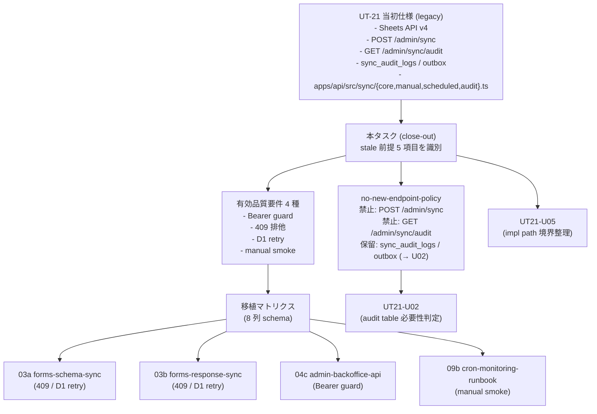

# Phase 2: 設計（移植マトリクス設計 + no-new-endpoint-policy）

## メタ情報

| 項目 | 値 |
| --- | --- |
| タスク名 | UT-21 Sheets sync 仕様を Forms sync 現行正本へ吸収する close-out |
| Phase 番号 | 2 / 13 |
| Phase 名称 | 設計（移植マトリクス設計 + no-new-endpoint-policy） |
| 作成日 | 2026-04-30 |
| 前 Phase | 1（要件定義） |
| 次 Phase | 3（設計レビュー） |
| 状態 | spec_created |
| タスク分類 | docs-only / specification-cleanup（legacy umbrella close-out） |

## 目的

Phase 1 で確定した「UT-21 を direct implementation に昇格させずに、有効品質要件のみを 03a / 03b / 04c / 09b に吸収する legacy umbrella close-out」を実現するための設計を、(a) UT-21 stale 前提 5 項目 → 現行正本 差分表、(b) 有効品質要件 4 種 → 03a / 03b / 04c / 09b 移植マトリクス、(c) `POST /admin/sync` / `GET /admin/sync/audit` 新設禁止方針（no-new-endpoint-policy）の明文化、の 3 軸で固定する。Phase 3 のレビューが代替案比較で結論を出せる粒度の入力を作成する。

なお本タスクは docs-only / legacy umbrella close-out である。yaml / コード / D1 schema の編集は本フェーズで一切行わず、03a / 03b / 04c / 09b の受入条件への移植 patch 案として「Phase 5 で提示」する境界をここで再固定する。

## 実行タスク

1. UT-21 stale 前提 5 項目 vs 現行正本 の差分表を確定する（完了条件: 5 行すべてに「stale 前提 / 現行正本 / 差分要因 / 取り扱い」が記載）。
2. 有効品質要件 4 種 → 03a / 03b / 04c / 09b の移植マトリクスを 8 列 schema で確定する（完了条件: 4 行 × 8 列で空セルゼロ）。
3. `POST /admin/sync` / `GET /admin/sync/audit` 新設禁止方針（no-new-endpoint-policy）を文書化する（完了条件: 禁止対象・例外条件・根拠・確認コマンドの 4 セクションが揃う）。
4. `sync_audit_logs` / `sync_audit_outbox` 新設保留方針（U02 判定まで保留）を文書化する（完了条件: 保留条件・解除条件・受け皿タスク ID の 3 項目が記載）。
5. UT-21 想定実装パス vs 現行実装パス の差分整理方針を UT21-U05 へ委譲する境界を明示する（完了条件: 委譲先タスク ID とスコープが記述）。
6. 03a / 03b / 04c / 09b の受入条件 patch 案の最小フィールドを定義する（完了条件: patch 1 件あたりの required フィールド 6 件が列挙）。
7. 成果物を `outputs/phase-02/migration-matrix-design.md` と `outputs/phase-02/no-new-endpoint-policy.md` に分離して作成する（完了条件: 2 ファイル分離が artifacts.json と一致）。

## 参照資料

| 種別 | パス | 用途 |
| --- | --- | --- |
| 必須 | docs/30-workflows/ut21-forms-sync-conflict-closeout/phase-01.md | Phase 1 確定事項（真の論点・4条件・stale 前提認識） |
| 必須 | docs/30-workflows/unassigned-task/UT-21-sheets-d1-sync-endpoint-and-audit-implementation.md | UT-21 当初仕様（差分比較の左辺） |
| 必須 | docs/30-workflows/unassigned-task/task-ut21-forms-sync-conflict-closeout-001.md | 原典 close-out スペック |
| 必須 | apps/api/src/jobs/sync-forms-responses.ts | Forms response sync 正本実装 |
| 必須 | apps/api/src/sync/schema/ | schema 同期正本実装 |
| 必須 | .claude/skills/aiworkflow-requirements/references/task-workflow.md | D1 / sync_jobs / deployment current facts |
| 参考 | docs/30-workflows/unassigned-task/task-sync-forms-d1-legacy-umbrella-001.md | 姉妹 close-out フォーマット |

## 構造図 (Mermaid)



## (a) UT-21 stale 前提 5 項目 → 現行正本 差分表

| # | UT-21 stale 前提 | 現行正本 | 差分要因 | 取り扱い |
| --- | --- | --- | --- | --- |
| 1 | 同期元 = Google Sheets API v4 (`spreadsheets.values.get`) | Google Forms API (`forms.get` / `forms.responses.list`) | DTO が `SheetRow` から Forms response へ変更。`SHA-256(response_id)` 冪等キーは Forms `responseId` ベース | Sheets 経路への復帰なし。Phase 5 で 03a/03b に Forms 経路を再確認する patch 案を提示 |
| 2 | 単一 `POST /admin/sync` endpoint | `POST /admin/sync/schema`（03a） + `POST /admin/sync/responses`（03b） の 2 系統 | `job_kind` 単一責務原則による分離 | `POST /admin/sync` を新設しない。no-new-endpoint-policy で固定 |
| 3 | `GET /admin/sync/audit` 公開 endpoint | `sync_jobs` ledger を admin UI 経由で内部参照 | 公開 audit endpoint は不要。admin UI で `sync_jobs` を読む方針 | `GET /admin/sync/audit` を新設しない。no-new-endpoint-policy で固定 |
| 4 | `sync_audit_logs` / `sync_audit_outbox` 二段監査テーブル | `sync_jobs` ledger（`status` / `job_kind` / `metrics_json` / `started_at` / `finished_at`） | `sync_jobs` の不足分析が未実施 | 新設保留。U02（`task-ut21-sync-audit-tables-necessity-judgement-001`）で判定 |
| 5 | 実装パス `apps/api/src/sync/{core,manual,scheduled,audit}.ts` | `apps/api/src/jobs/sync-forms-responses.ts` + `apps/api/src/sync/schema/*` | Cron handler 配置と import path が現行と乖離 | 境界整理は U05（`task-ut21-impl-path-boundary-realignment-001`）に委譲 |

## (b) 有効品質要件 4 種 → 03a / 03b / 04c / 09b 移植マトリクス

| 移植 ID | UT-21 由来要件 | 移植先タスク | 反映観点 | 受入条件 patch 案の骨子 | 検証方針 | 派生タスク | 不変条件 touched | 優先度 |
| --- | --- | --- | --- | --- | --- | --- | --- | --- |
| MIG-01 | Bearer guard（401 / 403 / 200 認可境界） | 04c-parallel-admin-backoffice-api-endpoints | `Authorization: Bearer <SYNC_ADMIN_TOKEN>` middleware を `/admin/sync/*` 全ルートへ適用 | 401（header 欠落） / 403（不一致） / 200（一致）の 3 ケース AC を 04c の AC に追加 | Vitest int test（middleware 単体）+ 04c phase-04 のテスト戦略へ追記 | なし | #5 | 高 |
| MIG-02 | 409 排他（`sync_jobs.status='running'` 同種 job 衝突） | 03a / 03b | 同種 `job_kind` で `running` レコードが既存の場合 409 Conflict を返却 | 409 ケース AC を 03a / 03b 双方の AC に追加（job_kind ごとに排他） | Vitest int test（sync_jobs repository）+ phase-04 へ追記 | なし | #4 / #5 | 高 |
| MIG-03 | D1 retry / `SQLITE_BUSY` backoff / 短い transaction / batch-size 制限 | 03a / 03b | 指数バックオフ retry、transaction 短縮、batch-size 上限の AC | retry 戦略・batch-size 上限値・transaction 境界を 03a / 03b の AC に追加 | Vitest int test（D1 mock retry）+ phase-04 / phase-09 へ追記 | なし | #5 | 中 |
| MIG-04 | manual smoke（実 secrets / 実 D1 環境） | 09b runbook + 09a / 09c smoke | NON_VISUAL 証跡として `outputs/phase-11/` 系へログを残す手順を runbook に明記 | 09b runbook に「UT-21 由来 smoke 項目」セクションを追加。09a / 09c phase-11 の証跡形式を統一 | Cloudflare Workers 実環境で `bash scripts/cf.sh` 経由で実行。証跡ログを `outputs/phase-11/main.md` へ記録 | UT21-U04（`task-ut21-phase11-smoke-rerun-real-env-001`） | #5 | 中 |

## (c) no-new-endpoint-policy（新設禁止方針）

### 禁止対象

| # | 対象 | 禁止根拠 |
| --- | --- | --- |
| 1 | `POST /admin/sync`（単一 endpoint） | `job_kind` 単一責務原則により 03a `POST /admin/sync/schema` と 03b `POST /admin/sync/responses` の 2 系統に分離済み。単一統合は二重正本化を生む |
| 2 | `GET /admin/sync/audit`（公開 audit endpoint） | `sync_jobs` ledger は admin UI 経由で内部参照する設計（02c / 04c）。公開 endpoint は admin 認可境界を冗長化し、API surface を不必要に拡大する |

### 例外条件

- いずれの endpoint も、本タスクの完了後に新設する場合は **必ず** aiworkflow-requirements skill `references/task-workflow.md` への正本記述追加 + 03a / 03b / 04c の AC 改訂を伴う独立タスクとして起票する。本 close-out の延長線上では新設しない。

### 根拠（参照）

- `docs/30-workflows/unassigned-task/task-sync-forms-d1-legacy-umbrella-001.md` の「単一 `/admin/sync` を新設しない」方針との整合
- CLAUDE.md 不変条件 #5（D1 直接アクセスは `apps/api` に閉じる）+ 02c の admin-managed data 境界

### 確認コマンド

```bash
rg -n "POST /admin/sync\b|GET /admin/sync/audit|sync_audit_logs|sync_audit_outbox" \
  docs/30-workflows/02-application-implementation \
  .claude/skills/aiworkflow-requirements/references
```

期待: ヒット件数が「legacy 文脈での参照のみ」になっており、03a / 03b / 04c の正本仕様内で「新設すべき」記述は 0 件。

## (d) `sync_audit_logs` / `sync_audit_outbox` 新設保留方針

| 項目 | 内容 |
| --- | --- |
| 保留対象 | `sync_audit_logs`（best-effort 監査ログ） / `sync_audit_outbox`（at-least-once 配送 outbox） |
| 保留条件 | `sync_jobs` ledger の不足分析が未実施 |
| 解除条件 | UT21-U02 にて `sync_jobs` の `status` / `metrics_json` / `started_at` / `finished_at` が「実行履歴 / 実行中ジョブ / 失敗詳細」をカバーできるか判定。不足が証明された場合のみ新設 |
| 受け皿タスク | `docs/30-workflows/unassigned-task/task-ut21-sync-audit-tables-necessity-judgement-001.md`（UT21-U02） |
| 本タスク内での扱い | 新設しない。U02 へ委譲する旨を本仕様書および UT-21 仕様書状態欄に記録 |

## (e) 受入条件 patch 案 最小フィールド定義

03a / 03b / 04c / 09b の各 Phase 5 で「実 patch 適用」を行う際、各 patch には以下 6 フィールドを必ず含める。

| # | フィールド | 説明 |
| --- | --- | --- |
| 1 | 移植 ID（MIG-XX） | 本 Phase の移植マトリクス行番号 |
| 2 | 対象タスク ID | 03a / 03b / 04c / 09b いずれか |
| 3 | 追加対象 AC 番号 | 既存 AC 番号の末尾追加（例: 03a AC-12） |
| 4 | AC 文言（追加分） | UT-21 由来要件の具体的記述 |
| 5 | 検証方針 | Vitest int test / smoke / lint いずれか |
| 6 | 不変条件 touched | #1 / #4 / #5 / #7 のいずれか |

## 既存 schema / Ownership 宣言

| 観点 | 宣言 |
| --- | --- |
| 本タスクが docs-only であること | 移植マトリクスの設計と new-endpoint 禁止方針の明文化のみが本タスクの作業範囲 |
| code 変更の禁則 | `apps/api/src/jobs/*` / `apps/api/src/sync/*` / `apps/web/*` の編集は本タスクで一切実施しない |
| D1 schema 変更の禁則 | `sync_audit_logs` / `sync_audit_outbox` の DDL は本タスクで一切作成しない |
| 派生タスクの owner | UT21-U02 / U04 / U05 はすでに別ファイル化済み。本タスクは cross-link のみ |
| 03a/03b/04c/09b への波及 | Phase 5 で patch 案を提示するのみ。実 patch 適用は各タスクの Phase 内 |

## 統合テスト連携

| 連携先 Phase | 連携内容 |
| --- | --- |
| Phase 3 | 移植マトリクス・no-new-endpoint-policy・stale 差分表を代替案比較対象として渡す |
| Phase 4 | rg / 整合性 / cross-link 死活の検証戦略入力として policy を渡す |
| Phase 5 | 03a/03b/04c/09b の受入条件 patch 案の入力として移植マトリクスを渡す |
| Phase 7 | AC matrix の右軸として移植マトリクスの行を使用 |
| Phase 12 | 派生タスク UT21-U02 / U04 / U05 への cross-link を unassigned-task-detection.md に転記 |

## 多角的チェック観点（AIが判断）

- 移植マトリクスの 4 行が 03a / 03b / 04c / 09b に一意割り当てされているか（同じ要件が複数タスクへ二重移植されていないか）
- no-new-endpoint-policy の禁止対象 2 件と保留対象 2 件が排他に分離されているか
- 不変条件 #1（schema 固定回避）/ #5（D1 アクセス境界）/ #7（Forms 再回答経路）への抵触が混入していないか
- UT-21 想定実装パス → 現行実装パス の境界整理が U05 へ委譲されているか
- `POST /admin/sync` / `GET /admin/sync/audit` を「将来的に検討」と書く誘惑を排除しているか（明確な「禁止」表現）

## サブタスク管理

| # | サブタスク | 担当 Phase | 状態 | 備考 |
| --- | --- | --- | --- | --- |
| 1 | stale 前提 5 項目 差分表 | 2 | spec_created | migration-matrix-design.md |
| 2 | 移植マトリクス 8 列 schema | 2 | spec_created | 4 行 × 8 列 |
| 3 | no-new-endpoint-policy 文書化 | 2 | spec_created | no-new-endpoint-policy.md |
| 4 | sync_audit_logs / outbox 新設保留方針 | 2 | spec_created | U02 委譲 |
| 5 | 実装パス境界整理の U05 委譲 | 2 | spec_created | U05 cross-link |
| 6 | 受入条件 patch 案 最小フィールド | 2 | spec_created | 6 フィールド |

## 成果物

| 種別 | パス | 説明 |
| --- | --- | --- |
| ドキュメント | outputs/phase-02/migration-matrix-design.md | UT-21 品質要件 → 03a/03b/04c/09b 移植マトリクス + stale 差分表 |
| ドキュメント | outputs/phase-02/no-new-endpoint-policy.md | `POST /admin/sync` / `GET /admin/sync/audit` 新設禁止方針 + sync_audit_logs/outbox 新設保留方針 |
| メタ | artifacts.json | Phase 2 状態の更新 |

## 完了条件チェックリスト

- [ ] stale 前提 5 項目 差分表が「stale 前提 / 現行正本 / 差分要因 / 取り扱い」の 4 列で固定されている
- [ ] 移植マトリクスが 4 行 × 8 列で空セルゼロ
- [ ] `POST /admin/sync` / `GET /admin/sync/audit` 新設禁止方針が「禁止対象 / 例外条件 / 根拠 / 確認コマンド」の 4 セクションで記載されている
- [ ] `sync_audit_logs` / `sync_audit_outbox` 新設保留が U02 へ委譲されている
- [ ] 実装パス境界整理が U05 へ委譲されている
- [ ] 受入条件 patch 案 最小フィールド（6 件）が定義されている
- [ ] 本タスクが docs-only / legacy umbrella close-out である宣言が改めて記載されている

## タスク100%実行確認【必須】

- 全実行タスク（7 件）が `spec_created`
- 全成果物が `outputs/phase-02/` 配下に配置予定（2 ファイル分離）
- 不変条件 #1 / #4 / #5 / #7 抵触の混入がないことが多角的チェックで確認されている
- artifacts.json の `phases[1].status` が `spec_created`

## 次 Phase への引き継ぎ

- 次 Phase: 3（設計レビュー）
- 引き継ぎ事項:
  - stale 前提 5 項目 差分表
  - 移植マトリクス（4 行 × 8 列）
  - no-new-endpoint-policy（禁止 2 件 + 保留 2 件）
  - 受入条件 patch 案 最小フィールド（6 件）
  - U02 / U05 への委譲境界
- ブロック条件:
  - 移植マトリクスに空セル
  - `POST /admin/sync` / `GET /admin/sync/audit` を「将来検討」と書いている（明確な禁止になっていない）
  - 本タスクが docs-only であることの宣言が抜けている
  - U02 / U05 への委譲先が明示されていない
