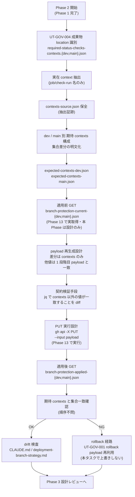

# Phase 2: 設計（contexts 抽出 / payload 再生成設計）

## メタ情報

| 項目 | 値 |
| --- | --- |
| タスク名 | UT-GOV-001 second-stage contexts reapply（task-utgov001-second-stage-reapply-001） |
| Phase 番号 | 2 / 13 |
| Phase 名称 | 設計（contexts 抽出 / payload 再生成設計） |
| 作成日 | 2026-04-30 |
| 前 Phase | 1 (要件定義) |
| 次 Phase | 3 (設計レビュー) |
| 状態 | spec_created |
| タスク分類 | implementation / governance / NON_VISUAL |

## 目的

Phase 1 で確定した「`contexts=[]` 暫定 fallback の構造的解消」要件を、UT-GOV-004 完了成果物からの実在 context 抽出ルール、dev / main 別の期待 contexts 設計、`branch-protection-payload-{dev,main}.json` の再生成設計、適用前 / 適用後 GET の保全設計、`gh api` による REST 呼び出し設計、1 PUT 失敗時 rollback 経路設計、admin block 回避設計、workflow 名 vs job 名 / check-run 名 の判別ルール、CLAUDE.md / deployment-branch-strategy.md drift 検査設計として具体化する。Phase 3 のレビューが代替案比較で結論を出せる粒度の設計入力を Phase 13 の実 PUT runbook に渡せる形で完成させる。

## 本 Phase でトレースする AC

- AC-1（UT-GOV-004 成果物からの実在 context 抽出と `outputs/phase-02/contexts-source.json` 保全）
- AC-2（dev / main 別の期待 contexts 個別 JSON と集合差分の明文化）
- AC-4（payload の `required_status_checks.contexts` 再生成設計、暫定 `contexts=[]` 残留無し）
- AC-9（typo context 防止のため workflow 名禁止 / 実 job/check-run 名採用の原則と検証手段の文書化）
- AC-10（admin block 回避の rollback 担当・経路の再確認・記述）

## 実行タスク

1. UT-GOV-004 成果物の location 候補を識別し、実在 context 抽出ルールを定義する（完了条件: 成果物 location が JSON / Markdown のどちらでも対応する抽出パターンを記述）。
2. dev / main 別の期待 contexts を個別 JSON で設計する（完了条件: 集合一致・順序不問の原則と、dev / main の集合差分が明文化）。
3. `branch-protection-payload-{dev,main}.json` の再生成設計を行う（完了条件: 差分は contexts のみで、他値は UT-GOV-001 1 段階目 payload と一致することの検証手段を記述）。
4. 適用前 GET（`branch-protection-current-{dev,main}.json`）の保全設計を行う（完了条件: 取得タイミング・保管先・改変禁止原則）。
5. 適用後 GET（`branch-protection-applied-{dev,main}.json`）の取得設計を行う（完了条件: PUT 直後に取得し、期待 contexts との集合一致確認手段を記述）。
6. `gh api` による REST 呼び出し設計を行う（完了条件: コマンド形式・必要 scope（admin）・rate limit 配慮・JSON 整形手段（jq）を記述）。
7. 1 PUT 失敗時 rollback 経路を設計する（完了条件: UT-GOV-001 rollback payload 再利用・本タスクで上書きしない原則・branch 別 rollback 手順を記述）。
8. admin block 回避設計を行う（完了条件: rollback 担当・経路・PUT 直前確認チェックリスト）。
9. workflow 名 vs job 名 / check-run 名 の判別ルールを定義する（完了条件: 禁止例・採用例・検証手段）。
10. CLAUDE.md / deployment-branch-strategy.md drift 検査設計を行う（完了条件: 検査対象 6 値の対応表）。
11. 設計成果物 3 ファイル（`contexts-source.json` / `expected-contexts-{dev,main}.json` / `payload-design.md`）を分離して作成する。

## 参照資料

| 種別 | パス | 用途 |
| --- | --- | --- |
| 必須 | docs/30-workflows/completed-tasks/utgov001-second-stage-reapply/phase-01.md | 真の論点・4 条件・Ownership 宣言・命名規則チェックリスト |
| 必須 | docs/30-workflows/completed-tasks/utgov001-second-stage-reapply/index.md | 正本語彙・AC・苦戦箇所 |
| 必須 | docs/30-workflows/completed-tasks/UT-GOV-001-github-branch-protection-apply.md | 1 段階目 payload / rollback payload / 運用境界 |
| 必須 | UT-GOV-004 成果物（`required-status-checks-contexts.{dev,main}.json` 等） | 実在 context の正本（唯一の入力源） |
| 必須 | CLAUDE.md（ブランチ戦略 / Governance / Secret hygiene） | drift 検証基準・禁止事項 |
| 必須 | docs/00-getting-started-manual/deployment-branch-strategy.md | deployment branch strategy 正本 |
| 必須 | GitHub REST API: `PUT/GET /repos/{owner}/{repo}/branches/{branch}/protection` | スキーマ正本 |
| 参考 | .claude/skills/aiworkflow-requirements/references/ci-cd.md | required_status_checks 関連の正本 |

## 構造図 (Mermaid) — 後追い再 PUT 設計フロー



## UT-GOV-004 成果物からの実在 context 抽出ルール

### 成果物 location 候補

| 候補 | 形式 | 抽出パターン |
| --- | --- | --- |
| `required-status-checks-contexts.dev.json` / `required-status-checks-contexts.main.json` | JSON 配列 | `jq -r '.[]'` で 1 行 1 context として展開 |
| `required-status-checks-contexts.json`（dev / main を 1 ファイルで保持） | JSON object | `jq -r '.dev[]' / jq -r '.main[]'` で分離抽出 |
| Markdown 表形式（フォールバック） | Markdown | 表 row から context カラムを `awk` で抽出（最終手段） |

### 抽出原則

- 入力源は UT-GOV-004 成果物のみ。実 GitHub Actions の check-run から再抽出しない（責務境界）。
- 抽出した値は workflow 名（`*.yml` / `build-and-test.yml` 等）であってはならない。job 名（`build (ubuntu-latest)`）または check-run 名（`build` / `test` 等）のみ採用。
- 抽出証跡は `outputs/phase-02/contexts-source.json` に保全する。形式は `{"source_path": "...", "extracted_at": "...", "dev": [...], "main": [...]}`。

## dev / main 別の期待 contexts 設計

| 観点 | 設計 |
| --- | --- |
| ファイル分離 | `outputs/phase-02/expected-contexts-dev.json` / `expected-contexts-main.json` |
| 集合一致原則 | 配列要素の集合一致（順序不問・重複なし）。GitHub REST API の挙動に合わせる |
| 集合差分の明文化 | dev only / main only / both の 3 区分で payload-design.md に列挙 |
| 空配列の扱い | 期待 contexts が空配列 == 本タスクの目的未達。AC-4 違反として Phase 3 でブロック |
| 重複検出 | jq `unique` で抽出時に重複除去。重複検出時は UT-GOV-004 側の不整合として別タスク起票 |

## payload 再生成設計

### 差分原則

- `branch-protection-payload-{dev,main}.json` の `required_status_checks.contexts` のみが本タスクの書換対象。
- 他値（`required_status_checks.strict` / `enforce_admins` / `required_pull_request_reviews` / `required_linear_history` / `required_conversation_resolution` / `allow_force_pushes` / `allow_deletions` / `restrictions` / `block_creations` / `required_signatures`）は UT-GOV-001 1 段階目 payload と完全一致しなければならない。

### 検証手段

```bash
# 擬似コマンド（Phase 13 で実行）
jq 'del(.required_status_checks.contexts)' first-stage-payload-dev.json > first-stage-payload-dev.no-contexts.json
jq 'del(.required_status_checks.contexts)' branch-protection-payload-dev.json > second-stage-payload-dev.no-contexts.json
diff first-stage-payload-dev.no-contexts.json second-stage-payload-dev.no-contexts.json
# 期待: 差分ゼロ
```

dev / main それぞれで上記 diff を実施し、差分ゼロを AC-4 の検証根拠とする。

## 適用前 / 適用後 GET 設計

### 適用前 GET

| 項目 | 設計 |
| --- | --- |
| タイミング | Phase 13 の PUT 実行直前 |
| コマンド | `gh api repos/{owner}/{repo}/branches/{branch}/protection > outputs/phase-13/branch-protection-current-{branch}.json` |
| 改変禁止 | `current-{branch}.json` は本タスクで一切書換しない（rollback 時の参照源） |
| dev / main 独立 | 各 branch で個別ファイル |

### 適用後 GET

| 項目 | 設計 |
| --- | --- |
| タイミング | PUT 応答受信直後（PUT 応答 JSON とは別取得） |
| コマンド | `gh api repos/{owner}/{repo}/branches/{branch}/protection > outputs/phase-13/branch-protection-applied-{branch}.json` |
| 検証 | `jq '.required_status_checks.contexts | sort' applied-{branch}.json` と `jq '. | sort' expected-contexts-{branch}.json` の集合一致 |

## GitHub REST API 呼び出し設計

| 観点 | 設計 |
| --- | --- |
| Client | `gh api`（gh CLI 経由）。`wrangler` / 独自 curl を使わない |
| 認証 | repository admin scope を持つ token。`gh auth status` で事前確認 |
| token 注入 | ローカル環境変数 / `gh auth login` 済セッションで揮発的に扱う。runbook には `op://Employee/ubm-hyogo-env/GITHUB_ADMIN_TOKEN`（admin scope 必須）の参照のみを記述、token 値は記述しない |
| rate limit | branch protection PUT は authenticated rate limit（5000 req/h）に対し本タスクで 6 req（GET×2 / PUT×2 / 適用後 GET×2）程度のため余裕 |
| JSON 整形 | `jq` を必須前提。整形は `jq '.'`、集合比較は `jq 'sort'` |
| エラー検出 | HTTP status を `gh api -i` で確認、403 = scope 不足 / 404 = branch 名 typo / 422 = payload schema 違反として分岐 |

### コマンド形式（疑似）

```bash
# GET
gh api repos/{owner}/{repo}/branches/dev/protection \
  -H "Accept: application/vnd.github+json" \
  > outputs/phase-13/branch-protection-current-dev.json

# PUT（Phase 13 でユーザー承認後に実行）
gh api -X PUT repos/{owner}/{repo}/branches/dev/protection \
  -H "Accept: application/vnd.github+json" \
  --input outputs/phase-13/branch-protection-payload-dev.json
```

## 1 PUT 失敗時 rollback 経路設計

### 原則

- rollback payload は **UT-GOV-001 で確立済みの rollback payload を再利用**する。本タスクで rollback payload を新規生成・上書きしない（Ownership 宣言と整合）。
- dev / main 独立 rollback。1 PUT が成功して 1 PUT が失敗した場合、失敗側のみ rollback する。成功側は維持。
- rollback PUT も `gh api -X PUT --input <UT-GOV-001-rollback-payload>` で行う。

### 失敗パターン別 rollback 手順

| 失敗パターン | rollback 対象 | 手順 |
| --- | --- | --- |
| dev PUT 失敗 / main 未実行 | dev のみ | dev に UT-GOV-001 rollback payload を PUT。main は 2 段階目 PUT を保留し原因調査 |
| dev 成功 / main PUT 失敗 | main のみ | main に UT-GOV-001 rollback payload を PUT。dev は 2 段階目状態を維持 |
| dev / main 両方 PUT 失敗 | dev / main 両方 | 両 branch に UT-GOV-001 rollback payload を PUT。原因調査 |
| 適用後 GET で集合不一致（typo context 等） | 検出側 branch のみ | 該当 branch に UT-GOV-001 rollback payload を PUT。`expected-contexts-{branch}.json` を再生成する別タスク起票 |

## admin block 回避設計

`enforce_admins=true` 下では contexts を埋めた瞬間、対応 check-run が走っていない open PR は admin でも merge 不能になる。

### PUT 直前確認チェックリスト

- [ ] UT-GOV-001 rollback payload の location が確定している
- [ ] `gh auth status` で admin scope 有効
- [ ] dev / main の open PR 一覧を `gh pr list --base dev --state open` / `--base main` で確認
- [ ] 期待 contexts に対応する check-run が現行 PR で走っている / 走る予定であることを確認
- [ ] rollback PUT のコマンドをコピペ準備した状態で 2 段階目 PUT を実行
- [ ] dev / main を **直列** で PUT（同時実行禁止。1 PUT 完了後に次へ）

### rollback 担当

実行者本人（admin token 保有者）。Phase 13 はユーザー承認前提のため、rollback 実行もユーザー承認の延長線上で実行者が担当する。

## workflow 名 vs job 名 / check-run 名 の判別ルール

| 判別軸 | 禁止例 | 採用例 |
| --- | --- | --- |
| ファイル拡張子 | `build-and-test.yml` / `ci.yml` | （拡張子無し） |
| パス区切り | `.github/workflows/ci` | `build` |
| matrix 表記 | （workflow 名のみ） | `build (ubuntu-latest)` / `test (node-24)` |
| 検証手段 | — | `gh api repos/{owner}/{repo}/commits/{sha}/check-runs --jq '.check_runs[].name'` で実 check-run 名と突合 |

## drift 検査設計

| 検査対象 | CLAUDE.md 期待値 | deployment-branch-strategy.md 期待値 | 検査手段 |
| --- | --- | --- | --- |
| `required_pull_request_reviews` | `null` | （feature → dev → main 昇格と整合） | `jq '.required_pull_request_reviews'` |
| `enforce_admins.enabled` | `true` | — | `jq '.enforce_admins.enabled'` |
| `allow_force_pushes.enabled` | `false` | — | `jq '.allow_force_pushes.enabled'` |
| `allow_deletions.enabled` | `false` | — | `jq '.allow_deletions.enabled'` |
| `required_linear_history.enabled` | `true` | — | `jq '.required_linear_history.enabled'` |
| `required_conversation_resolution.enabled` | `true` | — | `jq '.required_conversation_resolution.enabled'` |

drift 検出時は `outputs/phase-09/drift-check.md` に記録し、CLAUDE.md / deployment-branch-strategy.md 側の追従更新を別タスクで起票する（GitHub 側 protection を正本とする原則と整合）。

## 設計 trade-off

| トレードオフ軸 | 選択肢 X | 選択肢 Y | 採用 | 理由 |
| --- | --- | --- | --- | --- |
| dev / main の PUT 順序 | 同時実行（並列） | 直列 PUT | 直列 | 同時実行は片側失敗時の状況把握が遅れ、admin block 連鎖リスクが高まる |
| PUT 失敗時の対応 | 即時 rollback | 修正再 PUT | 即時 rollback | typo context は検出後即時 rollback して原因調査。修正再 PUT は再 typo リスクあり |
| 適用後 GET の取得方法 | PUT 応答 JSON を流用 | 別途 GET を実行 | 別途 GET | PUT 応答と GET の挙動差を排除し、AC-5 / AC-6 の証跡として明確化 |
| context 抽出源 | 実 check-run から再抽出 | UT-GOV-004 成果物のみ | UT-GOV-004 成果物のみ | 責務境界の維持。UT-GOV-004 が context 名 Owner |
| rollback payload | 本タスクで再生成 | UT-GOV-001 のものを再利用 | 再利用 | Ownership 宣言と整合。rollback payload の二重正本を防ぐ |
| 集合一致の判定 | 順序込み完全一致 | 順序不問の集合一致 | 集合一致 | GitHub REST API は順序を保証しないため |

## 統合テスト連携

| 連携先 Phase | 連携内容 |
| --- | --- |
| Phase 3 | contexts 抽出・payload 設計・rollback 境界をレビュー入力として渡す |
| Phase 4 | expected contexts / payload 差分 / drift 検査をテスト戦略へ渡す |
| Phase 5 | `outputs/phase-13/branch-protection-payload-{dev,main}.json` を実生成する runbook へ渡す |
| Phase 13 | user approval 後の GET / PUT / GET 証跡生成へ渡す |

## 成果物

| 種別 | パス | 説明 |
| --- | --- | --- |
| 設計 | outputs/phase-02/contexts-source.json | UT-GOV-004 由来 context の抽出証跡 |
| 設計 | outputs/phase-02/expected-contexts-dev.json | dev の期待 contexts 配列 |
| 設計 | outputs/phase-02/expected-contexts-main.json | main の期待 contexts 配列 |
| 設計 | outputs/phase-02/payload-design.md | payload 再生成設計（差分は contexts のみ・検証手段・rollback 経路・admin block 回避・drift 検査の整理） |
| メタ | artifacts.json | Phase 2 状態の更新 |

## 完了条件

Acceptance Criteria for this Phase:

- [ ] UT-GOV-004 成果物 location が識別され、抽出ルールが記述されている（AC-1）
- [ ] dev / main 別の期待 contexts 個別 JSON 設計が完了し、集合差分が明文化されている（AC-2）
- [ ] payload 再生成設計で「差分は contexts のみ」「他値は 1 段階目 payload と一致」が検証手段付きで記述されている（AC-4）
- [ ] 適用前 / 適用後 GET の保全・検証設計が記述されている（AC-3 / AC-5 / AC-6 への入力）
- [ ] `gh api` 呼び出し設計（コマンド形式・scope・rate limit・JSON 整形）が記述されている
- [ ] 1 PUT 失敗時の dev / main 独立 rollback 経路が UT-GOV-001 rollback payload 再利用の原則とともに記述されている（AC-8 への入力）
- [ ] admin block 回避（PUT 直前確認チェックリスト・rollback 担当）が記述されている（AC-10）
- [ ] workflow 名 vs job 名 / check-run 名 の判別ルールが禁止例 / 採用例 / 検証手段で記述されている（AC-9）
- [ ] CLAUDE.md / deployment-branch-strategy.md drift 検査の対象 6 値が表で固定されている（AC-7 への入力）
- [ ] 設計 trade-off 6 軸が採用根拠とともに記述されている
- [ ] 成果物 4 ファイル（contexts-source.json / expected-contexts-{dev,main}.json / payload-design.md）の生成設計が完成している

## タスク 100% 実行確認【必須】

- 全実行タスク（11 件）が `spec_created`
- 全成果物が `outputs/phase-02/` 配下に配置設計済み
- 本 Phase でトレースする AC（AC-1 / AC-2 / AC-4 / AC-9 / AC-10）が完了条件にすべて含まれている
- 異常系（typo context / dev/main 片側 PUT 失敗 / admin block / contexts=[] 残留 / workflow 名混入 / drift / Secret 漏洩）の論点が設計レベルで提示されている
- artifacts.json の `phases[1].status` が `spec_created`

## 次 Phase への引き渡し

- 次 Phase: 3 (設計レビュー)
- 引き継ぎ事項:
  - 抽出ルール / 期待 contexts 設計 / payload 再生成設計 / GET 保全設計 / `gh api` 呼び出し設計 / rollback 経路設計 / admin block 回避設計 / workflow vs job 判別ルール / drift 検査設計 / 設計 trade-off
  - 成果物 4 ファイルの形式と検証手段
  - 「差分は contexts のみ」「他値は 1 段階目 payload と一致」の検証 diff 手順
  - dev / main 直列 PUT 原則・即時 rollback 原則・UT-GOV-004 成果物のみを入力源とする原則・rollback payload 再利用原則
- ブロック条件:
  - UT-GOV-004 成果物 location が未確定
  - 期待 contexts が空配列で生成される
  - payload diff で contexts 以外の値に差分が出る
  - workflow 名が contexts に混入する設計が残る
