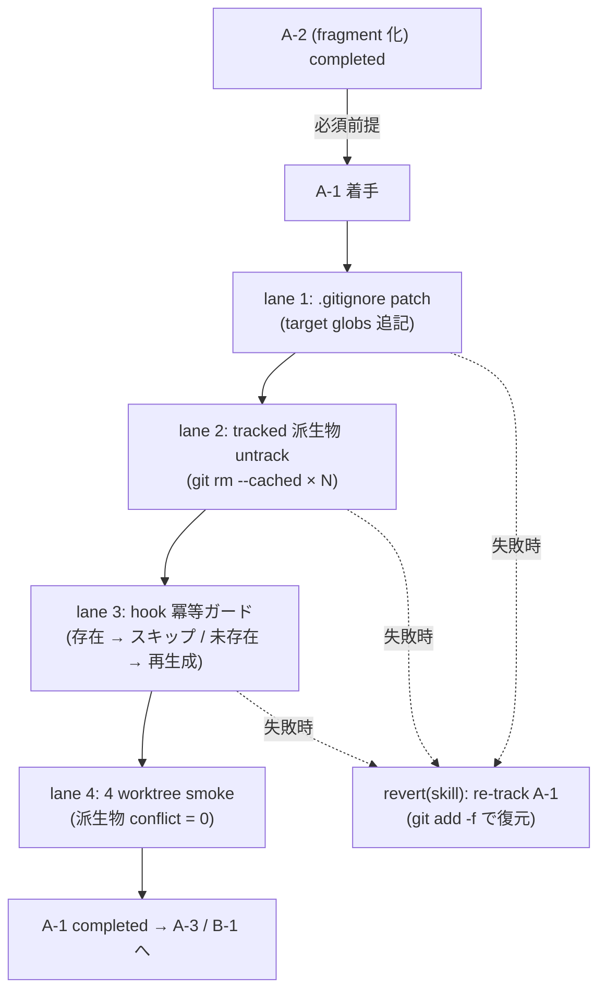

# Phase 2 成果物 — 設計

## 1. トポロジ（Mermaid）



## 2. SubAgent lane 設計

| lane | 役割 | 入力 | 出力 / 副作用 | 成果物 |
| --- | --- | --- | --- | --- |
| 1 | gitignore patch（4 系列 glob 追記） | runbook §Step 1 patch | `.gitignore` の diff、`git check-ignore -v` 全マッチ | gitignore-diff.patch |
| 2 | untrack（全 skill 横断棚卸し → `git rm --cached`） | lane 1 完了、`git ls-files .claude/skills` 実態 | `chore(skill): untrack auto-generated ledger files (A-1)` コミット | untrack-commit.log |
| 3 | hook 冪等ガード追加（`[[ -f <target> ]] && exit 0`） | lefthook.yml | hook ガード差分（最小） | hook-guard.diff |
| 4 | 4 worktree smoke verification | lane 1〜3 完了 | smoke コマンド系列。`outputs/phase-11/manual-smoke-log.md` に NOT EXECUTED で保存 | manual-smoke-log.md |

## 3. ファイル変更計画

| パス | 操作 | 編集 lane | 注意 |
| --- | --- | --- | --- |
| `.gitignore` | append 4 系列 + ヘッダコメント | 1 | 正本のみ。`.git/info/exclude` 禁止 |
| `.claude/skills/<skill>/indexes/keywords.json` 等 | `git rm --cached`（worktree 実体は残す） | 2 | 全 skill 横断で実態棚卸し後 |
| `lefthook.yml` ないし対応 hook script | 冪等ガード行追加 | 3 | T-6 未実装なら最小限 |
| apps/web / apps/api / packages | 変更なし | - | 本タスクは触らない |

## 4. state ownership

| state | owner | writer | reader | TTL |
| --- | --- | --- | --- | --- |
| `.gitignore` A-1 セクション | lane 1 | A-1 PR | git | 永続 |
| `indexes/*.json` / `*.cache.json` / `LOGS.rendered.md`（派生物） | hook / `pnpm indexes:rebuild` | hook（未存在時のみ） | skill 利用時 | worktree-local |
| `LOGS.md`（正本） | A-2 で確立 | 開発者 / hook（A-2 規約） | skill 利用 | append-only。A-1 では gitignore 化しない |
| post-commit / post-merge hook | lane 3 / T-6 | A-1 PR / T-6 PR | lefthook | 永続 |

> 中心境界: **hook は canonical を書かない**。派生物のみ生成し、未存在時のみ実行する。

## 5. ロールバック設計

```bash
git revert <A-1 untrack commit>
git revert <A-1 gitignore commit>
git add -f .claude/skills/<skill>/indexes/keywords.json   # 派生物が worktree に残っている場合
git commit -m "revert(skill): re-track A-1 ledger files"
```

1〜2 コミット粒度で完結。A-2 状態には影響しない。

## 6. 4 worktree smoke コマンド系列（仕様レベル）

```bash
git checkout main
for n in 1 2 3 4; do bash scripts/new-worktree.sh verify/a1-$n; done
for n in 1 2 3 4; do
  ( cd .worktrees/verify-a1-$n && pnpm indexes:rebuild )
done
for n in 1 2 3 4; do git merge --no-ff verify/a1-$n; done
git ls-files --unmerged | wc -l   # => 0 が AC-9
```

実走は Phase 11。

## 7. 依存タスク順序（A-2 完了必須）— 重複明記 2/3

A-2 が completed でなければ Phase 5 実装着手は許可されない。Phase 3 着手可否ゲートで NO-GO として再明示する。

## 8. Phase 3 への引き渡し

- base case = 案 A（lane 1〜4 直列 + 1〜2 コミットロールバック）
- 4 worktree smoke コマンド系列を Phase 11 へ
- A-2 完了 NO-GO 条件を Phase 3 へ
