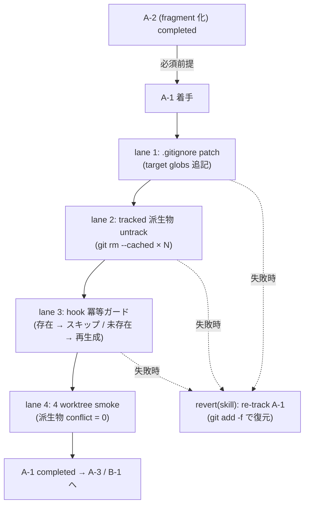

# Phase 2: 設計

## メタ情報

| 項目 | 値 |
| --- | --- |
| タスク名 | 自動生成 skill ledger の gitignore 化 (skill-ledger-a1-gitignore) |
| Phase 番号 | 2 / 13 |
| Phase 名称 | 設計 |
| 作成日 | 2026-04-28 |
| 前 Phase | 1 (要件定義) |
| 次 Phase | 3 (設計レビュー) |
| 状態 | completed |
| タスク種別 | docs-only / NON_VISUAL / infrastructure_governance |

## 目的

Phase 1 で確定した「A-2 完了前提・target globs 4 系列・全 skill 横断棚卸し・hook 冪等ガード」の要件を、トポロジ / SubAgent lane / state ownership / ファイル変更計画 / ロールバック設計に分解し、Phase 3 のレビューが代替案比較で結論を出せる粒度の設計入力を作成する。本 Phase の成果は仕様レベルであり、実コード適用は Phase 5 以降に委ねる。

## 実行タスク

1. 4 ステップのトポロジ（`.gitignore` 編集 → tracked 派生物 untrack → hook ガード冪等化 → 4 worktree smoke）を Mermaid で固定する（完了条件: 4 ステップが矢印で連結されている）。
2. SubAgent lane 4 本（lane 1 gitignore patch / lane 2 untrack / lane 3 hook guard / lane 4 smoke verification）を表化する（完了条件: 各 lane の I/O / 副作用 / 成果物が記述）。
3. ファイル変更計画を確定する（完了条件: 編集対象ファイルが正本 `.gitignore` のみであり、`.git/info/exclude` ではないことが明示されている）。
4. state ownership 表を作成する（完了条件: hook / canonical 派生物 / `.gitignore` / `LOGS.md` の 4 state について writer / reader / TTL が一意）。
5. ロールバック設計を確定する（完了条件: 1 コミット粒度で `revert(skill): re-track A-1 ledger files` を実行する手順が記述）。
6. 4 worktree smoke の検証コマンド系列を仕様レベルで固定する（完了条件: `scripts/new-worktree.sh` × N + 並列再生成 + `git merge --no-ff` × N + `git ls-files --unmerged` の系列が記述）。

## 依存タスク順序（A-2 完了必須）— 重複明記 1/3

> **A-2（task-skill-ledger-a2-fragment）が completed であることが本 Phase の必須前提である。**
> A-2 未完了で本 Phase の設計を実装に移すと、`LOGS.md` を `.gitignore` に含めた瞬間に履歴が事故的に失われる。本 Phase は A-2 完了を「設計の前提」として扱い、A-2 未完了の場合は Phase 3 の NO-GO 条件で block される。

## 参照資料

| 種別 | パス | 用途 |
| --- | --- | --- |
| 必須 | docs/30-workflows/skill-ledger-a1-gitignore/phase-01.md | 真の論点・target globs・4 条件 |
| 必須 | docs/30-workflows/completed-tasks/task-conflict-prevention-skill-state-redesign/outputs/phase-5/gitignore-runbook.md | Step 1〜4 / ロールバック手順 |
| 必須 | .claude/skills/aiworkflow-requirements/references/architecture-overview-core.md | repository 境界 |
| 必須 | lefthook.yml | post-commit / post-merge hook の正本配置 |
| 参考 | https://git-scm.com/docs/gitignore | glob 解釈 |

## トポロジ (Mermaid)



## SubAgent lane 設計

| lane | 役割 | 入力 | 出力 / 副作用 | 成果物 |
| --- | --- | --- | --- | --- |
| 1. gitignore patch | 正本 `.gitignore` への 4 系列 glob 追記 | runbook §Step 1 patch | `.gitignore` の diff、`git check-ignore -v` 全マッチ | gitignore-diff.patch |
| 2. untrack | 全 skill 横断で tracked 派生物を `git rm --cached` | lane 1 完了、`git ls-files .claude/skills` の実態 | `chore(skill): untrack auto-generated ledger files (A-1)` コミット | untrack-commit.log |
| 3. hook guard | post-commit / post-merge の冪等ガード追加（`[[ -f <target> ]] && exit 0`） | lefthook.yml、既存 hook script | hook ガード差分（最小）。本体実装が無ければ T-6 へ委譲 | hook-guard.diff |
| 4. smoke verification | 4 worktree 並列再生成 → merge で派生物 conflict 0 件確認 | lane 1〜3 完了状態 | smoke コマンド系列を `outputs/phase-11/manual-smoke-log.md` に NOT EXECUTED で保存 | manual-smoke-log.md |

## ファイル変更計画

| パス | 操作 | 編集者 | 注意 |
| --- | --- | --- | --- |
| `.gitignore` | append（4 系列 glob + コメント） | lane 1 | `.git/info/exclude` ではない正本のみ |
| `.claude/skills/<skill>/indexes/keywords.json` 等 | `git rm --cached`（worktree 実体は残す） | lane 2 | 全 skill 横断で実態棚卸し後に対象化 |
| `lefthook.yml` または既存 hook script | 冪等ガード行追加（あれば） | lane 3 | 本体未実装なら T-6 で実施 |
| その他 | 変更しない | - | apps/web / apps/api のソースは触らない |

## 環境変数 / Secret

本タスクは Secret / 環境変数を導入・参照しない。

## state ownership 表

| state | 物理位置 | owner | writer | reader | TTL / lifecycle |
| --- | --- | --- | --- | --- | --- |
| `.gitignore` の A-1 セクション | repository root | lane 1 | A-1 PR | git / 全 worktree | 永続。`merge=union` 等は B-1 で対応 |
| `indexes/*.json` / `*.cache.json` / `LOGS.rendered.md`（派生物） | worktree（git untracked） | hook / `pnpm indexes:rebuild` | hook（未存在時のみ生成） | skill 利用時 | worktree-local。コミットされない |
| `LOGS.md`（正本） | worktree（git tracked、A-2 後 fragment 化） | A-2 で確立 | 開発者 / hook（A-2 規約に従う） | skill 利用 | append-only。A-1 では gitignore 化しない |
| post-commit / post-merge hook | `lefthook.yml` 経由 | lane 3 / T-6 | A-1 PR / T-6 PR | lefthook | 永続 |

> **重要**: hook は **canonical（tracked）ファイルを書かない**。派生物のみを生成し、未存在時のみ実行する冪等性を持つ。これが untrack の循環事故を防ぐ核心境界。

## ロールバック設計

```bash
# A-1 を取り消す場合（1 コミット粒度）
git revert <A-1 untrack commit>          # untrack を戻す
git revert <A-1 gitignore commit>        # .gitignore の 4 系列 glob を戻す
# 派生物が worktree に既存の場合
git add -f .claude/skills/<skill>/indexes/keywords.json
git commit -m "revert(skill): re-track A-1 ledger files"
```

ロールバックは 1〜2 コミットで完結し、A-2 状態には影響しない。

## 4 worktree smoke 検証コマンド系列（仕様レベル）

```bash
# Phase 11 で実走する。本 Phase では系列のみ固定。
git checkout main
for n in 1 2 3 4; do bash scripts/new-worktree.sh verify/a1-$n; done
for n in 1 2 3 4; do
  ( cd .worktrees/verify-a1-$n && pnpm indexes:rebuild )
done
for n in 1 2 3 4; do git merge --no-ff verify/a1-$n; done
git ls-files --unmerged | wc -l   # => 0 が AC-9
```

## 実行手順

### ステップ 1: 全 skill 横断棚卸し仕様の固定

- Phase 5 ステップ 0（実装着手前）として「`git ls-files .claude/skills | rg "(indexes/.*\\.json|\\.cache\\.json|LOGS\\.rendered\\.md)"` で実態列挙」を仕様化する。

### ステップ 2: トポロジと lane の確定

- Mermaid 図と SubAgent lane 4 本を `outputs/phase-02/main.md` に固定する。

### ステップ 3: state ownership とロールバックの確定

- 4 state の owner / writer / reader / TTL を表化し、hook が canonical を書かない境界を中心境界として明示する。

### ステップ 4: 4 worktree smoke 仕様の固定

- 検証コマンド系列を仕様レベルで固定し、実走は Phase 11 に委ねる。

## 統合テスト連携

| 連携先 Phase | 連携内容 |
| --- | --- |
| Phase 3 | 設計の代替案比較・PASS/MINOR/MAJOR 判定の入力 |
| Phase 4 | lane 1〜4 ごとのテスト計画ベースライン |
| Phase 5 | 実装ランブックの擬似コード起点 |
| Phase 6 | 異常系（hook 循環 / `.git/info/exclude` 誤配置 / 棚卸し漏れ / A-2 未完了） |
| Phase 11 | 4 worktree smoke の手順 placeholder |

## 多角的チェック観点

- A-2 完了前提が 3 重に明記されているか（本 Phase が 2 重目）。
- hook が tracked canonical を書かない境界が state ownership で明示されているか。
- runbook 例示 glob でなく実態（`git ls-files`）ベースの棚卸しが lane 2 の前提に置かれているか。
- ロールバックが 1〜2 コミット粒度で完結するか。
- 不変条件 #5 を侵害しない範囲か（apps/api / apps/web のソースを触らない）。

## サブタスク管理

| # | サブタスク | 担当 Phase | 状態 | 備考 |
| --- | --- | --- | --- | --- |
| 1 | Mermaid トポロジ | 2 | completed | 4 ステップ + ロールバック分岐 |
| 2 | SubAgent lane 4 本 | 2 | completed | I/O・成果物明示 |
| 3 | ファイル変更計画 | 2 | completed | 正本 `.gitignore` のみ編集 |
| 4 | state ownership 表 | 2 | completed | 4 state |
| 5 | ロールバック設計 | 2 | completed | 1〜2 コミット粒度 |
| 6 | 4 worktree smoke コマンド系列 | 2 | completed | Phase 11 へ引き渡し |

## 成果物

| 種別 | パス | 説明 |
| --- | --- | --- |
| 設計 | outputs/phase-02/main.md | トポロジ・SubAgent lane・state ownership・ファイル変更計画・ロールバック |
| メタ | artifacts.json | Phase 2 状態の更新 |

## 完了条件

- [x] Mermaid トポロジに 4 ステップとロールバック分岐が記述されている
- [x] SubAgent lane 4 本に I/O / 成果物が記述されている
- [x] ファイル変更計画で正本 `.gitignore` のみが編集対象であることが明示されている
- [x] state ownership 表に「hook が canonical を書かない」境界が記述されている
- [x] ロールバック設計が 1〜2 コミット粒度で記述されている
- [x] 4 worktree smoke コマンド系列が仕様レベルで固定されている
- [x] A-2 完了前提が本 Phase で重複明記されている（3 重明記の 2 箇所目）

## タスク100%実行確認【必須】

- 全実行タスク（6 件）が `completed`
- 全成果物が `outputs/phase-02/` 配下に配置済み
- 異常系（hook 循環 / 棚卸し漏れ / `.git/info/exclude` 誤配置 / A-2 未完了）の対応 lane が設計に含まれる
- artifacts.json の `phases[1].status` が `completed`

## 次 Phase への引き渡し

- 次 Phase: 3 (設計レビュー)
- 引き継ぎ事項:
  - base case = lane 1〜4 直列実行 + 1〜2 コミット粒度のロールバック
  - 4 worktree smoke コマンド系列を Phase 11 へ
  - A-2 完了を NO-GO 条件として Phase 3 へ引き渡す
- ブロック条件:
  - Mermaid に 4 ステップのいずれかが欠落
  - state ownership に「hook が canonical を書かない」境界が無い
  - ロールバック設計が 3 コミット以上を要求している
  - A-2 完了前提が記述されていない
