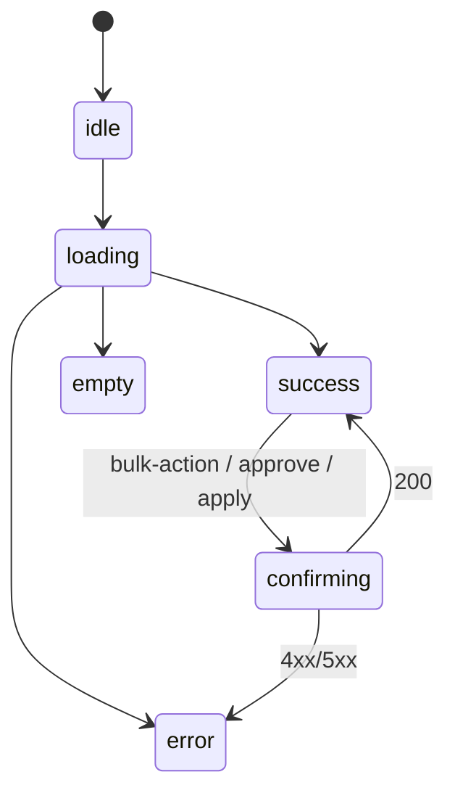

# task-21 screen-blueprints-admin

## §0. 自己完結コンテキスト

このタスクを単独で着手する担当者が、外部資料に遡らずとも実装判断できるよう、必須前提を本節に閉じ込める。

### 0.1 上位ゴール

`docs/00-getting-started-manual/claude-design-prototype/pages-admin.jsx`（658 行・凍結正本）の **管理層 8 routes** を `09g-screen-blueprints-admin.md` に **完全再現**する。プロトタイプ未掲載の admin 画面（requests / identity-conflicts / audit など 3 画面）は phase-3 §3 §5.3〜§5.7 の派生ルールを正本転記する。AdminSidebar は §1 に集約し全画面共通として扱う。bulk-action / approve-reject / schema-apply confirm 等の操作手順を一字一句明文化する。token は `--ubm-*` 名のみ参照（値は 09b、primitive は 09c、icon は 09d）。

### 0.2 DAG 座標

- 依存元: なし（task-01 scope-gate-all-screens 完了のみ前提）
- 依存先: task-15（admin dashboard + members）/ task-16（tags/meetings/requests）/ task-17（schema/conflicts/audit）/ task-06
- 並列性: **task-06 / 07 / 08 / 19 / 20 / 22 と並列実行可**。

### 0.3 触れるファイル群

- C（新規作成）: `docs/00-getting-started-manual/specs/09g-screen-blueprints-admin.md`（700〜1200 行）
- R（参照のみ）: `pages-admin.jsx`（L1-L658）/ `outputs/phase-1/phase-1.md` §3 / `outputs/phase-3/phase-3.md` §2 §3 §5.3〜§5.7
- M / 削除: なし

### 0.4 既存 API（不変）

phase-3 §2 の admin API を **正本**として転記:

- `GET /admin/kpi`
- `GET /admin/members` / `PATCH /admin/members/:id`
- `GET /admin/tags` / `POST /admin/tags/:id/{approve,reject}`
- `GET /admin/schema/diff` / `POST /admin/schema/apply`
- `GET /admin/requests` / `POST /admin/requests/:id/{approve,reject}`
- `GET /admin/identity-conflicts` / `POST /admin/identity-conflicts/:id/resolve`
- `GET /admin/audit`
- `GET /admin/meetings` / `POST /admin/meetings`

### 0.5 不変条件

1. pages-admin.jsx は **凍結正本**。本タスクで改変しない。
2. JSX inline 転記は **一字一句**。
3. 視覚値（HEX / oklch / px）を本ファイルに **0 件**含める。
4. `apps/web` から D1 直接アクセス禁止（CLAUDE.md 不変条件 5）。
5. AdminSidebar は §1 に 1 箇所だけ記述し、各画面 §X からは「§1 参照」とリンクで集約する（重複禁止）。
6. bulk-action / approve-reject は確認ダイアログ（Modal）必須。`role="dialog"` + `aria-modal="true"` + Esc close + focus trap を §X.6 a11y に必ず記述。
7. schema-apply は二段確認（diff 表示 → apply confirm）を §X.3 状態遷移に明示。
8. 未掲載画面（requests / identity-conflicts / audit）は phase-3 §3 §5.3〜§5.7 の派生ルールに従い、新規 primitive を生成しない（09c の組合せのみ）。

### 0.6 上流から受け取るシグネチャ

- phase-1 §3 admin 8 routes: `/(admin)/admin{,/members,/tags,/meetings,/schema,/requests,/identity-conflicts,/audit}`
- phase-3 §2 API 接続表
- phase-3 §3 §5.3 admin queue / §5.4 admin CRUD / §5.5 admin diff / §5.6 admin compare / §5.7 admin timeline
- prototype 行範囲: AdminDashboardPage L4-L161 / AdminMembersPage L162-L368 / AdminTagsPage L369-L507 / SchemaDiffPage L508-L657

### 0.7 下流へ渡すシグネチャ

`09g-screen-blueprints-admin.md` 章立て:

```
1. AdminSidebar（全画面共通・1 箇所集約）
2. /(admin)/admin (Dashboard)        ← AdminDashboardPage L4-L161
3. /(admin)/admin/members            ← AdminMembersPage L162-L368
4. /(admin)/admin/tags               ← AdminTagsPage L369-L507
5. /(admin)/admin/meetings           ← phase-3 §3 §5.4 派生 (CRUD)
6. /(admin)/admin/schema             ← SchemaDiffPage L508-L657
7. /(admin)/admin/requests           ← phase-3 §3 §5.3 派生 (queue)
8. /(admin)/admin/identity-conflicts ← phase-3 §3 §5.6 派生 (compare)
9. /(admin)/admin/audit              ← phase-3 §3 §5.7 派生 (timeline)
99. 不採用要素
```

各 §X (2〜9) は同列構成: X.1 prototype 由来 / X.2 コピー原文 / X.3 状態遷移 mermaid / X.4 API 表 / X.5 props/state / X.6 a11y / X.7 操作手順 (bulk-action / approve-reject / apply confirm 等) / X.8 参照（09c/09b/09d/09a）。

### 0.8 用語

- **AdminSidebar**: admin layout 共通の左 nav。本仕様 §1 に集約。
- **bulk-action**: DataTable 行選択 → 一括操作（approve / reject 等）。
- **approve-reject**: tags queue / requests queue の承認/却下。
- **schema-apply**: schema diff を D1 に適用する admin 専用操作。
- **admin queue / admin compare / admin timeline**: phase-3 §3 §5.3/§5.6/§5.7 の派生パターン名。

---

> 責務 dir: `03-spec-source`
> 想定工数: 1.0 人日
> 主担当: Tech Writer
> 依存: task-01 完了
> 後続: task-15 / task-16 / task-17

---

## 1. ヘッダー

| 項目 | 値 |
|------|---|
| task id | 21 |
| task name | screen-blueprints-admin |
| const ref | CONST_005 / CONST_007 |
| 入力 | `pages-admin.jsx`（658 行）/ phase-1..3 |
| 出力 | `09g-screen-blueprints-admin.md`（新規 700〜1200 行） |
| 主成果物の DoD | §8 参照 |

---

## 2. ゴール / 非ゴール

### 2.1 ゴール

1. admin 8 routes + AdminSidebar 共通 = **9 セクション**を 09g に新規作成
2. プロトタイプ掲載 4 画面（dashboard / members / tags / schema）は JSX inline 一字一句転記
3. 未掲載 4 画面（meetings / requests / identity-conflicts / audit）は phase-3 §3 派生ルールに従って完全再現
4. AdminSidebar は §1 集約・他画面で重複記述禁止
5. bulk-action / approve-reject / schema-apply 等の操作手順を §X.7 で手順化
6. 各画面で phase-3 §2 と完全一致の API 表を持つ

### 2.2 非ゴール

- 実装コード（task-15..17）
- token 値（task-08）
- primitive 仕様（task-19）
- 公開 / 会員画面（task-20）
- shell / fixtures（task-22）

---

## 3. 変更対象ファイル表

| 区分 | path | 概要 |
|------|------|------|
| C（新規） | `docs/00-getting-started-manual/specs/09g-screen-blueprints-admin.md` | admin 9 セクション |
| R（参照） | `docs/00-getting-started-manual/claude-design-prototype/pages-admin.jsx` | 転記元（4 画面） |
| R（参照） | `outputs/phase-3/phase-3.md` §2 §3 | API + 未掲載派生 |

---

## 4. シグネチャ / 章立て

### 4.1 章立て

```
1. AdminSidebar (共通)
   1.1 prototype 由来 (`pages-admin.jsx` L<該当>) ※ AdminLayout 内 sidebar 部分
   1.2 nav 項目（Dashboard / Members / Tags / Meetings / Schema / Requests / IdentityConflicts / Audit）
   1.3 active state / aria-current="page"
   1.4 token 参照
2. /(admin)/admin (Dashboard) — KpiGrid + ZoneChart + StatusChart + RecentActions
3. /(admin)/admin/members — DataTable + MemberDrawer (PATCH)
4. /(admin)/admin/tags — TagsQueue (左 list + 右 detail) + approve/reject confirm
5. /(admin)/admin/meetings — MeetingsCalendar + MeetingForm (CRUD 派生)
6. /(admin)/admin/schema — SchemaDiff (2 column) + apply confirm（二段確認）
7. /(admin)/admin/requests — RequestsQueue + RequestDetail + approve/reject
8. /(admin)/admin/identity-conflicts — ConflictPair compare + resolve
9. /(admin)/admin/audit — AuditTimeline + AuditFilterBar
99. 不採用要素 (TweaksPanel / theme switcher / data-theme)
```

### 4.2 各 §X (2〜9) の最小列構成

```markdown
## X. <route>

### X.1 prototype 由来 / 派生ルール
（プロトタイプ掲載: ```jsx ... ``` / 未掲載: phase-3 §3 §5.x の派生ルール正本転記）

### X.2 コピー原文（一字一句）
- 見出し / button label / placeholder / confirm dialog 文言

### X.3 状態遷移


### X.4 API 表（phase-3 §2 完全一致）
| method | endpoint | trigger | 状態反映 |

### X.5 props / state
| name | type | scope |

### X.6 a11y
- DataTable 行選択 keyboard
- bulk-action confirm Modal: `role="dialog"` + `aria-modal="true"` + focus trap + Esc close
- live region (status / alert) for toast

### X.7 操作手順（bulk-action / approve-reject / apply 等）
1. 行選択 → bulk-action button enable
2. button 押下 → confirm Modal open
3. confirm 押下 → API call
4. 成功時 toast + 一覧再取得 / 失敗時 error toast

### X.8 参照
- primitive: 09c §X / icon: 09d §X / token: 09b §X / mapping: 09a §X
```

### 4.3 §1 AdminSidebar 集約サンプル

```markdown
## 1. AdminSidebar (全画面共通)

### 1.1 prototype 由来
（AdminLayout 内 sidebar 部分の JSX を一字一句転記）

### 1.2 nav 項目
| order | label | route | icon |
| 1 | Dashboard | /(admin)/admin | dashboard |
| 2 | Members | /(admin)/admin/members | users |
| 3 | Tags | /(admin)/admin/tags | tag |
| 4 | Meetings | /(admin)/admin/meetings | calendar |
| 5 | Schema | /(admin)/admin/schema | diff |
| 6 | Requests | /(admin)/admin/requests | inbox |
| 7 | IdentityConflicts | /(admin)/admin/identity-conflicts | merge |
| 8 | Audit | /(admin)/admin/audit | clock |

### 1.3 active state
- 現在 route 一致時 `aria-current="page"` 付与
- focus visible ring は token 経由

### 1.4 token / icon
- primitive: 09c §9 Sidebar
- icon: 09d §X
- token: `--ubm-color-panel`, `--ubm-color-accent`, `--ubm-radius-md`
```

### 4.4 §2〜§9 から AdminSidebar への参照ルール

各画面 §X 冒頭に「**Sidebar は §1 を参照（本 § では再記述しない）**」と明記し、§X 本文では layout の main 部分のみを記述する。

### 4.5 未掲載画面（§5 / §7 / §8 / §9）の派生ルール正本転記

| route | 派生元 | 取り込む情報 |
|-------|--------|-------------|
| /(admin)/admin/meetings | phase-3 §3 §5.4 admin CRUD | DataTable + Form Modal / POST /admin/meetings |
| /(admin)/admin/requests | phase-3 §3 §5.3 admin queue | 左 list + 右 detail / approve-reject confirm |
| /(admin)/admin/identity-conflicts | phase-3 §3 §5.6 admin compare | 2-column compare + resolve |
| /(admin)/admin/audit | phase-3 §3 §5.7 admin timeline | TimelineList + AuditFilterBar |

各派生 § には `> 派生元: phase-3 §3 §5.x` と冒頭に注記する。

### 4.6 §99 不採用要素

| 要素 | 理由 |
|------|------|
| TweaksPanel (`app.jsx` L213-L251) | EDITMODE 専用 |
| theme switcher | dark mode MVP 非対応 |
| data-theme="warm"/"cool" | 同上 |

---

## 5. 入力・出力

### 5.1 入力
- pages-admin.jsx（658 行・凍結）
- phase-1 §3 / phase-3 §2 §3 §5.3〜§5.7

### 5.2 出力
- 09g-screen-blueprints-admin.md（新規 700〜1200 行）

---

## 6. テスト方針

### 6.1 markdown 構造検証

| 検証 | 方法 |
|------|------|
| セクション数 | `grep -cE '^## [0-9]+\. ' specs/09g-screen-blueprints-admin.md` → 9+1 (§99) |
| AdminSidebar 集約 | `grep -c '^## 1\. AdminSidebar' specs/09g-...` → 1 |
| Sidebar 重複なし | 各画面 §X 内に Sidebar JSX 直接記述が無いこと（目視 + grep "Sidebar" 出現箇所限定確認） |
| mermaid block | `grep -c '^```mermaid$' specs/09g-...` → 8+ |

### 6.2 視覚値混入禁止

```bash
F=docs/00-getting-started-manual/specs/09g-screen-blueprints-admin.md
grep -nE '#[0-9a-fA-F]{3,8}\b' "$F" && exit 1 || true
grep -nE 'oklch\(' "$F" && exit 1 || true
grep -nE '\b[0-9]+px\b' "$F" && exit 1 || true
grep -nE '\bbg-\[' "$F" && exit 1 || true
```

### 6.3 API trace check

phase-3 §2 admin API と 09g §X.4 を行レベル diff で完全一致確認。

### 6.4 操作手順の妥当性確認

bulk-action / approve-reject / schema-apply の §X.7 が confirm Modal を経由する 3〜4 ステップで記述されているかレビュー。

---

## 7. 実行コマンド

```bash
cat docs/00-getting-started-manual/claude-design-prototype/pages-admin.jsx
$EDITOR docs/00-getting-started-manual/specs/09g-screen-blueprints-admin.md
grep -cE '^## [0-9]+\. ' docs/00-getting-started-manual/specs/09g-screen-blueprints-admin.md
bash scripts/verify-09g-no-visual-values.sh || true
mise exec -- pnpm lint:md docs/00-getting-started-manual/specs/09g-screen-blueprints-admin.md || true
```

---

## 8. DoD（Definition of Done）

- [ ] `09g-screen-blueprints-admin.md` 新規作成・700〜1200 行
- [ ] §1 AdminSidebar 共通セクション（重複なし）
- [ ] §2〜§9 で admin 8 routes blueprint が揃う（dashboard / members / tags / meetings / schema / requests / identity-conflicts / audit）
- [ ] §2〜§9 各画面で X.1 (JSX or 派生ルール) / X.2 (コピー原文) / X.3 (mermaid) / X.4 (API) / X.5 (props/state) / X.6 (a11y) / X.7 (操作手順) / X.8 (参照) が揃う
- [ ] 未掲載 4 画面（meetings / requests / identity-conflicts / audit）が phase-3 §3 §5.3〜§5.7 派生ルールに従って正本転記
- [ ] bulk-action / approve-reject / schema-apply で confirm Modal の `role="dialog"` + `aria-modal="true"` + focus trap + Esc close が §X.6 に記述
- [ ] schema-apply の二段確認（diff → apply confirm）が §6.3 状態遷移に明示
- [ ] 視覚値（HEX / oklch / px / `bg-[#...]`) が 0 件
- [ ] phase-3 §2 admin API と §X.4 が完全一致
- [ ] §99 不採用に TweaksPanel / theme switcher / data-theme の 3 件
- [ ] markdown lint で error 0
- [ ] 09c / 09b / 09d / 09a への link が全画面で記述

---

## 9. 影響範囲・リスク

| リスク | 緩和策 |
|--------|--------|
| AdminSidebar 重複 | §1 集約 + 各画面冒頭で「Sidebar は §1 参照」明記 |
| 未掲載 4 画面の独自 primitive 生成 | 09c の primitive 組合せに限定する制約を §冒頭で明記 |
| 派生ルールの解釈ぶれ | phase-3 §3 §5.3〜§5.7 を 1 字も改変せず転記、解釈は §X.7 操作手順に閉じる |
| API 表ドリフト | §6.3 trace check |

---

## 10. 関連 task / link 先

- task-06（09-ui-ux.md 契約）
- task-07（09a mapping）
- task-08（09b token）
- task-19（09c primitives）
- task-22（09d icons / 09h shell+fixtures）
- task-15 / task-16 / task-17（実装）
