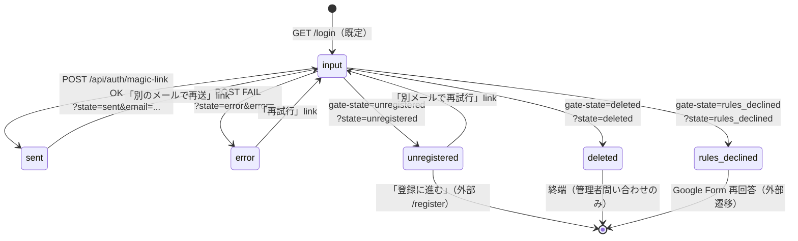
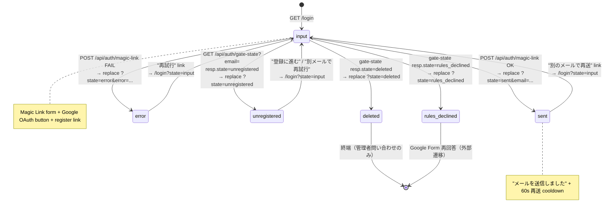

# task-13: login-rebuild — `/login` 5 状態リビルド実装仕様書

> 改訂日: 2026-05-07
> 担当 dir: `06-screens-member`
> 主担当: Frontend
> 工数見積: 1.0 人日
> 依存: task-09（Tailwind v4 / OKLch tokens）, task-10（ui-primitives）
> 後続: task-18（Playwright smoke + verify-design-tokens）

---

## 0. 自己完結コンテキスト

このセクションは task-13 を**単独で読んでも実装に着手できる**ための前提集約。本タスクを並列で着手する Claude Code / 人間が、他タスク仕様書 / outputs / コードを行き来せずに着手判断できることを意図する。

### 0.1 上位ゴール

`/login` 画面を Auth.js デフォルト UI から prototype 準拠の **カード型ログインカード**へリビルドし、URL query 駆動の **5 状態（input / sent / unregistered / deleted / error）+ rules_declined 派生**を OKLch tokens のみで描画する。Magic Link API / Auth.js / gate-state の **API surface は一切変更しない**。最終的に `pnpm verify-design-tokens` の HEX マッチ 0 件と Playwright 5 状態 smoke green を達成する。

### 0.2 DAG 座標

```
[task-09 Tailwind v4 / OKLch] ──┐
                                 ├──▶ [task-13 login-rebuild] ──▶ [task-18 Playwright + verify]
[task-10 ui-primitives]      ───┘
```

- **依存元**: task-09（design tokens ＝ `--ubm-color-*` の正本）, task-10（`<Banner>` `<Card>` `<Button>` `<Input>` 等の ui-primitive 部品）
- **依存先**: task-18（Playwright smoke の 5 状態網羅 / `verify-design-tokens` gate）
- **並列可能**: **task-11, task-12, task-14, task-15, task-16, task-17** と完全並列（API surface も DOM scope も衝突しない）

### 0.3 触れるファイル群（read / write 全列挙）

write（編集 / 新規）:
- `apps/web/app/login/page.tsx`（Server Component / `searchParams` parse）
- `apps/web/app/login/_components/LoginPanel.client.tsx`（rebuild）
- `apps/web/app/login/_components/LoginCard.tsx`（new）
- `apps/web/app/login/_components/LoginStatus.tsx`（new）
- `apps/web/app/login/_components/MagicLinkForm.client.tsx`（minor）
- `apps/web/app/login/_components/GoogleOAuthButton.client.tsx`（minor）
- `apps/web/src/lib/url/login-query.ts`（`LoginGateState` に `"error"` 追加 1 行）
- `apps/web/app/login/_components/__tests__/{LoginPanel,LoginCard}.test.tsx`（new）
- `e2e/login-smoke.spec.ts`（task-18 spec への append）

read（参照のみ・変更禁止）:
- `apps/web/app/api/auth/magic-link/route.ts`
- `apps/web/app/api/auth/[...nextauth]/route.ts`
- `apps/web/app/api/auth/gate-state/route.ts`
- `apps/api/src/routes/auth/`（session-resolve / magic-link 検証）
- `docs/00-getting-started-manual/claude-design-prototype/pages-member.jsx`（login カード layout の正本）
- `docs/30-workflows/ui-prototype-alignment-mvp-recovery/outputs/phase-1..3/`

### 0.4 既存 API（不変・新規追加禁止）

| endpoint | method | 役割 | path |
|----------|--------|------|------|
| `/api/auth/magic-link` | POST | Magic Link 送信トリガ | `apps/web/app/api/auth/magic-link/route.ts` |
| `/api/auth/[...nextauth]` | GET / POST | Auth.js handler（Google OAuth） | `apps/web/app/api/auth/[...nextauth]/route.ts` |
| `/api/auth/gate-state` | GET | email から active/unregistered/deleted/rules_declined を判定 | `apps/web/app/api/auth/gate-state/route.ts` |

`apps/api` 側 `routes/auth/*` は `apps/web` がプロキシ越しに叩く参照先。**シグネチャ変更・新 endpoint 追加は本タスクで禁止**（不変条件、phase-1 §1.2）。

### 0.5 不変条件

1. URL query が gate state の正本（state machine の唯一の真実、SSR で確定する）
2. `/no-access` ルートは復活させない（5 状態 + `rules_declined` で表現する）
3. Auth.js + Magic Link API surface は不変（`apps/web/app/api/auth/*` を変更しない）
4. クライアント mutation は **Server Action 不採用**、`fetch` + `router.replace` パターン継続（Cloudflare Workers / Set-Cookie 制約のため）
5. `apps/web` から D1 への直接アクセス禁止（不変条件 #5）。gate-state は `apps/api` への proxy。
6. HEX 直書き禁止（OKLch tokens 経由のみ。`pnpm verify-design-tokens` で gate）
7. `redirect` クエリは同一オリジン path のみ許可（open redirect 防止）
8. session storage / localStorage に state を保存しない

### 0.6 上流シグネチャ（inline 展開）

#### 0.6.1 `POST /api/auth/magic-link`

```ts
// 入力
interface MagicLinkRequest {
  readonly email: string;       // RFC5322 形式
  readonly redirect: string;    // 同一オリジン path
}
// 出力（200）
interface MagicLinkOk { readonly ok: true }
// 出力（4xx / 5xx）
interface MagicLinkErr { readonly ok: false; readonly error: string }
```

#### 0.6.2 `GET /api/auth/gate-state?email=...`

```ts
// LoginGateState の discriminated union（5 状態 + rules_declined）
type LoginGateState =
  | { state: "input" }                                         // 既定
  | { state: "sent"; email: string }                           // 送信済み表示用
  | { state: "unregistered"; email?: string }                  // 未登録 → /register 誘導
  | { state: "deleted"; email?: string }                       // 削除待ち / 終端
  | { state: "rules_declined"; email?: string; formUrl: string } // Form 再回答
  | { state: "error"; error: string };                         // 送信失敗等
```

#### 0.6.3 `GET /api/auth/[...nextauth]`

Auth.js 標準。`signIn("google", { callbackUrl })` をクライアントから呼ぶ。失敗時は middleware で `/login?state=error&error=...` に rewrite される。

### 0.7 下流シグネチャ（task-18 へ渡す契約）

- `<LoginCard data-component="login-card" data-state={state}>` 属性を必ず付与する。task-18 の Playwright が `getByTestId('login-card').toHaveAttribute('data-state', '<state>')` で 5 状態を assert する。
- `verify-design-tokens` は `apps/web/app/login/**` に対する HEX 正規表現マッチ 0 件を期待する。tokens 経由のみで色を表現すること。
- `e2e/login-smoke.spec.ts` に 5 状態（input / sent / unregistered / deleted / error）の case を append する（rules_declined は任意）。

### 0.8 用語

| 用語 | 定義 |
|------|------|
| gate state | `/login` の URL query `?state=...` で表現される 5+1 状態 |
| Magic Link | Auth.js Email provider 経由のメール送信ログイン方式 |
| rules_declined | 規約再同意未了。Google Form 再回答が更新経路（不変条件 #7）|
| input 状態 | 既定。フォーム + Google OAuth 導線が描画される |
| open redirect | 外部 URL を `redirect` に渡されてフィッシング誘導されるリスク |
| ui-primitive | task-10 で確立する `<Banner>` `<Card>` `<Button>` `<Input>` 等の共通部品 |

### 0.9 画面の概念（状態遷移含む）

`/login` は **URL query `?state=...` を唯一の真実**とする state machine。5 状態 + rules_declined を以下の遷移で動かす（router.replace で query を書き換えるたびに Server Component が再描画され、Client が状態別 layout を render する）。



各状態の描画責務:

| state | レイアウト | 主要部品 | role / aria |
|-------|-----------|---------|-------------|
| input | Card + form | MagicLinkForm + GoogleOAuthButton + register link | form の `<label>`、submit `aria-busy` |
| sent | Card + success Banner | 「メールを送信しました」 + 60s 再送 cooldown + 別メール link | Banner role=`status` |
| unregistered | Card + warning Banner | warn 文言 + `/register` link + 別メール link | Banner role=`status` |
| deleted | Card + danger Banner | 管理者問い合わせ CTA のみ | Banner role=`alert` |
| rules_declined | Card + warning Banner | 規約再同意の Google Form 外部 link | Banner role=`status` |
| error | Card + danger Banner | error 文字列（200 文字 slice 済） + 再試行 link | Banner role=`alert` |

`?gate=admin_required` / `?gate=member_required` は input 状態と組合せ可能で、warn Banner の上乗せとして描画される（既存挙動を継続）。client 側の `MagicLinkForm.client` は submit 時に `POST /api/auth/magic-link` と `GET /api/auth/gate-state?email=...` を `Promise.all` で並列発火し、gate-state が non-active を返したら magic-link 結果を待たず `router.replace` で query を上書きする（既存実装を維持）。

---

## 1. ヘッダー

| 項目 | 値 |
|------|-----|
| Task ID | task-13 |
| Task name | login-rebuild |
| 対象 route | `/login`（App Router、Cloudflare Workers / `@opennextjs/cloudflare` SSR） |
| 5 状態 | `input` / `sent` / `unregistered` / `deleted` / `error`（rules_declined は `unregistered` の派生として扱う） |
| 既存実装 | `apps/web/app/login/page.tsx` + `_components/{LoginPanel.client,MagicLinkForm.client,GoogleOAuthButton.client}.tsx` |
| 不変条件 | URL query が gate state の正本（#8）／ `/no-access` 未使用（#9）／ Auth.js + Magic Link API surface 不変（#10） |
| 仕様根拠 | `docs/00-getting-started-manual/specs/02-auth.md`, `13-mvp-auth.md`, `06-member-auth.md`, `claude-design-prototype/pages-member.jsx` |
| プロトタイプ部品 | shadcn `login-0x` 系ブロック（カード型ログイン）／ OKLch tokens 適用済み Card / Button / Input / Banner |

---

## 2. ゴール / 非ゴール

### 2.1 ゴール（Definition of Done）

| ID | 条件 | 検証 |
|----|------|------|
| G-13-1 | `/login` の 5 状態（input / sent / unregistered / deleted / error）すべてが prototype の login-card レイアウト準拠で描画される | Playwright smoke + 視認 |
| G-13-2 | OKLch tokens（`--ubm-color-primary` / `-success` / `-warning` / `-danger` / `-info`）が全状態で適用、HEX 直書き 0 件 | `pnpm verify-design-tokens` |
| G-13-3 | Auth.js デフォルト画面（`/api/auth/signin` の素 UI）に見えない（ロゴ / カード / 2 OAuth 導線が必ず可視） | 手動 QA |
| G-13-4 | `gate-state` API → `unregistered` / `deleted` の分岐が URL query 駆動で動作 | Vitest（state machine） + Playwright |
| G-13-5 | Magic Link 送信 = 既存 `app/api/auth/magic-link/` route に POST、レスポンス成功で `?state=sent&email=...` に遷移 | Vitest（form submit）|
| G-13-6 | Google OAuth 導線 = 既存 `app/api/auth/[...nextauth]/` の signIn flow を踏み、redirect parameter を尊重 | 既存 GoogleOAuthButton 流用 |
| G-13-7 | a11y critical violation 0（form label, role=alert, focus visible） | jest-axe + Playwright |
| G-13-8 | クライアントコンポーネントは状態 renderer のみ。fetch / mutation は Server Action もしくは既存 `/api/auth/*` への POST に閉じる | コードレビュー |

### 2.2 非ゴール

- 新 API endpoint 追加（`apps/web/app/api/auth/*` 既存 surface を一切変更しない）
- Auth.js config（`auth.ts` / `[...nextauth]/route.ts`）の挙動変更
- パスワードログイン / 2FA / SSO 拡張
- Email provider の差し替え（Resend / SES など）
- `/no-access` route 復活
- session storage / localStorage への state 保存

---

## 3. 変更対象ファイル表

| path | 区分 | 役割 |
|------|------|------|
| `apps/web/app/login/page.tsx` | M（edit） | Server Component。`searchParams` を `parseLoginQuery` で確定し `<LoginPanel>` に委譲（既存構造を維持しつつ `<LoginCard>` wrapper を追加） |
| `apps/web/app/login/_components/LoginPanel.client.tsx` | M（rebuild） | 5 状態ディスパッチャ。状態別 component を内部呼び出し。Banner を ui-primitive の `<Banner>` に置換 |
| `apps/web/app/login/_components/LoginCard.tsx` | C（new） | カード型レイアウト wrapper（Server Component で OK）。ロゴ / タイトル / slot / footer 領域を提供 |
| `apps/web/app/login/_components/LoginStatus.tsx` | C（new） | 5 状態それぞれの本文ブロック（input/sent/unregistered/deleted/error）を切り出した Client/Server hybrid。ボタン部は子コンポーネント slot |
| `apps/web/app/login/_components/MagicLinkForm.client.tsx` | M（minor） | 既存 form 維持。tokens 適用 + `aria-busy` 追加のみ |
| `apps/web/app/login/_components/GoogleOAuthButton.client.tsx` | M（minor） | 既存 button 維持。tokens 適用 + brand mark の SVG inline |
| `apps/web/src/lib/url/login-query.ts` | R（参照） | `LoginGateState = 'input'\|'sent'\|'unregistered'\|'deleted'\|'rules_declined'` を継続利用。**`error` 状態はこの discriminated union に新規追加する**（task-13 で 1 行追加） |
| `apps/web/app/login/_components/__tests__/LoginPanel.test.tsx` | C（new） | Vitest: 5 状態 × 期待要素の存在確認 |
| `apps/web/app/login/_components/__tests__/LoginCard.test.tsx` | C（new） | Vitest: ロゴ / タイトル / slot rendering |
| `e2e/login-smoke.spec.ts` | M | task-18 で追記される 5 状態 smoke ケースの土台。本タスクではローカル smoke のみ |

> 既存 `LoginPanel.client.tsx` は `rules_declined` を含む discriminated union に対する exhaustive switch を行っている。`error` 状態は別 case を 1 つ追加し、5 状態 + rules_declined（派生）= 6 case で網羅する。

---

## 4. 各コンポーネントの Props 型（TypeScript 実例）

### 4.1 `login-query.ts` の状態定義（参照 + 1 行追加）

```ts
// apps/web/src/lib/url/login-query.ts
export type LoginGateState =
  | "input"
  | "sent"
  | "unregistered"
  | "deleted"
  | "rules_declined"
  | "error"; // ← task-13 で追加

export interface LoginQuery {
  readonly state: LoginGateState;
  readonly redirect: string; // 既定 `/profile`
  readonly email?: string;
  readonly error?: string; // human-readable message
  readonly gate?: "admin_required" | "member_required";
}

export function parseLoginQuery(
  raw: Record<string, string | string[] | undefined>,
): LoginQuery;
```

### 4.2 `LoginPage` props

```ts
// apps/web/app/login/page.tsx
interface LoginPageProps {
  readonly searchParams?: Promise<
    Record<string, string | string[] | undefined>
  >;
}
export default async function LoginPage(props: LoginPageProps): Promise<JSX.Element>;
```

### 4.3 `LoginCard`（new / Server Component）

```ts
// apps/web/app/login/_components/LoginCard.tsx
export interface LoginCardProps {
  readonly title: string;             // 例: "UBM 兵庫支部会へログイン"
  readonly subtitle?: string;         // 例: "メンバー専用ページ"
  readonly footerSlot?: React.ReactNode; // "未登録の方は..." 等
  readonly children: React.ReactNode; // 状態別本文
}
export function LoginCard(props: LoginCardProps): JSX.Element;
```

### 4.4 `LoginStatus`（new / Client Component for sent CTA、それ以外は Server）

```ts
// apps/web/app/login/_components/LoginStatus.tsx
import type { LoginGateState } from "../../../src/lib/url/login-query";

export interface LoginStatusProps {
  readonly state: Exclude<LoginGateState, "input">; // input は LoginCard 直配下で render
  readonly redirect: string;
  readonly email?: string;
  readonly error?: string;
}
export function LoginStatus(props: LoginStatusProps): JSX.Element;
```

### 4.5 `LoginPanel`（rebuild / Client Component）

```ts
// apps/web/app/login/_components/LoginPanel.client.tsx
"use client";
import type { LoginGateState } from "../../../src/lib/url/login-query";

export interface LoginPanelProps {
  readonly state: LoginGateState;
  readonly email?: string;
  readonly redirect: string;
  readonly error?: string;
  readonly gate?: "admin_required" | "member_required";
}
export function LoginPanel(props: LoginPanelProps): JSX.Element;
```

### 4.6 `MagicLinkForm.client`（既存）

```ts
export interface MagicLinkFormProps {
  readonly redirect: string;
}
// 内部で fetch("/api/auth/magic-link", { method: "POST", body: { email, redirect } })
// success: router.replace(`/login?state=sent&email=${enc}&redirect=${enc}`)
// failure: router.replace(`/login?state=error&error=${enc}&redirect=${enc}`)
```

### 4.7 `GoogleOAuthButton.client`（既存）

```ts
export interface GoogleOAuthButtonProps {
  readonly redirect: string;
}
// signIn("google", { callbackUrl: redirect }) を Auth.js から呼ぶ
```

### 4.8 共通 `Banner`（ui-primitives 由来 / task-10 産）

```ts
// apps/web/src/components/ui/banner.tsx (task-10)
export interface BannerProps {
  readonly tone: "info" | "success" | "warning" | "danger";
  readonly title?: string;
  readonly children: React.ReactNode;
}
```

`tone` → CSS variable mapping:

| tone | CSS var | role |
|------|---------|------|
| info | `--ubm-color-info` | `status` |
| success | `--ubm-color-success` | `status` |
| warning | `--ubm-color-warning` | `status` |
| danger | `--ubm-color-danger` | `alert` |

---

## 5. 状態遷移図（5 状態 / URL query 駆動）



### 5.1 URL query parameter 一覧

| key | 型 | 必須 | 既定値 | 例 |
|-----|----|------|--------|-----|
| `state` | `LoginGateState` | no | `"input"` | `?state=sent` |
| `redirect` | `string` (path) | no | `"/profile"` | `?redirect=%2Fadmin` |
| `email` | `string` | no（state=sent で表示用に使う） | undefined | `?email=foo%40bar.com` |
| `error` | `string`（human-readable） | no（state=error 時のみ） | undefined | `?error=送信に失敗しました` |
| `gate` | `"admin_required"\|"member_required"` | no | undefined | `?gate=admin_required` |

`parseLoginQuery` は zod schema で validate し、未知の `state` は `"input"` にフォールバック。`redirect` は同一オリジンの path のみ許可（open redirect 防止）。

### 5.2 Server / Client 責務境界

| 役割 | Server (`page.tsx`) | Client (`LoginPanel`) |
|------|---------------------|----------------------|
| URL query parse | ○（`parseLoginQuery`） | ✕ |
| 状態別 layout 選択 | △（top-level の `<LoginCard>` のみ） | ○ |
| Magic Link POST | ✕ | ○（`MagicLinkForm` 内 `fetch`） |
| Google OAuth signIn | ✕ | ○（next-auth `signIn`） |
| `?state` 書き換え | ✕ | ○（`router.replace`） |

---

## 6. データフロー（form submit → API → server state → URL query 更新）

### 6.1 input → sent（Magic Link 送信）

```
[user types email] 
  → [submit form]
  → MagicLinkForm.client: fetch POST /api/auth/magic-link { email, redirect }
  → app/api/auth/magic-link/route.ts: Auth.js Email provider 呼び出し
  → 200 { ok: true }
  → MagicLinkForm.client: router.replace(`/login?state=sent&email=${enc}&redirect=${enc}`)
  → page.tsx 再レンダリング: searchParams.state = "sent"
  → LoginPanel が <LoginStatus state="sent" email=...> を render
```

失敗時（4xx / 5xx）は `?state=error&error=<message>` に置換。

### 6.2 input → unregistered / deleted / rules_declined（gate-state 判定）

```
[Magic Link 送信前 or sent → 戻り] 
  → MagicLinkForm.client: 並行で fetch GET /api/auth/gate-state?email=...
  → 200 { state: "active" | "unregistered" | "deleted" | "rules_declined" }
  → state !== "active" のとき router.replace(`/login?state=${state}`)
```

> 実装上は「submit 時に magic-link POST と gate-state GET を `Promise.all` で並列発火し、gate-state が non-active を返したら magic-link の結果を待たず query を上書きする」設計でも良い。**MagicLinkForm.client の現状実装はこの並列パターンに準拠**（task-13 では維持）。

### 6.3 Google OAuth フロー

```
[click "Google でログイン"]
  → GoogleOAuthButton.client: signIn("google", { callbackUrl: redirect })
  → Auth.js が /api/auth/[...nextauth]/route.ts に飛ばす
  → Google 認可 → callback URL → Auth.js が session 確立
  → callbackUrl にリダイレクト（=`/profile`）
  → 失敗時: /login?error=... に Auth.js が遷移するので state=error にマッピングする URL rewrite を middleware で吸収（既存）
```

### 6.4 Server Action 採用判断

MVP では **fetch + router.replace パターンを継続**（既存 `MagicLinkForm.client` 実装を尊重）。Server Action を導入すると Cloudflare Workers の制約（Set-Cookie / streaming）と衝突するリスクがあるため、本タスクでは見送り。phase-3 §4.13 の「Magic Link 送信は Server Action」は将来推奨であり MVP では非採用。

---

## 7. テスト方針

### 7.1 Vitest（unit / state machine）

ファイル: `apps/web/app/login/_components/__tests__/LoginPanel.test.tsx`

| ケース | input | 期待 |
|--------|-------|------|
| state=input | `{state:"input", redirect:"/profile"}` | h1 表示、MagicLinkForm 表示、GoogleOAuthButton 表示、register link 存在 |
| state=input + gate=admin_required | `{state:"input", gate:"admin_required"}` | warn Banner: "管理者権限が必要" 表示 |
| state=sent | `{state:"sent", email:"a@b"}` | success Banner: "メールを送信しました" 表示、60s 再送案内、別メール link 存在 |
| state=unregistered | `{state:"unregistered"}` | warn Banner、`/register` link 存在 |
| state=deleted | `{state:"deleted"}` | danger Banner（role=alert）、CTA は「管理者へ」のみ |
| state=rules_declined | `{state:"rules_declined"}` | warn Banner、Google Form 外部 link |
| state=error + error="送信失敗" | `{state:"error", error:"送信失敗"}` | danger Banner（role=alert）に "送信失敗" 文字列、再試行 link |
| 未知の state | `{state:"unknown" as any}` | parseLoginQuery で `"input"` にフォールバック確認（別ファイル） |

ファイル: `apps/web/app/login/_components/__tests__/LoginCard.test.tsx`

- ロゴ alt = "UBM 兵庫支部会"
- title prop が h1 に反映
- footerSlot prop が render される
- カードに `data-component="login-card"` が付与される

ファイル: `apps/web/src/lib/url/__tests__/login-query.test.ts`（既存があれば追記）

- error 状態を含む 6 値の parse
- redirect の open redirect 防止（`https://evil.com` は `/profile` にフォールバック）

### 7.2 フォームバリデーション（`MagicLinkForm.test.tsx` 既存追記）

| ケース | input | 期待 |
|--------|-------|------|
| 空 email submit | `""` | aria-invalid=true、submit 抑止、API call 0 |
| 無効 email | `"abc"` | "メールアドレスの形式が正しくありません" 表示、API call 0 |
| 正常 email | `"a@b.com"` | fetch POST /api/auth/magic-link 1 回呼ばれる、router.replace `?state=sent` |
| API 失敗 | mock 500 | router.replace `?state=error` |
| cooldown 中 | 1 度送信後すぐ再送信 | submit button disabled、再送タイマー残時間表示 |

### 7.3 Playwright smoke（`e2e/login-smoke.spec.ts`）

| ケース | URL | 期待 |
|--------|-----|------|
| input | `/login` | h1 "ログイン" 表示、`input[type=email]` 存在、Google button 存在 |
| sent | `/login?state=sent&email=a%40b.com` | "メールを送信しました" 表示 |
| unregistered | `/login?state=unregistered` | warn Banner + register link |
| deleted | `/login?state=deleted` | role=alert + 管理者問い合わせ文言 |
| error | `/login?state=error&error=送信失敗` | role=alert + "送信失敗" 表示 |

各ケースで `expect(page).toHaveScreenshot()` は採用しない（OS 依存差分回避）。代わりに `data-state` 属性 で状態を確認する: `await expect(page.getByTestId('login-card')).toHaveAttribute('data-state', 'sent')`。

### 7.4 a11y（jest-axe）

```ts
import { axe, toHaveNoViolations } from "jest-axe";
expect.extend(toHaveNoViolations);

it("input state has no a11y violations", async () => {
  const { container } = render(<LoginPanel state="input" redirect="/profile" />);
  const results = await axe(container);
  expect(results).toHaveNoViolations();
});
```

5 状態 × axe を回す。critical violation 0 を必須。serious violation は 0 を目標、許容可（理由付きで `expect(serious).toBeLessThanOrEqual(0)` は警告レベルにできる）。

### 7.5 視覚回帰（任意）

prototype（`pages-member.jsx`）と並べたスクリーンショット比較は手動レビューに留める（自動化は本タスク外）。

---

## 8. ローカル実行コマンド

```bash
# Node 24 / pnpm 10 を確実に使う
mise install                                # 初回のみ
mise exec -- pnpm install                   # 依存導入

# ────────────────────────────
# 開発サーバ
mise exec -- pnpm --filter web dev          # http://localhost:3000/login

# ────────────────────────────
# 型チェック / lint
mise exec -- pnpm typecheck
mise exec -- pnpm lint

# ────────────────────────────
# 単体テスト（vitest）
mise exec -- pnpm --filter web test -- login
mise exec -- pnpm --filter web test -- LoginPanel
mise exec -- pnpm --filter web test -- LoginCard
mise exec -- pnpm --filter web test -- MagicLinkForm
mise exec -- pnpm --filter web test -- login-query

# ────────────────────────────
# Playwright smoke（task-18 整備後の経路）
mise exec -- pnpm --filter web test:e2e -- login-smoke

# ────────────────────────────
# tokens 検証
mise exec -- pnpm --filter web verify-design-tokens

# ────────────────────────────
# 5 状態の手動 smoke URL（dev サーバ立ち上げ後）
#   /login
#   /login?state=sent&email=foo%40example.com
#   /login?state=unregistered
#   /login?state=deleted
#   /login?state=error&error=%E9%80%81%E4%BF%A1%E5%A4%B1%E6%95%97
#   /login?state=rules_declined
#   /login?gate=admin_required
```

---

## 9. DoD（Definition of Done）

| # | 項目 | 検証 |
|---|------|------|
| D-1 | `/login` の 5 状態（+ rules_declined）が prototype の login-card レイアウトで表示される（カード型・ロゴ・OAuth 2 導線） | 手動 + Playwright |
| D-2 | OKLch tokens が全状態で適用、`grep -E '#[0-9a-fA-F]{3,6}' apps/web/app/login` の HEX マッチ 0 件 | `verify-design-tokens` |
| D-3 | Auth.js デフォルトの `/api/auth/signin` 素 UI に見えない（Container / Card / Logo / Heading が必ず描画される） | 視認 |
| D-4 | URL query 駆動の state machine が exhaustive（switch 文が `never` で型検査通過） | tsc |
| D-5 | Magic Link / Google OAuth の API surface 不変（`apps/web/app/api/auth/*` を変更していない） | git diff 確認 |
| D-6 | Vitest: 状態遷移 / バリデーションケースすべて green | `pnpm test` |
| D-7 | Playwright: 5 状態 smoke すべて pass | `pnpm test:e2e` |
| D-8 | jest-axe: 5 状態すべてで critical violation 0 | `pnpm test` |
| D-9 | `apps/web/src/lib/url/login-query.ts` の `LoginGateState` に `"error"` が含まれる | tsc |
| D-10 | redirect が同一オリジン path 検証されており open redirect 不可 | login-query.test.ts |
| D-11 | `data-state` 属性が `<LoginCard>` に付与され Playwright で参照可能 | smoke |
| D-12 | a11y: form の `<label>` 関連付け、`role="alert"` が danger Banner にのみ付与、focus visible | axe |
| D-13 | dev / staging で 5 状態を手動巡回し、Sentry にエラーが残っていない | 手動 |

---

## 10. 実装順序（推奨）

1. `LoginGateState` に `"error"` を追加し、`parseLoginQuery` の zod schema を拡張（テスト追加）
2. `LoginCard.tsx`（Server Component）を新規作成、Storybook 不要だが視認 dev URL で確認
3. `LoginStatus.tsx` を新規作成し sent / unregistered / deleted / error / rules_declined の 5 案件を切り出す
4. `LoginPanel.client.tsx` を rebuild し、case 文を `<LoginStatus>` 呼び出しに整理。`input` だけは MagicLinkForm + GoogleOAuthButton を直接配置
5. `MagicLinkForm.client.tsx` の Banner 部分を ui-primitive `<Banner>` に置換、tokens 適用
6. `GoogleOAuthButton.client.tsx` の Google ロゴ SVG を inline 化、tokens 適用
7. `page.tsx` で `<LoginCard>` wrapper を `<main>` 直下に配置
8. Vitest を 5 状態 + バリデーション分書き、CI green を確認
9. jest-axe を全状態に適用
10. Playwright smoke ケースを 5 件追加（task-18 配下のファイルに追記してもよい）
11. dev サーバで全 URL を手動巡回し、視覚的に prototype と並べて差分を潰す

---

## 11. リスクと緩和策

| リスク | 影響 | 緩和 |
|--------|------|------|
| `LoginGateState` 拡張で既存呼び出し側の exhaustive 違反 | tsc fail | task-13 内で `error` case を全 switch に追加 |
| `state=error` が `error` クエリと衝突 | XSS の error 文字列描画 | `error` は `String(error).slice(0, 200)` でサニタイズ + DOMText 経由のみ render |
| Magic Link 送信後に `?state=sent` で reload するとメール再送される誤解 | UX 混乱 | `state=sent` 時は form を非表示、再送は明示 link 経由のみ |
| Google OAuth 失敗時の Auth.js デフォルト error page にフォールバックされる | 5 状態の整合崩壊 | `/api/auth/error` を middleware で `/login?state=error&error=...` に rewrite（既存 middleware で対応済みか task 中に確認） |
| OKLch サポートしない古いブラウザでカラー崩れ | 視認性 | task-08 の sRGB fallback を継承（本タスクで追加実装は不要） |

---

## 12. 既存 API surface（参照のみ・変更なし）

| endpoint | method | 目的 | 既存 path |
|----------|--------|------|----------|
| `/api/auth/magic-link` | POST | Magic Link メール送信 | `apps/web/app/api/auth/magic-link/route.ts` |
| `/api/auth/[...nextauth]` | GET/POST | Auth.js handler（Google OAuth） | `apps/web/app/api/auth/[...nextauth]/route.ts` |
| `/api/auth/gate-state` | GET | email から active/unregistered/deleted/rules_declined を判定 | `apps/web/app/api/auth/gate-state/route.ts` |

API Worker (`apps/api`) との関係:
- `/api/auth/gate-state` は `apps/web` 側で D1 ではなく **`apps/api/src/routes/auth/session-resolve.ts` を fetch** して結果を返す proxy 設計（`apps/web` から D1 直接アクセス禁止: 不変条件 #5）。本タスクではこの proxy 動作を変えない。

---

## 13. 参照ドキュメント

| ファイル | 用途 |
|---------|------|
| `docs/00-getting-started-manual/specs/02-auth.md` | 認証設計 / 5 状態正本 |
| `docs/00-getting-started-manual/specs/13-mvp-auth.md` | MVP 認証方針 |
| `docs/00-getting-started-manual/specs/06-member-auth.md` | 会員 auth gate state 仕様 |
| `docs/00-getting-started-manual/claude-design-prototype/pages-member.jsx` | login カードレイアウト・5 状態 mock |
| `docs/30-workflows/ui-prototype-alignment-mvp-recovery/outputs/phase-1/phase-1.md` | スコープ / API マッピング |
| `docs/30-workflows/ui-prototype-alignment-mvp-recovery/outputs/phase-3/phase-3.md` §4.13 | task-13 差分 hint |

---

## 14. 受け入れチェックリスト（最終）

- [ ] `LoginGateState` に `"error"` を含む 6 値が定義されている
- [ ] `LoginCard.tsx` / `LoginStatus.tsx` が新規作成されている
- [ ] `LoginPanel.client.tsx` が ui-primitive `<Banner>` を使用している
- [ ] HEX 直書き 0 件（`pnpm verify-design-tokens` pass）
- [ ] 5 状態すべてで Vitest テストが green
- [ ] jest-axe で critical 0
- [ ] Playwright smoke 5 ケース pass
- [ ] dev URL を 5 状態 + gate=admin_required で巡回し prototype と整合確認
- [ ] `apps/web/app/api/auth/*` 配下を一切変更していない（git diff 0）
- [ ] PR 説明に prototype と並べたスクリーンショットを添付（`outputs/phase-11/` に保存される場合は phase-13 の PR 本文で参照）

---

## 15. 補足: prototype 部品との対応表

| prototype block (`pages-member.jsx`) | 本タスクの component | 備考 |
|-------------------------------------|---------------------|------|
| `<LoginCard>`（カード型レイアウト） | `LoginCard.tsx`（new） | shadcn `login-0x` 系をベースに OKLch トークン適用 |
| `<LoginInput>`（input 状態） | `LoginPanel.client.tsx` の `case "input"` | MagicLinkForm + GoogleOAuthButton + register link |
| `<LoginSent>`（sent 状態） | `LoginStatus.tsx` 内 sent block | 60s 再送案内 + 別メール link |
| `<LoginUnregistered>`（unregistered 状態） | 同上 unregistered block | warn Banner + register link |
| `<LoginDeleted>`（deleted 状態） | 同上 deleted block | danger Banner + 管理者問い合わせ |
| `<LoginError>`（error 状態） | 同上 error block（new） | danger Banner + 再試行 link |
| `<LoginBrandLogo>` | `LoginCard.tsx` 内 inline SVG | UBM 兵庫支部会のロゴマーク |

prototype に存在しないが必要なもの:
- gate=admin_required の warn Banner（既存 LoginPanel に実装済み・継続）
- rules_declined（utils-driven、Google Form 再回答 link）

---

## 16. 補足: 想定 dev URL での視覚レビュー手順

1. `mise exec -- pnpm --filter web dev` で起動
2. 以下の URL を順番に開く

```
http://localhost:3000/login
http://localhost:3000/login?state=sent&email=user%40example.com
http://localhost:3000/login?state=unregistered
http://localhost:3000/login?state=deleted
http://localhost:3000/login?state=error&error=Magic%20Link%20%E9%80%81%E4%BF%A1%E3%81%AB%E5%A4%B1%E6%95%97%E3%81%97%E3%81%BE%E3%81%97%E3%81%9F
http://localhost:3000/login?state=rules_declined
http://localhost:3000/login?gate=admin_required
http://localhost:3000/login?gate=member_required&error=%E3%83%AD%E3%82%B0%E3%82%A4%E3%83%B3%E3%81%8C%E5%BF%85%E8%A6%81%E3%81%A7%E3%81%99
```

3. 各 URL で以下を確認
   - カード型レイアウトが prototype と整合
   - Banner の色味が tokens 由来（`--ubm-color-success/-warning/-danger/-info`）
   - フォーカス可視（Tab キーで input → button 順に移動）
   - reload しても URL query が保持される
4. DevTools の Inspector で computed style を確認し、`oklch(...)` 形式で色が解決されている

---

## 17. CI / lint 連動

| gate | ファイル | 役割 |
|------|---------|------|
| typecheck | tsconfig | `LoginGateState` exhaustive switch の検証 |
| lint | `.eslintrc.cjs` | `react/jsx-no-target-blank` で `<a target="_blank">` の `rel="noopener noreferrer"` 必須 |
| verify-design-tokens | `apps/web/scripts/verify-design-tokens.ts` (task-18) | `apps/web/app/login/**` の HEX マッチを 0 件に保つ |
| Playwright | task-18 で 5 状態 smoke を網羅 | 本タスクは 5 ケース分の spec を `e2e/login-smoke.spec.ts` に append |

