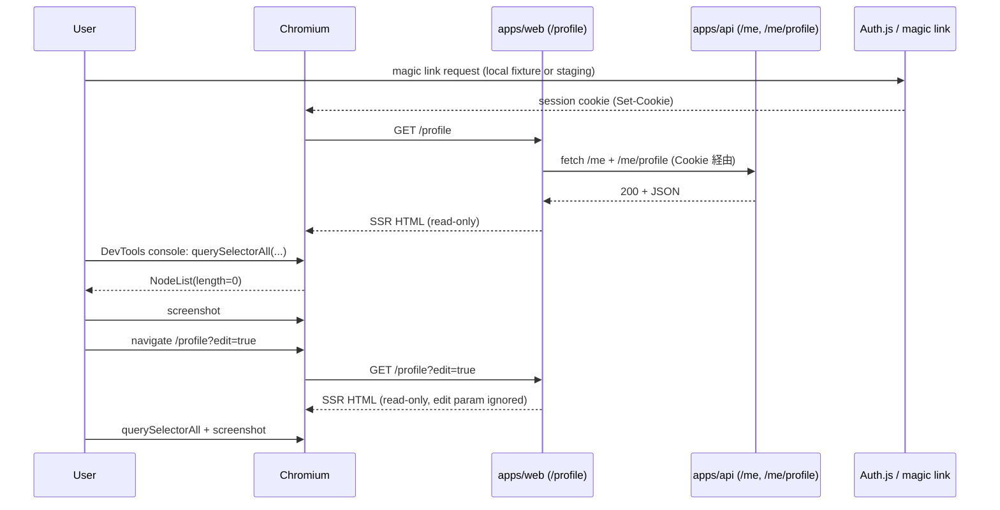

# Phase 2: 設計

## メタ情報

| 項目 | 値 |
| --- | --- |
| Phase 番号 | 2 / 13 |
| Phase 名称 | 設計 |
| 作成日 | 2026-04-30 |
| 前 Phase | 1 (要件定義) |
| 次 Phase | 3 (設計レビュー) |
| 状態 | pending |

## 目的

session 確立フロー、screenshot 取得チェーン、DevTools snippet、evidence 命名規約を確定し、Phase 5 runbook 化に渡す。

## session 確立フロー（Mermaid）

`outputs/phase-02/session-flow.mmd` に下記を記述:



## evidence 命名規約

`outputs/phase-02/evidence-naming.md` に明文化:

| ID | 環境 | ファイル | 観測対象 |
| --- | --- | --- | --- |
| M-08 | local | M-08-profile.png | logged-in `/profile` 表示 |
| M-09 | local | M-09-no-form.png | DOM に form/input/textarea/submit 0 件 |
| M-09 | local | M-09-no-form.devtools.txt | DevTools console 出力 |
| M-10 | local | M-10-edit-query-ignored.png | `/profile?edit=true` でも read-only |
| M-10 | local | M-10-edit-query-ignored.devtools.txt | DevTools 出力 |
| M-14 | staging | M-14-staging-profile.png | staging logged-in 表示 |
| M-15 | staging | M-15-edit-cta.png | Google Form 編集導線 |
| M-16 | staging | M-16-localstorage-ignored.png | localStorage 改変が本文編集に反映されない |
| M-16 | staging | M-16-localstorage-ignored.devtools.txt | sanitized localStorage / DOM 観測出力 |
| diff | — | manual-smoke-evidence-update.diff | 6 行 `pending` → `captured` 更新 |

命名規則: `M-{番号}-{観測対象}[.devtools.txt]`、staging 版は接頭辞 `M-{番号}-staging-...`、すべて `outputs/phase-11/evidence/screenshot/` 配下。

## DevTools snippet 設計（Phase 5 runbook で詳細化）

```js
// snippet-no-form.js
const sel = 'form, input, textarea, button[type=submit]';
const list = document.querySelectorAll(sel);
console.log(JSON.stringify({
  url: location.pathname + location.search,
  selector: sel,
  count: list.length,
  outerHTML_first: list[0]?.outerHTML ?? null,
  timestamp: new Date().toISOString()
}, null, 2));
```

出力をクリップボードコピーし、`*.devtools.txt` に保存。`url` は host / protocol を含めず、path + query のみを記録する。

## 環境分担

| 環境 | URL | 取得 evidence | session 経路 |
| --- | --- | --- | --- |
| local | http://localhost:3000 | M-08, M-09, M-10 | local fixture（magic link mock） |
| staging | Cloudflare staging URL | M-14, M-15, M-16 | staging magic link 実発行 |

## 不変条件 → 観測項目マッピング

| 不変条件 | 観測項目 | evidence |
| --- | --- | --- |
| #4 | session 必須でのみ logged-in 表示 | M-08, M-14（logged-in screenshot） |
| #5 | member 層境界（admin / public 不混入） | M-08, M-14（member session / admin UI 不在 / public UI 不在を observation note に記録） |
| #8 | read-only（form 0 件 / 本文編集不可） | M-09 + devtools、M-16 localStorage ignored |
| #11 | `?edit=true` 無視 / 本文直接編集経路なし | M-10 + devtools、M-15 edit CTA |

## 実行タスク

- [ ] `outputs/phase-02/main.md` に設計サマリ記述
- [ ] `session-flow.mmd` 配置
- [ ] `evidence-naming.md` 配置
- [ ] DevTools snippet を Phase 5 runbook 入力としてドラフト
- [ ] 環境分担と URL を確定（staging URL は Phase 10 GO 判定時点で再確認）

## Schema / 共有コード Ownership 宣言

本タスクは visual evidence 取得のみで、共有 schema や `_shared/` 編集は **行わない**。コード変更は `manual-smoke-evidence.md` の status 文字列更新のみ（同 file の owner は親 06b workflow）。

## 参照資料

| 種別 | パス | 用途 |
| --- | --- | --- |
| 必須 | docs/00-getting-started-manual/specs/13-mvp-auth.md | session 仕様 |
| 必須 | docs/30-workflows/completed-tasks/06b-parallel-member-login-and-profile-pages/ | 親 workflow（manual-smoke-evidence.md 所在） |

## 実行手順

### ステップ 1: session 確立フロー Mermaid 化
- local fixture / staging 双方の確立手順を 1 図に統合
### ステップ 2: 命名規約と env 分担表確定
- 10 evidence files（6 screenshots + 3 DevTools txt + 1 diff）と Phase 11 補助 metadata を漏れなく列挙
### ステップ 3: DevTools snippet ドラフト
- Phase 5 への入力として placeholder を作成

## 統合テスト連携

| 連携先 Phase | 連携内容 |
| --- | --- |
| Phase 3 | alternative 案の評価対象 |
| Phase 4 | evidence チェックリスト |
| Phase 5 | runbook + snippet 詳細化 |

## サブタスク管理

| # | サブタスク | 担当 Phase | 状態 |
| --- | --- | --- | --- |
| 1 | session-flow.mmd | 2 | pending |
| 2 | evidence-naming.md | 2 | pending |
| 3 | DevTools snippet draft | 2 | pending |
| 4 | env 分担確定 | 2 | pending |

## 成果物

| 種別 | パス | 説明 |
| --- | --- | --- |
| ドキュメント | outputs/phase-02/main.md | Phase 2 主成果物 |
| 設計図 | outputs/phase-02/session-flow.mmd | Mermaid sequence |
| 命名 | outputs/phase-02/evidence-naming.md | 12 file 命名規約 |

## 完了条件

- [ ] session 確立フロー mermaid 化
- [ ] 命名規約と env 分担確定
- [ ] DevTools snippet draft 完成

## タスク100%実行確認【必須】

- [ ] 全実行タスク completed
- [ ] 異常系（local fixture 不在 / staging 未デプロイ）も網羅
- [ ] 次 Phase 引き継ぎ事項記述
- [ ] artifacts.json の phase 2 を completed

## 次 Phase

- 次: Phase 3 (設計レビュー)
- 引き継ぎ: 設計 3 案候補（local fixture only / staging only / 両方）
