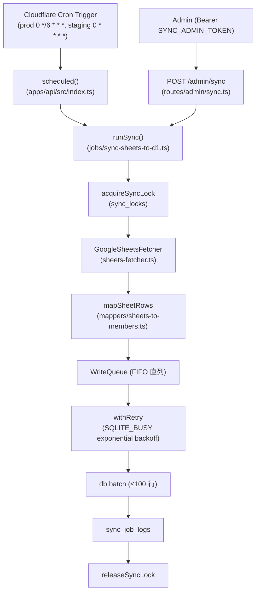

# Phase 2 成果物 — 同期ジョブ設計

## 1. 構造図

## 2. モジュール設計

| # | モジュール | パス | 入力 | 出力 / 副作用 |
| --- | --- | --- | --- | --- |
| 1 | Job entry | `apps/api/src/jobs/sync-sheets-to-d1.ts` | `SyncEnv`, `SyncOptions` | `SyncResult` + `sync_job_logs` 行 |
| 2 | Scheduled binding | `apps/api/src/index.ts` | `ScheduledController` | `ctx.waitUntil(runSync(...))` |
| 3 | Admin route | `apps/api/src/routes/admin/sync.ts` | Bearer token + body | `runSync(env, { trigger: 'admin' })` |
| 4 | Retry util | `apps/api/src/utils/with-retry.ts` | `fn`, `RetryOptions` | retried `RetryResult<T>` |
| 5 | Write queue | `apps/api/src/utils/write-queue.ts` | task closure | FIFO chain で逐次実行 |
| 6 | Sheets fetcher | `apps/api/src/jobs/sheets-fetcher.ts` | `SheetsFetcherOptions` | `SheetsValueRange`, JWT は WebCrypto で署名 |
| 7 | Mapper | `apps/api/src/jobs/mappers/sheets-to-members.ts` | `string[][]` | `MemberRow[]` + skip 一覧 |
| 8 | Lock manager | `apps/api/src/jobs/sync-lock.ts` | `D1Database`, `AcquireOptions` | TTL 付き `SyncLock`、expired 強制 release |

## 3. 環境変数 / Secret マトリクス

| Secret / Variable | 種別 | dev (staging) | production | 注入経路 |
| --- | --- | --- | --- | --- |
| `GOOGLE_SHEETS_SA_JSON` | Secret | required | required | `wrangler secret put` |
| `SHEETS_SPREADSHEET_ID` | Variable | dev sheet id | prod sheet id | `wrangler.toml [vars]` |
| `SYNC_ADMIN_TOKEN` | Secret | required | required | `wrangler secret put` |
| `SYNC_BATCH_SIZE` | Variable | 100 | 100 | `wrangler.toml [vars]` |
| `SYNC_MAX_RETRIES` | Variable | 5 | 5 | `wrangler.toml [vars]` |
| `SYNC_RANGE` | Variable | `Form Responses 1!A1:ZZ10000` | 同左 | `wrangler.toml [vars]` |
| Cron schedule | Config | `0 * * * *` | `0 */6 * * *` | `[triggers]` / `[env.staging.triggers]` |

## 4. State ownership

| State | Owner | 書き込み元 | 読み込み元 |
| --- | --- | --- | --- |
| `sync_locks` | jobs/sync-lock.ts | runSync | runSync (acquire/release) |
| `sync_job_logs` | jobs/sync-sheets-to-d1.ts | runSync | 運用観測（Phase 9/11） |
| `member_responses` | jobs/sync-sheets-to-d1.ts (sync) / `apps/api` のみ書き込み | upsertMembers | API 読み取り経路 |
| pageToken cursor | （未使用）Sheets API は cursor を返さないため、A1 range 分割で代替 | - | - |

## 5. 既存コンポーネント再利用判断

| 候補 | 判断 | 備考 |
| --- | --- | --- |
| `packages/integrations/google` の forms-client | 参照しない | Sheets API 用に `apps/api/src/jobs/sheets-fetcher.ts` を新設（forms-client は Forms API 用） |
| Hono `/admin/*` middleware | 個別実装 | 本タスクで Bearer 認証ミドルウェアを route 内に配置（UT-21 で middleware に昇格を検討） |
| D1 binding `c.env.DB` | 再利用 | 既存 wrangler.toml の binding をそのまま利用 |
