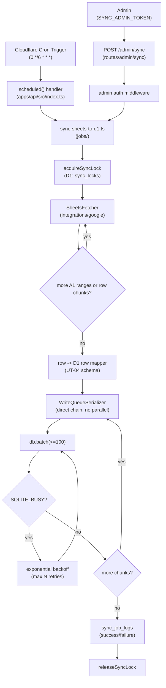

# Phase 2: 設計

## メタ情報

| 項目 | 値 |
| --- | --- |
| タスク名 | Sheets→D1 同期ジョブ実装 (UT-09) |
| Phase 番号 | 2 / 13 |
| Phase 名称 | 設計 |
| 作成日 | 2026-04-27 |
| 前 Phase | 1 (要件定義) |
| 次 Phase | 3 (設計レビュー) |
| 状態 | spec_created |
| タスク分類 | specification-design |

## 目的

Phase 1 で確定した「WAL 非前提・冪等パイプラインを `apps/api` 内に閉じて構築する」要件を、モジュール構造 / Mermaid 構造図 / env マトリクス / 既存コンポーネント再利用可否 / state ownership に分解し、Phase 3 のレビューが代替案比較で結論を出せる粒度の設計入力を作成する。

## 実行タスク

1. Cron Trigger → Sheets fetch → D1 upsert のフローを Mermaid 構造図で固定する（完了条件: scheduled handler / `/admin/sync` route 双方が同一 core 関数を呼び出す形が図示されている）。
2. dev / main 環境別の Cron スケジュールと Secret マトリクスを表化する（完了条件: 3 Secret × 2 環境すべてに登録経路が記述されている）。
3. モジュール設計（5 モジュール: job entry / route handler / retry-backoff util / queue serializer / Sheets fetcher / D1 upsert mapper）を擬似 export 仕様で記述する（完了条件: 各モジュールに input / output / 副作用が記載）。
4. 既存コンポーネント再利用可否を確認する（完了条件: UT-03 認証 client、Hono `/admin/*` middleware、D1 client wrapper、Logger の 4 候補に reuse / new の判断が付与されている）。
5. state ownership 表を作成する（完了条件: sync_locks / sync_job_logs / members / pageToken cursor のオーナーが Phase 5 実装時に一意に決まる）。
6. 成果物 `outputs/phase-02/sync-job-design.md` と `outputs/phase-02/d1-contention-mitigation.md` を分離して作成する（完了条件: 2 ファイル分離が artifacts.json と一致）。

## 参照資料

| 種別 | パス | 用途 |
| --- | --- | --- |
| 必須 | docs/30-workflows/ut-09-sheets-to-d1-cron-sync-job/phase-01.md | 真の論点・4条件・命名規則チェックリスト |
| 必須 | docs/30-workflows/completed-tasks/ut-02-d1-wal-mode/outputs/ | retry/backoff・queue serialization・batch sizing の起源 |
| 必須 | .claude/skills/aiworkflow-requirements/references/deployment-cloudflare.md | wrangler.toml の `[triggers]` / env split 方針 |
| 必須 | .claude/skills/aiworkflow-requirements/references/database-schema.md | upsert 対象テーブルの確認 |
| 必須 | .claude/skills/aiworkflow-requirements/references/api-endpoints.md | `/admin/sync` の認可境界・命名 |
| 参考 | https://developers.cloudflare.com/workers/runtime-apis/scheduled-event/ | scheduled handler の signature |

## 構造図 (Mermaid)

## 環境変数 / Secret マトリクス

| Secret / Variable | 種別 | dev 環境 | main 環境 | 注入経路 | 1Password Vault |
| --- | --- | --- | --- | --- | --- |
| `GOOGLE_SHEETS_SA_JSON` | Secret | required | required | Cloudflare Secret (`wrangler secret put`) | UBM-Hyogo / dev / main |
| `SHEETS_SPREADSHEET_ID` | Variable | dev sheet id | prod sheet id | `wrangler.toml` `[vars]` または Secret | UBM-Hyogo / dev / main |
| `SYNC_ADMIN_TOKEN` | Secret | required | required | Cloudflare Secret | UBM-Hyogo / dev / main |
| Cron schedule | Config | `0 */1 * * *`（dev: 1h） | `0 */6 * * *`（main: 6h） | `wrangler.toml` `[triggers]` env-scoped | - |
| `SYNC_BATCH_SIZE` | Variable | 100 | 100 | `wrangler.toml` `[vars]` | - |
| `SYNC_MAX_RETRIES` | Variable | 5 | 5 | `wrangler.toml` `[vars]` | - |

## モジュール設計

| # | モジュール | パス（提案） | 入力 | 出力 / 副作用 | 備考 |
| --- | --- | --- | --- | --- | --- |
| 1 | Job entry (core) | `apps/api/src/jobs/sync-sheets-to-d1.ts` | `Env`、`trigger: 'cron' \| 'admin'` | `SyncResult { fetched, upserted, failed, durationMs }`、sync_job_logs に書き込み | scheduled / route 双方から呼ばれる pure-ish entry |
| 2 | Scheduled binding | `apps/api/src/index.ts`（既存ファイル拡張） | `ScheduledController` | core 呼び出し、ctx.waitUntil() で結果ログ | 既存 fetch handler は変更しない |
| 3 | Admin route | `apps/api/src/routes/admin/sync/index.ts` | `Hono.Request`（Bearer `SYNC_ADMIN_TOKEN`） | `POST /admin/sync` で core を呼ぶ | UT-21 の audit hook も同 file 内に配置可（要 Phase 3 議論） |
| 4 | Retry-backoff util | `apps/api/src/utils/with-retry.ts` | `fn`、`{ maxRetries, baseMs, isRetryable }` | retried result | `SQLITE_BUSY` 検出は err.message を判定 |
| 5 | Write queue serializer | `apps/api/src/utils/write-queue.ts` | `tasks: Array<() => Promise<T>>` | 順次直列実行（並列 0） | mutex 不要、Promise chain のみ |
| 6 | Sheets fetcher | `packages/integrations/google` 既存 + `apps/api/src/integrations/sheets-fetcher.ts` | spreadsheetId、A1 range list、chunk size | `{ rows }`（`ValueRange.values` 正規化後） | UT-03 の auth client を再利用。`nextPageToken` は使わない |
| 7 | Mapper | `apps/api/src/jobs/mappers/sheets-to-members.ts` | sheets row | `MemberRow`（D1 schema） | UT-04 schema に依存。Sheets schema は固定しない（不変条件 #1） |
| 8 | Lock manager | `apps/api/src/jobs/sync-lock.ts` | `Env` | `acquire()` / `release()`、sync_locks テーブル更新 | TTL 付き lock。expired lock は強制 release |

## 既存コンポーネント再利用可否

| 候補 | 場所 | 判断 | 理由 |
| --- | --- | --- | --- |
| Sheets API auth client | `packages/integrations/google`（UT-03 成果） | reuse | UT-03 で確定済み。本タスクで再実装しない |
| `/admin/*` Hono middleware | `apps/api/src/middlewares/admin-auth.ts`（既存想定） | reuse if exists / new if not | 既存があれば再利用、無ければ Phase 5 で新設し UT-21 と共有 |
| D1 client wrapper | `apps/api/src/db/`（既存想定） | reuse | binding 取得を既存 helper に揃える |
| Logger | `apps/api/src/lib/logger.ts`（あれば） | reuse | structured log 規約を踏襲 |
| Retry util | なし | new | `with-retry.ts` を本タスクで新設し UT-10 で formalize |
| Write queue serializer | なし | new | `write-queue.ts` を新設 |

## state ownership 表

| state | 物理位置 | owner module | writer | reader | TTL / lifecycle |
| --- | --- | --- | --- | --- | --- |
| `sync_locks` row | D1 | `sync-lock.ts` | core (acquire/release) | core (check) | TTL 30min。expired は強制解除 |
| `sync_job_logs` row | D1 | `sync-sheets-to-d1.ts` | core | UT-08 monitoring / UT-21 audit | 永続。古いログは別タスクで pruning |
| `members` row | D1 | `mappers/sheets-to-members.ts` 経由 upsert | core | apps/api 全 route | upsert（unique key on sheets row id） |
| `pageToken cursor` | in-memory（呼び出しごと） | Sheets fetcher | core | core | 1 sync 内で完結。永続化しない |
| Cron schedule | `wrangler.toml` | infra | wrangler deploy | runtime | 環境別 |

## 実行手順

### ステップ 1: Phase 1 入力の取り込み

- 真の論点・4条件・命名規則チェックリストを確認する。
- 既存命名規則チェックリスト 5 観点を repo の実態に対し走査する（`apps/api/src/routes/`、`apps/api/src/jobs/`、`apps/api/src/utils/`、`wrangler.toml`、`apps/api/src/lib/logger.ts`）。

### ステップ 2: 構造図とモジュール分解

- Mermaid 構造図を `outputs/phase-02/sync-job-design.md` に固定する。
- 8 モジュールの input / output / 副作用を擬似 TypeScript signature で記述する。

### ステップ 3: D1 競合対策の独立成果物化

- `outputs/phase-02/d1-contention-mitigation.md` に以下を記述する。
  - retry-backoff の擬似コード（`baseMs * 2^attempt + jitter`、最大 N 回）
  - write queue serializer の擬似コード（並列度 1、Promise chain）
  - batch sizing 方針（`SYNC_BATCH_SIZE = 100`、超過時はチャンク分割）
  - 短い transaction 方針（1 batch ≤ 100 件、cross-batch transaction を作らない）
  - staging load/contention test の実施手順（Phase 11 で実行する placeholder）

### ステップ 4: 環境マトリクスと state ownership 確定

- env マトリクスと state ownership 表を Phase 5 実装が一意に決まる粒度で記述する。

## 統合テスト連携

| 連携先 Phase | 連携内容 |
| --- | --- |
| Phase 3 | 設計の代替案比較・PASS/MINOR/MAJOR 判定の入力 |
| Phase 4 | モジュール 8 件のテスト計画ベースライン |
| Phase 5 | 実装ランブックの擬似コード起点 |
| Phase 6 | 異常系（lock expired / SQLITE_BUSY / pageToken 切断）の網羅対象 |
| Phase 11 | staging load/contention test の手順 placeholder |

## 多角的チェック観点

- 不変条件 #1: Sheets schema を mapper 層に閉じ、core / route / util に漏らしていない。
- 不変条件 #4: admin-managed data 専用テーブル（members 等）に upsert し、Form schema 由来データと混在しない。
- 不変条件 #5: D1 binding は `apps/api` 内のみ。設計に `apps/web` からの参照が登場していない。
- 認可境界: scheduled handler は env binding でのみ起動、`/admin/sync` は `SYNC_ADMIN_TOKEN` の Bearer 認証必須。
- 無料枠: dev 1h / main 6h Cron で月 < 1k invocation、D1 write 月 < 50k、Sheets API < 300 req/min/project の範囲内。
- Secret hygiene: 設計上 SA JSON は Workers env 経由のみ、ログにも出力しない（`logger.redact` 規約）。

## サブタスク管理

| # | サブタスク | 担当 Phase | 状態 | 備考 |
| --- | --- | --- | --- | --- |
| 1 | Mermaid 構造図 | 2 | spec_created | sync-job-design.md |
| 2 | env / Secret マトリクス | 2 | spec_created | 3 Secret × 2 環境 |
| 3 | モジュール設計 8 件 | 2 | spec_created | I/O・副作用記述 |
| 4 | 既存コンポーネント再利用可否 | 2 | spec_created | reuse / new 判断 |
| 5 | state ownership 表 | 2 | spec_created | 4 state |
| 6 | D1 競合対策ファイル分離 | 2 | spec_created | d1-contention-mitigation.md |

## 成果物

| 種別 | パス | 説明 |
| --- | --- | --- |
| 設計 | outputs/phase-02/sync-job-design.md | 全体構成・Mermaid・モジュール設計・state ownership |
| 設計 | outputs/phase-02/d1-contention-mitigation.md | retry/backoff・queue serialization・batch sizing・staging test 手順 |
| メタ | artifacts.json | Phase 2 状態の更新 |

## 完了条件

- [ ] Mermaid 構造図に scheduled / `/admin/sync` 双方が同一 core を呼び出す形が表現されている
- [ ] env / Secret マトリクスに 3 Secret × 2 環境すべての注入経路が記述されている
- [ ] 8 モジュールすべてに input / output / 副作用が記述されている
- [ ] 既存コンポーネント再利用可否で 4 候補以上に reuse / new の判断がある
- [ ] state ownership 表に 4 state（sync_locks / sync_job_logs / members / pageToken）が含まれる
- [ ] 成果物が 2 ファイル（sync-job-design.md / d1-contention-mitigation.md）に分離されている

## タスク100%実行確認【必須】

- 全実行タスク（6 件）が `spec_created`
- 全成果物が `outputs/phase-02/` 配下に配置済み
- 異常系（lock expired / SQLITE_BUSY / pageToken 切断 / SA JSON parse 失敗）の対応モジュールが設計に含まれる
- artifacts.json の `phases[1].status` が `spec_created`
- artifacts.json の `phases[1].outputs` に 2 ファイルが列挙されている

## 次 Phase への引き渡し

- 次 Phase: 3 (設計レビュー)
- 引き継ぎ事項:
  - sync-job-design.md / d1-contention-mitigation.md を代替案比較の base case として渡す
  - state ownership 表を代替案ごとに再評価
  - env マトリクスは代替案で変更されないことを Phase 3 の制約として固定
- ブロック条件:
  - Mermaid 図に scheduled / route / core / lock / queue / batch / log のいずれかが欠落
  - 既存命名規則チェック未走査
  - state ownership に重複 owner が残っている
