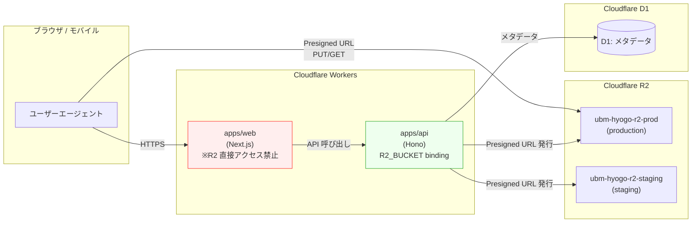

# Phase 2 成果物: R2 アーキテクチャ設計 (r2-architecture-design.md)

## メタ情報

| 項目 | 値 |
| --- | --- |
| タスク | UT-12 |
| Phase | 2 / 13 |
| 作成日 | 2026-04-27 |
| 種別 | spec_created / docs-only |

## 1. R2 バケット構成

| 項目 | production | staging |
| --- | --- | --- |
| バケット名 | `ubm-hyogo-r2-prod` | `ubm-hyogo-r2-staging` |
| Workers バインディング | `R2_BUCKET` | `R2_BUCKET` |
| アクセス方針 | プライベート + Presigned URL（採用案F） | プライベート（検証用） |
| 公開方法 | UT-16 完了後に Public Bucket Domain 検討 | 非公開 |
| Location Hint | 自動（Cloudflare 推奨）またはアプリ運用地域に応じ Asia-Pacific | 自動 |
| 想定容量 | 8GB 以下（無料枠 80% 閾値） | 1GB 以下 |
| 削除保護 | wrangler / Dashboard 経由のみ（CI からは削除不可） | 同左 |

## 2. アーキテクチャ図 (Mermaid)



> 不変条件 5: `apps/web` から R2 への直接アクセスは禁止。Presigned URL の発行は `apps/api` のみが行う。

## 3. アクセスフロー設計

### 3-1. アップロードフロー（採用案F: プライベート + Presigned URL）

```
1. ブラウザ → apps/web → apps/api: アップロード要求 (filename, content-type)
2. apps/api: 認証確認 → R2_BUCKET から Presigned PUT URL を発行（有効期限 5 分）
3. apps/api → ブラウザ: Presigned URL 返却
4. ブラウザ → R2 (CORS 経由): 直接 PUT
5. ブラウザ → apps/api: アップロード完了通知 → D1 にメタデータ記録
```

### 3-2. ダウンロードフロー

```
1. ブラウザ → apps/api: ファイル URL 要求 (object-key)
2. apps/api: 認証確認 → Presigned GET URL を発行（有効期限 10 分）
3. apps/api → ブラウザ: Presigned URL 返却
4. ブラウザ → R2: 直接 GET
```

## 4. バケット内 prefix 設計

| prefix | 用途 | 公開可否 |
| --- | --- | --- |
| `members/{member-id}/` | 会員添付ファイル | プライベート（要 Presigned URL） |
| `uploads/tmp/` | 一時アップロード（24h で削除予定 / Lifecycle Rule は将来タスク） | プライベート |
| `public/` | 公開画像（UT-16 完了後に Public Bucket Domain 経由） | 将来公開（現状非公開） |
| `events/{event-id}/` | イベント関連ファイル | プライベート |

## 5. wrangler バインディング方針

- バインディング名: `R2_BUCKET`（全環境共通 / 不変条件として固定）
- 設置先: `apps/api/wrangler.toml` の `[env.production]` / `[env.staging]` のみ
- 設置禁止: `apps/web/wrangler.toml`（不変条件 5）
- アクセスコード例（apps/api 内 / 実装は将来タスク）:

```ts
// apps/api/src/routes/uploads.ts (将来実装)
const obj = await c.env.R2_BUCKET.get(key);
const uploaded = await c.env.R2_BUCKET.put(key, body);
```

## 6. アクセス方針（パブリック / プライベート選択基準）

| 用途 | 選択 | 根拠 |
| --- | --- | --- |
| 会員添付ファイル | プライベート + Presigned URL | 個人情報保護 / GDPR 観点 |
| 一時アップロード | プライベート | 認可制御の徹底 |
| 公開画像（イベントフライヤー等） | 当面プライベート / UT-16 完了後に Public Bucket Domain 検討 | カスタムドメインなしの `*.r2.cloudflarestorage.com` 公開はブランド観点で非推奨 |

採用案: **F = プライベートデフォルト + Presigned URL**

## 7. 無料枠モニタリング方針

| メトリクス | 無料枠上限 | 80% 閾値 | 通知経路（UT-17 連携） |
| --- | --- | --- | --- |
| Storage | 10 GB | 8 GB | UT-17 アラート（Slack / Email） |
| Class A 操作（PUT/POST/COPY/LIST 等） | 1,000 万 / 月 | 800 万 | UT-17 アラート |
| Class B 操作（GET/HEAD 等） | 1 億 / 月 | 8,000 万 | UT-17 アラート |
| Egress | 無制限（無料） | - | 監視不要 |

### モニタリング実装方針

- 一次取得元: Cloudflare Dashboard > R2 > Analytics（手動）
- 自動化: Cloudflare GraphQL API + Workers Cron（UT-17 タスク内で実装）
- 閾値超過時の挙動: Storage は書き込み拒否、Class A/B は throttling される（公式仕様確認済み）
- UT-17 未着手の場合の代替: 月次手動確認を Phase 12 implementation-guide に記載

## 8. UT-16 (カスタムドメイン) 連携設計

UT-16 完了後の作業（本タスクでは設計のみ・実適用は UT-16 内で）:

1. CORS AllowedOrigins を `https://<production-domain>` に差し替え
2. R2 Public Bucket Domain を有効化（`public/` prefix のみ公開）
3. Cache Rules で公開資産を Edge Cache に乗せ Class B ops を削減
4. CSP `connect-src` / `img-src` に Custom Domain を追加（apps/web）

## 9. UT-17 (Cloudflare Analytics alerts) 連携ポイント

| 連携項目 | 本タスクの対応 | UT-17 で行う実装 |
| --- | --- | --- |
| Storage 80% 閾値 | 8GB 閾値の根拠を本書に記載 | Workers Cron + GraphQL クエリ |
| Class A/B 80% 閾値 | 同上 | 同上 |
| 通知経路 | Slack / Email を想定として記載 | 通知 Webhook 実装 |

## 10. 既存コンポーネント再利用可否

| コンポーネント | 既存有無 | 再利用判定 |
| --- | --- | --- |
| R2 SDK ラッパー | 無 | 将来実装で新規作成 |
| Presigned URL ヘルパー | 無 | 将来実装で `@aws-sdk/s3-request-presigner` 等を導入 |
| ファイル meta 管理 D1 テーブル | 無 | 将来実装で migration 追加 |

[FB-SDK-07-1] フィードバック: 既存実装が無いことを再確認。本タスクは設定のみ・実装は別タスクという境界を維持する。

## 11. open question

- UT-17 が UT-12 完了より先行する見込みが現時点で立っていない → Phase 12 implementation-guide に「UT-17 着手まで月次手動確認」を明記
- production 環境の smoke test を実行するか → Phase 3 レビューで staging 限定を採用予定

## 12. 完了条件チェック

- [x] R2 バケットアーキテクチャ設計が完成（Mermaid 図含む）
- [x] バインディング命名・設置方針が確定
- [x] パブリック / プライベート選択基準が記載
- [x] 無料枠モニタリング方針 + UT-17 連携が記載
- [x] UT-16 / UT-17 連携設計が記載
- [x] 既存コンポーネント再利用可否が判定済み
- [x] 機密情報の直書きなし
