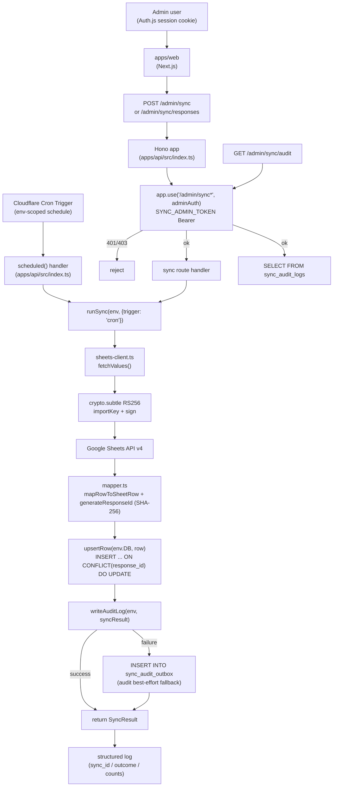

# Phase 2: 設計

## メタ情報

| 項目 | 値 |
| --- | --- |
| タスク名 | Sheets→D1 sync endpoint 実装と audit logging (UT-21) |
| Phase 番号 | 2 / 13 |
| Phase 名称 | 設計 |
| 作成日 | 2026-04-29 |
| 前 Phase | 1 (要件定義) |
| 次 Phase | 3 (設計レビュー) |
| 状態 | spec_created |
| タスク分類 | application_implementation |

## 目的

Phase 1 で確定した「契約/実装境界解消 + 三位一体（認可・冪等性・audit best-effort）」要件を、actual file structure（types.ts / sheets-client.ts / mapper.ts / worker.ts / index.ts）を base case とし、SYNC_ADMIN_TOKEN Bearer middleware の挿入点 / SHA-256 冪等キー生成仕様 / audit best-effort + outbox 設計 / Workers crypto.subtle JWT 署名 / exactOptionalPropertyTypes 対応 を Mermaid 図 + モジュール表 + state ownership に分解し、Phase 3 のレビューが代替案比較で結論を出せる粒度の設計入力を作成する。

## 実行タスク

1. `/admin/sync` / `/admin/sync/responses` / scheduled handler → `runSync(env, options)` → upsert + audit (best-effort) + outbox のフローを Mermaid 構造図で固定する（完了条件: 認可 middleware・冪等キー生成・audit 失敗時 outbox 経路が明示）。
2. dev / production 環境別 Cron スケジュールと Secret マトリクス（4 Secret × 2 環境）を表化する（完了条件: すべてに `op://Employee/ubm-hyogo-env/...` 参照経路が記述）。
3. actual file structure 5 ファイルのモジュール設計（types / sheets-client / mapper / worker / index）を擬似 export 仕様で記述する（完了条件: 各モジュールに input / output / 副作用 / exactOptionalPropertyTypes 対応点 が記載）。
4. SYNC_ADMIN_TOKEN Bearer middleware の挿入点（`app.use('/admin/sync*', adminAuth)`）と CSRF 配線を擬似コードで固定する（完了条件: Bearer token 検証 の順序が定義）。
5. audit best-effort + outbox 設計を独立成果物化する（完了条件: best-effort 判定条件・outbox row schema・再 drain cron 方針が記述）。
6. 冪等キー (SHA-256 `generateResponseId`) の入力列・hash アルゴリズム・upsert unique key を固定する（完了条件: Sheets 列追加に対する破壊性ゼロが説明）。
7. state ownership 表（sync_records / sync_audit_logs / sync_audit_outbox / sync_locks / pageToken cursor）を作成する（完了条件: writer/reader/lifecycle が一意）。
8. 成果物 2 ファイル（sync-endpoint-design.md / audit-best-effort-design.md）を分離して作成する。

## 参照資料

| 種別 | パス | 用途 |
| --- | --- | --- |
| 必須 | docs/30-workflows/ut-21-sheets-d1-sync-endpoint-and-audit-implementation/phase-01.md | 真の論点・4条件・命名規則チェックリスト |
| 必須 | docs/30-workflows/completed-tasks/03-serial-data-source-and-storage-contract/outputs/phase-02/sync-flow.md | 状態遷移の正本 |
| 必須 | docs/30-workflows/completed-tasks/03-serial-data-source-and-storage-contract/outputs/phase-02/data-contract.md | audit best-effort + outbox 方針 |
| 必須 | docs/30-workflows/completed-tasks/03-serial-data-source-and-storage-contract/outputs/phase-05/sync-deployment-runbook.md | deploy 手順 |
| 必須 | .claude/skills/aiworkflow-requirements/references/api-endpoints.md | `/admin/sync*` 命名・認可境界 |
| 必須 | .claude/skills/aiworkflow-requirements/references/deployment-cloudflare.md | wrangler.toml `[triggers]` env split |
| 必須 | .claude/skills/aiworkflow-requirements/references/deployment-secrets-management.md | 1Password (Employee/ubm-hyogo-env) → Cloudflare Secrets |
| 参考 | https://developers.cloudflare.com/workers/runtime-apis/web-crypto/sign/ | crypto.subtle.sign RS256 |
| 参考 | https://authjs.dev/reference/core | Auth.js session / callbacks |

## 構造図 (Mermaid)



## 環境変数 / Secret マトリクス

| Secret / Variable | 種別 | dev 環境 | production 環境 | 注入経路 | 1Password 参照 |
| --- | --- | --- | --- | --- | --- |
| `GOOGLE_SHEETS_SA_JSON` | Secret | required | required | Cloudflare Secret (`wrangler secret put --env <name>`) | `op://Employee/ubm-hyogo-env/GOOGLE_SHEETS_SA_JSON` |
| `SHEETS_SPREADSHEET_ID` | Secret/Variable | dev sheet id | prod sheet id | `wrangler.toml` `[env.*.vars]` または Secret | `op://Employee/ubm-hyogo-env/SHEETS_SPREADSHEET_ID` |
| `SYNC_ADMIN_TOKEN` | Secret | required | required | Cloudflare Secret | `op://Employee/ubm-hyogo-env/SYNC_ADMIN_TOKEN` |
| `ADMIN_ROLE_EMAILS` | Variable | dev allowlist | prod allowlist | `wrangler.toml` `[env.*.vars]` | `op://Employee/ubm-hyogo-env/ADMIN_ROLE_EMAILS` |
| Cron schedule | Config | `0 */1 * * *`（1h） | `0 */6 * * *`（6h） | `wrangler.toml` `[env.*.triggers]` | - |
| `SYNC_BATCH_SIZE` | Variable | 100 | 100 | `[env.*.vars]` | - |

> SA 名は `ubm-hyogo-sheets-reader@ubm-hyogo.iam.gserviceaccount.com`。`ubm-sheets-reader` ではない。

## モジュール設計（actual file structure）

| # | モジュール | パス（actual） | 入力 | 出力 / 副作用 | 備考 |
| --- | --- | --- | --- | --- | --- |
| 1 | 型定義 | `apps/api/src/sync/types.ts` | - | `Env`, `SheetRow`, `SyncResult`, `SyncOptions`, `AuditEntry` 型 export | exactOptionalPropertyTypes=true 対応で全 SheetRow フィールドを `string \| undefined` 明示 |
| 2 | Sheets client | `apps/api/src/sync/sheets-client.ts` | `env.GOOGLE_SHEETS_SA_JSON`, `spreadsheetId`, `range` | `ValueRange.values`、副作用: Google Sheets API 呼び出し | `crypto.subtle.importKey({extractable: false}) + sign({name: "RSASSA-PKCS1-v1_5", hash: "SHA-256"})` で RS256 JWT 署名。PEM ヘッダ除去 + base64 デコード |
| 3 | Mapper | `apps/api/src/sync/mapper.ts` | sheets row (`string[]`) | `SheetRow`, `response_id: string` (SHA-256 hex) | `COL` 定数で列 index 集約。`generateResponseId(row)` は固定列を `\x1F` 区切りで join → SHA-256。Sheets schema は本ファイルに閉じる（不変条件 #1） |
| 4 | Worker (core) | `apps/api/src/sync/worker.ts` | `env: Env`, `options: SyncOptions` | `SyncResult`、副作用: D1 upsert + audit + outbox | `runSync` / `runBackfill` / `upsertRow` / `writeAuditLog` を export。pure-ish entry で scheduled / manual 双方から呼ばれる |
| 5 | Hono ルート + middleware | `apps/api/src/index.ts` | `Hono.Request`, `Env`, `ExecutionContext` | `POST /admin/sync` / `POST /admin/sync/responses` / `GET /admin/sync/audit` の3ルート登録。`scheduled()` handler export | `app.use('/admin/sync*', adminAuth)` で middleware を一括適用。scheduled は `ctx.waitUntil(runSync(env, {trigger: 'cron'}))` |

## SYNC_ADMIN_TOKEN Bearer middleware 挿入点

```typescript
// 擬似コード（apps/api/src/middlewares/admin-auth.ts として新設）
import { Hono } from 'hono'
import { Auth } from '@auth/core'

export const adminAuth = async (c, next) => {
  // 1. session 検証（Auth.js JWT cookie をデコード）
  const session = await getSession(c.req, { secret: c.env.SYNC_ADMIN_TOKEN })
  if (!session?.user?.email) return c.json({ error: 'unauthorized' }, 401)

  // 2. admin role 判定（ADMIN_ROLE_EMAILS allowlist）
  const adminEmails = c.env.ADMIN_ROLE_EMAILS.split(',').map(e => e.trim())
  if (!adminEmails.includes(session.user.email)) return c.json({ error: 'forbidden' }, 403)

  // 3. CSRF check（POST 時のみ。Auth.js csrf token と照合）
  if (c.req.method !== 'GET') {
    const csrfHeader = c.req.header('x-csrf-token')
    if (!csrfHeader || !verifyCsrf(csrfHeader, session)) {
      return c.json({ error: 'csrf_invalid' }, 403)
    }
  }

  c.set('session', session)
  await next()
}

// apps/api/src/index.ts での適用
app.use('/admin/sync*', adminAuth)  // ← 一括適用でルートごとの付け忘れを構造的に排除
app.post('/admin/sync', manualHandler)
app.post('/admin/sync/responses', backfillHandler)
app.get('/admin/sync/audit', auditHandler)
```

## 冪等キー (SHA-256) 仕様

```typescript
// apps/api/src/sync/mapper.ts
export const COL = {
  TIMESTAMP: 0,
  EMAIL: 1,
  NAME_FULL: 2,
  // ... 31 questions / 6 sections の固定列 index
} as const

export async function generateResponseId(row: string[]): Promise<string> {
  // 固定列を \x1F (Unit Separator) で join → SHA-256 hex
  const fixedCols = [
    row[COL.TIMESTAMP] ?? '',
    row[COL.EMAIL] ?? '',
    row[COL.NAME_FULL] ?? '',
    // 列追加に対する破壊性ゼロ: 末尾追加なら ID 不変
  ].join('\x1F')
  const hash = await crypto.subtle.digest('SHA-256', new TextEncoder().encode(fixedCols))
  return Array.from(new Uint8Array(hash)).map(b => b.toString(16).padStart(2, '0')).join('')
}
```

D1 upsert は `INSERT INTO sync_records (response_id, ...) VALUES (?, ...) ON CONFLICT(response_id) DO UPDATE SET ...` の形で `response_id` を unique key とする。

## state ownership 表

| state | 物理位置 | owner module | writer | reader | TTL / lifecycle |
| --- | --- | --- | --- | --- | --- |
| `sync_records` row | D1 | `worker.ts` `upsertRow` | `runSync` | apps/api 全 route | upsert（unique key on `response_id`） |
| `sync_audit_logs` row | D1 | `worker.ts` `writeAuditLog` | `runSync`（best-effort） | `GET /admin/sync/audit`、UT-08 monitoring | 永続。古いログは別タスクで pruning |
| `sync_audit_outbox` row | D1 | `worker.ts` `writeAuditLog` の catch 節 | `runSync`（audit 失敗時のみ） | 別 cron で再 drain | drain 成功で削除 |
| `sync_locks` row | D1 | `worker.ts`（任意。MVP は省略可） | `runSync` | `runSync` | TTL 30min。expired は強制解除 |
| `pageToken cursor` | in-memory | `sheets-client.ts` | `runSync` | `runSync` | 1 sync 内で完結。永続化しない |
| Cron schedule | `wrangler.toml` `[env.*.triggers]` | infra | wrangler deploy | runtime | 環境別 |

## 実行手順

### ステップ 1: Phase 1 入力の取り込み

- 真の論点（三位一体 + 契約/実装境界解消）と命名規則チェックリスト 5 観点を確認する。
- actual file structure 5 ファイルが既に repo に存在することを確認する。

### ステップ 2: 構造図とモジュール分解

- Mermaid 構造図を `outputs/phase-02/sync-endpoint-design.md` に固定する。
- 5 モジュールの input / output / 副作用を擬似 TypeScript signature で記述する。
- SYNC_ADMIN_TOKEN Bearer middleware の挿入点と CSRF 配線を擬似コードで固定する。

### ステップ 3: audit best-effort + outbox 独立成果物化

- `outputs/phase-02/audit-best-effort-design.md` に以下を記述する。
  - best-effort の判定条件（sync 本体成功 AND audit insert 失敗のみ outbox へ）
  - `sync_audit_outbox` テーブル schema（audit_payload JSON / created_at / retry_count）
  - 別 cron での再 drain 方針（本タスクスコープ外。下流 05a-observability で実装）
  - ロールバック禁止理由（主データ喪失リスク）
  - 03-serial data-contract.md との 5 点同期チェックリスト

### ステップ 4: 冪等キー仕様と state ownership 確定

- SHA-256 入力列を `mapper.ts` `COL` 定数の固定 index で固定する。
- 列追加に対する破壊性ゼロを設計レベルで説明する。
- state ownership 表に 5 state を含め、writer / reader / lifecycle を一意に決める。

### ステップ 5: env マトリクスと Cron 分離

- dev `0 */1 * * *` / production `0 */6 * * *` を `wrangler.toml` `[env.*.triggers]` で分離する案を固定する。
- 1Password 参照は全て `op://Employee/ubm-hyogo-env/<FIELD>` 形式で表化する。

## 統合テスト連携

| 連携先 Phase | 連携内容 |
| --- | --- |
| Phase 3 | 設計の代替案比較・PASS/MINOR/MAJOR 判定の入力 |
| Phase 4 | 5 モジュール + middleware + audit best-effort のテスト計画ベースライン |
| Phase 5 | 実装ランブックの擬似コード起点（middleware 配線・冪等キー・outbox 含む） |
| Phase 6 | 異常系（audit 失敗 / JWT 署名失敗 / 認可漏れ / SQLITE_BUSY / Sheets schema 変更）の網羅対象 |
| Phase 9 | 03-serial との 5 点同期チェック実施 |
| Phase 11 | dev 環境での scheduled / manual / backfill smoke 手順 placeholder |

## 多角的チェック観点

- 不変条件 #1: Sheets schema を `mapper.ts` (COL 定数) に閉じ、worker / index に漏らしていない。03-serial sync-flow をコードコメントに転記していない。
- 不変条件 #4: `sync_audit_logs` / `sync_audit_outbox` が admin-managed data 専用テーブルとして分離されている。
- 不変条件 #5: D1 binding は `apps/api/src/sync/*` 内のみ。設計に `apps/web` からの参照が登場していない。
- 認可境界: scheduled handler は env binding でのみ起動、`/admin/sync*` は `app.use('/admin/sync*', adminAuth)` で session + admin role + CSRF の3点を必須化。
- 冪等性: `generateResponseId` の入力列が `COL` 定数で固定され、列追加で hash 値が変化しない（末尾追加方針）。
- audit best-effort: sync 本体成功 / audit 失敗時に勝手にトランザクション化せず、outbox に蓄積する。
- exactOptionalPropertyTypes: SheetRow 全フィールドが `string | undefined`、DB バインドが `?? null` 合体されている。
- Workers 互換: googleapis 依存が混入せず、`crypto.subtle` で RS256 署名されている。PEM ヘッダ除去 + base64 デコードを手動で行う。
- 1Password / SA 名: vault `Employee` / item `ubm-hyogo-env`、SA `ubm-hyogo-sheets-reader@...` で固定されている。
- 無料枠: dev 1h / production 6h Cron で月 < 1k invocation、D1 write 月 < 50k、Sheets API < 300 req/min/project の範囲内。

## サブタスク管理

| # | サブタスク | 担当 Phase | 状態 | 備考 |
| --- | --- | --- | --- | --- |
| 1 | Mermaid 構造図 | 2 | spec_created | sync-endpoint-design.md |
| 2 | env / Secret マトリクス | 2 | spec_created | 4 Secret × 2 環境、1Password 参照含む |
| 3 | actual file 5 モジュール設計 | 2 | spec_created | I/O・副作用・exactOptionalPropertyTypes 対応 |
| 4 | SYNC_ADMIN_TOKEN Bearer middleware 挿入点 | 2 | spec_created | SYNC_ADMIN_TOKEN Bearer の擬似コード |
| 5 | audit best-effort + outbox 独立成果物 | 2 | spec_created | audit-best-effort-design.md |
| 6 | 冪等キー (SHA-256) 仕様 | 2 | spec_created | COL 定数 + 列追加破壊性ゼロ |
| 7 | state ownership 表 | 2 | spec_created | 5 state |
| 8 | 成果物 2 ファイル分離 | 2 | spec_created | sync-endpoint-design.md / audit-best-effort-design.md |

## 成果物

| 種別 | パス | 説明 |
| --- | --- | --- |
| 設計 | outputs/phase-02/sync-endpoint-design.md | actual file structure・Mermaid・モジュール設計・middleware 挿入点・state ownership・冪等キー仕様 |
| 設計 | outputs/phase-02/audit-best-effort-design.md | audit best-effort 判定条件・sync_audit_outbox schema・再 drain 方針・03-serial 同期チェックリスト |
| メタ | artifacts.json | Phase 2 状態の更新 |

## 完了条件

- [ ] Mermaid 構造図に `app.use('/admin/sync*', adminAuth)` 経由 → `runSync` → upsert → audit best-effort → outbox 経路が表現されている
- [ ] env / Secret マトリクスに 4 Secret × 2 環境すべての注入経路と 1Password 参照が記述されている
- [ ] actual file structure 5 モジュールすべてに input / output / 副作用 / exactOptionalPropertyTypes 対応が記述されている
- [ ] Auth.js admin middleware の挿入点が `app.use('/admin/sync*', adminAuth)` で一括適用される設計になっている
- [ ] audit best-effort + outbox 設計が独立成果物化されている
- [ ] 冪等キー (SHA-256) の入力列・unique key・列追加破壊性ゼロが説明されている
- [ ] state ownership 表に 5 state（sync_records / sync_audit_logs / sync_audit_outbox / sync_locks / pageToken）が含まれる
- [ ] 成果物が 2 ファイル（sync-endpoint-design.md / audit-best-effort-design.md）に分離されている

## タスク100%実行確認【必須】

- 全実行タスク（8 件）が `spec_created`
- 全成果物が `outputs/phase-02/` 配下に配置済み
- 異常系（audit 失敗 → outbox / JWT 署名失敗 / 認可漏れ / SQLITE_BUSY / Sheets schema 変更）の対応モジュールが設計に含まれる
- artifacts.json の `phases[1].status` が `spec_created`
- artifacts.json の `phases[1].outputs` に 2 ファイルが列挙されている

## 次 Phase への引き渡し

- 次 Phase: 3 (設計レビュー)
- 引き継ぎ事項:
  - sync-endpoint-design.md / audit-best-effort-design.md を代替案比較の base case として渡す
  - actual file structure 5 ファイル（types/sheets-client/mapper/worker/index）は変更しない前提で代替案を評価
  - state ownership 表を代替案ごとに再評価
  - env マトリクス（4 Secret × 2 環境）と 1Password 参照形式は代替案で変更されないことを Phase 3 の制約として固定
  - SYNC_ADMIN_TOKEN Bearer middleware は `app.use('/admin/sync*', adminAuth)` の一括適用形式が必須
- ブロック条件:
  - Mermaid 図に session 検証 / admin role / CSRF / runSync / upsert / audit / outbox のいずれかが欠落
  - 既存命名規則チェック未走査
  - state ownership に重複 owner が残っている
  - audit best-effort 設計でロールバック方針が混入している
