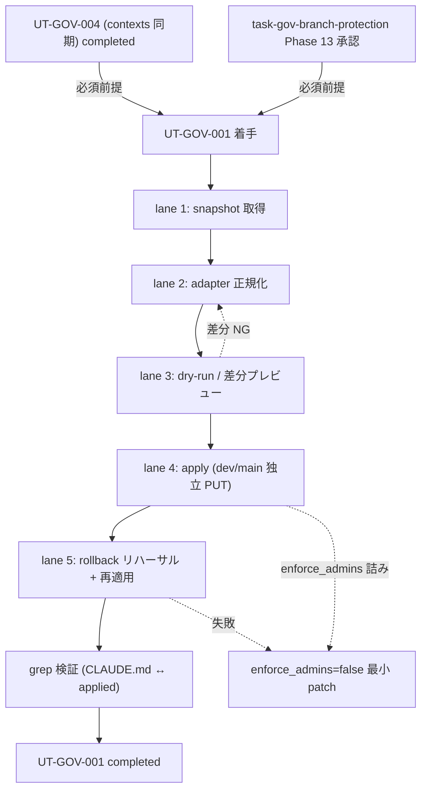

# Phase 2 成果物 — 設計

## 1. 設計サマリ

UT-GOV-001 は **`gh api` 直叩き + payload を Git 管理する MVP 方式**で実装する。lane 1〜5（snapshot 取得 → adapter 正規化 → dry-run → apply → rollback リハーサル）を直列に実行し、dev / main は **bulk 化せず独立 PUT** する。snapshot（GET 応答そのまま）は **PUT 不可形式**で監査用、payload / rollback payload は adapter 正規化済みで PUT 専用、と用途を分離する。`enforce_admins=true` 詰み時の緊急 rollback は事前生成済みの最小 patch と DELETE 経路で完結させる。UT-GOV-004 完了前提は本 Phase 含む 3 箇所で重複明記する。

## 2. トポロジ



## 3. SubAgent lane 設計

| lane | 役割 | 入力 | 出力 |
| --- | --- | --- | --- |
| 1 | snapshot | gh CLI 認証 / repo | snapshot-{dev,main}.json |
| 2 | adapter | 草案 design.md §2 / snapshot / UT-GOV-004 contexts | payload-{dev,main}.json / rollback-{dev,main}.json |
| 3 | dry-run | snapshot / payload | apply-runbook.md §dry-run-diff |
| 4 | apply | payload | applied-{dev,main}.json |
| 5 | rollback | rollback payload / payload | rollback-rehearsal-log.md |

## 4. payload 正規化 adapter（GET → PUT）

### 4.1 field マッピング表（親仕様 §8.1 最低限 field を全件）

| field | GET 形 | PUT 形 | 備考 |
| --- | --- | --- | --- |
| `required_status_checks` | `{strict, contexts[]}` | `{strict, contexts[]}` | UT-GOV-004 積集合のみ。未完了時は `[]`（2 段階適用） |
| `enforce_admins` | `{enabled, url}` | `bool` | `.enabled` 抽出 |
| `required_pull_request_reviews` | object/absent | `null` | solo 運用固定 |
| `restrictions` | `{users:[{login}], teams:[{slug}], apps:[{slug}]} or null` | `{users:[login...], teams:[slug...], apps:[slug...]} or null` | login/slug 配列に flatten |
| `required_linear_history` | `{enabled}` | bool | |
| `allow_force_pushes` | `{enabled}` | bool（false 固定） | |
| `allow_deletions` | `{enabled}` | bool（false 固定） | |
| `required_conversation_resolution` | `{enabled}` | bool | |
| `lock_branch` | `{enabled}` | bool（**false 固定**、§8.3） | |
| `allow_fork_syncing` | `{enabled}` | bool | |
| `block_creations` | `{enabled}` | bool（任意） | |

### 4.2 adapter 擬似コード（jq）

```bash
jq '{
  required_status_checks: (.required_status_checks // null),
  enforce_admins: (.enforce_admins.enabled // false),
  required_pull_request_reviews: null,
  restrictions: (
    if .restrictions == null then null
    else {
      users: [.restrictions.users[].login],
      teams: [.restrictions.teams[].slug],
      apps:  [.restrictions.apps[].slug]
    } end),
  required_linear_history: (.required_linear_history.enabled // true),
  allow_force_pushes: (.allow_force_pushes.enabled // false),
  allow_deletions: (.allow_deletions.enabled // false),
  required_conversation_resolution: (.required_conversation_resolution.enabled // true),
  lock_branch: false,
  allow_fork_syncing: (.allow_fork_syncing.enabled // false)
}' snapshot-{branch}.json > rollback-{branch}.json
```

> 草案 → payload はこの adapter ではなく、design.md §2 を写経した上で UT-GOV-004 の contexts を埋め込む。

## 5. snapshot vs rollback payload の用途分離

| ファイル | 形式 | 用途 | PUT 可？ |
| --- | --- | --- | --- |
| snapshot-{branch}.json | GET 応答そのまま | 監査・差分計算 | **不可**（422 になる） |
| payload-{branch}.json | PUT schema 正規化 | 本適用・再適用 | 可 |
| rollback-{branch}.json | PUT schema 正規化（snapshot を adapter 通過） | 緊急時 rollback | 可 |
| applied-{branch}.json | PUT 応答そのまま | 適用結果の証跡 | 不可（保存のみ） |

## 6. dev / main 別ファイル戦略（bulk 化禁止）

- すべてのファイルを `{branch}` サフィックスで物理分離。
- PUT も dev / main それぞれ独立 1 回ずつ実行。bulk script で一括化しない（§8.5）。
- 片側の PUT が失敗しても、もう片側は影響を受けない。

## 7. 4 ステップ手順（dry-run → apply → rollback リハーサル → 再適用）

```bash
# === 0. 前提 === UT-GOV-004 completed？
# === 1. snapshot ===
gh api repos/{owner}/{repo}/branches/dev/protection  > snapshot-dev.json
gh api repos/{owner}/{repo}/branches/main/protection > snapshot-main.json

# === 2. adapter（草案 → payload / snapshot → rollback payload） ===
# Phase 5 で実装。本 Phase は仕様レベル固定。

# === 3. dry-run ===
diff <(jq -S . snapshot-dev.json)  <(jq -S . payload-dev.json)
diff <(jq -S . snapshot-main.json) <(jq -S . payload-main.json)
# intended diff を apply-runbook.md §dry-run-diff に記録、レビュー承認

# === 4. apply（独立 PUT × 2） ===
gh api repos/{owner}/{repo}/branches/dev/protection  -X PUT --input payload-dev.json  > applied-dev.json
gh api repos/{owner}/{repo}/branches/main/protection -X PUT --input payload-main.json > applied-main.json

# === 5. rollback リハーサル ===
gh api repos/{owner}/{repo}/branches/dev/protection  -X PUT --input rollback-dev.json
gh api repos/{owner}/{repo}/branches/main/protection -X PUT --input rollback-main.json

# === 6. 再適用 ===
gh api repos/{owner}/{repo}/branches/dev/protection  -X PUT --input payload-dev.json
gh api repos/{owner}/{repo}/branches/main/protection -X PUT --input payload-main.json

# === 7. 二重正本 drift 検証 ===
gh api repos/{owner}/{repo}/branches/main/protection | jq '.required_pull_request_reviews'  # => null 期待
grep -E "required_pull_request_reviews\s*[:=]?\s*null" CLAUDE.md
```

## 8. state ownership 表

| state | 物理位置 | writer | reader | TTL |
| --- | --- | --- | --- | --- |
| GitHub 実値（**正本**） | github.com | lane 4 / lane 5（PUT のみ） | gh api GET / UI | 永続 |
| snapshot | outputs/phase-13/snapshot-{branch}.json | lane 1（1 回限り） | lane 2 / 監査 | 永続 |
| payload | outputs/phase-13/payload-{branch}.json | lane 2 | lane 3〜5 | 永続 |
| rollback payload | outputs/phase-13/rollback-{branch}.json | lane 2 | lane 5 / 緊急時 | 永続 |
| applied | outputs/phase-13/applied-{branch}.json | lane 4 | 監査 | 永続 |
| CLAUDE.md ブランチ戦略 | CLAUDE.md | docs PR | 開発者 | 永続（**参照**） |

> **境界**: 正本は GitHub 実値 / snapshot は PUT 不可 / dev・main 独立 / hook 等で書かない。

## 9. ロールバック設計（3 経路）

### 9.1 通常 rollback

```bash
gh api repos/{owner}/{repo}/branches/dev/protection  -X PUT --input rollback-dev.json
gh api repos/{owner}/{repo}/branches/main/protection -X PUT --input rollback-main.json
```

### 9.2 緊急 rollback（`enforce_admins=true` で admin 自身 block、§8.4）

```bash
# 経路 A: enforce_admins サブリソースの DELETE
gh api repos/{owner}/{repo}/branches/main/protection/enforce_admins -X DELETE
# 経路 B: rollback payload の enforce_admins=false 版を PUT
gh api repos/{owner}/{repo}/branches/main/protection -X PUT --input rollback-main.json
```

担当者: solo 運用のため実行者本人。連絡経路（手元 ssh / GitHub UI）を `apply-runbook.md` に必ず明記。

### 9.3 再適用（rollback リハーサル後）

```bash
gh api repos/{owner}/{repo}/branches/dev/protection  -X PUT --input payload-dev.json
gh api repos/{owner}/{repo}/branches/main/protection -X PUT --input payload-main.json
```

## 10. ファイル変更計画

| パス | 操作 |
| --- | --- |
| outputs/phase-13/branch-protection-snapshot-{dev,main}.json | 新規（lane 1） |
| outputs/phase-13/branch-protection-payload-{dev,main}.json | 新規（lane 2） |
| outputs/phase-13/branch-protection-rollback-{dev,main}.json | 新規（lane 2） |
| outputs/phase-13/branch-protection-applied-{dev,main}.json | 新規（lane 4） |
| outputs/phase-13/apply-runbook.md / outputs/phase-11/apply-runbook.md | 新規（lane 3 / 5） |
| その他（apps/web, apps/api, D1, .gitignore 等） | 触らない |

## 11. リスク表（親仕様 §8.1〜8.6 全件マップ）

| # | リスク | 緩和策 | 受け皿 |
| --- | --- | --- | --- |
| §8.1 | GET/PUT field 差異で 422 | adapter field マッピング表 + jq 擬似コード | §4 |
| §8.2 | contexts 未出現値で merge 不能 | UT-GOV-004 完了前提 3 重明記 + 2 段階適用フォールバック | §2 / §4.1 / Phase 3 |
| §8.3 | `lock_branch=true` 詰み | `lock_branch=false` 固定、有効化は freeze runbook 別タスク | §4.1 |
| §8.4 | `enforce_admins=true` admin 詰み | 緊急 rollback 2 経路（DELETE / PUT）+ 担当者明記 | §9.2 |
| §8.5 | dev/main bulk PUT 片側ミス | `{branch}` サフィックス分離 + 独立 PUT | §6 / §10 |
| §8.6 | CLAUDE.md ↔ GitHub 二重正本 drift | grep 検証手順を runbook に組み込み | §7 ステップ 7 |

## 12. UT-GOV-004 完了前提（3 重明記の 2 箇所目）

未完了時は `contexts=[]` で先行 PUT → UT-GOV-004 完了後に再 PUT する **2 段階適用** に切替。Phase 3 NO-GO 条件で再度 block。

## 13. 引き渡し（Phase 3 へ）

- base case = lane 1〜5 直列実行
- adapter field マッピング表（§8.1 最低限 field 全件）
- rollback 3 経路（通常 / 緊急 enforce_admins / 再適用）
- bulk 化禁止 = dev / main 独立 PUT
- UT-GOV-004 完了 NO-GO ゲート
