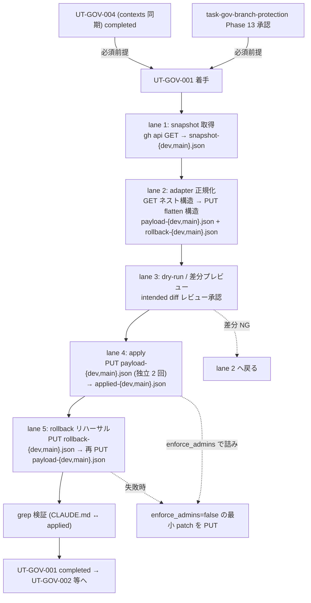

# Phase 2: 設計

## メタ情報

| 項目 | 値 |
| --- | --- |
| タスク名 | GitHub branch protection apply / rollback payload 正規化 (ut-gov-001-github-branch-protection-apply) |
| Phase 番号 | 2 / 13 |
| Phase 名称 | 設計 |
| 作成日 | 2026-04-28 |
| 前 Phase | 1 (要件定義) |
| 次 Phase | 3 (設計レビュー) |
| 状態 | completed |
| タスク種別 | implementation / NON_VISUAL / github_governance |

## 目的

Phase 1 で確定した「UT-GOV-004 完了前提・GET/PUT 正規化 adapter・`{branch}` 別ファイル戦略・`enforce_admins` rollback 経路・4 ステップ手順」要件を、トポロジ / SubAgent lane / state ownership / payload 設計 / ロールバック設計に分解し、Phase 3 のレビューが代替案比較で結論を出せる粒度の設計入力を作成する。本 Phase の成果は仕様レベルであり、実 PUT は Phase 13 ユーザー承認後に委ねる。

## 実行タスク

1. 5 ステップトポロジ（snapshot 取得 → adapter 正規化 → dry-run → apply → rollback リハーサル → 再適用）を Mermaid で固定する。
2. SubAgent lane 5 本（lane 1 snapshot / lane 2 adapter / lane 3 dry-run review / lane 4 apply / lane 5 rollback rehearsal）を表化する。
3. payload / snapshot / rollback / applied のファイル分離戦略と `{branch}` サフィックス命名を確定する（bulk 化禁止）。
4. state ownership 表を作成する（GitHub 実値 / snapshot / payload / rollback payload / applied / CLAUDE.md の 6 state を writer / reader / TTL で一意化）。
5. ロールバック設計を確定する（`enforce_admins` のみ一時 false 化 → 全 protection 復元 の 2 段階）。
6. adapter 正規化 field マッピング表を確定する（GET 構造 → PUT 構造）。
7. `enforce_admins=true` 適用時の rollback 担当者・経路を `apply-runbook.md` 構造で固定する。
8. dev / main 別ファイル戦略（branch サフィックス必須・独立 PUT）を固定する。
9. CLAUDE.md と GitHub 実値の grep 確認手順を仕様レベルで固定する。

## 依存タスク順序（UT-GOV-004 完了必須）— 重複明記 2/3

> **UT-GOV-004（`required_status_checks.contexts` 実在 job 名同期）が completed であることが本 Phase の必須前提である。**
> 未同期で本 Phase の設計を実装に移すと、merge 不能事故が確定する（親仕様 §8.2）。本 Phase では UT-GOV-004 完了を「設計の前提」として扱い、未完了の場合の代替経路として **2 段階適用（contexts=[] で先行 PUT → UT-GOV-004 完了後に再 PUT）** を adapter 仕様に組み込む。Phase 3 の NO-GO 条件で再度 block ゲートを置く。

## 参照資料

| 種別 | パス | 用途 |
| --- | --- | --- |
| 必須 | docs/30-workflows/ut-gov-001-github-branch-protection-apply/phase-01.md | 真の論点 / 4 条件 / 苦戦箇所割り当て |
| 必須 | docs/30-workflows/completed-tasks/UT-GOV-001-github-branch-protection-apply.md | 親仕様 §8 苦戦箇所 |
| 必須 | docs/30-workflows/completed-tasks/task-github-governance-branch-protection/outputs/phase-2/design.md §2 | 草案 JSON |
| 必須 | https://docs.github.com/en/rest/branches/branch-protection | PUT schema |
| 参考 | CLAUDE.md ブランチ戦略 | solo 運用ポリシー（`required_pull_request_reviews=null`） |

## トポロジ (Mermaid)



## SubAgent lane 設計

| lane | 役割 | 入力 | 出力 / 副作用 | 成果物 |
| --- | --- | --- | --- | --- |
| 1. snapshot | dev / main の現行 protection を `gh api GET` で取得 | `gh` CLI 認証 / repo 名 | snapshot 2 ファイル（監査用、PUT 不可形式のまま保全） | branch-protection-snapshot-{dev,main}.json |
| 2. adapter | 草案 JSON を PUT schema に正規化 / snapshot を rollback payload に正規化 | 草案 design.md §2 / snapshot / UT-GOV-004 contexts | payload 2 ファイル + rollback payload 2 ファイル | branch-protection-payload-{dev,main}.json / branch-protection-rollback-{dev,main}.json |
| 3. dry-run review | intended diff（snapshot vs payload）を提示しレビュー承認 | snapshot / payload | 差分テキスト（runbook 記載） / 承認記録 | apply-runbook.md §dry-run-diff |
| 4. apply | dev / main それぞれに独立 PUT、応答 JSON 保存 | payload / 承認記録 | applied 2 ファイル | branch-protection-applied-{dev,main}.json |
| 5. rollback rehearsal | snapshot から rollback payload を 1 回 PUT → 再度本 payload を PUT（double-apply） | rollback payload / payload | リハーサルログ | rollback-rehearsal-log.md |

## adapter 正規化 field マッピング表

| field | GET 応答（ネスト） | PUT payload（flatten） | 備考 |
| --- | --- | --- | --- |
| `required_status_checks` | `{ strict, contexts[] }` | `{ strict, contexts[] }` | contexts は UT-GOV-004 の積集合のみ。未完了時は `[]` |
| `enforce_admins` | `{ enabled: true/false, url }` | `true / false`（bool） | `.enabled` を抽出 |
| `required_pull_request_reviews` | object or absent | `null` | solo 運用のため `null` で固定 |
| `restrictions` | `{ users:[{login}], teams:[{slug}], apps:[{slug}] } or null` | `{ users:["login"], teams:["slug"], apps:["slug"] } or null` | login/slug を抽出して flatten。solo 運用では `null` |
| `required_linear_history` | `{ enabled }` | bool | |
| `allow_force_pushes` | `{ enabled }` | bool（false 固定） | |
| `allow_deletions` | `{ enabled }` | bool（false 固定） | |
| `required_conversation_resolution` | `{ enabled }` | bool | |
| `lock_branch` | `{ enabled }` | bool（**false 固定**、§8.3） | freeze runbook 整備まで有効化禁止 |
| `allow_fork_syncing` | `{ enabled }` | bool | |
| `block_creations` | `{ enabled }` | bool（任意） | |

## ファイル変更計画

| パス | 操作 | 編集者 | 注意 |
| --- | --- | --- | --- |
| `outputs/phase-13/branch-protection-snapshot-{dev,main}.json` | 新規作成（lane 1） | lane 1 | GET 応答そのまま保全。PUT には使わない |
| `outputs/phase-13/branch-protection-payload-{dev,main}.json` | 新規作成（lane 2） | lane 2 | PUT schema 準拠。dev / main 別 |
| `outputs/phase-13/branch-protection-rollback-{dev,main}.json` | 新規作成（lane 2） | lane 2 | snapshot を adapter で PUT schema に変換した結果 |
| `outputs/phase-13/branch-protection-applied-{dev,main}.json` | 新規作成（lane 4） | lane 4 | PUT 応答保存 |
| `outputs/phase-13/apply-runbook.md` / `outputs/phase-11/apply-runbook.md` | 新規作成 | lane 3 / 5 | dry-run diff / 承認記録 / rollback 経路 / 担当者 |
| その他 | 変更しない | - | apps/web / apps/api / D1 / `.gitignore` 等は触らない |

## 環境変数 / Secret

| 種別 | 名前 | 用途 | 管理場所 |
| --- | --- | --- | --- |
| GitHub Token | `GH_TOKEN`（または `gh auth login` の OAuth トークン） | branch protection PUT に必要な `administration:write` スコープ | 実行者ローカル `gh auth login`。本タスクでは新規導入しない |

> token 値は payload / runbook / log に転記しない。`.env` にも書かない（CLAUDE.md ローカル `.env` 運用ルール準拠）。

## state ownership 表

| state | 物理位置 | owner | writer | reader | TTL / lifecycle |
| --- | --- | --- | --- | --- | --- |
| GitHub 側 protection 実値（**正本**） | github.com repository settings | UT-GOV-001 PR | lane 4 / lane 5（PUT 経由のみ） | gh api GET / GitHub UI | 永続。変更は次 governance タスクで上書き |
| snapshot（監査用） | `outputs/phase-13/branch-protection-snapshot-{dev,main}.json` | lane 1 | lane 1（1 回限り） | lane 2（rollback payload 生成）/ 監査 | 永続（PR にコミット） |
| payload（PUT 入力） | `outputs/phase-13/branch-protection-payload-{dev,main}.json` | lane 2 | lane 2 | lane 3 / lane 4 / lane 5 | 永続（PR にコミット） |
| rollback payload（PUT 用、緊急用） | `outputs/phase-13/branch-protection-rollback-{dev,main}.json` | lane 2 | lane 2 | lane 5 / 緊急 rollback | 永続。`enforce_admins=false` 用最小 patch も同居 |
| applied（PUT 応答） | `outputs/phase-13/branch-protection-applied-{dev,main}.json` | lane 4 | lane 4 | 監査 | 永続（PR にコミット） |
| CLAUDE.md ブランチ戦略記述 | `CLAUDE.md` | リポジトリ規約 | docs PR | 全開発者 | 永続。**正本ではなく参照**（実値正本は GitHub 側） |

> **重要境界**:
> - **正本は GitHub 側の実値**。snapshot / payload / applied / CLAUDE.md はその参照。
> - snapshot は **PUT 不可形式**で保全し、PUT には必ず adapter で正規化された payload / rollback payload を使う（GET をそのまま PUT する事故の防止）。
> - dev / main を bulk 化しない。1 PUT = 1 branch を厳守。

## ロールバック設計

### 通常 rollback（適用後に巻き戻す）

```bash
# dev / main 独立で実行
gh api repos/{owner}/{repo}/branches/dev/protection -X PUT \
  --input outputs/phase-13/branch-protection-rollback-dev.json
gh api repos/{owner}/{repo}/branches/main/protection -X PUT \
  --input outputs/phase-13/branch-protection-rollback-main.json
```

### 緊急 rollback（`enforce_admins=true` で admin 自身 block 発生時、§8.4）

```bash
# enforce_admins のみ一時 false 化する最小 patch（事前生成）
# branch-protection-rollback-{dev,main}.json と同居させる別ファイル:
#   branch-protection-emergency-disable-enforce-admins-{dev,main}.json
gh api repos/{owner}/{repo}/branches/main/protection/enforce_admins -X DELETE
# あるいは rollback payload の `enforce_admins=false` 版を PUT
```

> 緊急 rollback の担当者は `apply-runbook.md` に **必ず明記**（solo 運用では実行者本人）。連絡経路（自分の手元 ssh / GitHub UI 経由）も併記。

### 再適用（rollback リハーサル後の本適用復元）

```bash
gh api repos/{owner}/{repo}/branches/dev/protection -X PUT \
  --input outputs/phase-13/branch-protection-payload-dev.json
gh api repos/{owner}/{repo}/branches/main/protection -X PUT \
  --input outputs/phase-13/branch-protection-payload-main.json
```

## 4 ステップ手順（dry-run → apply → rollback リハーサル → 再適用）

```bash
# ===== 0. 前提確認 =====
# UT-GOV-004 completed？ → 未完了なら contexts=[] の 2 段階適用に切替

# ===== 1. snapshot =====
gh api repos/{owner}/{repo}/branches/dev/protection  > outputs/phase-13/branch-protection-snapshot-dev.json
gh api repos/{owner}/{repo}/branches/main/protection > outputs/phase-13/branch-protection-snapshot-main.json

# ===== 2. adapter 正規化（草案 → payload / snapshot → rollback payload） =====
# jq / Node スクリプト等で実施（仕様レベルで固定、実装は Phase 5）

# ===== 3. dry-run / 差分プレビュー =====
diff <(jq -S . snapshot-dev.json)  <(jq -S . payload-dev.json)
diff <(jq -S . snapshot-main.json) <(jq -S . payload-main.json)
# intended diff を apply-runbook.md に記録、レビュー承認

# ===== 4. apply（独立 PUT × 2） =====
gh api repos/{owner}/{repo}/branches/dev/protection  -X PUT --input payload-dev.json  > applied-dev.json
gh api repos/{owner}/{repo}/branches/main/protection -X PUT --input payload-main.json > applied-main.json

# ===== 5. rollback リハーサル =====
gh api repos/{owner}/{repo}/branches/dev/protection  -X PUT --input rollback-dev.json
gh api repos/{owner}/{repo}/branches/main/protection -X PUT --input rollback-main.json

# ===== 6. 再適用 =====
gh api repos/{owner}/{repo}/branches/dev/protection  -X PUT --input payload-dev.json
gh api repos/{owner}/{repo}/branches/main/protection -X PUT --input payload-main.json

# ===== 7. 二重正本 drift 検証（§8.6） =====
gh api repos/{owner}/{repo}/branches/main/protection | jq '.required_pull_request_reviews'
# => null であることを CLAUDE.md ブランチ戦略表と grep で照合
grep -E "required_pull_request_reviews\s*[:=]?\s*null" CLAUDE.md
```

## 実行手順

### ステップ 1: 前提確認の固定

- UT-GOV-004 完了 or 同時完了の判定基準を Phase 5 着手前のゲート条件として `apply-runbook.md` に記述。

### ステップ 2: トポロジと lane の確定

- Mermaid 図と SubAgent lane 5 本を `outputs/phase-02/main.md` に固定。

### ステップ 3: adapter field マッピングの確定

- 親仕様 §8.1 の最低限 field を全件マッピング表に載せる。

### ステップ 4: state ownership / 別ファイル戦略の確定

- 6 state の owner / writer / reader / TTL を表化、bulk 化禁止を境界として明示。

### ステップ 5: rollback 経路と緊急 rollback の確定

- `enforce_admins=true` 詰み時の最小 patch（一時 false 化）と担当者を `apply-runbook.md` 構造に組み込む。

### ステップ 6: 4 ステップ手順の仕様レベル固定

- snapshot → adapter → dry-run → apply → rollback リハーサル → 再適用 → grep 検証 を bash 系列で固定。

## 統合テスト連携

| 連携先 Phase | 連携内容 |
| --- | --- |
| Phase 3 | 設計の代替案比較・PASS/MINOR/MAJOR 判定の入力 |
| Phase 4 | lane 1〜5 ごとのテスト計画ベースライン |
| Phase 5 | 実装ランブック（adapter / payload 生成スクリプト）の擬似コード起点 |
| Phase 6 | 異常系（422 / contexts merge 不能 / enforce_admins 詰み / bulk 片側ミス / drift） |
| Phase 11 | dry-run / apply / rollback リハーサル smoke の実走基準 |
| Phase 13 | user_approval_required: true で実 PUT を実行する根拠を提供 |

## 多角的チェック観点

- UT-GOV-004 完了前提が 3 重に明記されているか（本 Phase が 2 重目）。
- adapter で GET ネスト → PUT flatten の field 差異が網羅されているか（親仕様 §8.1 最低限リスト）。
- `lock_branch=false` が固定されているか（§8.3）。
- `enforce_admins=true` の rollback 経路が事前生成 payload + runbook 担当者明記で完結しているか（§8.4）。
- dev / main を独立 PUT として扱う bulk 化禁止が固定されているか（§8.5）。
- snapshot を PUT に流す事故が adapter で構造的に防がれているか（§8.1）。
- CLAUDE.md と GitHub 実値の grep 検証が runbook に組み込まれているか（§8.6）。
- 不変条件 #5 を侵害しない範囲か（apps/api / apps/web / D1 を触らない）。

## サブタスク管理

| # | サブタスク | 担当 Phase | 状態 | 備考 |
| --- | --- | --- | --- | --- |
| 1 | Mermaid トポロジ | 2 | completed | 5 lane + 緊急 rollback 分岐 |
| 2 | SubAgent lane 5 本 | 2 | completed | I/O・成果物明示 |
| 3 | adapter field マッピング表 | 2 | completed | §8.1 最低限 field 全件 |
| 4 | ファイル変更計画 | 2 | completed | `{branch}` サフィックス分離 |
| 5 | state ownership 表 | 2 | completed | 6 state |
| 6 | ロールバック設計（通常 / 緊急 / 再適用） | 2 | completed | enforce_admins 一時 false 化 |
| 7 | 4 ステップ手順 bash 系列 | 2 | completed | dry-run / apply / rollback / 再適用 / grep |
| 8 | UT-GOV-004 完了前提の重複明記 | 2 | completed | 3 重明記の 2 箇所目 |

## 成果物

| 種別 | パス | 説明 |
| --- | --- | --- |
| 設計 | outputs/phase-02/main.md | トポロジ / lane / adapter / state ownership / ファイル分離 / rollback 設計 / 4 ステップ手順 |
| メタ | artifacts.json | Phase 2 状態の更新 |

## 完了条件

- [x] Mermaid トポロジに 5 lane + 緊急 rollback 分岐が記述されている
- [x] SubAgent lane 5 本に I/O / 成果物が記述されている
- [x] adapter field マッピング表に §8.1 最低限 field が全件記述されている
- [x] ファイル変更計画で `{branch}` サフィックス分離・bulk 化禁止が明示されている
- [x] state ownership 表に「正本 = GitHub 実値」「snapshot は PUT 不可」境界が記述されている
- [x] ロールバック設計が通常 / 緊急（enforce_admins 一時 false 化）/ 再適用の 3 経路で記述されている
- [x] 4 ステップ手順が bash 系列で仕様レベル固定されている
- [x] UT-GOV-004 完了前提が本 Phase で重複明記されている（3 重明記の 2 箇所目）
- [x] `lock_branch=false` 固定が明示されている
- [x] CLAUDE.md ↔ GitHub 実値の grep 検証手順が組み込まれている

## タスク100%実行確認【必須】

- 全実行タスク（9 件）が `completed`
- 全成果物が `outputs/phase-02/` 配下に配置済み
- 異常系（422 / contexts 不能 / enforce_admins 詰み / bulk ミス / drift）の対応 lane が設計に含まれる
- artifacts.json の `phases[1].status` が `completed`

## 次 Phase への引き渡し

- 次 Phase: 3 (設計レビュー)
- 引き継ぎ事項:
  - base case = lane 1〜5 直列実行（snapshot → adapter → dry-run → apply → rollback リハーサル → 再適用）
  - dev / main 独立 PUT、bulk 化禁止
  - adapter field マッピング表（§8.1 最低限 field 全件）
  - rollback 3 経路（通常 / 緊急 enforce_admins / 再適用）
  - UT-GOV-004 完了を NO-GO 条件として Phase 3 へ引き渡す
- ブロック条件:
  - Mermaid に 5 lane のいずれかが欠落
  - state ownership に「正本 = GitHub 実値」境界が無い
  - ロールバック設計に `enforce_admins` 一時 false 化が無い
  - dev / main bulk 化を許す設計が残っている
  - UT-GOV-004 完了前提が記述されていない
