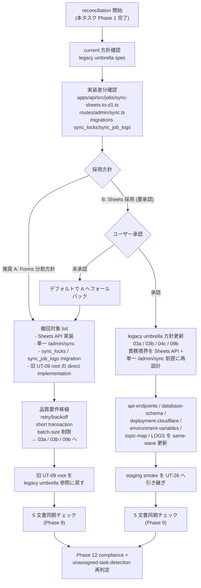

# Phase 2 設計成果物 — reconciliation 設計

正本仕様: `../../phase-02.md` / `../../index.md`
タスク ID: task-ut09-direction-reconciliation-001
作成日: 2026-04-29
実行種別: docs-only / direction-reconciliation / NON_VISUAL
前 Phase: 1（要件定義） / 次 Phase: 3（設計レビュー）
推奨方針: **A — current Forms 分割方針へ寄せる**（B 選択は要ユーザー承認）
AC トレース: AC-1 / AC-3 / AC-4 / AC-5 / AC-6 / AC-10

---

## 0. docs-only 境界（先頭固定）

本設計は **文書のみ**を成果物とする。本 Phase で記述する撤回 / 移植 / same-wave 更新は **すべて別タスクで実施**するものであり、本 reconciliation タスクのスコープには **コード変更・migration 実行・aiworkflow-requirements references 書換・PR 作成を一切含まない**。本書の擬似コードは契約境界の比較目的に限り、実装 diff として読まないこと。

---

## 1. 方針決定フロー（Mermaid）



> 推奨経路は `A`。`B` 経路はユーザー承認ゲートを必ず通過し、未承認時は自動的に A へフォールバックする。

---

## 2. 撤回 / 移植 / same-wave 更新 差分マッピング（AC-3 / AC-10）

### 2.1 採用 A 時 — 撤回対象（コード / migration 削除を別タスクで実施）

| 軸 | 対象 | 撤回理由 |
| --- | --- | --- |
| ファイル | `apps/api/src/jobs/sync-sheets-to-d1.ts` 系 | Sheets API 直接実装。Forms 分割方針と衝突 |
| ファイル | `apps/api/src/routes/admin/sync.ts`（単一 endpoint 実装） | `/admin/sync` 単一 endpoint。04c の 2 endpoint 契約と衝突 |
| endpoint | `POST /admin/sync`（単一） | 04c の 2 endpoint 命名と競合（C3） |
| migration | `sync_locks` テーブル up/down | `sync_jobs` ledger と二重化（S2） |
| migration | `sync_job_logs` テーブル up/down | `sync_jobs` ledger と二重化（S2） |
| Secret | `GOOGLE_SHEETS_SA_JSON` | Forms 採用時は不要（廃止候補） |
| Secret | `SHEETS_SPREADSHEET_ID` | Forms 採用時は不要（廃止候補） |
| 仕様 | `docs/30-workflows/ut-09-sheets-to-d1-cron-sync-job/` の direct implementation 化記述 | legacy umbrella 参照に戻す |
| Cron schedule | `wrangler.toml` の Sheets 前提 schedule | 09b runbook の Forms 2 endpoint 経路に合わせる |

### 2.2 採用 A 時 — 移植対象（D1 contention mitigation 知見の保存）

| # | 知見 | 移植先 | 移植内容（AC として継承） |
| --- | --- | --- | --- |
| M1 | WAL 非前提 | 03a / 03b 設計 | D1 のロック特性に依存しない設計 |
| M2 | retry/backoff | 03a / 03b / 09b runbook | exponential backoff 戦略・最大試行回数 |
| M3 | short transaction | 03a / 03b 実装 | 1 transaction の処理量上限 |
| M4 | batch-size 制限 | 03a / 03b / 09b | 1 sync あたり処理件数上限 |
| M5 | 二重起動防止 | 09b runbook | scheduled / manual 同時起動時の lock or idempotency strategy |

### 2.3 採用 B 時 — same-wave 更新対象（ユーザー承認後に別タスクで実施）

| 軸 | 対象 | 更新内容 |
| --- | --- | --- |
| 仕様 | `task-sync-forms-d1-legacy-umbrella-001.md` | 「旧 UT-09 を direct implementation にしない」方針を撤回 |
| 仕様 | 03a / 03b / 04c / 09b の `index.md` | 責務境界を Sheets API + 単一 `/admin/sync` 前提に再設計 |
| references | `api-endpoints.md` | `/admin/sync*` を単一 endpoint に書換 |
| references | `database-schema.md` | `sync_locks` + `sync_job_logs` を正本登録、`sync_jobs` の扱いを明記 |
| references | `deployment-cloudflare.md` / `environment-variables.md` | `GOOGLE_SHEETS_SA_JSON` / `SHEETS_SPREADSHEET_ID` を正本登録 |
| indexes | `topic-map` / `LOGS` | aiworkflow-requirements indexes 再生成必要 |
| 下流 | UT-26 staging-deploy-smoke | smoke シナリオを Sheets 経路に切替 |

---

## 3. `/admin/sync` 認可境界比較（AC-4）

```typescript
// ─── 採用 A（推奨）: 2 endpoint（04c 現行契約と整合） ──────────────
// middleware 挿入点: app.use('/admin/sync*', adminAuth)
app.use('/admin/sync*', adminAuth) // SYNC_ADMIN_TOKEN Bearer + admin role + CSRF を一括適用
app.post('/admin/sync/schema',    schemaSyncHandler)    // forms.get → schema diff upsert (sync_jobs)
app.post('/admin/sync/responses', responseSyncHandler)  // forms.responses.list → upsert + audit (sync_jobs)

// ─── 採用 B（要承認）: 単一 endpoint ─────────────────────────────
// middleware 挿入点: app.use('/admin/sync*', adminAuth)（A と同一）
app.use('/admin/sync*', adminAuth)
app.post('/admin/sync', singleSyncHandler) // sheets.values.get → upsert + audit (sync_locks + sync_job_logs)
```

| 観点 | A（2 endpoint） | B（単一 endpoint） |
| --- | --- | --- |
| middleware 挿入点 | `app.use('/admin/sync*', adminAuth)` | `app.use('/admin/sync*', adminAuth)`（共通） |
| Bearer 認可 | `SYNC_ADMIN_TOKEN` 単一 | `SYNC_ADMIN_TOKEN` 単一 |
| admin role allowlist | `ADMIN_ROLE_EMAILS` | `ADMIN_ROLE_EMAILS` |
| CSRF | 適用 | 適用 |
| route 数 | 2（schema / responses 分離） | 1（単一 handler 内分岐） |
| 04c 整合 | PASS（現行契約） | MAJOR（同期更新で PASS 化が条件） |
| 責務分離 | 高（schema 同期と responses 同期を分割） | 低（handler 内分岐に集約） |
| 09b cron 経路 | 2 経路の順序付き呼び出し | 単一経路 |

> middleware 挿入点は両案で共通。route 数と handler 内部処理が分岐。**04c との整合は A が PASS、B は same-wave 更新で PASS 化が条件**。

---

## 4. D1 ledger 一意化方針（AC-5）

| 評価軸 | A: `sync_jobs`（推奨） | B: `sync_locks` + `sync_job_logs` |
| --- | --- | --- |
| 一意性 | PASS（単一テーブルで sync 状態管理） | MINOR（2 テーブル分担。lock と log の join 設計が必要） |
| 運用可観測性 | PASS（status / started_at / finished_at / error 一括取得） | PASS（lock TTL と log retention を分離管理可能） |
| WAL 非前提互換 | PASS（短い transaction で対応可能） | MINOR（lock acquisition と log insert の transaction 境界が分岐） |
| current 正本との一致 | PASS（database-schema.md 登録済み） | MAJOR（database-schema.md 同期更新必須） |
| 監査ログ連携 | `sync_jobs` row を audit 源として継続 | `sync_job_logs` を audit 源として正式採用 |

**結論**: reconciliation 推奨は A。`sync_jobs` 単一に統一し、B 採用時のみ `sync_locks` + `sync_job_logs` を正本化する。**A と B の併存（二重 ledger）は禁止**（S2 再発防止）。

---

## 5. 5 文書同期チェック手順（AC-6 / Phase 9 で実施）

| # | 文書 | チェック観点 | 期待結果（A 採用時） | 期待結果（B 採用時） |
| --- | --- | --- | --- | --- |
| D1 | `unassigned-task/task-sync-forms-d1-legacy-umbrella-001.md` | 「旧 UT-09 を direct implementation にしない」方針 | 維持 | 撤回（direct implementation 容認に更新） |
| D2 | `02-application-implementation/03a-.../index.md` | Forms schema sync 責務境界 / `sync_jobs` 利用 / 2 endpoint 整合 | 無変更（M1〜M4 を AC として追記） | Sheets 前提へ責務再設計 |
| D3 | `02-application-implementation/03b-.../index.md` | Forms response sync の responseId 解決方式 / `sync_jobs` 利用 | 無変更（M1〜M4 を AC として追記） | Sheets 前提へ責務再設計 |
| D4 | `02-application-implementation/04c-.../index.md` | `/admin/sync*` endpoint 数と認可境界 | 2 endpoint 維持 | 単一 endpoint へ更新 |
| D5 | `09b-parallel-cron-triggers-monitoring-and-release-runbook/index.md` | cron schedule と runbook の sync 経路 / M5 二重起動防止 | Forms 2 経路維持（M5 強化） | Sheets 単一経路へ更新 |

### 5.1 実施手順（Phase 9 入力）

1. 上記 5 文書を `grep` / 目視で観点別に確認する。
2. 採用方針（A or B）に対する期待結果と差分があれば、本 reconciliation タスクではなく **個別の更新タスク**を起票する（docs-only 境界を維持）。
3. aiworkflow-requirements references（api-endpoints / database-schema / environment-variables / deployment-cloudflare）の登録値を **同観点で再走査**し、差分を Phase 9 出力 `contract-sync-check.md` に記録する。
4. 差分検知時は **PR をマージしない** ゲートとして扱う（Ownership 衝突検知ルール）。
5. staging smoke が pending の場合は「PASS」と記載しない（AC-13 / S6 運用ルール）。

---

## 6. 異常系設計の扱い

| 異常系 | 設計上の扱い |
| --- | --- |
| 二重 ledger 残存（`sync_jobs` と `sync_locks`+`sync_job_logs` 同時存在） | A 採用時は §2.1 の migration 撤回で必須解消、B 採用時は `sync_jobs` 廃止 or 明示的並存方針を database-schema.md に記載 |
| endpoint 競合（`/admin/sync` と `/admin/sync/schema`+`responses` 同時存在） | A 採用時は §2.1 の `routes/admin/sync.ts` 撤回で解消、B 採用時は 04c 同期更新で 2 endpoint を撤回 |
| Secret 名衝突 | 採用方針別に §2.1 / §2.3 の差分マッピングで一意化、A=Forms 系のみ / B=Sheets 系のみ |
| Ownership 違反 | Phase 1 §2 Ownership 宣言で防止、衝突検知時は reconciliation タスク起票 |
| B 未承認のまま実装着手 | Mermaid `FallbackA` 経路で A へフォールバック、PR をマージしない |

---

## 7. AC トレース

| AC | 充足箇所 |
| --- | --- |
| AC-1 | option-comparison.md の 9 行 × 2 列マトリクス（4 条件 + 5 観点） |
| AC-3 | §2.1（撤回 5 軸 +α）/ §2.2（移植 5 知見） |
| AC-4 | §3 認可境界比較（middleware 挿入点・route 数・04c 整合） |
| AC-5 | §4 D1 ledger 一意化（4 軸評価 + 結論） |
| AC-6 | §5 5 文書同期チェック手順（D1〜D5 × 2 採用方針） |
| AC-10 | §0 docs-only 境界 + §2.3 same-wave 更新リスト + §1 Mermaid `ApproveB` ゲート |

---

## 8. 次 Phase への引き渡し

- **次 Phase**: Phase 3（設計レビュー / 30 種思考法 / GO-NO-GO）
- **引き継ぎ事項**:
  1. reconciliation-design.md / option-comparison.md を代替案比較の base case とする
  2. 推奨 = A（option-comparison マトリクス上 MAJOR ゼロ・MINOR ゼロ）
  3. B は MAJOR 1（current facts）/ MINOR 3（実現性 / 不変条件 #6 / 運用性）が解消可能かを 30 種思考法で判定
  4. 5 文書同期チェック（§5）を Phase 9 入力として固定
  5. Mermaid 方針決定フロー（§1）を GO/NO-GO ゲートの根拠に再利用
  6. docs-only 境界（§0）を Phase 3 制約として固定
- **ブロック条件**:
  - 比較マトリクス（option-comparison.md）に空セル
  - 撤回 / 移植マッピングが 5 軸未満
  - 5 文書同期チェック対象が 5 文書未満
  - Mermaid に B 未承認フォールバック経路欠落

---

状態: spec_created → completed
