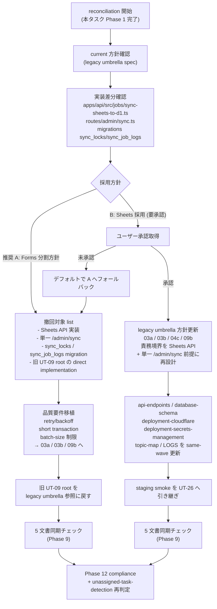

# Phase 2: 設計（reconciliation 設計 / 選択肢比較）

## メタ情報

| 項目 | 値 |
| --- | --- |
| タスク名 | UT-09 direction reconciliation（task-ut09-direction-reconciliation-001） |
| Phase 番号 | 2 / 13 |
| Phase 名称 | 設計（reconciliation 設計 / 選択肢比較） |
| 作成日 | 2026-04-29 |
| 前 Phase | 1 (要件定義) |
| 次 Phase | 3 (設計レビュー) |
| 状態 | spec_created |
| タスク分類 | docs-only / direction-reconciliation |

## 目的

Phase 1 で確定した「reconciliation の docs-only 文書化」要件を、選択肢 A（current Forms 分割方針へ寄せる）と選択肢 B（Sheets 採用方針）の 2 案で具体的に設計する。撤回対象 / 移植対象の差分マッピング、`/admin/sync` 単一 endpoint vs 2 endpoint の認可境界比較、D1 ledger 一意化判定、5 文書（legacy umbrella / 03a / 03b / 04c / 09b）の同期チェック手順、Mermaid（方針決定フロー図）を完成させ、Phase 3 のレビューが代替案比較で結論を出せる粒度の設計入力を作成する。

## 実行タスク

1. 選択肢 A / B の reconciliation 設計を独立成果物として記述する（完了条件: A は撤回 / 移植マッピング、B は same-wave 更新リストが各々完結している）。
2. 選択肢比較表を 4条件 + 5 観点（API 契約 / D1 ledger / Secret 名 / Cron runbook / 監査ログ連携）で作成する（完了条件: 9 行 × 2 列のマトリクスに空セルゼロ）。
3. 撤回対象（採用 A 時） / 移植対象（採用 A 時の品質要件保存）/ same-wave 更新対象（採用 B 時）を差分マッピング表で固定する（完了条件: ファイル / endpoint / table / Secret / Cron schedule の 5 軸で記述）。
4. `/admin/sync` 単一 endpoint と `/admin/sync/schema` + `/admin/sync/responses` 2 endpoint の認可境界比較を擬似コード水準で記述する（完了条件: middleware 挿入点が両者で記述）。
5. D1 ledger 一意化判定（`sync_jobs` vs `sync_locks` + `sync_job_logs`）の評価軸を定義する（完了条件: 一意性・運用可観測性・WAL 非前提互換の 3 軸で評価）。
6. 5 文書同期チェック手順を Phase 9 で実施する形式に固定する（完了条件: 文書 × チェック観点 × 期待結果のマトリクス）。
7. 方針決定フローを Mermaid 図で固定する（完了条件: 推奨 A デフォルト経路と B 経路の分岐が明示）。
8. 成果物 2 ファイル（reconciliation-design.md / option-comparison.md）を分離して作成する。

## 参照資料

| 種別 | パス | 用途 |
| --- | --- | --- |
| 必須 | docs/30-workflows/ut09-direction-reconciliation/phase-01.md | 真の論点・4条件・Ownership 宣言・命名規則チェックリスト |
| 必須 | docs/30-workflows/unassigned-task/task-sync-forms-d1-legacy-umbrella-001.md | current 方針正本 |
| 必須 | docs/30-workflows/02-application-implementation/03a-parallel-forms-schema-sync-and-stablekey-alias-queue/index.md | Forms schema sync 正本 |
| 必須 | docs/30-workflows/02-application-implementation/03b-parallel-forms-response-sync-and-current-response-resolver/index.md | Forms response sync 正本 |
| 必須 | docs/30-workflows/02-application-implementation/04c-parallel-admin-backoffice-api-endpoints/index.md | admin endpoint 正本 |
| 必須 | docs/30-workflows/ut-09-sheets-to-d1-cron-sync-job/index.md | 撤回 or 採用の対象 root |
| 必須 | .claude/skills/aiworkflow-requirements/references/api-endpoints.md | `/admin/sync*` 命名・認可境界 |
| 必須 | .claude/skills/aiworkflow-requirements/references/database-schema.md | ledger 正本 |
| 必須 | .claude/skills/aiworkflow-requirements/references/environment-variables.md / .claude/skills/aiworkflow-requirements/references/deployment-cloudflare.md | Service Account secret 名 |
| 参考 | docs/30-workflows/ut-21-sheets-d1-sync-endpoint-and-audit-implementation/phase-02.md | Sheets 系の先行設計（B 採用時の参考） |

## 構造図 (Mermaid) — 方針決定フロー



## 選択肢 A / B 比較マトリクス

| 観点 | 選択肢 A: Forms 分割方針へ寄せる（推奨） | 選択肢 B: Sheets 採用方針 |
| --- | --- | --- |
| 価値性 | PASS（current 方針と整合・後続 4 タスク無変更） | PASS（Sheets 直接実装で短期実装コスト低） |
| 実現性 | PASS（撤回 + 03a/03b/09b への品質要件移植のみ） | MINOR（legacy umbrella + 03a/03b/04c/09b + references を same-wave 更新） |
| 整合性（不変条件 #1/#4/#5/#6） | PASS（schema は mapper.ts に閉じる方針維持） | MINOR（不変条件 #6: GAS prototype 延長扱いの再検討が必要） |
| 整合性（current facts） | PASS（legacy umbrella 維持） | MAJOR（current 方針の更新が必須） |
| 運用性 | PASS（運用変更なし） | MINOR（references 更新後の運用見直し必須） |
| API 契約 | `POST /admin/sync/schema` + `POST /admin/sync/responses` の 2 endpoint（04c と整合） | 単一 `POST /admin/sync`（04c 正本との競合を解消する更新が必要） |
| D1 ledger | `sync_jobs` 単一（current 維持） | `sync_locks` + `sync_job_logs` の 2 ledger を正式採用（database-schema.md 更新） |
| Secret 名 | `GOOGLE_FORM_ID` / `GOOGLE_SERVICE_ACCOUNT_EMAIL` / `GOOGLE_PRIVATE_KEY` + Forms API token 系（Sheets 系 secret は廃止候補） | `GOOGLE_SHEETS_SA_JSON` + `SHEETS_SPREADSHEET_ID` を正式採用 |
| Cron runbook | 09b の `/admin/sync/schema` + `/admin/sync/responses` 2 経路呼び出しを維持 | 09b を `/admin/sync` 単一経路前提に再設計 |
| 監査ログ連携 | `sync_jobs` row を audit 源として継続 | `sync_job_logs` を audit 源として正式採用、outbox 設計を別途検討 |

> マトリクス備考: A は **MAJOR ゼロ・MINOR ゼロ**。B は MAJOR 1（current facts）/ MINOR 3（実現性 / 不変条件 #6 / 運用性）。Phase 3 の 30 種思考法レビューで MAJOR の解消可否を判定する。

## 撤回 / 移植 / same-wave 更新 差分マッピング

### 採用 A 時 — 撤回対象（コード / migration 削除を別タスクで実施）

| 軸 | 対象 | 撤回理由 |
| --- | --- | --- |
| ファイル | `apps/api/src/jobs/sync-sheets-to-d1.ts` 系 | Sheets API 直接実装。Forms 分割方針と衝突 |
| ファイル | `apps/api/src/routes/admin/sync.ts`（単一 endpoint 実装） | `/admin/sync` 単一 endpoint。04c の 2 endpoint 契約と衝突 |
| migration | `sync_locks` テーブル up/down | `sync_jobs` ledger と二重化 |
| migration | `sync_job_logs` テーブル up/down | `sync_jobs` ledger と二重化 |
| Secret | `GOOGLE_SHEETS_SA_JSON` / `SHEETS_SPREADSHEET_ID` | Forms 採用時は不要（廃止候補） |
| 仕様 | `docs/30-workflows/ut-09-sheets-to-d1-cron-sync-job/` の direct implementation 化記述 | legacy umbrella 参照に戻す |
| Cron schedule | `wrangler.toml` の Sheets 前提 schedule | 09b runbook の Forms 2 endpoint 経路に合わせる |

### 採用 A 時 — 移植対象（品質要件として 03a / 03b / 09b へ保存）

| 知見 | 移植先 | 移植内容 |
| --- | --- | --- |
| WAL 非前提 | 03a / 03b 設計 | D1 のロック特性に依存しない設計を AC として継承 |
| retry/backoff | 03a / 03b / 09b runbook | exponential backoff 戦略・最大試行回数を品質要件として固定 |
| short transaction | 03a / 03b 実装 | 1 transaction の処理量を制限する AC として継承 |
| batch-size 制限 | 03a / 03b / 09b | 1 sync あたり処理件数の上限を AC として固定 |
| 二重起動防止 | 09b runbook | scheduled / manual 同時起動時の lock or idempotency strategy を仕様化 |

### 採用 B 時 — same-wave 更新対象（ユーザー承認後に別タスクで実施）

| 軸 | 対象 | 更新内容 |
| --- | --- | --- |
| 仕様 | `task-sync-forms-d1-legacy-umbrella-001.md` | 「旧 UT-09 を direct implementation にしない」方針を更新 |
| 仕様 | 03a / 03b / 04c / 09b の index.md | 責務境界を Sheets API + 単一 `/admin/sync` 前提に再設計 |
| references | api-endpoints.md / database-schema.md / deployment-cloudflare.md / environment-variables.md / deployment-cloudflare.md | Sheets 採用に合わせて更新 |
| topic-map / LOGS | aiworkflow-requirements indexes | rebuild 必要 |
| 下流 | UT-26 staging-deploy-smoke | smoke シナリオを Sheets 経路に切替 |

## `/admin/sync` 認可境界比較

```typescript
// 採用 A: 2 endpoint（04c の現行契約）
app.use('/admin/sync*', adminAuth)  // SYNC_ADMIN_TOKEN Bearer + admin role + CSRF を一括適用
app.post('/admin/sync/schema', schemaSyncHandler)      // forms.get → schema diff upsert
app.post('/admin/sync/responses', responseSyncHandler) // forms.responses.list → upsert + audit

// 採用 B: 単一 endpoint
app.use('/admin/sync*', adminAuth)
app.post('/admin/sync', singleSyncHandler)             // sheets.values.get → upsert + audit
```

> どちらも `app.use('/admin/sync*', adminAuth)` の挿入点は共通。差分は route 数と handler 内部処理。04c との整合は A が PASS、B は same-wave 更新で PASS 化が条件。

## D1 ledger 一意化判定軸

| 評価軸 | `sync_jobs`（A） | `sync_locks` + `sync_job_logs`（B） |
| --- | --- | --- |
| 一意性 | PASS（単一テーブルで sync 状態管理） | MINOR（2 テーブル分担。lock と log を join する設計） |
| 運用可観測性 | PASS（status / started_at / finished_at / error 一括取得） | PASS（lock TTL と log retention を分離管理可能） |
| WAL 非前提互換 | PASS（短い transaction で対応可能） | MINOR（lock acquisition と log insert の transaction 境界が分岐） |
| current 正本との一致 | PASS（database-schema.md 登録済み） | MAJOR（database-schema.md 更新必須） |
| 採用結論 | reconciliation 推奨 | B 採用時のみ正本化 |

## 5 文書同期チェック手順（Phase 9 で実施）

| 文書 | チェック観点 | 期待結果（A 採用時） | 期待結果（B 採用時） |
| --- | --- | --- | --- |
| `task-sync-forms-d1-legacy-umbrella-001.md` | 「旧 UT-09 を direct implementation にしない」方針 | 維持 | 更新（direct implementation 容認） |
| `03a/index.md` | Forms schema sync の責務境界 | 無変更 | Sheets 前提へ再設計 |
| `03b/index.md` | Forms response sync の responseId 解決方式 | 無変更 | Sheets 前提へ再設計 |
| `04c/index.md` | `/admin/sync*` endpoint 数と認可境界 | 2 endpoint 維持 | 単一 endpoint へ更新 |
| `09b/index.md` | cron schedule と runbook の sync 経路 | Forms 2 経路維持 | Sheets 単一経路へ更新 |

## 実行手順

### ステップ 1: Phase 1 入力の取り込み

- 真の論点（reconciliation の docs-only 文書化）と Ownership 宣言 5 対象を確認する。
- 既存契約・命名規則チェック 5 観点（current / 旧 UT-09 / api-endpoints / database-schema / deployment-secrets-management）の現行登録を抽出する。

### ステップ 2: 選択肢比較マトリクスの作成

- 4条件 + 5 観点（API 契約 / D1 ledger / Secret 名 / Cron runbook / 監査ログ連携）の 9 行 × 2 列マトリクスを `outputs/phase-02/option-comparison.md` に固定する。
- 空セルゼロ、A の MAJOR/MINOR ゼロ、B の MAJOR 1 / MINOR 3 を Phase 3 入力として渡す。

### ステップ 3: 差分マッピングの作成

- A 採用時の撤回対象（5 軸）と移植対象（5 知見）を表化する。
- B 採用時の same-wave 更新対象（5 軸）を表化する。
- `outputs/phase-02/reconciliation-design.md` に格納する。

### ステップ 4: 認可境界 / D1 ledger / 5 文書同期チェック

- 認可境界比較を擬似 TypeScript で記述する。
- D1 ledger 一意化判定軸（4 軸）を表化する。
- 5 文書 × 2 採用方針の同期チェックマトリクスを Phase 9 入力として固定する。

### ステップ 5: Mermaid 方針決定フロー

- 推奨 A デフォルト経路と B（要承認）経路の分岐を Mermaid で固定する。
- B 未承認時の A フォールバック経路も明示する。

### ステップ 6: 成果物 2 ファイル分離

- `outputs/phase-02/reconciliation-design.md`: Mermaid + 差分マッピング + 認可境界 + D1 ledger + 5 文書同期チェック。
- `outputs/phase-02/option-comparison.md`: 選択肢 A / B 比較マトリクス専用。

## 統合テスト連携

| 連携先 Phase | 連携内容 |
| --- | --- |
| Phase 3 | 設計の代替案比較・PASS/MINOR/MAJOR 判定の入力 |
| Phase 4 | 5 文書同期チェック手順を検証戦略の起点に |
| Phase 5 | 撤回 / 移植手順を実装ランブックの擬似コード起点に |
| Phase 6 | 異常系（二重 ledger 残存 / endpoint 競合 / Secret 名衝突 / Ownership 違反 / B 未承認のまま実装着手）の網羅対象 |
| Phase 9 | 5 文書同期チェック実施 |
| Phase 11 | A 採用時の撤回 smoke / B 採用時の同期 smoke 手順 placeholder |

## 多角的チェック観点

- 不変条件 #1: schema を mapper.ts / schema 定義に閉じる宣言が両案で維持されているか。
- 不変条件 #4: ledger テーブルが admin-managed data 専用として分離されているか。
- 不変条件 #5: D1 binding が `apps/api` 内のみに閉じているか。
- 不変条件 #6: B 採用時に GAS prototype の延長として旧 UT-09 を本番昇格させていないかの再検証手順を含むか。
- 二重 ledger: A 採用で `sync_locks` + `sync_job_logs` migration が確実に撤回対象に含まれているか。
- endpoint 認可: `app.use('/admin/sync*', adminAuth)` 挿入点が両案で共通記述されているか。
- Secret hygiene: 採用方針別に廃止 / 採用 secret が一意化されているか。
- 運用ルール: staging smoke pending を PASS と誤記しない / unrelated verification-report を本 PR に混ぜない方針が含まれるか。
- docs-only 境界: 設計内に「コード変更は別タスク」と明記されているか。
- 5 文書同期: legacy umbrella / 03a / 03b / 04c / 09b すべてがチェック対象に含まれるか。

## サブタスク管理

| # | サブタスク | 担当 Phase | 状態 | 備考 |
| --- | --- | --- | --- | --- |
| 1 | Mermaid 方針決定フロー | 2 | spec_created | reconciliation-design.md |
| 2 | 選択肢 A/B 比較マトリクス（4条件 + 5 観点） | 2 | spec_created | option-comparison.md |
| 3 | 撤回対象 / 移植対象 差分マッピング（A） | 2 | spec_created | reconciliation-design.md |
| 4 | same-wave 更新対象（B） | 2 | spec_created | reconciliation-design.md |
| 5 | `/admin/sync` 認可境界比較 | 2 | spec_created | 擬似 TypeScript |
| 6 | D1 ledger 一意化判定軸 | 2 | spec_created | 4 軸 |
| 7 | 5 文書同期チェック手順 | 2 | spec_created | Phase 9 入力 |
| 8 | 成果物 2 ファイル分離 | 2 | spec_created | reconciliation-design.md / option-comparison.md |

## 成果物

| 種別 | パス | 説明 |
| --- | --- | --- |
| 設計 | outputs/phase-02/reconciliation-design.md | reconciliation 設計（Mermaid・撤回 / 移植マッピング・認可境界・D1 ledger・5 文書同期チェック） |
| 設計 | outputs/phase-02/option-comparison.md | 選択肢 A / B 比較マトリクス（4条件 + 5 観点・9 行 × 2 列） |
| メタ | artifacts.json | Phase 2 状態の更新 |

## 完了条件

- [ ] Mermaid 方針決定フローに A デフォルト経路 / B（要承認）経路 / B 未承認時 A フォールバック経路が表現されている
- [ ] 選択肢 A / B 比較マトリクスに 4条件 + 5 観点の 9 行が空セルゼロで記述されている
- [ ] A 採用時の撤回対象（5 軸）と移植対象（5 知見）が表化されている
- [ ] B 採用時の same-wave 更新対象（5 軸）が表化されている
- [ ] `/admin/sync` 認可境界比較が両案で擬似コード記述されている
- [ ] D1 ledger 一意化判定軸（4 軸）が表化されている
- [ ] 5 文書同期チェック手順が文書 × 2 採用方針のマトリクスで記述されている
- [ ] 成果物が 2 ファイル（reconciliation-design.md / option-comparison.md）に分離されている
- [ ] docs-only 境界（コード変更は別タスク）が明記されている

## タスク100%実行確認【必須】

- 全実行タスク（8 件）が `spec_created`
- 全成果物が `outputs/phase-02/` 配下に配置済み
- 異常系（二重 ledger / endpoint 競合 / Secret 名衝突 / Ownership 違反 / B 未承認のまま実装着手）の対応設計が含まれる
- artifacts.json の `phases[1].status` が `spec_created`
- artifacts.json の `phases[1].outputs` に 2 ファイルが列挙されている

## 次 Phase への引き渡し

- 次 Phase: 3 (設計レビュー)
- 引き継ぎ事項:
  - reconciliation-design.md / option-comparison.md を代替案比較の base case として渡す
  - 推奨 = 採用 A（MAJOR ゼロ・MINOR ゼロ）。B は MAJOR 1（current facts）/ MINOR 3 が解消可能か Phase 3 で判定
  - 5 文書同期チェック手順を Phase 9 へ引き継ぐ前提として固定
  - Mermaid 方針決定フローを GO/NO-GO ゲートの根拠に再利用
  - docs-only 境界（コード変更は別タスク）を Phase 3 制約として固定
- ブロック条件:
  - 比較マトリクスに空セル
  - 撤回 / 移植マッピングに 5 軸未満
  - 5 文書同期チェック対象に 5 文書未満
  - Mermaid に B 未承認フォールバック経路欠落
