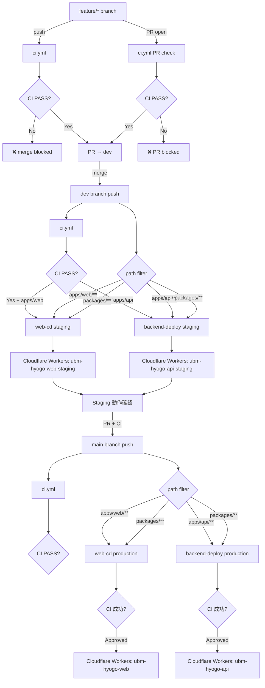
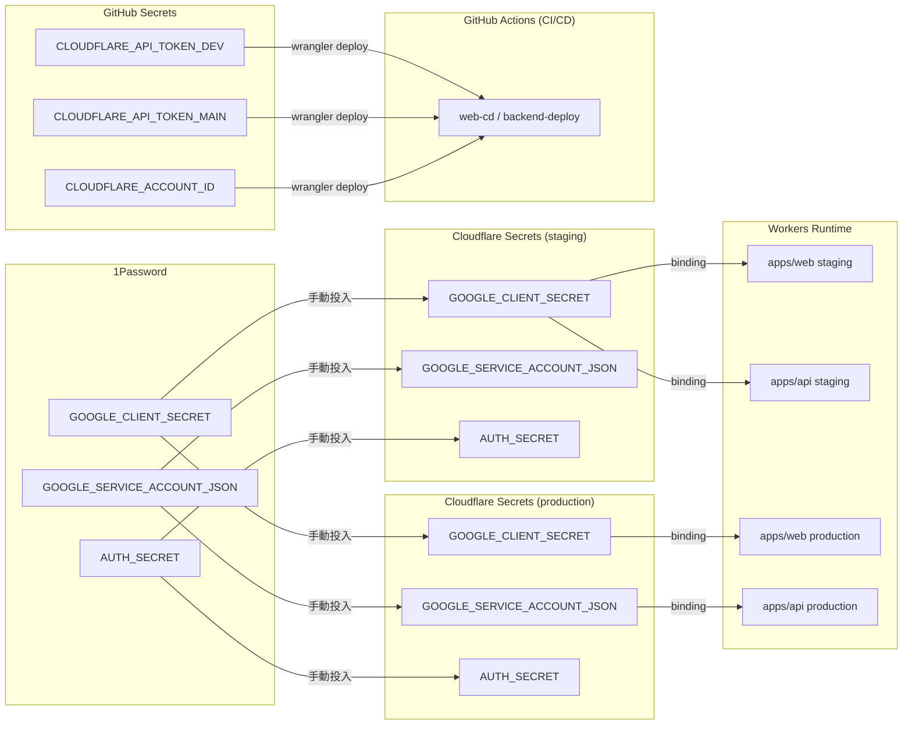
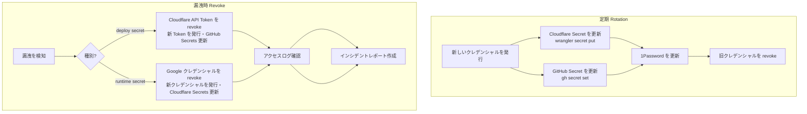

# Workflow トポロジー設計

## メタ情報

| 項目 | 値 |
| --- | --- |
| タスク名 | cicd-secrets-and-environment-sync |
| Phase 番号 | 2 / 13 |
| 作成日 | 2026-04-26 |
| 状態 | completed |

---

## 1. Workflow ファイル一覧

| ファイル | 略称 | 主な役割 |
| --- | --- | --- |
| `.github/workflows/ci.yml` | CI | lint / typecheck / build（品質ゲート） |
| `.github/workflows/web-cd.yml` | web-cd | apps/web のデプロイ（staging / production） |
| `.github/workflows/backend-deploy.yml` | backend-deploy | apps/api のデプロイ（staging / production） |

---

## 2. ci.yml の役割

### 目的
すべてのブランチ・PR で品質を保証する。デプロイは行わない。

### Trigger 設計

| イベント | 条件 | 実行内容 |
| --- | --- | --- |
| `push` | すべてのブランチ | lint + typecheck + build |
| `pull_request` | target: `dev`, `main` | lint + typecheck + build |

### Jobs 構成

```
ci.yml
├── job: lint
│   └── pnpm lint (全 workspace)
├── job: typecheck
│   └── pnpm typecheck (全 workspace)
└── job: build
    ├── needs: [lint, typecheck]
    ├── pnpm --filter @ubm-hyogo/web build
    └── pnpm --filter @ubm-hyogo/api build
```

### 品質ゲートとしての位置づけ

- PR を `dev` / `main` へ merge するには ci.yml の全 job が成功することを branch protection rule で必須とする
- web-cd / backend-deploy は push 直起動であり、CI 成功は merge 前の branch protection で担保する

---

## 3. web-cd の役割

### 目的
`apps/web` (Next.js + @opennextjs/cloudflare) を Cloudflare Workers にデプロイする。
`dev` ブランチへの push で staging、`main` ブランチへの push で production にデプロイする。

### Trigger 設計

| イベント | ブランチ | Path Filter | 実行環境 |
| --- | --- | --- | --- |
| `push` | `dev` | `apps/web/**`, `packages/**`, `pnpm-lock.yaml` | staging |
| `push` | `main` | `apps/web/**`, `packages/**`, `pnpm-lock.yaml` | production |

### Jobs 構成

```
web-cd.yml
└── job: deploy-web
    ├── environment: dev (staging) / main (production)
    ├── pnpm install
    ├── pnpm --filter @ubm-hyogo/web build:cloudflare
    └── pnpm --filter @ubm-hyogo/web deploy:staging / deploy:production
        └── uses: CLOUDFLARE_API_TOKEN (GitHub Environment Secret), CLOUDFLARE_ACCOUNT_ID (GitHub Variable)
```

### 環境マッピング

| ブランチ | GitHub Environment | Cloudflare Workers | D1 Database |
| --- | --- | --- | --- |
| `dev` | `dev` | `ubm-hyogo-web-staging` | staging D1 |
| `main` | `main` | `ubm-hyogo-web` | production D1 |

### Deploy承認設定

| 環境 | 承認要件 |
| --- | --- |
| `dev` GitHub Environment | 自動（承認不要） |
| `main` GitHub Environment | 自動（承認不要・CIチェック必須） |

---

## 4. backend-deploy の役割

### 目的
`apps/api` (Hono on Cloudflare Workers) を Cloudflare Workers にデプロイする。
`dev` ブランチへの push で staging、`main` ブランチへの push で production にデプロイする。

### Trigger 設計

| イベント | ブランチ | Path Filter | 実行環境 |
| --- | --- | --- | --- |
| `push` | `dev` | `apps/api/**`, `packages/**`, `pnpm-lock.yaml` | staging |
| `push` | `main` | `apps/api/**`, `packages/**`, `pnpm-lock.yaml` | production |

### Jobs 構成

```
backend-deploy.yml
└── job: deploy-api
    ├── environment: dev (staging) / main (production)
    ├── pnpm install
    ├── pnpm --filter @ubm-hyogo/api build
    └── pnpm --filter @ubm-hyogo/api deploy:staging / deploy:production
        └── uses: CLOUDFLARE_API_TOKEN (GitHub Environment Secret), CLOUDFLARE_ACCOUNT_ID (GitHub Variable)
```

### 環境マッピング

| ブランチ | GitHub Environment | Cloudflare Workers | D1 Database |
| --- | --- | --- | --- |
| `dev` | `dev` | `ubm-hyogo-api-staging` | staging D1 |
| `main` | `main` | `ubm-hyogo-api` | production D1 |

---

## 5. dev / main の Trigger 設計

### ブランチ戦略との対応

```
feature/* ──push──→ CI のみ実行（デプロイなし）
    │
    └──PR──→ dev ──push──→ CI + web-cd(staging) + backend-deploy(staging)
                 │
                 └──PR + CI──→ main ──push──→ CI + web-cd(production) + backend-deploy(production)
```

### Trigger 決定理由

| ブランチ | デプロイ trigger | 理由 |
| --- | --- | --- |
| `feature/*` | なし | staging / production を汚染しない。CI のみで品質を確認 |
| `dev` | staging へ自動デプロイ | staging で動作確認できる状態を常に保つ |
| `main` | production へ CI 成功後デプロイ | PR 経由と CI 必須チェックで意図しない本番デプロイを防ぐ |

---

## 6. Mermaid フロー図

### 6.1 全体フロー



### 6.2 Secret フロー



### 6.3 Rotation / Revoke フロー



---

## 7. path filter 設計の詳細

### 共通パッケージの扱い

`packages/**` の変更は web と api の両方に影響する可能性があるため、両 workflow を trigger する設計とする。

| 変更ファイル | web-cd | backend-deploy | 理由 |
| --- | --- | --- | --- |
| `apps/web/**` のみ | ✓ | ✗ | web のみの変更 |
| `apps/api/**` のみ | ✗ | ✓ | api のみの変更 |
| `packages/**` | ✓ | ✓ | 共通パッケージは両方に影響する可能性 |
| `pnpm-lock.yaml` | ✓ | ✓ | 依存関係変更は両方を再ビルドして検証 |
| `.github/workflows/**` | ✗ | ✗ | workflow ファイル自体の変更はデプロイしない |
| `docs/**` | ✗ | ✗ | ドキュメントのみの変更はデプロイしない |

### path filter の注意点

- `packages/**` の変更が staging を汚染しないよう、変更が意図的であることを PR でレビューする
- 将来的に `packages/**` の影響範囲が明確になれば、より細かい path filter に移行する
