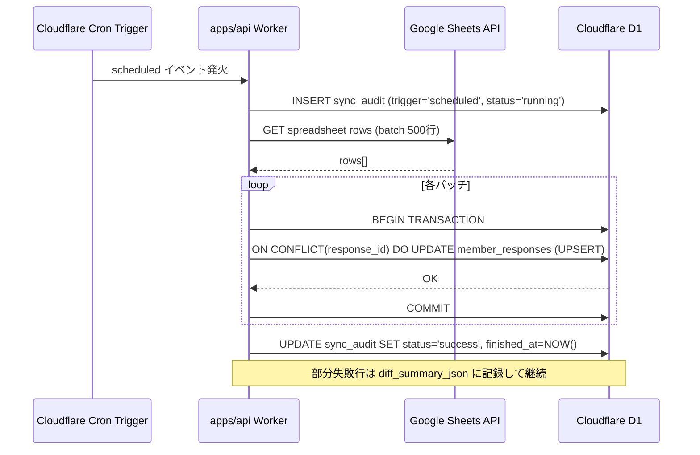
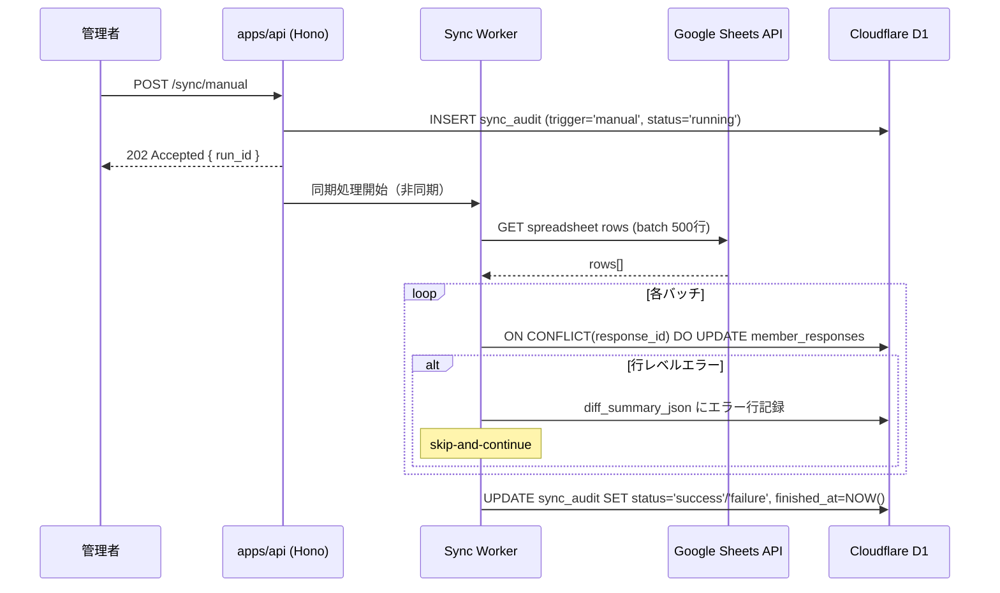
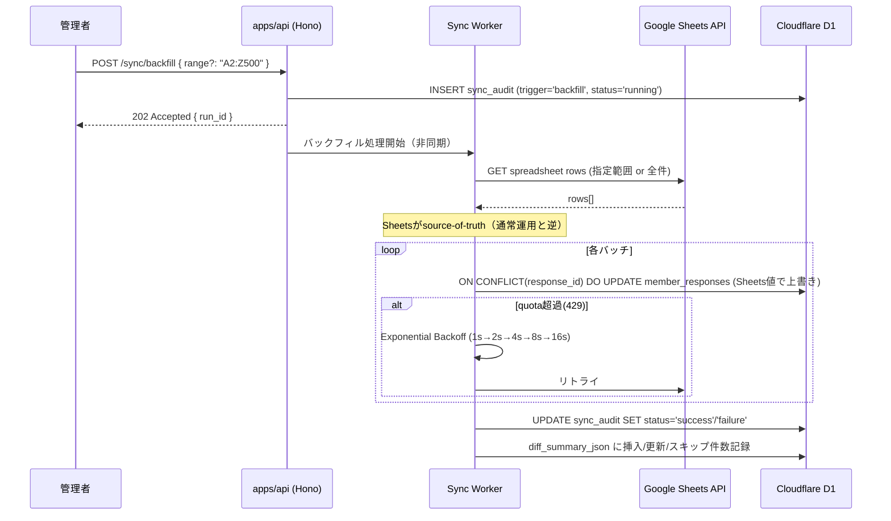

# Phase 2 — 同期フロー図

## フロー 1: 定期スケジュール同期（Cron Triggers）

```mermaid
sequenceDiagram
  participant Cron as Cloudflare Cron Trigger
  participant Worker as apps/api Worker
  participant Sheets as Google Sheets API
  participant D1 as Cloudflare D1

  Cron->>Worker: scheduled イベント発火
  Worker->>D1: INSERT sync_audit (trigger='scheduled', status='running')
  Worker->>Sheets: GET spreadsheet rows (batch 500行)
  Sheets-->>Worker: rows[]
  loop 各バッチ
    Worker->>D1: BEGIN TRANSACTION
    Worker->>D1: ON CONFLICT(response_id) DO UPDATE member_responses (UPSERT)
    D1-->>Worker: OK
    Worker->>D1: COMMIT
  end
  Worker->>D1: UPDATE sync_audit SET status='success', finished_at=NOW()
  Note over Worker,D1: 部分失敗行は diff_summary_json に記録して継続
```

---

## フロー 2: 手動同期（POST /sync/manual）

```mermaid
sequenceDiagram
  participant Admin as 管理者
  participant API as apps/api (Hono)
  participant Worker as Sync Worker
  participant Sheets as Google Sheets API
  participant D1 as Cloudflare D1

  Admin->>API: POST /sync/manual
  API->>D1: INSERT sync_audit (trigger='manual', status='running')
  API-->>Admin: 202 Accepted { run_id }
  API->>Worker: 同期処理開始（非同期）
  Worker->>Sheets: GET spreadsheet rows (batch 500行)
  Sheets-->>Worker: rows[]
  loop 各バッチ
    Worker->>D1: ON CONFLICT(response_id) DO UPDATE member_responses
    alt 行レベルエラー
      Worker->>D1: diff_summary_json にエラー行記録
      Note over Worker: skip-and-continue
    end
  end
  Worker->>D1: UPDATE sync_audit SET status='success'/'failure', finished_at=NOW()
```

---

## フロー 3: バックフィル（POST /sync/backfill）

```mermaid
sequenceDiagram
  participant Admin as 管理者
  participant API as apps/api (Hono)
  participant Worker as Sync Worker
  participant Sheets as Google Sheets API
  participant D1 as Cloudflare D1

  Admin->>API: POST /sync/backfill { range?: "A2:Z500" }
  API->>D1: INSERT sync_audit (trigger='backfill', status='running')
  API-->>Admin: 202 Accepted { run_id }
  API->>Worker: バックフィル処理開始（非同期）
  Worker->>Sheets: GET spreadsheet rows (指定範囲 or 全件)
  Sheets-->>Worker: rows[]
  Note over Worker: Sheetsがsource-of-truth（通常運用と逆）
  loop 各バッチ
    Worker->>D1: ON CONFLICT(response_id) DO UPDATE member_responses (Sheets値で上書き)
    alt quota超過(429)
      Worker->>Worker: Exponential Backoff (1s→2s→4s→8s→16s)
      Worker->>Sheets: リトライ
    end
  end
  Worker->>D1: UPDATE sync_audit SET status='success'/'failure'
  Worker->>D1: diff_summary_json に挿入/更新/スキップ件数記録
```
