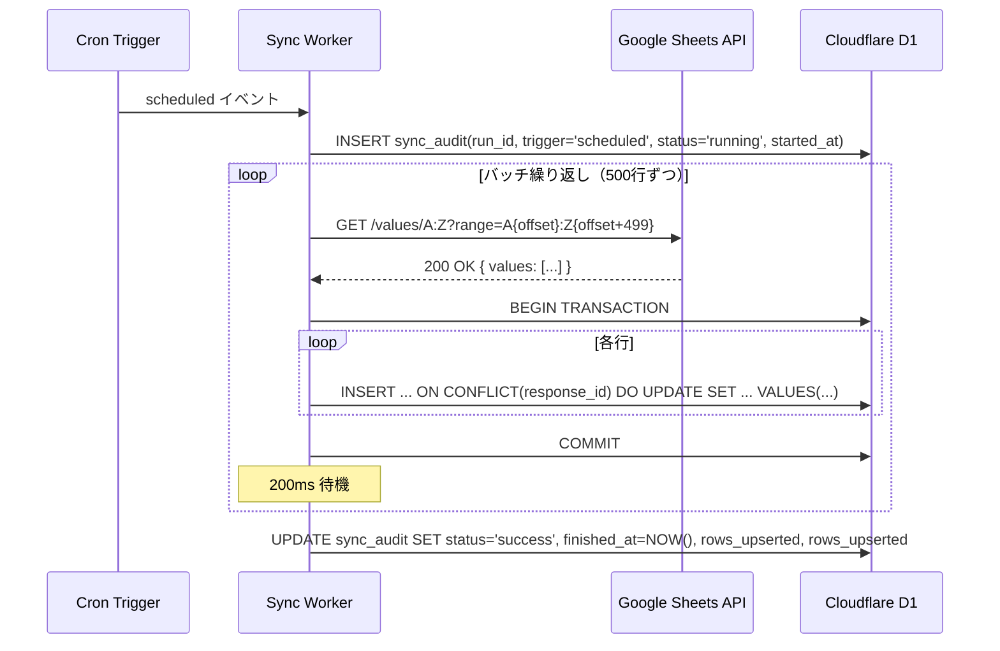
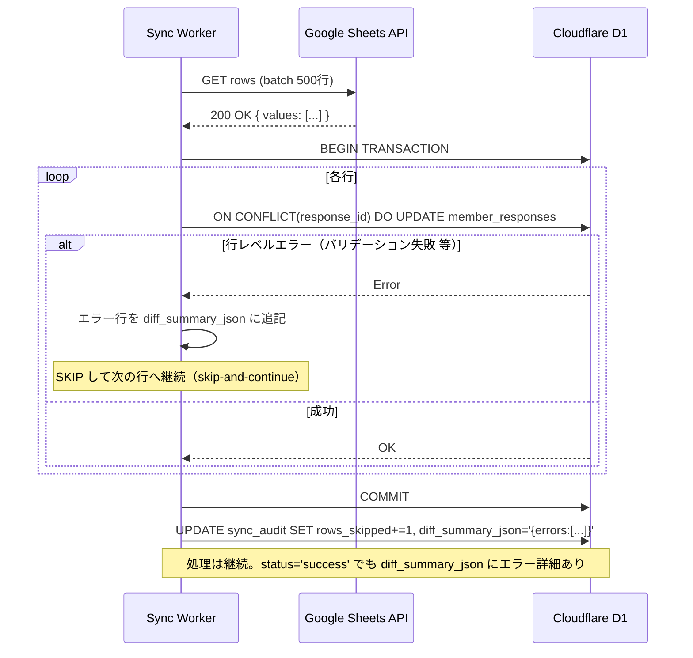
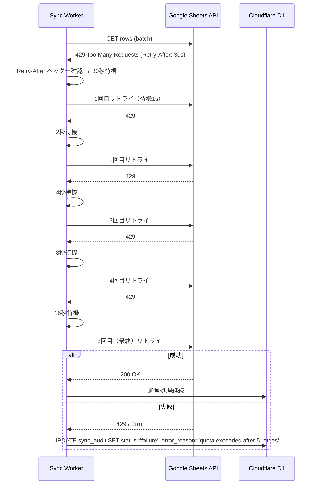
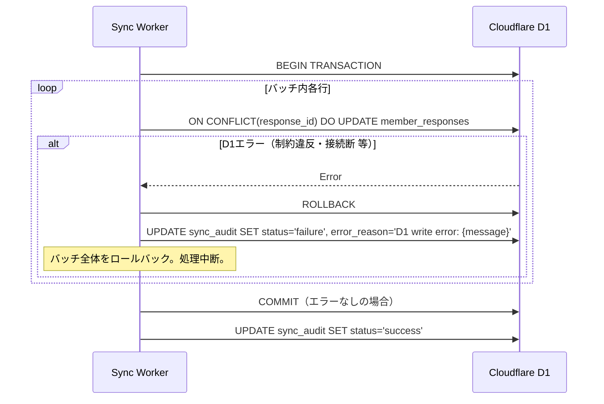

# Phase 5 — シーケンス図（正常系・異常系）

## 正常系: Sheets → Worker → D1

```mermaid
sequenceDiagram
  participant Cron as Cron Trigger
  participant Worker as Sync Worker
  participant Sheets as Google Sheets API
  participant D1 as Cloudflare D1

  Cron->>Worker: scheduled イベント
  Worker->>D1: INSERT sync_audit(run_id, trigger='scheduled', status='running', started_at)
  loop バッチ繰り返し（500行ずつ）
    Worker->>Sheets: GET /values/A:Z?range=A{offset}:Z{offset+499}
    Sheets-->>Worker: 200 OK { values: [...] }
    Worker->>D1: BEGIN TRANSACTION
    loop 各行
      Worker->>D1: INSERT ... ON CONFLICT(response_id) DO UPDATE SET ... VALUES(...)
    end
    Worker->>D1: COMMIT
    Note over Worker: 200ms 待機
  end
  Worker->>D1: UPDATE sync_audit SET status='success', finished_at=NOW(), rows_upserted, rows_upserted
```

---

## 異常系1: 部分失敗（skip-and-continue）

```mermaid
sequenceDiagram
  participant Worker as Sync Worker
  participant Sheets as Google Sheets API
  participant D1 as Cloudflare D1

  Worker->>Sheets: GET rows (batch 500行)
  Sheets-->>Worker: 200 OK { values: [...] }
  Worker->>D1: BEGIN TRANSACTION
  loop 各行
    Worker->>D1: ON CONFLICT(response_id) DO UPDATE member_responses
    alt 行レベルエラー（バリデーション失敗 等）
      D1-->>Worker: Error
      Worker->>Worker: エラー行を diff_summary_json に追記
      Note over Worker: SKIP して次の行へ継続（skip-and-continue）
    else 成功
      D1-->>Worker: OK
    end
  end
  Worker->>D1: COMMIT
  Worker->>D1: UPDATE sync_audit SET rows_skipped+=1, diff_summary_json='{errors:[...]}'
  Note over Worker,D1: 処理は継続。status='success' でも diff_summary_json にエラー詳細あり
```

---

## 異常系2: quota超過（Exponential Backoff）

```mermaid
sequenceDiagram
  participant Worker as Sync Worker
  participant Sheets as Google Sheets API
  participant D1 as Cloudflare D1

  Worker->>Sheets: GET rows (batch)
  Sheets-->>Worker: 429 Too Many Requests (Retry-After: 30s)
  Worker->>Worker: Retry-After ヘッダー確認 → 30秒待機
  Worker->>Sheets: 1回目リトライ（待機1s）
  Sheets-->>Worker: 429
  Worker->>Worker: 2秒待機
  Worker->>Sheets: 2回目リトライ
  Sheets-->>Worker: 429
  Worker->>Worker: 4秒待機
  Worker->>Sheets: 3回目リトライ
  Sheets-->>Worker: 429
  Worker->>Worker: 8秒待機
  Worker->>Sheets: 4回目リトライ
  Sheets-->>Worker: 429
  Worker->>Worker: 16秒待機
  Worker->>Sheets: 5回目（最終）リトライ
  alt 成功
    Sheets-->>Worker: 200 OK
    Worker->>D1: 通常処理継続
  else 失敗
    Sheets-->>Worker: 429 / Error
    Worker->>D1: UPDATE sync_audit SET status='failure', error_reason='quota exceeded after 5 retries'
  end
```

---

## 異常系3: D1書き込み失敗（ロールバック + sync_audit記録）

```mermaid
sequenceDiagram
  participant Worker as Sync Worker
  participant D1 as Cloudflare D1

  Worker->>D1: BEGIN TRANSACTION
  loop バッチ内各行
    Worker->>D1: ON CONFLICT(response_id) DO UPDATE member_responses
    alt D1エラー（制約違反・接続断 等）
      D1-->>Worker: Error
      Worker->>D1: ROLLBACK
      Worker->>D1: UPDATE sync_audit SET status='failure', error_reason='D1 write error: {message}'
      Note over Worker: バッチ全体をロールバック。処理中断。
    end
  end
  Worker->>D1: COMMIT（エラーなしの場合）
  Worker->>D1: UPDATE sync_audit SET status='success'
```
