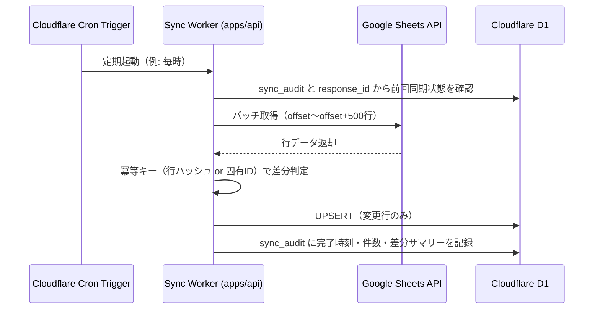
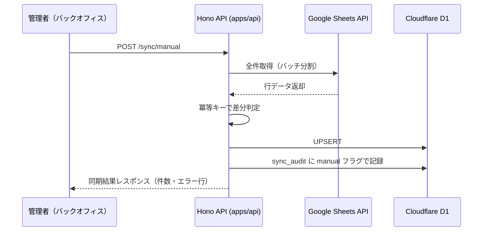
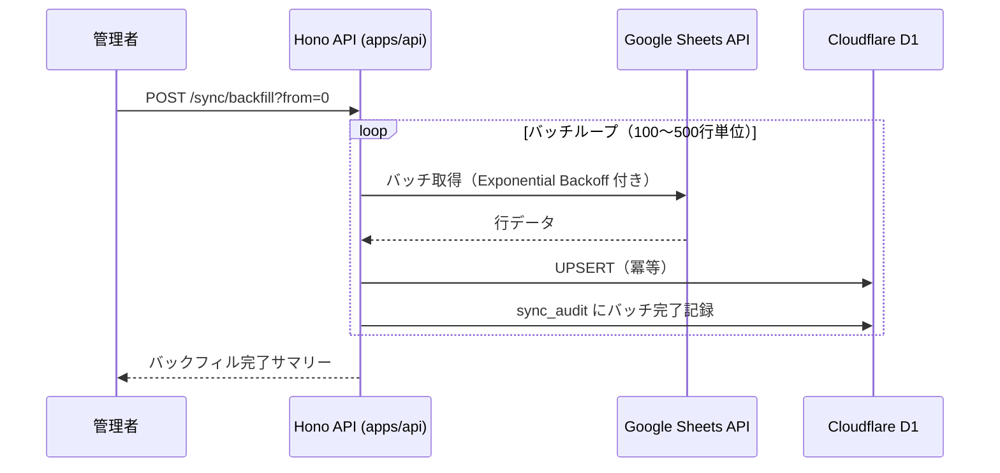

# Phase 2: 設計

## メタ情報

| 項目 | 値 |
| --- | --- |
| タスク名 | sheets-d1-sync-design |
| Phase 番号 | 2 / 13 |
| Phase 名称 | 設計 |
| 作成日 | 2026-04-26 |
| 前 Phase | 1 (要件定義) |
| 次 Phase | 3 (設計レビュー) |
| 状態 | completed |

## 目的

Phase 1 の要件を入力として、Sheets → D1 同期アーキテクチャを設計文書として確定する。同期方式の採択根拠・3種フロー図・既存 `sync_audit` 監査契約の運用・冪等性確保・エラーハンドリングを明文化し、UT-09 が迷わず実装着手できる設計仕様を出力する。

## 実行タスク

- 同期方式4候補（push / pull / webhook / cron）を比較評価し、採択方式を決定する
- Cloudflare Workers Cron Triggers 採択の設計根拠を明文化する
- 手動同期・定期スケジュール・バックフィルの3種フロー図（Mermaid）を作成する
- 既存 `sync_audit` テーブルの運用方針（trigger / status / counts / error_reason / diff_summary_json）を設計する
- Sheets 行の冪等性確保設計（バンドマン固有 ID またはハッシュ管理）を決定する
- エラーハンドリング・リトライ設計（回数・Exponential Backoff・部分失敗継続戦略）を定義する
- Sheets API quota 対処方針（バッチサイズ・レート制御）を設計する

## 参照資料

| 種別 | パス | 用途 |
| --- | --- | --- |
| 必須 | outputs/phase-01/requirements.md | Phase 1 の要件・評価軸・外部制約 |
| 必須 | docs/completed-tasks/03-serial-data-source-and-storage-contract/index.md | データソース・ストレージ契約方針 |
| 必須 | docs/completed-tasks/03-serial-data-source-and-storage-contract/outputs/phase-02/data-contract.md | `sync_audit` / `response_id` 既存契約 |
| 必須 | .claude/skills/aiworkflow-requirements/references/architecture-overview-core.md | D1 / Sheets の役割と制約 |
| 必須 | .claude/skills/aiworkflow-requirements/references/deployment-cloudflare.md | Cloudflare Workers / Cron Triggers 無料枠・制約 |
| 参考 | .claude/skills/task-specification-creator/references/spec-update-workflow.md | Phase 12 同期ルール |

## 実行手順

### ステップ 1: 同期方式比較評価と採択決定

Phase 1 の requirements.md を読み、4候補を以下の評価軸で比較する。

| 方式 | 無料枠適合 | 実装コスト | 冪等性 | 信頼性 | 採択 |
| --- | --- | --- | --- | --- | --- |
| push（Sheets → API 即時送信） | △（GAS 依存） | 中 | 要設計 | 中 | 否 |
| pull（Workers が Sheets を定期取得） | ○ | 低 | 要設計 | 高 | 候補 |
| webhook（Sheets 変更通知） | △（Workspace 設定依存） | 高 | 要設計 | 中 | 否 |
| cron（Cloudflare Workers Cron Triggers） | ○（無料枠内） | 低 | 要設計 | 高 | **採択** |

**採択: Cloudflare Workers Cron Triggers（pull 方式）**

採択根拠を design.md に明文化する:
- 無料枠内で Cron Triggers が利用可能（Workers Paid プラン不要）
- Sheets 側の GAS / webhook 設定不要で依存を最小化できる
- 冪等なバッチ処理として実装しやすく、部分失敗時の再実行が容易
- push / webhook は Sheets 側の設定変更リスクがあり運用コストが高い

### ステップ 2: 3種フロー設計

以下の3種フローを Mermaid で sync-flow.md に作成する。

**フロー 1: 定期スケジュール同期（Cron Triggers）**

**フロー 2: 手動同期**

**フロー 3: バックフィル（過去データ全件再同期）**

### ステップ 3: sync_audit 監査契約の運用設計

`sync_audit` テーブルは既存 data-source contract の監査証跡として維持し、UT-01 では新規テーブルを追加しない。

| カラム名 | 型 | 説明 |
| --- | --- | --- |
| run_id | TEXT PRIMARY KEY | 同期監査 ID |
| trigger | TEXT | 'scheduled' / 'manual' / 'backfill' |
| started_at | TEXT (ISO8601) | 同期開始タイムスタンプ |
| finished_at | TEXT (ISO8601) | 同期完了タイムスタンプ（NULL = 未完了） |
| status | TEXT | 'running' / 'success' / 'failure' |
| rows_upserted | INTEGER | 新規登録件数 |
| rows_upserted | INTEGER | 更新件数 |
| rows_skipped | INTEGER | 変更なしとしてスキップした件数 |
| error_reason | TEXT | 失敗理由 |
| diff_summary_json | TEXT | 差分・部分失敗詳細 JSON |

**インデックス方針**: 既存契約を優先し、UT-01 では物理インデックスを新設しない。検索要件が必要な場合は UT-04 / 03 contract の変更要求として扱う。

### ステップ 4: 冪等性確保設計

Sheets の行には標準の一意キーが存在しないため、以下の2方式を評価する。

| 方式 | 説明 | 採択基準 |
| --- | --- | --- |
| バンドマン固有 ID | Sheets に `member_id` カラムを管理者が付与 | Sheets 側のデータ管理コストが発生する |
| 行ハッシュ管理 | 全カラム結合の SHA-256 ハッシュを冪等キーとする | 値変更を差分として検知できる |

**採択方針**: 冪等キーは既存契約の `member_responses.response_id` を第一候補とする。Sheets 由来で `response_id` が取得できない行だけ補助的な差分 fingerprint を `diff_summary_json` に記録し、D1 メンバーテーブルへ `diff_fingerprint` カラムを新設しない。

### ステップ 5: エラーハンドリング・リトライ設計

| シナリオ | 対処方針 |
| --- | --- |
| Sheets API エラー（一時的） | Exponential Backoff（初回 1s、最大 5 回、最大待機 32s） |
| D1 書き込みエラー | トランザクション内でロールバック。sync_audit に failure と error_reason を記録 |
| バッチ途中での Worker タイムアウト | response_id による冪等 UPSERT と sync_audit の件数差分から再開範囲を判断 |
| Sheets API quota 超過（429） | Retry-After ヘッダーを尊重してウェイト後リトライ |
| 全行エラー | sync_audit に failure を記録。次回 Cron で自動リトライ |

**部分失敗継続戦略**: 1行のエラーで全体を停止しない。エラー行を diff_summary_json に記録しつつ残りの行の処理を継続する（skip-and-continue）。

### ステップ 6: Sheets API quota 対処方針

- **バッチサイズ**: 1リクエストあたり 100〜500 行（デフォルト 500 行）
- **リクエスト間隔**: バッチ間に 200ms のウェイトを挿入
- **Exponential Backoff**: 429 / 5xx 発生時は指数バックオフ（1s → 2s → 4s → 8s → 16s）
- **quota 見積もり**: 1万行の全件取得 = 20 リクエスト。通常 Cron（差分取得）は 1〜5 リクエスト程度

## 統合テスト連携

| 連携先 Phase | 連携内容 |
| --- | --- |
| Phase 3 | design.md / sync-flow.md をレビュー対象として使用 |
| Phase 7 | AC-1〜AC-7 のトレース根拠として使用 |
| Phase 10 | gate 判定の設計仕様として使用 |
| Phase 12 | close-out と spec sync 判断 |

## 多角的チェック観点（AIが判断）

- 価値性: Cron Triggers 採択により管理者の手動作業コストが下がるか。
- 実現性: 無料枠内（Cron Triggers / Sheets API / D1）で設計が成立するか。
- 整合性: source-of-truth（D1 canonical）が CLAUDE.md の不変条件と矛盾しないか。
- 運用性: sync_audit によって部分失敗時のリカバリが手順化できるか。

## サブタスク管理

| # | サブタスク | 担当 Phase | 状態 | 備考 |
| --- | --- | --- | --- | --- |
| 1 | 同期方式比較評価・採択 | 2 | completed | 4候補の比較表 + 採択理由 |
| 2 | 3種フロー図（Mermaid）作成 | 2 | completed | sync-flow.md |
| 3 | sync_audit 運用設計 | 2 | completed | 既存契約を維持し、物理スキーマ新設はしない |
| 4 | 冪等性確保設計 | 2 | completed | ハッシュ方式の採択 |
| 5 | エラーハンドリング・リトライ設計 | 2 | completed | skip-and-continue 方針 |
| 6 | Sheets API quota 対処方針 | 2 | completed | バッチサイズ・Backoff 定義 |
| 7 | design.md / sync-flow.md 作成 | 2 | completed | outputs/phase-02/ |

## 成果物

| 種別 | パス | 説明 |
| --- | --- | --- |
| ドキュメント | outputs/phase-02/design.md | 同期方式採択・スキーマ・エラーハンドリング設計 |
| ドキュメント | outputs/phase-02/sync-flow.md | 手動/定期/バックフィル フロー図 |
| メタ | artifacts.json | Phase 状態と outputs の記録 |

## 完了条件

- outputs/phase-02/design.md が作成済みである
- outputs/phase-02/sync-flow.md が作成済みである
- 同期方式比較表と Cron Triggers 採択根拠が明文化されている
- sync_audit の運用方針が定義されている
- 冪等性確保方式（行ハッシュ）が決定されている
- エラーハンドリング（skip-and-continue）と Backoff 設計が記載されている
- Sheets API quota 対処方針が記載されている

## タスク100%実行確認【必須】

- 全実行タスクが completed
- 全成果物が指定パスに配置済み
- 全完了条件にチェック
- 異常系（quota 超過 / D1 書き込みエラー / Worker タイムアウト）も設計済み
- 次 Phase への引き継ぎ事項を記述
- artifacts.json の該当 phase を completed に更新

## 次 Phase

- 次: 3 (設計レビュー)
- 引き継ぎ事項: outputs/phase-02/design.md と sync-flow.md を Phase 3 のレビュー入力とする。
- ブロック条件: 本 Phase の成果物が未作成なら Phase 3 に進まない。

## 依存マトリクス

| 種別 | 対象 | 理由 |
| --- | --- | --- |
| 上流 | 02-serial-monorepo-runtime-foundation / 01b / 01c | 基盤・認証・D1 binding が前提 |
| 下流 | UT-03 / UT-09 / 03-serial-data-source-and-storage-contract | 本 Phase の設計を参照して実装 |
| 並列 | なし | 独立実行可能 |
