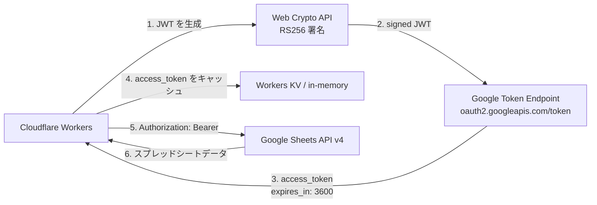
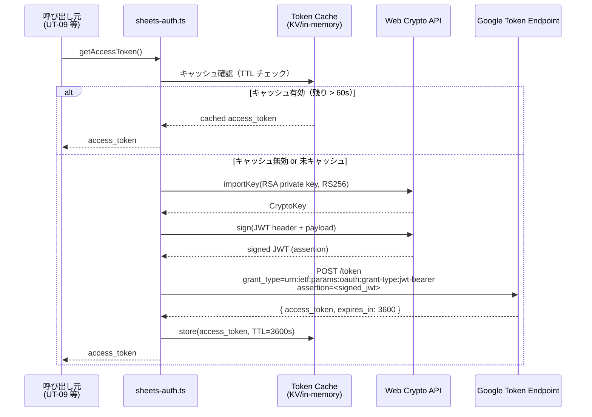

# Phase 2: 設計

## メタ情報

| 項目 | 値 |
| --- | --- |
| タスク名 | Sheets API 認証方式設定 (UT-03) |
| Phase 番号 | 2 / 13 |
| Phase 名称 | 設計 |
| 作成日 | 2026-04-26 |
| 担当 | delivery |
| 前 Phase | 1 (要件定義) |
| 次 Phase | 3 (設計レビュー) |
| 状態 | completed |

## 目的

Phase 1 で確定した要件・論点をもとに、以下の設計を行い成果物として文書化する。

1. 認証方式比較（Service Account JSON key vs OAuth 2.0）と選定根拠
2. Cloudflare Workers Edge Runtime での JWT 署名フロー
3. `sheets-auth.ts` モジュールの公開インターフェース定義
4. 環境別シークレット管理マトリクス

## 認証方式比較設計

### 比較評価表

| 評価軸 | Service Account JSON key | OAuth 2.0（ユーザー委任） |
| --- | --- | --- |
| Edge Runtime 対応 | Web Crypto API で RS256 署名可能 | リダイレクトフロー不可（Workers で UI なし） |
| 実装複雑度 | JWT 自前実装が必要（中） | 認可フロー管理が複雑（高） |
| シークレット管理 | JSON key 1つを Cloudflare Secrets に配置 | refresh_token + client_secret の複数管理 |
| 権限スコープ | サービスアカウントに付与した権限のみ | ユーザー権限に依存 |
| 有効期限 | JSON key は明示的に無効化しない限り有効 | refresh_token が失効リスクあり |
| 監査ログ | GCP の IAM 監査ログで追跡可能 | ユーザーアカウントに紐付くため追跡しにくい |
| **選定判定** | **採用** | 不採用 |

**選定理由**: Cloudflare Workers は HTTP リクエスト処理のみを行う Edge Runtime であり、OAuth 2.0 の認可コードフロー（ブラウザリダイレクト）は実行できない。また、サービスアカウントは非インタラクティブな server-to-server 認証に最適であり、シークレット管理もシンプルである。

### 認証フロー図



## Cloudflare Workers での JWT フロー設計

### シーケンス図



### JWT ペイロード仕様

| フィールド | 値 | 説明 |
| --- | --- | --- |
| `iss` | `<service_account_email>` | Service Account のメールアドレス |
| `scope` | `https://www.googleapis.com/auth/spreadsheets.readonly` | 最小権限スコープ |
| `aud` | `https://oauth2.googleapis.com/token` | Token Endpoint |
| `iat` | `Math.floor(Date.now() / 1000)` | 発行時刻（Unix秒） |
| `exp` | `iat + 3600` | 有効期限（1時間後） |

## sheets-auth.ts モジュール設計

### target topology

| concern | target topology | 責務境界 |
| --- | --- | --- |
| Secret parsing | `SheetsAuthEnv` → `parseServiceAccountKey` | `GOOGLE_SERVICE_ACCOUNT_JSON` の parse と validation のみを担当し、secret 値を log/error に含めない |
| JWT signing | `ServiceAccountKey` → `importPrivateKey` → `createSignedJWT` | Web Crypto API に閉じ、Node.js `crypto` / `Buffer` / `process.env` に依存しない |
| Token provider | `getAccessToken` → Google Token Endpoint | `fetch` で OAuth 2.0 token を取得し、Sheets data read/write は UT-09 に残す |
| Cache | `SHEETS_TOKEN_CACHE` or in-memory fallback | TTL と cache key を管理し、KV binding 未設定でも動作する |

### SubAgent lane 設計（3 lane 以下）

| Lane | 担当 | 入力 | 出力 | 依存 |
| --- | --- | --- | --- | --- |
| Lane A | 認証 contract / 型 | Phase 1 AC、正本仕様 | `SheetsAuthEnv` / `AccessTokenResult` / `SheetsAuthError` | なし |
| Lane B | runtime 実装 | Lane A contract、Cloudflare Workers 制約 | `packages/integrations/src/sheets-auth.ts` | Lane A |
| Lane C | validation / runbook | Lane A/B、Secrets 運用仕様 | `sheets-auth.test.ts`、`setup-runbook.md`、`local-dev-guide.md` | Lane A/B |

### validation matrix

| Command | 対象 | Expected result |
| --- | --- | --- |
| `pnpm install` | worktree dependency | lockfile と native package が現在環境に整合する |
| `pnpm --filter @repo/shared build` | shared 型依存 | integrations test 前の shared build が成功する |
| `pnpm --filter @ubm-hyogo/integrations test:run -- sheets-auth` | AUTH-01〜AUTH-06 | JWT 署名・token fetch・TTL cache・secret redaction が PASS |
| `pnpm --filter @ubm-hyogo/integrations typecheck` | `sheets-auth.ts` public contract | `SheetsAuthEnv` / `AccessTokenResult` / `SheetsAuthError` の型が矛盾しない |
| `rg -n "GOOGLE_SERVICE_ACCOUNT_JSON|private_key|access_token" --glob '!*.md' .` | secret hygiene | secret 実値が repository に混入していない |

### DI 境界の型配置判断

| 型 / 依存 | 配置先 | 判断 |
| --- | --- | --- |
| `SheetsAuthEnv` | `packages/integrations/src/sheets-auth.ts` | 具象モジュール内だけで使用するため同ファイルに閉じる |
| `AccessTokenResult` | `packages/integrations/src/sheets-auth.ts` | UT-09 が import する public result 型として auth module から export する |
| `SheetsAuthError` | `packages/integrations/src/sheets-auth.ts` | auth 境界固有の error 型であり shared 化しない |
| `KVNamespace` | Cloudflare runtime type | env binding として注入し、実装内部から global lookup しない |

### 公開インターフェース

```typescript
// packages/integrations/src/sheets-auth.ts

/** Cloudflare Workers の env bindings から注入される型 */
export interface SheetsAuthEnv {
  /** Service Account JSON key（文字列化 JSON） */
  GOOGLE_SERVICE_ACCOUNT_JSON: string;
  /** アクセストークンキャッシュ用 KV（省略時は in-memory fallback） */
  SHEETS_TOKEN_CACHE?: KVNamespace;
}

/** Service Account JSON key のパース済み型 */
export interface ServiceAccountKey {
  type: "service_account";
  project_id: string;
  private_key_id: string;
  private_key: string;       // PEM 形式 RSA 秘密鍵
  client_email: string;
  token_uri: string;
}

/** getAccessToken の戻り値 */
export interface AccessTokenResult {
  accessToken: string;
  expiresAt: number;         // Unix タイムスタンプ（秒）
}

/**
 * Google Sheets API v4 用アクセストークンを取得する。
 * キャッシュが有効（残り TTL > 60s）の場合はキャッシュから返す。
 *
 * @param env - Cloudflare Workers の env bindings
 * @returns アクセストークンと有効期限
 * @throws SheetsAuthError - JWT 署名失敗・Token Endpoint エラー時
 */
export async function getAccessToken(env: SheetsAuthEnv): Promise<AccessTokenResult>;

/**
 * PEM 形式の RSA 秘密鍵を Web Crypto API でインポートする。
 * @internal
 */
export async function importPrivateKey(pemKey: string): Promise<CryptoKey>;

/**
 * JWT assertion を生成し署名する。
 * @internal
 */
export async function createSignedJWT(
  key: CryptoKey,
  payload: Record<string, unknown>
): Promise<string>;

/** sheets-auth モジュール固有のエラークラス */
export class SheetsAuthError extends Error {
  constructor(
    message: string,
    public readonly cause?: unknown
  ) {
    super(message);
    this.name = "SheetsAuthError";
  }
}
```

### キャッシュ戦略

| ストレージ | 条件 | 動作 |
| --- | --- | --- |
| Workers KV | `SHEETS_TOKEN_CACHE` binding が存在する場合 | TTL 付きで KV に保存（Worker インスタンス跨ぎで共有） |
| in-memory | `SHEETS_TOKEN_CACHE` binding が存在しない場合 | module-scoped 変数に保存（同一 Worker インスタンス内のみ有効） |

**キャッシュキー**: `sheets_access_token_<service_account_email_hash_prefix>`

**再取得トリガー**: `Date.now() / 1000 > expiresAt - 60`（有効期限 60秒前に再取得）

## シークレット管理設計

### 環境別マトリクス

| 環境 | シークレット注入方法 | ファイル/ストア | コミット可否 |
| --- | --- | --- | --- |
| ローカル開発 | `wrangler dev` が自動読み込み | `.dev.vars`（プロジェクトルート） | **不可**（`.gitignore` 必須） |
| staging | Cloudflare Secrets | `wrangler secret put --env staging` | 不可（Cloudflare 管理） |
| production | Cloudflare Secrets | `wrangler secret put --env production` | 不可（Cloudflare 管理） |
| CI/CD (GitHub Actions) | GitHub Secrets → `wrangler secret put` | `GOOGLE_SERVICE_ACCOUNT_JSON` | 不可 |

### .dev.vars の記述例（コメントのみ。実値はドキュメントに記載しない）

```ini
# .dev.vars（ローカル開発専用・コミット禁止）
GOOGLE_SERVICE_ACCOUNT_JSON=<Service Account JSON key を1行化した文字列>
```

### Cloudflare Secrets 配置コマンド

```bash
# staging 環境
echo '<service_account_json>' | wrangler secret put GOOGLE_SERVICE_ACCOUNT_JSON --env staging

# production 環境
echo '<service_account_json>' | wrangler secret put GOOGLE_SERVICE_ACCOUNT_JSON --env production
```

## 依存関係マトリクス

| 依存先 | 型 | 本 Phase での確認事項 |
| --- | --- | --- |
| 01c-parallel-google-workspace-bootstrap | 上流 | Service Account JSON key が発行済みであること |
| 02-serial-monorepo-runtime-foundation | 上流 | `packages/integrations` ディレクトリ・`package.json` が存在すること |
| UT-01 | 上流 | 必要な Sheets API スコープ（readonly/readwrite）が確定していること |
| UT-09 | 下流 | `getAccessToken()` の公開インターフェースが安定していること |
| 03-serial-data-source-and-storage-contract | 下流 | 認証フローの概要が設計ドキュメントとして参照可能であること |


## 実行タスク

- [ ] この Phase の目的に沿って、既存セクションに記載されたレビュー、設計、検証を順番に実行する
- [ ] 実行結果は対応する outputs/phase-02/ 配下へ記録する
- [ ] 後続 Phase の入力として必要な差分、判断、未解決事項を明記する

## 参照資料

| 種別 | パス | 用途 |
| --- | --- | --- |
| 必須 | .claude/skills/aiworkflow-requirements/references/deployment-cloudflare.md | Cloudflare Workers・Secrets・KV の基本手順 |
| 必須 | docs/ut-03-sheets-api-auth/phase-01.md | Phase 1 成果物（requirements.md）の参照 |
| 参考 | docs/ut-03-sheets-api-auth/index.md | AC・スコープの正本 |
| 参考 | https://developers.google.com/identity/protocols/oauth2/service-account | Google Service Account 認証公式ドキュメント |

## 成果物

| 種別 | パス | 説明 |
| --- | --- | --- |
| ドキュメント | outputs/phase-02/auth-design.md | 認証フロー設計（シーケンス図・JWT ペイロード仕様） |
| ドキュメント | outputs/phase-02/auth-comparison-table.md | Service Account vs OAuth 2.0 比較評価表（AC-1 対応） |
| ドキュメント | outputs/phase-02/env-secret-matrix.md | 環境別シークレット管理マトリクス |
| メタ | artifacts.json | phase-02 を completed に更新 |


## 統合テスト連携（Phase 1〜11は必須）

- 対象コマンド: `pnpm --filter @ubm-hyogo/integrations test:run`
- 連携対象: `packages/integrations/src/sheets-auth.ts` と Sheets API 認証境界
- 記録先: `outputs/phase-02/` 配下の Phase 成果物
- 依存確認: Phase 4 以降で `pnpm install` と `pnpm --filter @repo/shared build` の必要性を再確認する

## 完了条件

- [ ] 認証方式比較評価表が `outputs/phase-02/auth-comparison-table.md` に存在する（AC-1）
- [ ] JWT フローのシーケンス図が `outputs/phase-02/auth-design.md` に存在する
- [ ] `sheets-auth.ts` の公開インターフェース（型定義・関数シグネチャ）が確定している
- [ ] 環境別シークレット管理マトリクスが `outputs/phase-02/env-secret-matrix.md` に存在する
- [ ] Phase 3 レビューへの引き継ぎ事項が明記されている

## タスク100%実行確認【必須】

- 全成果物が指定パスに配置済み
- 全完了条件にチェック
- 異常系（Service Account JSON の形式不正・KV binding 未設定）の設計が記録されている
- artifacts.json の phase-02 を completed に更新

## 次 Phase

- 次: 3 (設計レビュー)
- 引き継ぎ事項: auth-design.md・auth-comparison-table.md・env-secret-matrix.md・インターフェース定義をレビューの入力として渡す
- ブロック条件: 3 つの設計ドキュメントが未作成なら次 Phase に進まない
